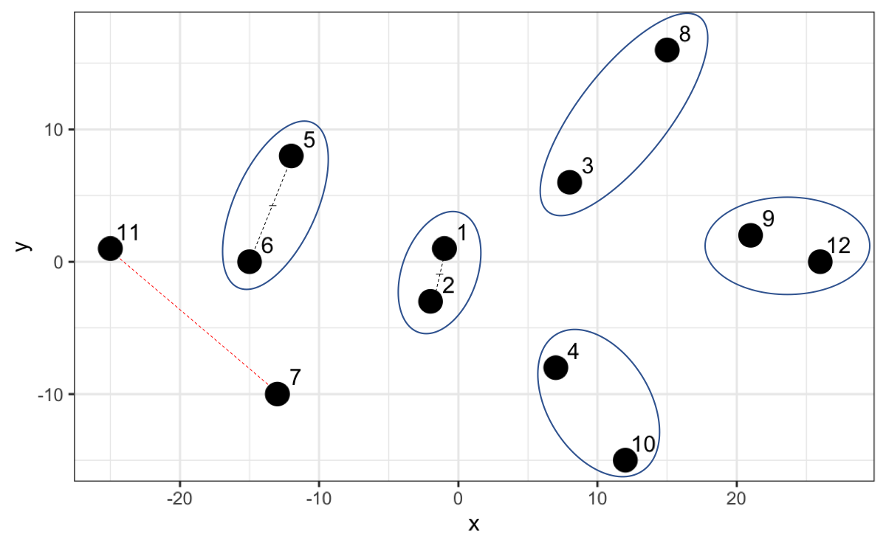

--- 
title: "Data Science with R"
subtitle: "Data Analysis and prediction algorithms with R. Second Edition"
author: "Author: Mg. Daniel Paredes Inilupu"
date: "2025-12-23"
#date: "2024-12-27"
site: bookdown::bookdown_site
documentclass: krantz
bibliography: [book.bib, packages.bib]
biblio-style: apalike
link-citations: yes
colorlinks: yes
urlcolor: blue
geometry: "left=1.5in, right=1.5in, top=1.25in, bottom=1.25in"
github-repo: dparedesi/Data-Science-with-R-book
description: "A comprehensive guide to data science using R, covering fundamentals, visualization, statistics, machine learning with tidymodels, and generative AI integration. Second Edition by Daniel Paredes."
always_allow_html: yes
graphics: yes
output:
  bookdown::gitbook:
    includes:
      in_header: analytics.html
      #after_body: disqus.html
    keep_md: yes  # Important: Keep the Markdown files
params:
 hidden: false
 #no_last: "The exercises, as well as some chapters we will learn, will be activated in this book as we progress through the course classes. This excerpt will be enabled for you up to one week after the course ends. "
---


# Preface {-}
Welcome to the second edition of Data Science with R!

This book, initially conceived as a compilation of personal notes to facilitate my learning, has evolved to become a comprehensive resource covering everything from fundamentals to advanced data science techniques.

I have invested over 700 hours in the creation of this book. You can support this effort by purchasing the PDF version on [leanpub](https://leanpub.com/dataScienceConR/). Furthermore, the purchase includes access to future updates and the possibility of making direct inquiries with me for three months regarding the covered topics or their practical application.

In this edition, the latest trends and technologies in data science have been incorporated. This includes updates to the most recent versions of R (4.4.2) and RStudio (2024.12.0), as well as the integration of modern libraries such as keras, tensorflow, xgboost, quanteda, and sparklyr. Interactive visualization tools like plotly and leaflet have also been added.

New sections address crucial topics such as ethics in data science, reproducibility through R Markdown, and version control with Git and GitHub. Additionally, we have strengthened the content on deep learning, time series analysis, text mining, and sentiment analysis.


The web version available at [bookdown](https://bookdown.org/dparedesi/data-science-con-r/)^[https://bookdown.org/dparedesi/data-science-con-r/] seeks to democratize data science knowledge. Share it and let's contribute together to freeing knowledge.


Just like the first edition, this version is based on exercises designed from practical classroom experiences and activities from the [Professional Certificate in Data Science](https://online-learning.harvard.edu/series/professional-certificate-data-science)^[https://online-learning.harvard.edu/series/professional-certificate-data-science] by **HarvardX**. The code used to generate this book is available on GitHub, encouraging transparency and reproducibility.

We have improved and updated the exercises, incorporating recent practical cases on social network analysis, climate change, and text mining. This allows for the immediate application of what has been learned to real-world problems.

I deeply thank the readers of the first edition for their comments and suggestions, which have been fundamental to improving this version.

This book has reached readers in Mexico, Colombia, Spain, Peru, and Chile, among other countries. I hope this second edition serves as a valuable tool to advance your learning and practice of data science.

If you have questions or suggestions, you can write to me at dparedesi@uni.pe. I usually respond within a maximum of 48 hours.

<a rel="license" href="http://creativecommons.org/licenses/by-nc-sa/4.0/"></a><br />This work is licensed under a <a rel="license" href="http://creativecommons.org/licenses/by-nc-sa/4.0/">Creative Commons Attribution-NonCommercial-ShareAlike 4.0 International License</a>.

# Acknowledgments {-}

First and foremost, I want to express my profound gratitude to my wife, Desislava, for her invaluable emotional support during the countless hours I dedicated to organizing ideas and writing code. Her knowledge in R was also key, contributing solutions and perspectives that enriched this work.

A special thanks to [Rafael Irizarry](https://hsph.harvard.edu/profile/rafael-a-irizarry/)^[https://hsph.harvard.edu/profile/rafael-a-irizarry/], a true benchmark in the R world, whose didactic way of teaching advanced techniques allowed me to advance significantly in my learning. I also extend my gratitude to the developers who, with their dedication, continue to create and maintain this wonderful language. This book is nothing more than a compendium and a guide, made possible thanks to the constant effort of those who expand R's libraries and packages.

My gratitude also goes to Briguit Reinaldo, CEO of Cedhinfo, whose tireless work brings the teaching of computer technologies to more people in Peru, inspiring many to explore new opportunities.

Finally, I want to acknowledge the valuable contribution of engineering students from UNI, who participated in grammatical review, paraphrasing, creation of additional exercises, and proposal of new topics to include. Special thanks to [Josep Agama](https://www.linkedin.com/in/josep-agama-749a61190/)^[https://www.linkedin.com/in/josep-agama-749a61190/] and [Andrés Espinoza](https://www.linkedin.com/in/aespinozacontreras/)^[https://www.linkedin.com/in/aespinozacontreras/] for their fundamental contributions in the first three chapters.

<!--chapter:end:index.Rmd-->


# Introduction {-}

Data science requires a multidisciplinary approach that combines statistics, programming, data mining, and business understanding. This book is designed to help you develop those skills through practical examples in R.


## Why R? {-}
R is a language created by statisticians for data analysis. Its versatility makes it a powerful tool for exploring, modeling, and visualizing data.

## Installing R {-}
You can download R from the Comprehensive R Archive Network (**CRAN**).

1. Search for CRAN on Google:


2. Once on the CRAN page, select the version for your operating system: Linux, Mac OS X, or Windows:


Here the steps for Windows are shown, but the steps are similar for Linux or Mac OS X.

3. On the CRAN website, we need to install `base` which includes all the basic packages you need to get started. Later, in the following chapters, we will see how to install other additional packages.


4. Click on the first link to get the most recent version:


Then, open the installer you just downloaded to install R and follow the on-screen instructions.

## Installing RStudio {-}
Although you could already start using R in console mode, we are going to install RStudio, an integrated development environment (IDE), which will facilitate our work with R.

1. Search for RStudio on Google:


2. You should see the website as it appears below. Once there, go to the upper right menu and click on **DOWNLOAD**


3. Then scroll down until you find the download options. Select the **Free** RStudio Desktop option.


4. It will show you the button to download according to your operating system. You can also download from the list below the **Download** button.


Once the installer is downloaded, open it and follow the on-screen instructions.

## RStudio Sections {-}
When you start RStudio for the first time, you will see 3 sections:


One of the great advantages of R over point-and-click analysis software is that we can save our work as Scripts.

To create a new Script, you can click on File, then New File, and then on **R Script**.


This way we will have the 4 sections, or panels, of RStudio:


* **Code editor**: The code editor for Scripts where we can save our Scripts.
* **R console**: The R **console** where we will see the result of the execution of our Scripts.
* **Environment/History**: Here we will mainly see the variables/functions as we create them.
* **Other panes**: Finally a section with additional tabs. Here we will see our created plots, for example.

## Testing RStudio {-}
To test that we have installed it correctly, go to the console section and calculate how much 13 multiplied by 265 is. Click on the **console section**, type in the console and then press **Enter**


``` r
13 * 265
#> [1] 3445
```

You should have gotten `3445` as a result in the same way you observe lines above. With the difference of the symbol `##`. This symbol in this book will serve to differentiate the result that our R Scripts yield. Thus, if you do not see the symbol `##` it is R code, and what is with `##` simulates the result seen in the console.

You will also see before the number `3445` the number 1 in brackets: `[1]`. This is because each Script can yield a set of solutions/results. In brackets it tells you which solution number it shows you. In this case the solution is unique, but later we will see when there are more results from your Script.

You can get the same result if you write in the **Scripts section**, and not in the console, that will allow you to make several calculations. For example, on one hand I can do 28 * 27 and then I can calculate a sum 65 + 35


``` r
#Calculating 28 multiplied by 27:
28 * 27

#Adding 65 + 35:
65 + 35
```

To execute from the scripts section we can select all the lines and then click on **Run** in the upper right part or press **Ctrl** + **Enter**. Keep in mind that the `#` sign makes that line a comment.

Try selecting all the text, then selecting only the sum line and click on **Run**. You will see that it only executes what you select.

You are now ready to start learning R.

<!--chapter:end:01-introduction/introduction.Rmd-->


# (PART) Fundamentals and Key Tools {-}

# Objects {#objects}

In the world of programming, an **object** is like a container that holds information. This information can be of different types: numbers, text, complex data, and even code. The important thing is that an object groups everything necessary to represent an entity or concept.

In R, practically everything is an object. The variables we will use to store data, the functions we will use to process that data, and even the data itself, are objects.

## What are objects in R?

Imagine you are organizing your move to the United States. Each item you pack in a box (clothes, books, appliances) can be considered an object. Each object has characteristics that define it: a name, a type, a size, a weight, etc.

In R, objects also have characteristics that define them. These characteristics are called **attributes**. Some common attributes are:

*   **Name:** The name we give to the object to be able to refer to it.
*   **Type:** The type of data the object contains (numeric, character, logical, etc.).
*   **Class:** The class of the object, which defines its structure and behavior (vector, list, data frame, function, etc.).
*   **Length:** The amount of elements the object contains (if it is a vector, a list, etc.).

### R as an object-oriented language

R is an **object-oriented** programming language. This means it relies on the concept of objects to organize and process information.

Object-oriented programming has several advantages:

*   **Modularity:** Objects allow dividing a program into smaller, manageable parts.
*   **Reusability:** Objects can be reused in different parts of the program or in other programs.
*   **Encapsulation:** Objects hide implementation details, facilitating their use and maintenance.

### The power of abstraction

The concept of an object allows us to **abstract** the complexity of the real world. Instead of thinking about the details of how data is stored and processed in computer memory, we can think in terms of objects representing real-world entities.

For example, instead of thinking of a series of numbers representing the temperatures of different cities, we can think of a "temperatures" object containing all that information.

This abstraction facilitates understanding and handling information, allowing us to focus on the logic of the problem we want to solve.

## Variables: The first objects on your journey

Before we start packing for our move to the United States, we need to know what things we will take. Each object we decide to take is represented in R as a **variable**.

Think of variables as labels we put on each object. For example, we could use the variable `state` to save the name of the state we are moving to, or the variable `num_suitcases` to save the number of suitcases we will take.

### Creating variables in R

In R, we don't need to declare a variable before using it. We simply assign it a value using the `<-` symbol.

**Example:**


``` r
# Assign the value "California" to the variable "state"
state <- "California"

# Assign the value 5 to the variable "num_suitcases"
num_suitcases <- 5
```

To see the value we have saved in a variable, we simply type its name in the RStudio console and press Enter.

**Example:**


``` r
state <- "California"

state
#> [1] "California"
```

When executing this code, you will see the value `"California"` appear in the console.

### Operations with variables

We can also use variables to perform operations. For example, if we want to calculate the total cost of our plane trip, we could use the variables `ticket_price` and `num_people`.

**Example:**


``` r
ticket_price <- 300
num_people <- 4

total_cost <- ticket_price * num_people

total_cost
#> [1] 1200
```

In this example, we first assign values to the variables `ticket_price` and `num_people`. Then, we multiply these variables to calculate the `total_cost` and display its value in the console.

### Best practices for naming variables

**Watch out for capitalization!**

R is case-sensitive. If you create a variable called `state` and then try to access it as `State`, R will not find it.

**Descriptive names**

It is important to use descriptive names for variables, clearly indicating what information they contain. Instead of using variables like `x` or `y`, it is better to use names like `ticket_price` or `num_suitcases`.

**Rules for naming variables**

*   Variable names can contain letters, numbers, and underscores (`_`).
*   They cannot start with a number.
*   They cannot contain spaces.
*   R is case-sensitive.

### Data types

Variables in R can contain different types of data:

*   **Numeric:** Represent numbers, such as the population of a city or the cost of a plane ticket.

    
    ``` r
    chicago_population <- 2700000
    ticket_price <- 300
    ```

*   **Character:** Represent text, such as the name of a state or a city.

    
    ``` r
    state <- "California"
    city <- "Los Angeles"
    ```

*   **Logical:** Represent truth values: `TRUE` or `FALSE`. We could use a logical variable to indicate if we want to visit a city or not.

    
    ``` r
    visit_chicago <- TRUE
    visit_miami <- FALSE
    ```

## Object types for complex data

The variables we have seen so far are very useful for storing individual information, such as the name of a city or the number of suitcases we will carry on our move. However, in the real world, we often need to work with more complex datasets.

Imagine you want to save the names of all the cities you plan to visit on your trip to the United States. Would you have to create a variable for each city? That would be very tedious!

Fortunately, R offers other types of objects that allow us to organize and manipulate information more efficiently. Let's look at some of them:

### Vectors: organizing information of the same type

Vectors are like trains transporting a series of objects of the same type. They can be numbers, text, or logical values, but all elements of a vector must be of the same type. For example, we could use a vector to save the name of each state in the United States, or a vector to save the population of each state.

**Creating vectors:** To create a vector, we can use the `c()` function (which stands for "combine") and list the elements we want to include, separated by commas.


``` r
# Create a vector with the names of some states
states <- c("California", "Texas", "Florida", "New York")

# Create a vector with the population of each state (in millions)
population <- c(39.2, 29.0, 21.4, 19.4) 
```

If we want to know the amount of data our vector has, its length, we will use the `length()` function. The `class()` function tells us the class of the object, that is, what type of data it contains.


``` r
length(population)  
#> [1] 4
class(states)     
#> [1] "character"
class(population)   
#> [1] "numeric"
```

We can use the `names()` function to assign names to the elements of a vector. This can be useful for identifying each element.


``` r
names(population) <- states
population
#> California      Texas    Florida   New York 
#>       39.2       29.0       21.4       19.4
```

In addition to `c()`, there are other useful functions for creating vectors:

*   `seq()`: Creates a sequence of numbers. We can specify the start value, the end value, and the increment.

    
    ``` r
    # Create a vector with numbers from 1 to 10
    numbers <- seq(1, 10)
    
    # Create a vector with numbers from 2 to 20, by 2
    even_numbers <- seq(2, 20, by = 2)
    ```

*   `rep()`: Repeats a value or a vector a specified number of times.

    
    ``` r
    # Create a vector with the value 1 repeated 5 times
    ones <- rep(1, 5)
    
    # Create a vector with the sequence "A", "B" repeated 3 times
    letters <- rep(c("A", "B"), 3)  # Output: "A" "B" "A" "B" "A" "B"
    ```

**Accessing vector elements:** Each element of a vector has a position, indicated by a number in brackets. The first element is at position 1, the second at position 2, and so on.


``` r
# Show the first element of the "states" vector
states[1]  # Output: "California"

# Show the third element of the "population" vector
population[3]  # Output: 21.4
```

We can also access multiple elements at once using the `:` operator. For example, to access elements from the second to the fourth of the `states` vector:


``` r
states[2:4]
#> [1] "Texas"    "Florida"  "New York"
```

**Operations with vectors:** We can perform mathematical operations with numeric vectors. For example, if we want to calculate the total population of the four states, we can use the `+` operator to sum the elements of the `population` vector.


``` r
population <- c(39.2, 29.0, 21.4, 19.4) 

population[1] + population[2] + population[3] + population[4]  
#> [1] 109
```

If we want to perform the same operation more concisely, R allows us to sum all elements of a vector directly:


``` r
population <- c(39.2, 29.0, 21.4, 19.4) 

sum(population)  
#> [1] 109
```

R also offers other tools for performing operations with vectors. For example, if we want to calculate the square root of the population of each state:


``` r
sqrt(population)  
#> [1] 6.260990 5.385165 4.626013 4.404543
```

In this case, the `sqrt()` function calculates the square root of each element of the `population` vector individually. This is possible because many functions in R are vectorized, meaning they can operate directly on vectors, element by element. Vectorized functions are very efficient as they avoid the need to write loops to process each element of the vector separately.
We will explore functions in R and how to use them for more complex data analysis in greater depth later.

**Vector coercion:** Unlike other programming languages, R tries to interpret or change a value when it encounters an error. For example, if we try to convert a character vector to numeric, R will convert the elements it can and replace the ones it cannot with `NA`.


``` r
example <- c("3", "b", "6", "a", "bridge", "4")
as.numeric(example)
#> Warning: NAs introduced by coercion
#> [1]  3 NA  6 NA NA  4
```

**Sorting vectors:** We can sort the elements of a vector using the `sort()` function.


``` r
districts <- c("Comas", "Lince", "Miraflores", "Lurigancho", "Chorrillos")
sort(districts) 
#> [1] "Chorrillos" "Comas"      "Lince"      "Lurigancho" "Miraflores"
```

We can also order a vector using its indices with the `order()` function. This way, we get a vector with the positions the elements of the original vector would occupy if they were sorted. This can be useful when we want to sort a vector based on another vector or when we want to preserve the original vector without modifying it.


``` r
indices <- order(districts)  # Output: 5 1 2 4 3
districts[indices]
#> [1] "Chorrillos" "Comas"      "Lince"      "Lurigancho" "Miraflores"
```

**NA in vectors:** If a vector contains NA values, some operations may return NA. We can use the `is.na()` function to identify NA values and filter them.


``` r
example_na <- c(28, 3, 19, NA, 89, 45, NA, 86, 5, 18, 28, NA)
example_no_na <- example_na[!is.na(example_na)]
mean(example_no_na)  # Output: 38.66667
#> [1] 35.66667
```

### Lists: grouping objects of different types

Lists are like containers that can hold different types of objects. Imagine a box where you can put clothes, books, tools, and any other object you need. In R, lists allow you to group diverse information into a single object.

**Creating lists:** To create a list, we use the `list()` function and specify the elements we want to include, separated by commas. Each element can have a name, indicated with the `=` symbol.


``` r
# Create a list with information about a city
city_info <- list(name = "San Francisco", 
                  population = 880000, 
                  cost_of_living = 3.8, 
                  climate = "Temperate")
```

**Accessing list elements:** To access the elements of a list, we can use their names or their positions.


``` r
# Access the "name" element of the "city_info" list
city_info$name  # Output: "San Francisco"

# Access the second element of the "city_info" list
city_info[[2]]  # Output: 880000
```

### Matrices: organizing data in rows and columns

Matrices are like tables that organize information in rows and columns. All elements of a matrix must be of the same type.

**Creating matrices:** To create a matrix, we use the `matrix()` function. We must specify the data we want to include, the number of rows (`nrow`), and the number of columns (`ncol`).


``` r
# Create a matrix with distances between cities (in miles)
city_distances <- matrix(c(0, 2600, 2100, 950, 
                           2600, 0, 1100, 2700, 
                           2100, 1100, 0, 2100, 
                           950, 2700, 2100, 0), 
                         nrow = 4, ncol = 4)
city_distances
#>      [,1] [,2] [,3] [,4]
#> [1,]    0 2600 2100  950
#> [2,] 2600    0 1100 2700
#> [3,] 2100 1100    0 2100
#> [4,]  950 2700 2100    0
```

**Accessing matrix elements:** To access the elements of a matrix, we use brackets and specify the row and column of the element we want.


``` r
# Access the element in row 1, column 3 of the "city_distances" matrix
city_distances[1, 3] 
#> [1] 2100
```

### Arrays: multidimensional matrices

Arrays are like matrices that have more than two dimensions. Imagine a matrix that, in addition to rows and columns, has depth. In R, arrays allow you to organize data in more complex structures.

**Creating arrays:** To create an array, we use the `array()` function.


``` r
# Create an array with maximum and minimum temperatures of 
# three cities during the summer months (June, July, August)
temperatures <- array(c(25, 28, 30, 22, 25, 28,  # City 1
                        28, 20, 32, 25, 18, 30,  # City 2
                        22, 25, 28, 18, 23, 25), # City 3
                      dim = c(3, 2, 3))  # 3 cities, 2 temperatures (max/min), 3 months
temperatures
#> , , 1
#> 
#>      [,1] [,2]
#> [1,]   25   22
#> [2,]   28   25
#> [3,]   30   28
#> 
#> , , 2
#> 
#>      [,1] [,2]
#> [1,]   28   25
#> [2,]   20   18
#> [3,]   32   30
#> 
#> , , 3
#> 
#>      [,1] [,2]
#> [1,]   22   18
#> [2,]   25   23
#> [3,]   28   25
```

**Accessing array elements:** To access the elements of an array, we use brackets and specify the position of the element in each dimension.


``` r
# Access the maximum temperature of city 2 in July
temperatures[2, 1, 2] 
#> [1] 20
```

### Factors: representing categorical data

Factors are a special type of object used to represent categorical data, that is, data that can be classified into groups. For example, the type of climate ("warm", "temperate", "cold"), the region of a country ("north", "south", "east", "west"), or the type of housing ("house", "apartment").

**Creating factors:** To create a factor, we use the `factor()` function.


``` r
# Create a factor with climate types of different cities
climate_types <- factor(c("Temperate", "Warm", "Cold"))
```

**Levels of a factor:** The different values a factor can take are called levels. In the previous example, the levels of the `climate_types` factor are "Temperate", "Warm", and "Cold".

**Utility of factors:** Factors are very useful for data analysis, as they allow grouping and comparing information efficiently. For example, we could use the `climate_types` factor to analyze how the cost of living varies in cities with different climates.

## The Universe of Objects in R

Throughout this chapter, we have explored the different types of objects inhabiting the R universe. From the simplest variables to multidimensional arrays, each object plays an important role in building our data analyses.

### Philosophy of objects in R

In R, everything is an object. This philosophy has profound implications for how code is written and executed. By treating everything as an object, R promotes consistency, modularity, and reuse.

Objects allow us to encapsulate information and behavior, facilitating code organization and maintenance. Furthermore, the ability to create our own objects gives us great power to model and solve complex problems.

By understanding the philosophy of objects in R, we can make the most of the language's capabilities for data analysis.

### Comparison with other languages

While many modern programming languages use the object-oriented paradigm, R has a particular approach. In languages like Python or Java, creating classes and objects is a fundamental part of the language. In R, while it is possible to create classes and objects, the language focuses more on the use of functions to manipulate and transform data.

This difference is due in part to R's history as a language for statistical analysis. In this context, functions are a natural tool for performing calculations and analyses.


## Exercises

Now that you know the different types of objects in R, it's time to put your knowledge to the test.

1. Create the following variables:

*   `city_name`: Store the name of the US city you would like to move to.
*   `population`: Store the population of that city (you can search for it online).
*   `distance`: Store the distance in kilometers from your current city to the US city.
*   `want_to_live_there`: Store a logical value (`TRUE` or `FALSE`) indicating if you really would like to live in that city.


<details>
  <summary type="button">Solution</summary>

``` r
city_name <- "Seattle"
population <- 724745 
distance <- 8340  # Approximate distance from Lima, Peru
want_to_live_there <- TRUE
```
</details>

2. Create a vector called `nearby_cities` containing the names of three cities near the city you chose in the previous exercise.


<details>
  <summary type="button">Solution</summary>

``` r
nearby_cities <- c("Tacoma", "Bellevue", "Everett")
```
</details>

3. Create a list called `my_list` containing the following elements:

*   Your name.
*   Your age.
*   A vector with the names of your three favorite colors.
*   A logical value indicating if you like chocolate.


<details>
  <summary type="button">Solution</summary>

``` r
my_list <- list(name = "Ana", 
                age = 30, 
                favorite_colors = c("blue", "green", "red"), 
                likes_chocolate = TRUE)
```
</details>

4. Create a matrix called `monthly_expenses` containing your estimated monthly expenses in the following categories:

| Category           | January | February | March |
|--------------------|-------|---------|-------|
| Housing            |       |         |       |
| Transport          |       |         |       |
| Food               |       |         |       |
| Entertainment      |       |         |       |

Complete the matrix with numerical values.


<details>
  <summary type="button">Solution</summary>

``` r
monthly_expenses <- matrix(c(1500, 1500, 1500,  # Housing
                             300,  250,  350,   # Transport
                             500,  400,  550,   # Food
                             200,  150,  250),  # Entertainment
                           nrow = 4, ncol = 3,
                           dimnames = list(c("Housing", "Transport", "Food", "Entertainment"),
                                           c("January", "February", "March")))
```
</details>

5. Create a factor called `climate_types` containing the names of the different climate types in the United States (you can use "Temperate", "Warm", "Cold", etc.). Assign labels to the factor levels to make them more descriptive (for example, "Cold climate", "Temperate climate", etc.).


<details>
  <summary type="button">Solution</summary>

``` r
climate_types <- factor(c("Temperate", "Warm", "Cold", "Warm", "Temperate"),
                     levels = c("Cold", "Temperate", "Warm"),
                     labels = c("Cold climate", "Temperate climate", "Warm climate"))

climate_types
```
</details>

6. Create a vector called `cities_to_visit` with the names of 5 cities you would like to visit in the United States. Then, create another vector called `days_per_city` with the number of days you would like to spend in each city. Finally, create a third vector called `daily_cost` with the estimated daily cost in each city (in dollars).


<details>
  <summary type="button">Solution</summary>

``` r
cities_to_visit <- c("New York", "Los Angeles", "Chicago", "San Francisco", "Miami")
days_per_city <- c(5, 4, 3, 6, 2)  
daily_cost <- c(200, 180, 150, 220, 170)
```
</details>

7. Create a vector called `max_temperatures` with the average maximum temperatures (in Celsius) of the cities you want to visit during the month of July. Then, create a vector called `min_temperatures` with the average minimum temperatures. Finally, create a matrix containing these two vectors as columns, and name the rows with the names of the cities.


<details>
  <summary type="button">Solution</summary>

``` r
max_temperatures <- c(29, 28, 27, 22, 31)  # Max temperatures in July
min_temperatures <- c(21, 18, 19, 15, 25)  # Min temperatures in July

# Create the matrix
temperatures <- matrix(c(max_temperatures, min_temperatures), nrow = 5, ncol = 2,
                       dimnames = list(cities_to_visit, c("Maximum", "Minimum")))

temperatures
#>               Maximum Minimum
#> New York           29      21
#> Los Angeles        28      18
#> Chicago            27      19
#> San Francisco      22      15
#> Miami              31      25
```
</details>

8. Create a three-dimensional array containing information about the climate of the cities you want to visit. The first dimension should represent the cities, the second dimension should represent the months of the year ("January", "February", ..., "December"), and the third dimension should represent two variables: "Temperature" and "Precipitation". You can use dummy values to fill the array.


<details>
  <summary type="button">Solution</summary>

``` r
# Create an array with dimensions 5 cities x 12 months x 2 variables
climate <- array(dim = c(5, 12, 2),
                dimnames = list(cities_to_visit,
                                month.name,
                                c("Temperature", "Precipitation")))

# Fill the array with dummy values (example)
climate[,, "Temperature"] <- sample(10:35, 60, replace = TRUE)  # Temperatures between 10 and 35 degrees
climate[,, "Precipitation"] <- sample(0:100, 60, replace = TRUE)  # Precipitation between 0 and 100 mm

climate
#> , , Temperature
#> 
#>               January February March April May June July August September
#> New York           34       35    24    33  25   30   22     23        10
#> Los Angeles        27       33    27    26  32   32   18     35        22
#> Chicago            10       35    25    33  29   13   26     10        17
#> San Francisco      17       35    21    19  10   19   20     31        15
#> Miami              12       23    32    26  10   20   21     10        11
#>               October November December
#> New York           34       11       32
#> Los Angeles        32       11       11
#> Chicago            28       22       22
#> San Francisco      25       26       26
#> Miami              13       33       35
#> 
#> , , Precipitation
#> 
#>               January February March April May June July August September
#> New York            9        9    58    68  76   71   20     58        93
#> Los Angeles        30       93    52    54  53   64   39     31        45
#> Chicago            40       12     5    61  41   88   22      9         5
#> San Francisco      63        0    63    10  41   68   68      2        37
#> Miami              77       87     3    15  94   49   98     33        99
#>               October November December
#> New York           22       22        9
#> Los Angeles         9       27       57
#> Chicago            66       73       57
#> San Francisco      89       63       52
#> Miami              38       73       98
```
</details>

9. Imagine you have a vector with the daily maximum temperatures of a US city for a year. Create a program that, using only the concepts learned in this chapter (variables, vectors, matrices, arrays, and factors), identifies the longest streak of consecutive days with maximum temperatures above a given threshold (for example, 25 degrees Celsius).


<details>
  <summary type="button">Solution</summary>
This exercise requires efficient vector handling and algorithmic logic to identify the longest streak. Here is a possible solution:


``` r
# Create a vector with dummy maximum temperatures for a year
temperatures <- sample(10:35, 365, replace = TRUE)

# Define the temperature threshold
threshold <- 25

# Create a logical vector indicating if the temperature exceeds the threshold
hot_days <- temperatures > threshold

# Initialize variables to track the longest streak
current_streak <- 0
longest_streak <- 0
start_longest_streak <- 0

# Iterate through the hot days vector
for (i in 1:length(hot_days)) {
  if (hot_days[i]) {
    current_streak <- current_streak + 1
  } else {
    if (current_streak > longest_streak) {
      longest_streak <- current_streak
      start_longest_streak <- i - current_streak
    }
    current_streak <- 0
  }
}

# Show the longest streak and its position
cat("The longest streak of hot days is:", longest_streak, "\n")
#> The longest streak of hot days is: 6
cat("Starts on day:", start_longest_streak, "\n")
#> Starts on day: 15
```
This code uses a `for` loop to traverse the hot days vector and two variables (`current_streak` and `longest_streak`) to track the longest streak.

</details>

10. Imagine you have a vector with the daily stock prices of a company for a year. Create a program that, using only the concepts learned in this chapter, determines the time period in which you could have bought and sold the shares to obtain the maximum profit. Assume you can only buy and sell once.


<details>
  <summary type="button">Solution</summary>
  This exercise is a variant of the classic "maximize stock profit" problem. Solving it optimally can be complex, but with the concepts from chapter 1, we can create an algorithm that finds a solution (though not necessarily the optimal one).


``` r
# Create a vector with dummy stock prices for a year
prices <- sample(50:150, 365, replace = TRUE)

# Initialize variables to track max profit
max_profit <- 0
buy_day <- 1
sell_day <- 1

# Iterate through the prices vector
for (i in 1:(length(prices) - 1)) {
  for (j in (i + 1):length(prices)) {
    profit <- prices[j] - prices[i]
    if (profit > max_profit) {
      max_profit <- profit
      buy_day <- i
      sell_day <- j
    }
  }
}

# Show max profit and buy/sell days
cat("Maximum profit:", max_profit, "\n")
#> Maximum profit: 100
cat("Buy day:", buy_day, "\n")
#> Buy day: 6
cat("Sell day:", sell_day, "\n")
#> Sell day: 354
```
This code uses two nested `for` loops to compare all possible pairs of buy and sell days.
</details>


<!--chapter:end:02-fundamentals/01.objects.Rmd-->


# Functions

## Introduction to the world of functions
In the previous chapter, we explored the different types of objects we can use to store and organize information in R. We learned to create variables, vectors, lists, matrices, and arrays, and saw how to access their elements and perform operations with them.

Now, in this chapter, we will go a step further and delve into the world of **functions**. Functions are one of the fundamental pillars of programming in R, allowing us to perform more complex tasks and automate our work.

### What are functions?

Imagine a coffee machine. You provide the ingredients (water, coffee, sugar), and the machine performs a series of steps to produce a cup of coffee. Similarly, a function in R is a set of instructions that receives input data (the **arguments**) and performs a series of operations to produce a result (the **return value**).

Functions allow us to encapsulate a set of instructions into a single block of code, facilitating reuse and code organization. Instead of writing the same instructions over and over again, we can create a function that performs them for us.

### Why use functions?

Functions offer several advantages:

*   **Reusability:** We can use the same function in different parts of our code or in different projects.
*   **Organization:** Functions help us organize our code into logical blocks, making it easier to read and understand.
*   **Readability:** By using functions, our code becomes more concise and easier to understand.
*   **Abstraction:** Functions allow us to abstract the complexity of a task, allowing us to focus on the logic of the problem we want to solve.

### First functions: exploring basic R functions

R already includes a large number of predefined functions that we can use to perform different tasks. Let's look at some examples:

*   `sum()`: Calculates the sum of the elements of a vector.

    
    ``` r
    numbers <- c(1, 2, 3, 4, 5)
    sum(numbers)  # Output: 15
    #> [1] 15
    ```

*   `mean()`: Calculates the arithmetic mean of the elements of a vector.

    
    ``` r
    temperatures <- c(25, 28, 26, 29, 27)
    mean(temperatures)  # Output: 27
    #> [1] 27
    ```

*   `round()`: Rounds a number to a specific number of decimal places.

    
    ``` r
    pi  # Output: 3.141593
    #> [1] 3.141593
    round(pi, 2)  # Output: 3.14
    #> [1] 3.14
    ```

*   `length()`: Returns the length of a vector (the number of elements it contains).

    
    ``` r
    cities <- c("New York", "Los Angeles", "Chicago")
    length(cities)  # Output: 3
    #> [1] 3
    ```

These are just a few of the many predefined functions that R offers. As we progress through the book, we will explore more functions and learn how to use them to perform more complex data analysis.


## Anatomy of a function

In the previous section, we saw what functions are and why they are so useful in programming. Now, we are going to delve into the structure of a function, so you can create your own functions and automate tasks in your data analysis.

### Arguments: the ingredients of the function

To make a cup of coffee, you need ingredients: water, coffee, and maybe sugar or milk. Similarly, functions in R need **arguments** to do their job. Arguments are the input data that the function uses to perform its operations.

For example, the `sum()` function needs a vector of numbers as an argument to calculate the sum of its elements.


``` r
numbers <- c(1, 2, 3, 4, 5)
sum(numbers)  # Output: 15
#> [1] 15
```

A function's arguments are specified in parentheses after the function name. If a function requires multiple arguments, they are separated by commas.

For example, imagine we want to create a function to calculate the total cost of a plane trip. This function might need the following arguments:

*  `ticket_price`: The price of a plane ticket.
*  `num_people`: The number of people traveling.
*  `discount`: An optional discount on the ticket price (for example, for being a student or senior citizen).

The function could be called `calculate_trip_cost` and would be used as follows:


``` r
calculate_trip_cost(ticket_price = 300, num_people = 2, discount = 0.1)
```

In this case, we are passing three arguments to the function: `ticket_price` with value 300, `num_people` with value 2, and `discount` with value 0.1 (representing a 10% discount).

### Body: the instructions of the function

The **body** of a function is the set of instructions that are executed when the function is called. These instructions can be any valid R code: variable assignments, mathematical operations, conditionals, loops, calls to other functions, etc.

The body of a function is defined within curly braces `{}`.

For example, the body of the function `calculate_trip_cost` could be:


``` r
calculate_trip_cost <- function(ticket_price, num_people, discount = 0) {
  total_cost <- ticket_price * num_people * (1 - discount)
  return(total_cost)
}
```

In this body, first the total cost of the trip is calculated by multiplying the ticket price by the number of people and by (1 minus the discount). Then, `return()` is used to return the `total_cost`.

Note that in the function definition, the argument `discount` has a default value of 0. This means that if we do not specify a value for `discount` when calling the function, the value 0 will be used.

For example, if we do not specify a value for `discount`, the function uses the default value 0, and the total cost is 600:

``` r
# Call the function without specifying the discount
calculate_trip_cost(ticket_price = 300, num_people = 2)
#> [1] 600
```

If we want to apply a discount, we can specify it when calling the function:


``` r
calculate_trip_cost(ticket_price = 300, num_people = 2, discount = 0.1)
#> [1] 540
```

In this case, the total cost is 540, since a 10% discount is applied.


### Return value: the result of the function

The **return value** is the result the function produces after executing its instructions. It can be a simple value (a number, text, a logical value) or a more complex object (a vector, a list, a dataframe).

In R, the return value is specified with the `return()` function. If `return()` is not used, the function will return the result of the last expression evaluated in the body.

In the `calculate_trip_cost` example, the return value is the `total_cost` of the trip, which is a number.

### Examples: creating simple functions step by step

Let's see an example of how to create a simple function that converts degrees Celsius to Fahrenheit:


``` r
celsius_to_fahrenheit <- function(celsius) {
  fahrenheit <- (celsius * 9 / 5) + 32
  return(fahrenheit)
}
```

In this example:

*   `celsius_to_fahrenheit` is the name of the function.
*   `celsius` is the argument of the function (the temperature in degrees Celsius).
*   The body of the function calculates the temperature in Fahrenheit using the formula `(celsius * 9 / 5) + 32` and stores it in the variable `fahrenheit`.
*   The `return()` function returns the value of the variable `fahrenheit`.

Now we can use our function to convert temperatures:


``` r
celsius_to_fahrenheit(0)   # Output: 32
#> [1] 32
celsius_to_fahrenheit(100)  # Output: 212
#> [1] 212
```
Congratulations! You just created your first function in R. As we progress through the chapter, you will learn to create more complex functions and use them to solve real-world problems.


## Mastering the use of functions

We have already seen how to create simple functions with basic arguments, including the possibility of assigning default values. Now, we will explore even more advanced techniques to master the use of functions and write more flexible and efficient code.

### Functions with a variable number of arguments (`...`): Adapting to different situations

Sometimes, we don't know beforehand how many arguments a function will receive. For these cases, R offers us the possibility of defining functions with a variable number of arguments using the three dots (`...`).

For example, the `sum()` function can receive any number of arguments:


``` r
sum(1, 2, 3) 
#> [1] 6
sum(1, 2, 3, 4, 5)  # Output: 15
#> [1] 15
```

We can use the three dots (`...`) to create our own functions that accept a variable number of arguments. For example, a function that calculates the average of several numbers:


``` r
calculate_average <- function(...) {
  numbers <- c(...)
  average <- mean(numbers)
  return(average)
}

calculate_average(1, 2, 3)
#> [1] 2
calculate_average(1, 2, 3, 4, 5)
#> [1] 3
```

In this example, the three dots (`...`) capture all the arguments passed to the function and store them in the `numbers` vector. Then, the function calculates the average of the numbers in the vector and returns it as a result.

It is important to note that when using `...`, we lose the ability to name the arguments individually. However, we gain flexibility by being able to pass a variable number of arguments to the function.

### Variable scope: local and global variables

The **scope** of a variable refers to the part of the code where the variable is accessible. In R, variables defined inside a function have a **local** scope, meaning they are only accessible within the function. Variables defined outside any function have a **global** scope, meaning they are accessible from anywhere in the code.

For example, in the function `calculate_average`, the variable `numbers` has a local scope:


``` r
calculate_average <- function(...) {
  numbers <- c(...)
  average <- mean(numbers)
  return(average)
}
```

If we try to access the variable numbers outside the function, we will get an error:

``` r
numbers  # Error: object 'numbers' not found
```

This is because `numbers` only exists inside the `calculate_average` function. When the function finishes executing, the local variables defined inside it cease to exist.

On the other hand, if we define a variable outside any function, it will be a global variable:


``` r
conversion_rate <- 0.621371  # Conversion rate from kilometers to miles
```

We can access the `conversion_rate` variable from anywhere in the code, even inside a function:


``` r
kilometers_to_miles <- function(kilometers) {
  miles <- kilometers * conversion_rate
  return(miles)
}

kilometers_to_miles(100)
#> [1] 62.1371
```

It is important to keep variable scope in mind when writing functions to avoid errors and confusion. If a variable is not defined in the current scope (local), R will look in the global scope. If the variable is not found in any scope, an error will occur.

For example, imagine we want to calculate the total cost of a trip, including the cost of the plane ticket, accommodation, and other expenses. We can create a function that receives these expenses as arguments and calculates the total cost:


``` r
calculate_trip_cost <- function(ticket, accommodation, other_expenses) {
  total_cost <- ticket + accommodation + other_expenses
  return(total_cost)
}
```

If we call this function with expense values, we get the total cost:


``` r
calculate_trip_cost(ticket = 300, accommodation = 500, other_expenses = 100) 
#> [1] 900
```

Now, imagine we want to apply a tax to the total cost. We could define a global variable `tax_rate`:


``` r
tax_rate <- 0.16
```

And then modify the function to include the tax:


``` r
calculate_trip_cost <- function(ticket, accommodation, other_expenses) {
  total_cost <- ticket + accommodation + other_expenses
  total_cost <- total_cost * (1 + tax_rate)
  return(total_cost)
}
```

When calling the function again, the total cost will include the tax:


``` r
calculate_trip_cost(ticket = 300, accommodation = 500, other_expenses = 100)
#> [1] 1044
```

In this case, the `calculate_trip_cost` function can access the global variable `tax_rate` because it is not defined locally within the function.

If we try to use a variable that is not defined in any scope, we will get an error:


``` r
calculate_trip_cost <- function(ticket, accommodation, other_expenses) {
  total_cost <- ticket + accommodation + other_expenses + tip
  return(total_cost)
}

calculate_trip_cost(ticket = 300, accommodation = 500, other_expenses = 100)  # Error: object 'tip' not found
```

In this case, the variable `tip` is not defined either locally or globally, so the function cannot access it.

It is important to understand the concept of variable scope to write functions that work correctly and avoid errors.

### Examples: functions to calculate taxes, discounts, etc.

Functions are very useful for automating repetitive tasks, such as calculating taxes, discounts, or converting units. Let's look at some examples with different levels of difficulty:

**Calculating shipping cost for a package**


``` r
calculate_shipping_cost <- function(weight, destination) {
  if (destination == "local") {
    cost <- 5 + 0.1 * weight
  } else if (destination == "national") {
    cost <- 10 + 0.2 * weight
  } else {  # destination == "international"
    cost <- 20 + 0.5 * weight
  }
  return(cost)
}

# Usage example
package_weight <- 2.5  # Weight in kilograms
destination <- "national"
shipping_cost <- calculate_shipping_cost(package_weight, destination)

shipping_cost
#> [1] 10.5
```

In this example, the `calculate_shipping_cost()` function calculates the shipping cost of a package based on its weight and destination. The function uses a conditional structure (`if`-`else if`-`else`) to apply different shipping rates depending on the destination.

**Calculating income tax with brackets**


``` r
calculate_income_tax <- function(income) {
  if (income <= 10000) {
    rate <- 0.10
  } else if (income <= 20000) {
    rate <- 0.15
  } else {
    rate <- 0.20
  }
  tax <- income * rate
  return(tax)
}

# Usage example
income <- 15000
tax <- calculate_income_tax(income)

tax
#> [1] 2250
```

In this example, the `calculate_income_tax()` function calculates a person's income tax based on their income. The function uses a conditional structure (`if`-`else if`-`else`) to apply different tax rates according to the income bracket.

**Calculating trip cost with multiple options**


``` r
calculate_trip_cost <- function(origin_city, destination_city, 
                                 transport_type = "plane", 
                                 num_people = 1, 
                                 hotel = NULL, 
                                 daily_expenses = 100, 
                                 trip_duration = 7) {
  
  # Calculate transport cost
  if (transport_type == "plane") {
    transport_cost <- 300 * num_people  # Base price per person
  } else if (transport_type == "train") {
    transport_cost <- 150 * num_people  # Base price per person
  } else {
    transport_cost <- 0  # Assuming transport is by own car
  }
  
  # Calculate accommodation cost
  if (!is.null(hotel)) {
    accommodation_cost <- hotel$price * trip_duration
  } else {
    accommodation_cost <- 0  # Assuming staying not at a hotel
  }
  
  # Calculate other expenses
  other_expenses <- daily_expenses * num_people * trip_duration
  
  # Calculate total cost
  total_cost <- transport_cost + accommodation_cost + other_expenses
  
  return(total_cost)
}

# Usage example
trip_cost_1 <- calculate_trip_cost(origin_city = "Lima", 
                                     destination_city = "New York", 
                                     transport_type = "plane", 
                                     num_people = 2)

trip_cost_2 <- calculate_trip_cost(origin_city = "Lima", 
                                     destination_city = "Los Angeles", 
                                     transport_type = "train", 
                                     num_people = 3, 
                                     hotel = list(price = 150), 
                                     daily_expenses = 120, 
                                     trip_duration = 10)

trip_cost_1 
#> [1] 2000
trip_cost_2 
#> [1] 5550
```

## Higher-order functions

In previous sections, we explored how to create and use functions in R. Now, let's delve into a more advanced concept: **higher-order functions**.

**What are higher-order functions?**

Higher-order functions are functions that can:

*   Receive other functions as arguments.
*   Return a function as a result.

This type of function allows us to write more flexible and expressive code, and they are a powerful tool for data analysis.

### `lapply()` and `sapply()`: applying a function to each element

Imagine you have a list with information about several US cities, and you want to calculate the population density of each city. You could write a `for` loop to iterate through the list and calculate the density of each city separately. However, R offers a more efficient and elegant way to do this: the `lapply()` function.

`lapply()` (which stands for "list apply") takes two arguments:

*   A list (or a vector).
*   A function to be applied to each element of the list.

`lapply()` applies the function to each element of the list and returns a new list with the results.


``` r
# Create a list with information about cities
cities <- list(
  New_York = list(population = 8.4e6, area = 783.8),
  Los_Angeles = list(population = 3.9e6, area = 1302.0),
  Chicago = list(population = 2.7e6, area = 606.1)
)

# Function to calculate population density
calculate_density <- function(city) {
  density <- city$population / city$area
  return(density)
}

# Calculate population density of each city
densities <- lapply(cities, calculate_density)

densities
#> $New_York
#> [1] 10717.02
#> 
#> $Los_Angeles
#> [1] 2995.392
#> 
#> $Chicago
#> [1] 4454.71
```

In this example, `lapply()` applies the `calculate_density` function to each element of the `cities` list and returns a new list `densities` with the population density of each city.

The `sapply()` function is similar to `lapply()`, but tries to simplify the result. If the result is a list of vectors of the same type and length, `sapply()` returns a vector or a matrix.


``` r
# Calculate population density of each city with sapply()
densities <- sapply(cities, calculate_density)

densities
#>    New_York Los_Angeles     Chicago 
#>   10717.020    2995.392    4454.710
```

In this case, `sapply()` returns a vector with population densities.

### `apply()`: applying a function to rows or columns

The `apply()` function allows us to apply a function to the rows or columns of a matrix or array. It's like having a tool that allows us to go through each row or column of our data table and perform a specific calculation on each one.

For example, if we have a matrix with the maximum and minimum temperatures of different cities, we can use `apply()` to calculate the average temperature of each city.


``` r
# Create a matrix with temperatures
temperatures <- matrix(c(25, 18, 30, 22, 35, 28), nrow = 3, ncol = 2,
                       dimnames = list(c("New York", "Los Angeles", "Chicago"),
                                       c("Maximum", "Minimum")))

# Calculate average temperature of each city
average_temperatures <- apply(temperatures, 1, mean)

average_temperatures
#>    New York Los Angeles     Chicago 
#>        23.5        26.5        29.0
```

In this example, `apply()` applies the `mean()` function to each row of the `temperatures` matrix (the argument `1` indicates that the function should be applied to rows) and returns a vector with the average temperatures of each city.

If we wanted to calculate the maximum or minimum temperature among all cities, we could use `apply()` with the `max()` or `min()` function, respectively, and apply it to columns (using argument `2`).


``` r
# Calculate maximum temperature among all cities
maximum_temperature <- apply(temperatures, 2, max)

maximum_temperature
#> Maximum Minimum 
#>      30      35
```

### `mapply()`: applying a function to multiple arguments

The `mapply()` function allows us to apply a function to multiple arguments in parallel. It's like having a tool that allows us to take several sets of data and apply the same operation to each corresponding set.

For example, imagine we have two vectors: one with the names of different US cities and another with their respective populations. We want to create a new vector containing the phrase "The city of [city name] has a population of [population] inhabitants". We could use `mapply()` to apply a function combining the city name and its population to each pair of elements from the vectors.


``` r
# Create vectors with city names and populations
cities <- c("New York", "Los Angeles", "Chicago")
populations <- c(8.4e6, 3.9e6, 2.7e6)

# Function to create the phrase
create_phrase <- function(city, population) {
  phrase <- paste("The city of", city, "has a population of", population, "inhabitants.")
  return(phrase)
}

# Create vector with phrases
city_phrases <- mapply(create_phrase, cities, populations)

city_phrases
#>                                                           New York 
#>    "The city of New York has a population of 8400000 inhabitants." 
#>                                                        Los Angeles 
#> "The city of Los Angeles has a population of 3900000 inhabitants." 
#>                                                            Chicago 
#>     "The city of Chicago has a population of 2700000 inhabitants."
```

In this example, `mapply()` applies the `create_phrase` function to the `cities` and `populations` vectors in parallel, taking one element from each vector at a time, and returns a vector with the resulting phrases.

Note that the `create_phrase` function receives two arguments: `city` and `population`. `mapply()` is responsible for taking one element from each vector and passing them as arguments to the function. In the first iteration, it passes "New York" as `city` and 8.4e6 as `population`. In the second iteration, it passes "Los Angeles" and 3.9e6, and so on.

Another example of using `mapply()` would be if we have two vectors with maximum and minimum temperatures of different cities, and we want to calculate the temperature difference between maximum and minimum for each city.


``` r
# Create vectors with maximum and minimum temperatures
maxs <- c(25, 30, 35)
mins <- c(18, 22, 28)

# Calculate temperature difference for each city
temp_difference <- mapply(function(max, min) max - min, maxs, mins)

temp_difference
#> [1] 7 8 7
```

In this example, `mapply()` applies the anonymous function `function(max, min) max - min` to the `maxs` and `mins` vectors in parallel, taking the first element of `maxs` and the first element of `mins`, then the second element of each vector, and so on. For each pair of elements, the anonymous function calculates the difference and returns a vector with the results.

### Examples: data analysis with higher-order functions

Higher-order functions are a powerful tool for data analysis. They allow us to perform complex operations concisely and efficiently. Imagine you have a matrix with information about different states, where each row represents a state and each column a numeric variable, such as population or per capita income. You could use `apply()` to calculate the mean of each column.


``` r
# Create a matrix with information about states
states <- matrix(c(39.2e6, 29.0e6, 21.4e6, 64500, 56100, 50800), nrow = 3, ncol = 2,
                 dimnames = list(c("California", "Texas", "Florida"),
                                 c("population", "per_capita_income")))

# Calculate mean of each column
means <- apply(states, 2, mean)

means
#>        population per_capita_income 
#>       29866666.67          57133.33
```

In this example, `apply()` applies the `mean()` function to each column of the states matrix and returns a vector with the means.

Another one would be if we have a list with prices of different hotels in several US cities. You could use `sapply()` to apply a function calculating the tax of each price, or `lapply()` to convert prices from dollars to euros.

You could also use `apply()` to calculate the average price of hotels in each city, or to find the most expensive and cheapest hotel in each city.

As we progress through the book, we will see more examples of how to use higher-order functions to solve real-world problems.

The possibilities are endless, and higher-order functions give you great flexibility to manipulate and analyze your data.

## Closures: functions with memory

Until now, we have seen that functions in R receive arguments, execute a set of instructions, and return a result. However, functions can also have "memory", that is, they can remember information between calls. This is possible thanks to a concept called **closures**.

### Concept: functions that "remember"

A closure is a function that "remembers" the environment in which it was created. This means the function has access to variables that were defined at the time of its creation, even if those variables are no longer in the current scope.

To better understand this concept, let's see an example. Imagine we want to create a function that counts how many times it has been called. We can do this using a closure:


``` r
create_counter <- function() {
  counter <- 0  # Initialize the counter

  # Define the function that increments the counter
  increment_counter <- function() {
    counter <<- counter + 1
    return(counter)
  }

  return(increment_counter)  # Return the function
}

# Create a counter
my_counter <- create_counter()

# Call the counter several times
my_counter()  
#> [1] 1
my_counter()  
#> [1] 2
my_counter()  
#> [1] 3
```

In this example, the `create_counter()` function creates a `counter` variable and an `increment_counter()` function. The `increment_counter()` function has access to the `counter` variable and increments it by 1 each time it is called. The `create_counter()` function returns the `increment_counter()` function.

When we call `my_counter()`, we are calling the `increment_counter()` function that was created inside `create_counter()`. This function "remembers" the value of the `counter` variable and increments it on each call.

It is important to note that the `counter` variable is not a global variable. It is only accessible within the `increment_counter()` function. This is because `counter` was defined inside the `create_counter()` function, so its scope is local to that function.

However, the `increment_counter()` function "captures" the `counter` variable in its environment, allowing it to access it even after the `create_counter()` function has finished executing.

### Applications: creating counters, functions with internal state

Closures have many applications in programming. Some of the most common are:

*   **Creating counters:** As we saw in the previous example, closures allow us to create functions that maintain an internal state between calls.
*   **Creating functions with configurable parameters:** We can use closures to create functions that "remember" specific parameters. For example, we could create a function generating functions to convert temperatures from Celsius to Fahrenheit, where the generated function "remembers" the temperature scale it needs to convert.
*   **Encapsulating data:** Closures allow us to hide data within a function, which can be useful for protecting sensitive information or avoiding naming conflicts. For example, we could create a function generating unique identifiers, where the generated function "remembers" the last generated identifier.

### Examples: simulating a game, creating an operation history

Let's see some more concrete examples of using closures:

*   **Simulating a game:** We can use a closure to simulate a game where the player has to guess a secret number. The closure can "remember" the secret number and keep track of the player's attempts.

*   **Creating an operation history:** We can use a closure to create a function that records operations performed on a variable. The closure can "remember" the operation history and show it when requested.

Closures are a powerful tool that allows us to write more flexible and expressive code. As you become familiar with them, you will discover new ways to apply them in your data analysis.

## Debugging and error handling: solving the mysteries of your code

So far, we have explored the fascinating world of functions in R. We have learned to create, use, and combine them to perform complex tasks. However, on the programming journey, encountering errors is inevitable. Sometimes, our code doesn't work as we expect, and we encounter cryptic error messages that leave us perplexed.

In this section, we will learn to identify, understand, and fix errors in our R code. We will also see how to handle errors gracefully, so our code is more robust and reliable.


### Identifying errors: common error messages in R

When our code contains an error, R will show us an error message in the console. These messages can seem intimidating at first, but with a little practice, we will learn to interpret them and use them to find the cause of the error.

Some common error messages in R are:

*   `Error: object 'object_name' not found`: This error occurs when we try to use a variable or function that does not exist. It may be that we misspelled the name, or that the variable or function is not defined in the current scope.
*   `Error in function_name(arguments): invalid argument`: This error occurs when we pass an invalid argument to a function. For example, if we pass a text vector to a function expecting a numeric vector.
*   `Error in if (condition) { ... }: argument is of length zero`: This error occurs when the condition in an `if` structure has length zero. This can happen if the condition evaluates to `NULL` or an empty vector.
*   `Error in for (variable in sequence) { ... }: invalid 'for' loop sequence`: This error occurs when the sequence in a `for` loop is invalid. For example, if the sequence is `NULL` or a vector of length zero.

It is important to read error messages carefully and try to understand what they are telling us. Often, the error message will give us a clue about the cause of the problem.


### Debugging tools: `debug()`, `traceback()`

R offers several tools to debug our code and find the cause of errors. Two of the most useful tools are `debug()` and `traceback()`.

*   `debug()`: This function allows us to execute a function step by step, allowing us to inspect the value of variables at each step and understand how the code is executing. To use `debug()`, we simply call the function with the name of the function we want to debug as an argument.

    
    ``` r
    debug(my_function)
    ```

    Then, when we call `my_function()`, R will enter debug mode and allow us to execute the code line by line.

*   `traceback()`: This function shows us the sequence of function calls that led to the error. This can be useful for understanding how the error was reached and which functions are involved. To use `traceback()`, simply call the function after an error has occurred.

    
    ``` r
    traceback()
    ```

    R will show a list of the functions that were called, starting with the function where the error occurred and ending with the function that started the code execution.


### Error handling: `tryCatch()`

Sometimes, we want our code to continue executing even if an error occurs. For this, we can use the `tryCatch()` function.

`tryCatch()` allows us to specify a block of code that will be executed if an error occurs. We can also specify a block of code that will be executed if no error occurs.


``` r
tryCatch(
  {
    # Code that might produce an error
  },
  error = function(e) {
    # Code to be executed if an error occurs
  },
  finally = {
    # Code to be executed always, whether or not there is an error
  }
)
```

For example, if we are reading data from a file and the file does not exist, we can use `tryCatch()` to show an error message and continue with code execution.


``` r
tryCatch(
  {
    data <- read.csv("my_file.csv")
  },
  error = function(e) {
    print("Error reading file. Please verify the file exists.")
  }
)
```

### Examples: debugging functions with errors, handling exceptions

Let's see some examples of how to use debugging tools and error handling in R:

*   **Debugging a function with `debug()`:**

    Imagine we create a function to calculate a person's Body Mass Index (BMI), but when using it, we get an error. We can use `debug()` to analyze what happens inside the function.

    
    ``` r
    calculate_bmi <- function(weight, height) {
      bmi <- weight / (height ^ 2) 
      return(bmi)
    }
    
    debug(calculate_bmi)
    calculate_bmi(weight = 70, height = 1.75)  # We call the function to start debugging
    ```

    When executing this code, R will enter debug mode. In the console, we will see a new prompt `Browse[1]>`. We can use commands like `n` (next) to execute the next line of code, `c` (continue) to continue normal execution, or `Q` to exit debug mode. We can also print the value of variables using their name (e.g. `weight`, `height`, `bmi`).

*   **Handling an exception with `tryCatch()`:**

    Suppose we are creating a function to calculate the annual population growth rate of a city. If the initial population is 0, the division will produce an error. We can use `tryCatch()` to handle this situation:

    
    ``` r
    calculate_growth_rate <- function(initial_population, final_population, years) {
      tryCatch(
        {
          rate <- ((final_population / initial_population)^(1 / years) - 1) * 100
          return(rate)
        },
        error = function(e) {
          message("Error: Initial population cannot be zero.")
          return(NA)
        }
      )
    }
    
    calculate_growth_rate(10000, 12000, 5)  # Output: 3.7137...
    #> [1] 3.713729
    calculate_growth_rate(0, 12000, 5)  # Output: "Error: Initial population cannot be zero." 
    #> [1] Inf
    ```

    In this example, if `initial_population` is 0, `tryCatch()` captures the error and displays a message. Then, it returns `NA` to indicate that calculation could not be performed.

With practice, you will learn to use these tools to debug your code, handle errors, and write more robust and reliable programs.


## Exercises

It's time to test your skills with functions! Below, you will find a series of exercises with different levels of difficulty.


11. Create a function called `miles_to_kilometers()` converting miles to kilometers. The function should receive a `miles` argument and return the equivalent in kilometers. (Remember that 1 mile equals 1.60934 kilometers).


<details>
  <summary type="button">Solution</summary>

``` r
miles_to_kilometers <- function(miles) {
  kilometers <- miles * 1.60934
  return(kilometers)
}
```
</details>

12. Create a function called `triangle_area()` calculating the area of a triangle. The function should receive two arguments: `base` and `height`, and return the triangle's area. (Remember that the area of a triangle is equal to (base * height) / 2).


<details>
  <summary type="button">Solution</summary>

``` r
triangle_area <- function(base, height) {
  area <- (base * height) / 2
  return(area)
    }
```
</details>

13. Create a function called `price_with_vat()` calculating the price of a product including VAT. The function should receive two arguments: `price_without_vat` and `vat_rate` (default, 0.16), and return the price with VAT.


<details>
  <summary type="button">Solution</summary>

``` r
price_with_vat <- function(price_without_vat, vat_rate = 0.16) {
  price_with_vat <- price_without_vat * (1 + vat_rate)
  return(price_with_vat)
}
```
</details>

14. Create a function called `is_even()` determining if a number is even. The function should receive a `number` argument and return `TRUE` if the number is even and `FALSE` if not. (Hint: use the modulo operator `%%`).


<details>
  <summary type="button">Solution</summary>

``` r
    is_even <- function(number) {
      return(number %% 2 == 0)
    }
```
</details>

15. Create a function called `factorial()` calculating the factorial of a number. The factorial of a positive integer *n*, denoted by *n!*, is the product of all positive integers less than or equal to *n*. For example, 5! = 5 * 4 * 3 * 2 * 1 = 120. (Hint: use a recursive function).


<details>
  <summary type="button">Solution</summary>

``` r
factorial <- function(n) {
  if (n == 0) {
    return(1)
  } else {
    return(n * factorial(n - 1))
  }
}
```
</details>

16. Create a function called `fibonacci()` generating a Fibonacci sequence of a given length. The Fibonacci sequence is a series of numbers where each number is the sum of the two preceding ones. The sequence typically starts with 0 and 1. For example, a Fibonacci sequence of length 10 would be: 0, 1, 1, 2, 3, 5, 8, 13, 21, 34.


<details>
  <summary type="button">Solution</summary>

``` r
fibonacci <- function(n) {
  if (n <= 0) {
    return(numeric(0))
  } else if (n == 1) {
    return(0)
  } else if (n == 2) {
    return(c(0, 1))
  } else {
    fib_seq <- numeric(n)
    fib_seq[1] <- 0
    fib_seq[2] <- 1
    for (i in 3:n) {
      fib_seq[i] <- fib_seq[i - 1] + fib_seq[i - 2]
    }
    return(fib_seq)
  }
}

fibonacci(10)
#>  [1]  0  1  1  2  3  5  8 13 21 34
```
</details>

17. Create a function called `gcd()` calculating the greatest common divisor (GCD) of two numbers. The GCD of two or more non-zero integers is the largest positive integer that divides them without a remainder. For example, the GCD of 12 and 18 is 6. (Hint: use the Euclidean algorithm).


<details>
  <summary type="button">Solution</summary>

``` r
gcd <- function(a, b) {
  while (b != 0) {
    temp <- b
    b <- a %% b
    a <- temp
  }
  return(a)
}
```
</details>

18. Create a function called `validate_password()` validating a password. The function should receive a `password` argument and return `TRUE` if the password meets the following conditions, and `FALSE` otherwise:

    *   Has at least 8 characters.
    *   Contains at least one uppercase letter.
    *   Contains at least one lowercase letter.
    *   Contains at least one number.
    *   Contains at least one special character (!@#$%^&*).


<details>
  <summary type="button">Solution</summary>

``` r
validate_password <- function(password) {
  if (nchar(password) < 8) {
    return(FALSE)
  }
  if (!grepl("[A-Z]", password)) {
    return(FALSE)
  }
  if (!grepl("[a-z]", password)) {
    return(FALSE)
  }
  if (!grepl("[0-9]", password)) {
    return(FALSE)
  }
  if (!grepl("[!@#$%^&*]", password)) {
    return(FALSE)
  }
  return(TRUE)
}
```
</details>

19. Create a function called `apply_discount()` receiving a price calculation function and a discount as arguments. The `apply_discount()` function should return a new function calculating the price with the discount applied.


<details>
  <summary type="button">Solution</summary>

``` r
apply_discount <- function(price_function, discount) {
  function(original_price) {
    discounted_price <- price_function(original_price) * (1 - discount)
    return(discounted_price)
  }
}
```
</details>

20. Create a function called `create_temperature_converter()` receiving a temperature scale as argument ("Celsius", "Fahrenheit" or "Kelvin"). The function should return a function converting temperatures to the specified scale.


<details>
  <summary type="button">Solution</summary>

``` r
create_temperature_converter <- function(scale) {
  if (scale == "Celsius") {
    return(function(temp) (temp - 32) * 5 / 9)  # Fahrenheit to Celsius
  } else if (scale == "Fahrenheit") {
    return(function(temp) (temp * 9 / 5) + 32)  # Celsius to Fahrenheit
  } else if (scale == "Kelvin") {
    return(function(temp) temp + 273.15)  # Celsius to Kelvin
  } else {
    stop("Invalid temperature scale.")
  }
}
```
</details>

21. Create a function called `guess_number()` simulating a guess the number game. The function should generate a random number between 1 and 100 and ask the user to guess it. The function should give hints to the user (higher or lower) and count the number of attempts. (Hint: use a closure to store the secret number and the number of attempts).


<details>
  <summary type="button">Solution</summary>

``` r
guess_number <- function() {
  secret_number <- sample(1:100, 1)
  attempts <- 0

  guess <- function() {
    attempts <<- attempts + 1
    cat("Attempt", attempts, ": ")
    number <- as.numeric(readline())
    if (is.na(number)) {
      cat("Please enter a valid number.\n")
    } else if (number < secret_number) {
      cat("The secret number is higher.\n")
    } else if (number > secret_number) {
      cat("The secret number is lower.\n")
    } else {
      cat("You guessed it! The secret number was", secret_number, "\n")
      cat("It took you", attempts, "attempts.\n")
    }
  }

  return(guess)
}

game <- guess_number()

game()
#> Attempt 1 : 
#> Please enter a valid number.
```
</details>


22. Create a function that, given a vector of integers, finds the contiguous subsequence with the maximum sum. For example, for the vector `c(-2, 1, -3, 4, -1, 2, 1, -5, 4)`, the contiguous subsequence with the maximum sum is `c(4, -1, 2, 1)`, with a sum of 6.


<details>
  <summary type="button">Solution</summary>

``` r
max_subsequence <- function(x) {
  current_max <- 0
  global_max <- 0
  start <- 1
  end <- 1
  temp_start <- 1

  for (i in 1:length(x)) {
    current_max <- current_max + x[i]
    if (current_max > global_max) {
      global_max <- current_max
      start <- temp_start
      end <- i
    }
    if (current_max < 0) {
      current_max <- 0
      temp_start <- i + 1
    }
  }
  return(list(subsequence = x[start:end], sum = global_max))
}

test <- c(-2, 1, -3, 4, -1, 2, 1, -5, 4)
max_subsequence(test)
#> $subsequence
#> [1]  4 -1  2  1
#> 
#> $sum
#> [1] 6
```
</details>

23. Create a function that, given a character vector, determines if it is possible to obtain a palindrome by rearranging its letters. A palindrome is a word or phrase that reads the same left to right as right to left (e.g. "radar").


<details>
  <summary type="button">Solution</summary>

``` r
is_palindrome_possible <- function(text) {
  letters <- strsplit(tolower(text), "")[[1]]
  frequencies <- table(letters)
  odds <- sum(frequencies %% 2)
  return(odds <= 1)
}

test <- c("radar", "hello", "abb")
result <- sapply(test, is_palindrome_possible)
result
#> radar hello   abb 
#>  TRUE FALSE  TRUE
```
</details>

24. Create a function that, given a positive integer, determines if it is a prime number. A prime number is a natural number greater than 1 that has no divisors other than 1 and itself.


<details>
  <summary type="button">Solution</summary>

``` r
is_prime <- function(n) {
  if (n <= 1) {
    return(FALSE)
  }
  if (n <= 3) {
    return(TRUE)
  }
  if (n %% 2 == 0 || n %% 3 == 0) {
    return(FALSE)
  }
  i <- 5
  while (i * i <= n) {
    if (n %% i == 0 || n %% (i + 2) == 0) {
      return(FALSE)
    }
    i <- i + 6
  }
  return(TRUE)
}

```
The condition `i * i <= n` in the `while` loop limits iterations to the square root of `n`. This optimizes the algorithm, as it is not necessary to check divisors greater than the square root of `n`.
The increment `i <- i + 6` is based on the observation that all prime numbers greater than 3 can be expressed in the form 6k ± 1. Therefore, only numbers of the form 6k ± 1 need to be checked as possible divisors.
</details>


<!--chapter:end:02-fundamentals/02.functions.Rmd-->


# Data Frames

## Introduction to Data Frames

In previous chapters, we explored different types of objects in R, such as variables, vectors, lists, and matrices. These objects allow us to store information in more efficient ways. Now, in this chapter, we will delve into the world of **data frames**, an essential tool for organizing and analyzing information that will help you make the best decision about your move to the United States.

### What are data frames?

Imagine a spreadsheet, with rows and columns organizing information in a tabular way. In R, a data frame is precisely that: a data structure that stores information in a tabular format, with rows representing **observations** (for example, every US city) and columns representing **variables** (such as population, cost of living, crime rate).

Each column of a data frame can contain a different data type: numeric, character, logical, factor, etc. This makes data frames very versatile for storing diverse information.

For example, a data frame about US cities could contain the following columns:

*   `city`: Name of the city (character).
*   `state`: State the city belongs to (character).
*   `population`: Population of the city (numeric).
*   `area`: Area of the city in square kilometers (numeric).
*   `has_beach`: Logical value indicating if the city has a beach (`TRUE` or `FALSE`).

### Why data frames?

In R, there are various structures for organizing data, such as vectors, lists, and matrices. However, data frames stand out as a fundamental tool in data analysis. Why?

Data frames offer a unique combination of features that make them ideal for representing and manipulating complex information:

*   **Tabular structure:** They organize data in rows and columns, like a spreadsheet, which facilitates visualization and understanding.
*   **Flexibility in data types:** Each column can contain a different data type (numbers, text, dates, etc.), which allows representing the diversity of real-world information.
*   **Efficiency in analysis:** Most data analysis functions and packages in R are designed to work with data frames.

In summary, data frames are a versatile and powerful data structure that adapts to the needs of modern data analysis.

### Data Frames in action: exploring information about the United States

In the context of your move to the United States, data frames will be essential for organizing and analyzing the information you need to make the best decision. We can use data frames to store information about:

*   **Crime:** Crime rates in different states.
*   **Cost of living:** Cost of housing, food, transportation in different cities.
*   **Climate:** Average temperatures, precipitation, days of sunshine in different regions.
*   **Demographics:** Population, average age, education level in different states.

With this information organized in data frames, you will be able to perform deeper analyses and make more informed decisions about your move.

## Creating Data Frames: Building your database for the move

Now that you know what data frames are and why they are so important in data analysis, it's time to learn how to create them. In R, we can create data frames in different ways: importing data from external files or creating them manually.

### Importing data from files: CSV, Excel

A common way to create data frames is by importing data from external files, such as CSV (Comma Separated Values) files or Excel files. R offers us functions to read data from different formats.

*   **Importing data from CSV files:** To import data from a CSV file, we use the `read.csv()` function.

    
    ``` r
    url <- "https://dparedesi.github.io/DS-con-R/notas-estudiantes.csv"
    
    # Import data from a CSV file called "notas-estudiantes.csv"
    cities <- read.csv(url)
    
    cities
    #>        inicio genero                 tipo P1 P2 P3 P4 P5 P6
    #> 1  03/05/2020  mujer Trabajo individual 1  5  5  5  5  5  5
    #> 2  03/05/2020 hombre Trabajo individual 1  5  5  5  5  4  5
    #> 3  03/05/2020  mujer Trabajo individual 1  5  5  4  5  5  5
    #> 4  03/05/2020 hombre Trabajo individual 1  5  5  5  5  5  5
    #> 5  03/05/2020 hombre Trabajo individual 1  2  5  5  5  5  5
    #> 6  03/05/2020 hombre Trabajo individual 1  5  4  5  1  5  5
    #> 7  03/05/2020 hombre Trabajo individual 1  2  1  5  5  2  5
    #> 8  03/05/2020 hombre Trabajo individual 1  5  5  5  5  5  5
    #> 9  03/05/2020 hombre Trabajo individual 1  4  5  5  5  5  5
    #> 10 03/05/2020 hombre Trabajo individual 1  3  4  5  5  5  5
    #> 11 03/05/2020 hombre Trabajo individual 1  2  5  5  5  5  5
    #> 12 03/05/2020  mujer Trabajo individual 1  1  1  5  5  5  1
    #> 13 03/05/2020 hombre Trabajo individual 1  5  5  5  5  5  5
    #> 14 03/05/2020  mujer Trabajo individual 1  3  5  5  1  1  1
    #> 15 03/05/2020 hombre Trabajo individual 1  4  5  5  5  5  5
    #> 16 03/05/2020  mujer Trabajo individual 1  5  5  5  5  5  5
    #> 17 03/05/2020 hombre Trabajo individual 1  5  1  5  5  1  1
    #> 18 03/05/2020  mujer Trabajo individual 1  4  5  5  5  5  5
    #> 19 03/05/2020 hombre Trabajo individual 1  5  3  5  5  5  2
    #> 20 03/05/2020 hombre Trabajo individual 1  3  5  5  5  5  5
    #> 21 03/05/2020 hombre Trabajo individual 1  1  4  4  4  5  5
    ```

    The `read.csv()` function has several optional arguments that allow us to customize data import. Some of the most common arguments are:

    *   `header`: Indicates if the file has a header row (`TRUE` or `FALSE`).
    *   `sep`: Specifies the character used to separate columns (by default, the comma ",").
    *   `dec`: Specifies the character used to separate decimals (by default, the dot ".").

*   **Importing data from Excel files:** To import data from an Excel file, we can use the `read_excel()` function from the `readxl` package.

    
    ``` r
    # Install the readxl package (if you don't have it installed)
    install.packages("readxl")
    
    # Load the readxl package
    library(readxl)
    
    # Import data from an Excel file called "states.xlsx"
    states <- read_excel("states.xlsx")
    ```

    The `read_excel()` function has several optional arguments, such as `sheet` to specify the spreadsheet to import.

### Creating data frames manually

We can also create data frames manually, combining vectors with the `data.frame()` function.


``` r
# Create vectors with information about cities
cities <- c("New York", "Los Angeles", "Chicago")
states <- c("New York", "California", "Illinois")
population <- c(8.4e6, 3.9e6, 2.7e6)

# Create a data frame with city information
df_cities <- data.frame(city = cities, state = states, population = population)

df_cities
#>          city      state population
#> 1    New York   New York    8400000
#> 2 Los Angeles California    3900000
#> 3     Chicago   Illinois    2700000
```

In this example, we create a data frame called `df_cities` with three columns: `city`, `state`, and `population`. Each column is created from a vector. Note that the vectors must have the same length to be combined into a data frame.

### Examples

We can use data frames to organize diverse information about our move to the United States. For example, we could create a data frame with information about different cities, including their cost of living, crime rate, and climate. We could also create a data frame with information about the different states, including their population, gross domestic product (GDP), and education system.


``` r
# Create a data frame with information about cities
df_cities <- data.frame(
  city = c("New York", "Los Angeles", "Chicago", "Houston"),
  state = c("New York", "California", "Illinois", "Texas"),
  cost_of_living = c(3.5, 2.8, 2.5, 2.0),  # In thousands of dollars
  crime_rate = c(400, 350, 500, 450),  # Per 100,000 inhabitants
  climate = c("Temperate", "Mediterranean", "Continental", "Subtropical")
)

df_cities
#>          city      state cost_of_living crime_rate       climate
#> 1    New York   New York            3.5        400     Temperate
#> 2 Los Angeles California            2.8        350 Mediterranean
#> 3     Chicago   Illinois            2.5        500   Continental
#> 4     Houston      Texas            2.0        450   Subtropical

# Create a data frame with information about states
df_states <- data.frame(
  state = c("California", "Texas", "Florida", "New York"),
  population = c(39.2e6, 29.0e6, 21.4e6, 19.4e6),
  gdp = c(3.2e12, 1.8e12, 1.1e12, 1.7e12),  # In dollars
  education_system = c("Good", "Regular", "Good", "Excellent")
)

df_states
#>        state population     gdp education_system
#> 1 California   39200000 3.2e+12             Good
#> 2      Texas   29000000 1.8e+12          Regular
#> 3    Florida   21400000 1.1e+12             Good
#> 4   New York   19400000 1.7e+12        Excellent
```

These data frames will allow us to analyze the information more efficiently and make more informed decisions about our move.

## Exploring Data Frames: Discovering the secrets of your data

We have already learned to create data frames, now it is time to explore their content and discover the information they hide. R offers us various tools to examine and understand our data.

### Accessing rows, columns, and cells

A data frame is like a map organized in rows and columns. To access the information we need, we must know how to navigate this map. R provides us with different ways to access rows, columns, and cells of a data frame.

*   **Accessing columns:** We can access a column of a data frame using the `$` operator followed by the column name.

    
    ``` r
    # Access the "state" column of the "df_cities" data frame
    df_cities$state
    #> [1] "New York"   "California" "Illinois"   "Texas"
    ```

    We can also access a column using the data frame name followed by brackets and the column name in quotes.

    
    ``` r
    # Access the "population" column of the "df_states" data frame
    df_states["population"]
    #>   population
    #> 1   39200000
    #> 2   29000000
    #> 3   21400000
    #> 4   19400000
    ```

*   **Accessing rows:** We can access a row of a data frame using brackets and the row number.

    
    ``` r
    # Access the third row of the "df_cities" data frame
    df_cities[3, ]
    #>      city    state cost_of_living crime_rate     climate
    #> 3 Chicago Illinois            2.5        500 Continental
    ```

*   **Accessing cells:** We can access a specific cell of a data frame using brackets and specifying the row and column.

    
    ``` r
    # Access the cell in row 2, column 3 of the "df_states" data frame
    df_states[2, 3]
    #> [1] 1.8e+12
    ```

*   **Filtering rows with conditions:** We can use logical conditions to filter the rows of a data frame. For example, if we want to get cities with a cost of living less than 3:

    
    ``` r
    df_cities[df_cities$cost_of_living < 3, ]
    #>          city      state cost_of_living crime_rate       climate
    #> 2 Los Angeles California            2.8        350 Mediterranean
    #> 3     Chicago   Illinois            2.5        500   Continental
    #> 4     Houston      Texas            2.0        450   Subtropical
    ```

### Functions for exploring data frames

R offers several useful functions for exploring data frames:

*   `head()`: Shows the first 6 rows of the data frame.

    
    ``` r
    head(df_cities)
    #>          city      state cost_of_living crime_rate       climate
    #> 1    New York   New York            3.5        400     Temperate
    #> 2 Los Angeles California            2.8        350 Mediterranean
    #> 3     Chicago   Illinois            2.5        500   Continental
    #> 4     Houston      Texas            2.0        450   Subtropical
    ```

*   `tail()`: Shows the last 6 rows of the data frame.

    
    ``` r
    tail(df_states)
    #>        state population     gdp education_system
    #> 1 California   39200000 3.2e+12             Good
    #> 2      Texas   29000000 1.8e+12          Regular
    #> 3    Florida   21400000 1.1e+12             Good
    #> 4   New York   19400000 1.7e+12        Excellent
    ```

*   `str()`: Shows the structure of the data frame, including column names, data type of each column, and the first values of each column.

    
    ``` r
    str(df_cities)
    #> 'data.frame':	4 obs. of  5 variables:
    #>  $ city          : chr  "New York" "Los Angeles" "Chicago" "Houston"
    #>  $ state         : chr  "New York" "California" "Illinois" "Texas"
    #>  $ cost_of_living: num  3.5 2.8 2.5 2
    #>  $ crime_rate    : num  400 350 500 450
    #>  $ climate       : chr  "Temperate" "Mediterranean" "Continental" "Subtropical"
    ```

*   `summary()`: Provides descriptive statistics for each column of the data frame, such as mean, median, minimum and maximum values, etc.

    
    ``` r
    summary(df_states)
    #>     state             population            gdp           education_system  
    #>  Length:4           Min.   :19400000   Min.   :1.10e+12   Length:4          
    #>  Class :character   1st Qu.:20900000   1st Qu.:1.55e+12   Class :character  
    #>  Mode  :character   Median :25200000   Median :1.75e+12   Mode  :character  
    #>                     Mean   :27250000   Mean   :1.95e+12                     
    #>                     3rd Qu.:31550000   3rd Qu.:2.15e+12                     
    #>                     Max.   :39200000   Max.   :3.20e+12
    ```

*   `View()`: Opens a window with an interactive view of the data frame, similar to a spreadsheet.

    
    ``` r
    View(df_cities)
    ```

### Examples: exploring data frames with move information

By exploring the data frames we created in the previous section, we can obtain valuable information about US cities and states. For example, we could use `summary()` to get descriptive statistics of the cost of living in different cities, or `View()` to examine information about each state in detail.


``` r
# Get descriptive statistics of cost of living in different cities
summary(df_cities$cost_of_living)
#>    Min. 1st Qu.  Median    Mean 3rd Qu.    Max. 
#>   2.000   2.375   2.650   2.700   2.975   3.500
```


``` r
# Examine detailed information about each state
View(df_states)
```

In addition to the mentioned functions, we can use other tools to explore our data frames. For example, we can use the `table()` function to get the frequency of each value in a categorical column, such as the `climate` column in the `df_cities` data frame.


``` r
table(df_cities$climate)
#> 
#>   Continental Mediterranean   Subtropical     Temperate 
#>             1             1             1             1
```

We can also use the `hist()` function to create a histogram of a numeric column, such as the population column in the `df_states` data frame.


``` r
hist(df_states$population)
```


These are just some ideas of how we can explore our data frames. As you become familiar with R, you will discover new functions and techniques for analyzing and visualizing your data.

## Manipulating Data Frames: Transforming your data

In the previous section, we learned to explore data frames and access the information they contain. Now, we will go a step further and learn to **manipulate** data frames, transforming data to answer specific questions and obtain relevant information for our move.

### Introduction to the pipeline operator (`|>`)

Before manipulating data frames, we will introduce a tool to write more readable and efficient code: the **native pipeline operator** (`|>`). This operator was introduced in R 4.1 (2021) as a built-in language feature, meaning it works without any additional packages.

The pipeline operator allows us to chain several operations sequentially. Instead of writing nested code, we can use the pipeline operator to "pass" the result of one operation to the next.

To use additional data manipulation functions, we'll load the `tidyverse` package, which includes `dplyr` - a package with many useful functions for working with data frames.

A package in R is like a toolbox with additional functions and data for performing specific tasks. To use a package's functions, we must first install it and then load it into our working environment.

To install the `tidyverse` package, we can use the following instruction in the R console:


``` r
install.packages("tidyverse")
```

This will install `tidyverse` and all the packages it contains, including `dplyr`. Once the package is installed, we can load it with the `library()` function:


``` r
library(tidyverse)
```

Now we can use the pipeline operator `(|>)` and functions from `dplyr.`

For example, if we want to view only the state, population, and total data from the `murders` data frame (from the `dslabs` package), we can use a pipeline:


``` r
install.packages("dslabs")
```


``` r
# Load library and dataset
library(dslabs)
data(murders)

# Pipeline
murders |> select(state, population, total)
#>                   state population total
#> 1               Alabama    4779736   135
#> 2                Alaska     710231    19
#> 3               Arizona    6392017   232
#> 4              Arkansas    2915918    93
#> 5            California   37253956  1257
#> 6              Colorado    5029196    65
#> 7           Connecticut    3574097    97
#> 8              Delaware     897934    38
#> 9  District of Columbia     601723    99
#> 10              Florida   19687653   669
#> 11              Georgia    9920000   376
#> 12               Hawaii    1360301     7
#> 13                Idaho    1567582    12
#> 14             Illinois   12830632   364
#> 15              Indiana    6483802   142
#> 16                 Iowa    3046355    21
#> 17               Kansas    2853118    63
#> 18             Kentucky    4339367   116
#> 19            Louisiana    4533372   351
#> 20                Maine    1328361    11
#> 21             Maryland    5773552   293
#> 22        Massachusetts    6547629   118
#> 23             Michigan    9883640   413
#> 24            Minnesota    5303925    53
#> 25          Mississippi    2967297   120
#> 26             Missouri    5988927   321
#> 27              Montana     989415    12
#> 28             Nebraska    1826341    32
#> 29               Nevada    2700551    84
#> 30        New Hampshire    1316470     5
#> 31           New Jersey    8791894   246
#> 32           New Mexico    2059179    67
#> 33             New York   19378102   517
#> 34       North Carolina    9535483   286
#> 35         North Dakota     672591     4
#> 36                 Ohio   11536504   310
#> 37             Oklahoma    3751351   111
#> 38               Oregon    3831074    36
#> 39         Pennsylvania   12702379   457
#> 40         Rhode Island    1052567    16
#> 41       South Carolina    4625364   207
#> 42         South Dakota     814180     8
#> 43            Tennessee    6346105   219
#> 44                Texas   25145561   805
#> 45                 Utah    2763885    22
#> 46              Vermont     625741     2
#> 47             Virginia    8001024   250
#> 48           Washington    6724540    93
#> 49        West Virginia    1852994    27
#> 50            Wisconsin    5686986    97
#> 51              Wyoming     563626     5
```

Code with pipeline is easier to read and understand, as it follows the natural flow of operations. Pipeline creates a view; we are not editing the `murders` data frame.

We can show the first rows using the `head()` function:


``` r
head(murders |> select(state, population, total))
#>        state population total
#> 1    Alabama    4779736   135
#> 2     Alaska     710231    19
#> 3    Arizona    6392017   232
#> 4   Arkansas    2915918    93
#> 5 California   37253956  1257
#> 6   Colorado    5029196    65
```

We can also use the pipeline operator to show the first rows:

``` r
murders |> select(state, population, total) |> head()
#>        state population total
#> 1    Alabama    4779736   135
#> 2     Alaska     710231    19
#> 3    Arizona    6392017   232
#> 4   Arkansas    2915918    93
#> 5 California   37253956  1257
#> 6   Colorado    5029196    65
```

For better readability, we will use one function per line, obtaining the same result:

``` r
murders |>
  select(state, population, total) |> # Select columns
  head() # Show first 6 rows
#>        state population total
#> 1    Alabama    4779736   135
#> 2     Alaska     710231    19
#> 3    Arizona    6392017   232
#> 4   Arkansas    2915918    93
#> 5 California   37253956  1257
#> 6   Colorado    5029196    65
```

### Transforming a table with `mutate()`
We can create new columns or modify existing ones using the `mutate()` function. For example, to add a column with the homicide rate per 100,000 inhabitants to the `murders` data frame:


``` r
murders |>
  mutate(ratio = total / population * 100000) |>
  head()
#>        state abb region population total    ratio
#> 1    Alabama  AL  South    4779736   135 2.824424
#> 2     Alaska  AK   West     710231    19 2.675186
#> 3    Arizona  AZ   West    6392017   232 3.629527
#> 4   Arkansas  AR  South    2915918    93 3.189390
#> 5 California  CA   West   37253956  1257 3.374138
#> 6   Colorado  CO   West    5029196    65 1.292453
```
This creates a view with the additional `ratio` column.

If we want to modify the `murders` data frame directly, we use the assignment operator `<-`:


``` r
murders <- murders |>
  mutate(ratio = total / population * 100000)
```


### Filtering data: selecting cities that interest you

We can filter rows meeting a condition using the `filter()` function. For example, to get states with less than 1 homicide per 100,000 inhabitants:


``` r
# Load dataset
data(murders)

murders |>
  mutate(ratio = total / population * 100000) |>
  filter(ratio < 1)
#>            state abb        region population total     ratio
#> 1         Hawaii  HI          West    1360301     7 0.5145920
#> 2          Idaho  ID          West    1567582    12 0.7655102
#> 3           Iowa  IA North Central    3046355    21 0.6893484
#> 4          Maine  ME     Northeast    1328361    11 0.8280881
#> 5      Minnesota  MN North Central    5303925    53 0.9992600
#> 6  New Hampshire  NH     Northeast    1316470     5 0.3798036
#> 7   North Dakota  ND North Central     672591     4 0.5947151
#> 8         Oregon  OR          West    3831074    36 0.9396843
#> 9   South Dakota  SD North Central     814180     8 0.9825837
#> 10          Utah  UT          West    2763885    22 0.7959810
#> 11       Vermont  VT     Northeast     625741     2 0.3196211
#> 12       Wyoming  WY          West     563626     5 0.8871131
```

We can use different operators to create our conditions:

*   `>`: greater than
*   `<`: less than
*   `>=`: greater than or equal to
*   `<=`: less than or equal to
*   `==`: equal to
*   `!=`: different from

We can also combine conditions using logical operators:

*   `&`:  AND
*   `|`:  OR
*   `!`:  NOT

For example, to filter by ratio less than 1 and West region:


``` r
murders |>
  mutate(ratio = total / population * 100000) |>
  filter(ratio < 1 & region == "West")
#>     state abb region population total     ratio
#> 1  Hawaii  HI   West    1360301     7 0.5145920
#> 2   Idaho  ID   West    1567582    12 0.7655102
#> 3  Oregon  OR   West    3831074    36 0.9396843
#> 4    Utah  UT   West    2763885    22 0.7959810
#> 5 Wyoming  WY   West     563626     5 0.8871131
```

### Sorting data: finding the safest cities

The `arrange()` function from the `dplyr` package allows us to order the rows of a data frame based on one or more columns. Imagine you have a data frame with information about different cities, and you want to order them from safest to least safe, based on their crime rate. Or perhaps you want to order them by cost of living, from cheapest to most expensive. `arrange()` allows you to do this easily.

For example, to order states by homicide rate (from lowest to highest):


``` r
murders |>
  mutate(ratio = total / population * 100000) |>
  arrange(ratio) |>
  head()
#>           state abb        region population total     ratio
#> 1       Vermont  VT     Northeast     625741     2 0.3196211
#> 2 New Hampshire  NH     Northeast    1316470     5 0.3798036
#> 3        Hawaii  HI          West    1360301     7 0.5145920
#> 4  North Dakota  ND North Central     672591     4 0.5947151
#> 5          Iowa  IA North Central    3046355    21 0.6893484
#> 6         Idaho  ID          West    1567582    12 0.7655102
```

If we want to sort in descending order, we use the `desc()` function:


``` r
murders |>
  mutate(ratio = total / population * 100000) |>
  arrange(desc(ratio)) |>
  head()
#>                  state abb        region population total     ratio
#> 1 District of Columbia  DC         South     601723    99 16.452753
#> 2            Louisiana  LA         South    4533372   351  7.742581
#> 3             Missouri  MO North Central    5988927   321  5.359892
#> 4             Maryland  MD         South    5773552   293  5.074866
#> 5       South Carolina  SC         South    4625364   207  4.475323
#> 6             Delaware  DE         South     897934    38  4.231937
```

We can also sort by multiple columns. For example, if we want to sort first by `region` and then by `state` (in alphabetical order):


``` r
murders |> 
  arrange(region, state) |>
  head()
#>           state abb    region population total
#> 1   Connecticut  CT Northeast    3574097    97
#> 2         Maine  ME Northeast    1328361    11
#> 3 Massachusetts  MA Northeast    6547629   118
#> 4 New Hampshire  NH Northeast    1316470     5
#> 5    New Jersey  NJ Northeast    8791894   246
#> 6      New York  NY Northeast   19378102   517
```

### Aggregating and summarizing data: obtaining general overview

The `summarize()` function from the `dplyr` package allows us to calculate descriptive statistics for one or more columns of a data frame. It's like summarizing information from our data frame into a single number or a set of numbers.

For example, to calculate the mean population of states:


``` r
murders |>
  summarize(mean_population = mean(population))
#>   mean_population
#> 1         6075769
```

We can combine `summarize()` with `group_by()` to calculate statistics by groups. For example, to calculate average population by region:


``` r
murders |>
  group_by(region) |>
  summarize(mean_population = mean(population))
#> # A tibble: 4 × 2
#>   region        mean_population
#>   <fct>                   <dbl>
#> 1 Northeast            6146360 
#> 2 South                6804378.
#> 3 North Central        5577250.
#> 4 West                 5534273.
```

### Joining data frames: combining information

Imagine you have two data frames: one with information about cities (name, population, etc.) and another with information about the states those cities belong to (state name, governor, etc.). If you want to combine information from both data frames to have a single data frame with all information about cities and their states, you can use `dplyr` join functions.

`dplyr` offers several functions for joining data frames, such as `left_join()`, `right_join()`, `inner_join()`, and `full_join()`. Each function performs a different type of join, depending on how data frame rows are combined.

The `left_join()` function joins two data frames keeping all rows from the first data frame (the one on the left) and adding columns from the second data frame that match the first data frame's rows. If a row from the first data frame has no match in the second data frame, new columns will have `NA` values.

For example, if we have a data frame with city information and another with state information, we can join them by the `state` column:


``` r
df_cities_states <- left_join(df_cities, df_states, by = "state")
```

The resulting data frame `df_cities_states` will contain information from both data frames combined. If a city in `df_cities` does not have a corresponding state in `df_states`, columns from `df_states` will have `NA` values for that city.

Let's see a concrete example. Suppose we have the following data frames:


``` r
df_cities <- data.frame(
  city = c("New York", "Los Angeles", "Chicago", "Houston"),
  state = c("New York", "California", "Illinois", "Texas")
)

df_states <- data.frame(
  state = c("California", "Texas", "Florida"),
  governor = c("Gavin Newsom", "Greg Abbott", "Ron DeSantis")
)

# Join data frames by "state" column
df_cities_states <- left_join(df_cities, df_states, by = "state")

df_cities_states
#>          city      state     governor
#> 1    New York   New York         <NA>
#> 2 Los Angeles California Gavin Newsom
#> 3     Chicago   Illinois         <NA>
#> 4     Houston      Texas  Greg Abbott
```

In this example, `left_join()` combines `df_cities` and `df_states` data frames by the `state` column. Note that "New York" and "Chicago" cities have `NA` values in the `governor` column, since their states ("New York" and "Illinois") are not present in the `df_states` data frame.

The other join functions (`right_join()`, `inner_join()`, and `full_join()`) work similarly, but with different criteria for combining data frame rows.

*   `right_join()` does the opposite of `left_join()`: keeps all rows from the right data frame and only rows from the left data frame that match.
*   `inner_join()` only keeps rows that have matches in both data frames.
*   `full_join()` keeps all rows from both data frames, adding `NA` where there are no matches.

You can consult `dplyr` documentation for more information about these functions.

### Examples

The `dplyr` functions we have seen allow us to perform complex data transformations to answer specific questions about our move to the United States. Let's see some examples with R code:

*   **Filter cities with a good education system and low cost of living:**

    
    ``` r
    # Assume we have a "df_cities" data frame with information 
    # about cities, including "education_system" and "cost_of_living" columns
    
    df_cities |> 
      filter(education_system == "Good" & cost_of_living < 2.5)
    ```

*   **Sort states by their GDP per capita:**

    
    ``` r
    # Assume we have a "df_states" data frame with information 
    # about states, including "gdp" and "population" columns
    
    df_states |> 
      mutate(gdp_per_capita = gdp / population) |> 
      arrange(desc(gdp_per_capita))
    ```

*   **Join a city data frame with a climate information data frame:**

    
    ``` r
    # Assume we have a "df_cities" data frame with information 
    # about cities, including "city" column, and a "df_climate" 
    # data frame with climate information, including "city" column
    
    df_cities_climate <- left_join(df_cities, df_climate, by = "city")
    ```

With these tools, you will be able to explore and analyze information about the United States to make the best decision about your move.


## Exercises

25. Report the state abbreviation `abb` and population `population` columns from the `murders` data frame


<details>
  <summary type="button">Solution</summary>

``` r
murders |>
  select(abb, population)

```
</details>

26. Report all data frame data that are not from the South region.


<details>
  <summary type="button">Solution</summary>

``` r
murders |>
  filter(region != "South")

```
</details>

> If we want to filter all records that are from the South and West region we will use `%in%` instead of `==` to compare versus a vector

27. Create the vector `south_and_west` containing values "South" and "West". Then filter records that are from those two regions.


<details>
  <summary type="button">Solution</summary>

``` r
south_and_west <- c("South", "West")
  
murders |>
  filter(region %in% south_and_west)

```
</details>

28. Add the `ratio` column to the `murders` data frame with the murder ratio per 100,000 inhabitants. Then, filter those with a ratio less than 0.5 and are from "South" and "West" regions. Report `state`, `abb`, and `ratio` columns.


<details>
  <summary type="button">Solution</summary>

``` r
data(murders)

south_and_west <- c("South", "West")
  
murders <- murders |>
  mutate(ratio = total/population*100000) |>
  filter(ratio < 0.9 & region %in% south_and_west) |>
  select(state, abb, ratio)

murders

```
</details>

> To sort using pipeline we use the `arrange(x)` function, where `x` is the name of the column we want to take as reference which will sort in ascending order or `arrange(desc(x))` to sort in descending order.

29. Modify the code generated in the previous exercise to sort the result by the `ratio` field.


<details>
  <summary type="button">Solution</summary>

``` r
data(murders)

south_and_west <- c("South", "West")
  
murders <- murders |>
  mutate(ratio = total/population*100000) |>
  filter(ratio < 0.9 & region %in% south_and_west) |>
  select(state, abb, ratio) |>
  arrange(ratio)

murders

```
So, finally we can know what state options we have to be able to move and solve the presented case.
</details>


## Data frames in plots

Now we will see some functions that allow us to visualize our data. Little by little we will build more complex and visually more aesthetic graphs to present. First let's see the most basic functions R presents us. In the next chapter we will see in more detail graph types and in which situations it is recommended to use one or another graph.

### Scatter plots
One of the most used plots in R is the scatter plot, which is a type of mathematical diagram using Cartesian coordinates to show values for two variables for a set of data [@jarrell1994, pp. 492]. By default we assume the variables to analyze are independent. Thus, the scatter plot will show the degree of correlation (not causality) between the two variables.

The simplest way to plot a scatter plot is with the `plot(x,y)` function, where `x` and `y` are vectors indicating the _x-axis_ coordinates and _y-axis_ coordinates of each point we want to plot. For example, let's see the relationship between population size and total murders.


``` r
# Let's store population data in the x_axis object
x_axis <- murders$population

# Let's store total murders data in the y_axis object
y_axis <- murders$total

# With this code we create the scatter plot
plot(x_axis, y_axis)

```


We can see a correlation between population and number of cases. Let's transform the `x_axis` dividing by one million (${10}^6$). Thus we will have the x axis expressed in millions.


``` r
x_axis <- murders$population/10^6
y_axis <- murders$total

plot(x_axis, y_axis)

```


### Histograms
We can also create histograms from a vector with the `hist` function.


``` r
data(murders)

murders <- murders |>
  mutate(ratio = total/population*100000)

hist(murders$ratio)

```


The ease R gives us to create graphs will save us time for analysis. From here we can quickly see that most states have a `ratio < 5`.

### Box plot

Finally, R allows us to create box plots easily with the `boxplot` function. So, if we wanted to analyze the distribution of `ratio` we would use the following code:


``` r
boxplot(murders$ratio)

```


## Data interpretation
We have seen graphs that can be generated with a line of code, but we need to interpret them. To do so, we need to learn or remember some statistics. Throughout this book we will learn statistical concepts not going deep into the math part, but from the practical part and leveraging that functions already exist in R.

Let's remember our case/problem. We have a list of murders in each of the 51 states. If we order them by the total column we would have:


``` r
murders |> 
  arrange(total) |>
  head()
#>           state abb        region population total     ratio
#> 1       Vermont  VT     Northeast     625741     2 0.3196211
#> 2  North Dakota  ND North Central     672591     4 0.5947151
#> 3 New Hampshire  NH     Northeast    1316470     5 0.3798036
#> 4       Wyoming  WY          West     563626     5 0.8871131
#> 5        Hawaii  HI          West    1360301     7 0.5145920
#> 6  South Dakota  SD North Central     814180     8 0.9825837
```

R provides us with the `summary()` function, which gives us a summary of a vector's data.


``` r
summary(murders$total)
#>    Min. 1st Qu.  Median    Mean 3rd Qu.    Max. 
#>     2.0    24.5    97.0   184.4   268.0  1257.0
```

1. `Min.`: Minimum value of vector
2. `1st Qu.`: First quartile
3. `Median`: Median or second quartile
4. `Mean`: Average
5. `3rd Qu.`: Third quartile
6. `Max.`: Maximum value of vector

### Quartiles
To understand quartiles let's visualize total data in an ordered way. To only obtain a single column in pipeline we will use `.$` before the variable name:


``` r
murders |> 
  arrange(total) |>
  pull(total)
#>  [1]    2    4    5    5    7    8   11   12   12   16   19   21   22   27   32
#> [16]   36   38   53   63   65   67   84   93   93   97   97   99  111  116  118
#> [31]  120  135  142  207  219  232  246  250  286  293  310  321  351  364  376
#> [46]  413  457  517  669  805 1257
```

Quartiles divide our vector into 4 parts with the same amount of data. Given we have 51 values, we would have groups of `51/4 = 12.75`. We would have groups of 13 values (3 groups of 13 elements and one of 12 elements).

For example, the first group would be composed of these numbers:


```
#>  [1]  2  4  5  5  7  8 11 12 12 16 19 21 22
```

The second group would be composed of these numbers:


```
#>  [1] 27 32 36 38 53 63 65 67 84 93 93 97 97
```
And so on. In total 4 groups made up of 25% of data each.

#### First quartile
Therefore, when we see the 1st quartile, `1st Qu.`, let's think that is the cut indicating up to where I can find 25% of the data.


``` r
summary(murders$total)
#>    Min. 1st Qu.  Median    Mean 3rd Qu.    Max. 
#>     2.0    24.5    97.0   184.4   268.0  1257.0
```

In our example `24.5` indicates that every number less than or equal to that number will be within the first 25% of data (25% of 51 data points = 12.75, rounded to 13 data points).

If we list numbers less than or equal to 24.5 we will have this list:

``` r
murders |>
  arrange(total) |>
  filter(total <= 24.5) |>
  pull(total)
#>  [1]  2  4  5  5  7  8 11 12 12 16 19 21 22
```

Which is exactly the same list we obtained previously for the first group.

#### Second quartile or median
The second quartile, also called the median (`Median`), indicates the cut of the second group. The first group contains the first 25% of data, the second group has additional 25%. So this cut would give us exactly the value found in the middle.


``` r
summary(murders$total)
#>    Min. 1st Qu.  Median    Mean 3rd Qu.    Max. 
#>     2.0    24.5    97.0   184.4   268.0  1257.0
```

In our example `97` indicates that below that number we will find 50% of total data (50% of 51 data points = 25.5, rounded to 26 data points).


``` r
murders |>
  arrange(total) |>
  filter(total <= 97) |>
  pull(total)
#>  [1]  2  4  5  5  7  8 11 12 12 16 19 21 22 27 32 36 38 53 63 65 67 84 93 93 97
#> [26] 97
```

#### Third quartile
The third quartile is the cut of the third group. Up to the median we already had 50%, if we add another 25% of data we would have 75%.


``` r
summary(murders$total)
#>    Min. 1st Qu.  Median    Mean 3rd Qu.    Max. 
#>     2.0    24.5    97.0   184.4   268.0  1257.0
```

In our example `268` indicates that below that number we will find 75% of total data (75% of 51 data points = 26.01, rounded to 26 data points).

### Interpretation of box plot
We are now ready to create a box plot with total murders and interpret results.


``` r
boxplot(murders$total)
```


The box starts at value 24.5 (first quartile) and ends at value 268 (third quartile). The thick line represents the median (second quartile), 97 in our example.

Between the first quartile and third quartile (between 24.5 and 97 for our example) we will find 50% of the data, also called interquartile range or `IQR`.

Outside the box we see a vertical line upwards and another downwards, showing the range of our data. Outside those lines we see dots which are atypical data very far from the mean, known as **outliers**.

We can quickly find to which states these extreme data belong if we sort the table descendingly using the `desc` function:


``` r
murders |>
  arrange(desc(total)) |>
  head()
#>          state abb        region population total    ratio
#> 1   California  CA          West   37253956  1257 3.374138
#> 2        Texas  TX         South   25145561   805 3.201360
#> 3      Florida  FL         South   19687653   669 3.398069
#> 4     New York  NY     Northeast   19378102   517 2.667960
#> 5 Pennsylvania  PA     Northeast   12702379   457 3.597751
#> 6     Michigan  MI North Central    9883640   413 4.178622
```

We see that in California `1257` cases were reported. That is one of the extreme data points we see in the box plot.

### Examples
1. Create variable `pop_log10` and store log base 10 data of population (`log10()` function). Perform the same log base 10 transformation for total murders and store it in variable `tot_log10`. Generate a scatter plot of these two variables.


``` r
pop_log10 <- log10(murders$population)
tot_log10 <- log10(murders$total)

plot(pop_log10, tot_log10)
```


2. Create a histogram of population in millions (divided by ${10}^6$).


``` r
hist(murders$population/10^6)
```


3. Create a box plot of population.


``` r
boxplot(murders$population)
```


## Exercises

Below, you will find a series of exercises with different levels of difficulty. It is time to put into practice what you have learned in this chapter. Remember you can use `dplyr` functions like `filter()`, `arrange()`, `mutate()`, `summarize()`, `group_by()` and `left_join()` to manipulate data frames.

30. Create a data frame called `my_expenses` with the following columns:

    *   `category`: A factor with categories "Housing", "Transport", "Food", and "Entertainment".
    *   `january`: Expenses in January for each category.
    *   `february`: Expenses in February for each category.
    *   `march`: Expenses in March for each category.


<details>
  <summary type="button">Solution</summary>

``` r
my_expenses <- data.frame(
  category = factor(c("Housing", "Transport", "Food", "Entertainment")),
  january = c(1500, 300, 500, 200),
  february = c(1500, 250, 400, 150),
  march = c(1500, 350, 550, 250)
)

my_expenses
#>        category january february march
#> 1       Housing    1500     1500  1500
#> 2     Transport     300      250   350
#> 3          Food     500      400   550
#> 4 Entertainment     200      150   250
```
</details>

31. Use `head()`, `tail()`, `str()` and `summary()` functions to explore `my_expenses` data frame.


<details>
  <summary type="button">Solution</summary>

``` r
head(my_expenses)
#>        category january february march
#> 1       Housing    1500     1500  1500
#> 2     Transport     300      250   350
#> 3          Food     500      400   550
#> 4 Entertainment     200      150   250
tail(my_expenses)
#>        category january february march
#> 1       Housing    1500     1500  1500
#> 2     Transport     300      250   350
#> 3          Food     500      400   550
#> 4 Entertainment     200      150   250
str(my_expenses)
#> 'data.frame':	4 obs. of  4 variables:
#>  $ category: Factor w/ 4 levels "Entertainment",..: 3 4 2 1
#>  $ january : num  1500 300 500 200
#>  $ february: num  1500 250 400 150
#>  $ march   : num  1500 350 550 250
summary(my_expenses)
#>           category    january        february        march       
#>  Entertainment:1   Min.   : 200   Min.   : 150   Min.   : 250.0  
#>  Food         :1   1st Qu.: 275   1st Qu.: 225   1st Qu.: 325.0  
#>  Housing      :1   Median : 400   Median : 325   Median : 450.0  
#>  Transport    :1   Mean   : 625   Mean   : 575   Mean   : 662.5  
#>                    3rd Qu.: 750   3rd Qu.: 675   3rd Qu.: 787.5  
#>                    Max.   :1500   Max.   :1500   Max.   :1500.0
```
</details>

32. Access `february` column of `my_expenses` data frame using `$` operator. Then, access the second row of the data frame using brackets.


<details>
  <summary type="button">Solution</summary>

``` r
my_expenses$february
#> [1] 1500  250  400  150
my_expenses[2, ]
#>    category january february march
#> 2 Transport     300      250   350
```
</details>

33. Filter `my_expenses` data frame to get only rows where expenses in `january` are greater than 400.


<details>
  <summary type="button">Solution</summary>

``` r
my_expenses |>
  filter(january > 400)
#>   category january february march
#> 1  Housing    1500     1500  1500
#> 2     Food     500      400   550
```
</details>

34. Sort `my_expenses` data frame descendingly by expenses in `march`.


<details>
  <summary type="button">Solution</summary>

``` r
my_expenses |>
  arrange(desc(march))
#>        category january february march
#> 1       Housing    1500     1500  1500
#> 2          Food     500      400   550
#> 3     Transport     300      250   350
#> 4 Entertainment     200      150   250
```
</details>

35. Add a column called `total` to `my_expenses` data frame containing the sum of January, February, and March expenses for each category.


<details>
  <summary type="button">Solution</summary>

``` r
my_expenses <- my_expenses |> 
  mutate(total = january + february + march)
```
</details>

36. Calculate mean and standard deviation of total expenses for each category in `my_expenses` data frame.


<details>
  <summary type="button">Solution</summary>

``` r
my_expenses |> 
  summarize(mean_total = mean(total), 
            std_total = sd(total))
#>   mean_total std_total
#> 1     1862.5  1793.216
```
</details>

37. Group `my_expenses` data frame by category and calculate sum of expenses for each month.


<details>
  <summary type="button">Solution</summary>

``` r
my_expenses |> 
  group_by(category) |> 
  summarize(sum_january = sum(january), 
            sum_february = sum(february), 
            sum_march = sum(march))
#> # A tibble: 4 × 4
#>   category      sum_january sum_february sum_march
#>   <fct>               <dbl>        <dbl>     <dbl>
#> 1 Entertainment         200          150       250
#> 2 Food                  500          400       550
#> 3 Housing              1500         1500      1500
#> 4 Transport             300          250       350
```
</details>

38. Visually analyze the following chart describing total murder distribution by regions. Just by visualizing it, could you point out which region has the smallest data range, ignoring outliers? Which region has the highest median?


<details>
  <summary type="button">Solution</summary>
  West has the smallest data range and has two outliers. South has the highest median among all regions.
  
  Analyzing solely by seeing a chart allows us to put ourselves in the final observer's shoes and understand if decisions can be made just with presented information.
</details>

39. Create `south` vector where you store filtered data of total murders occurred in South region. Then, create a histogram of `south` vector.


<details>
  <summary type="button">Solution</summary>

``` r
south <- murders |>
  filter(region == "South") |>
  pull(total)

hist(south)
```
</details>

40. Create a new data frame called `df_cities_climate` combining information from `df_cities` and `df_climate` (you must create `df_climate` data frame with city climate information). Ensure resulting data frame contains all cities from `df_cities`, even if they don't have climate information in `df_climate`.


<details>
  <summary type="button">Solution</summary>

``` r
df_climate <- data.frame(
  city = c("New York", "Los Angeles", "Chicago"),
  average_temperature = c(12.8, 17.7, 10.7),  # In degrees Celsius
  annual_precipitation = c(1269, 373, 965)  # In millimeters
)

df_cities_climate <- left_join(df_cities, df_climate, by = "city")
```
</details>

41. Create a data frame with some missing values (`NA`). Then, replace missing values with mean of non-missing values in same column.


<details>
  <summary type="button">Solution</summary>

``` r
# Create data frame with missing values
df_with_na <- data.frame(
  x = c(1, 2, NA, 4, 5),
  y = c(NA, 7, 8, NA, 10)
)

df_with_na
#>    x  y
#> 1  1 NA
#> 2  2  7
#> 3 NA  8
#> 4  4 NA
#> 5  5 10

# Replace missing values with mean
df_with_na <- df_with_na |> 
  mutate(x = ifelse(is.na(x), mean(x, na.rm = TRUE), x),
         y = ifelse(is.na(y), mean(y, na.rm = TRUE), y))

df_with_na
#>   x         y
#> 1 1  8.333333
#> 2 2  7.000000
#> 3 3  8.000000
#> 4 4  8.333333
#> 5 5 10.000000
```
</details>

42. Create a function called `clean_data_frame()` receiving a data frame as argument and replacing missing values with mean of non-missing values in each column.


<details>
  <summary type="button">Solution</summary>

``` r
clean_data_frame <- function(df) {
  for (col in names(df)) {
    if (is.numeric(df[[col]])) {
      df[[col]] <- ifelse(is.na(df[[col]]), mean(df[[col]], na.rm = TRUE), df[[col]])
    }
  }
  return(df)
}

## Test created function
# Create data frame with missing values to test function
df_test <- data.frame(
  age = c(25, 30, NA, 28, 35),
  height = c(1.75, 1.80, 1.65, NA, 1.70),
  weight = c(70, 80, 75, 65, NA)
)

df_test
#>   age height weight
#> 1  25   1.75     70
#> 2  30   1.80     80
#> 3  NA   1.65     75
#> 4  28     NA     65
#> 5  35   1.70     NA

# Apply function to test data frame
df_clean <- clean_data_frame(df_test)

# Show clean data frame
df_clean
#>    age height weight
#> 1 25.0  1.750   70.0
#> 2 30.0  1.800   80.0
#> 3 29.5  1.650   75.0
#> 4 28.0  1.725   65.0
#> 5 35.0  1.700   72.5
```
</details>


<!--chapter:end:02-fundamentals/03.data_frames.Rmd-->


# Advanced Techniques

## Metaprogramming: writing code that writes code

In previous chapters, we explored different object types in R and how to use functions to manipulate them. Now, we are going to delve into a more advanced concept: **metaprogramming**.

Metaprogramming is a technique that allows us to write code that generates other code. It's like having a code factory where we can create new functions and expressions dynamically.

Why is this useful? Metaprogramming can be very useful for:

*   **Automating repetitive tasks:** If we have to write similar code many times, we can use metaprogramming to generate that code automatically.
*   **Creating more flexible functions:** We can use metaprogramming to create functions that adapt to different situations and data types.
*   **Writing more concise and expressive code:** Metaprogramming allows us to express complex ideas more concisely.

In R, metaprogramming is based on the manipulation of **expressions**. An expression is a representation of R code as an object. We can create expressions, modify them, and evaluate them to generate new code.

### Manipulating expressions: The art of sculpting code

In R, metaprogramming relies on manipulating **expressions**. An expression is a representation of R code as an object. Instead of simply executing the code, we can manipulate it as if it were a block of clay, shaping and modifying it to create new expressions and functions.

Think of an expression like a cooking recipe. The recipe contains a set of instructions (ingredients and steps to follow) to create a dish. Similarly, an expression in R contains instructions to perform a task.

R offers us several tools to manipulate expressions, as if they were the hands of a sculptor shaping clay:

*   **`quote()`**: This function takes R code and "freezes" it into an expression, without evaluating it. It's like taking the cooking recipe and saving it in a book, without preparing it yet.

    
    ``` r
    my_expression <- quote(x + y)
    my_expression
    #> x + y
    ```

    In this example, `quote(x + y)` creates an expression representing the sum of `x` and `y`. The expression is stored in the variable `my_expression`, but the sum is not performed yet.

*   **`substitute()`**: This function allows us to substitute variables in an expression with their values. It's like in the cooking recipe, replacing the word "sugar" with the amount of sugar we want to use.

    
    ``` r
    x <- 10
    y <- 5
    substitute(x + y)
    #> x + y
    ```

    In this example, `substitute(x + y)` replaces variables `x` and `y` with their values (10 and 5, respectively), resulting in the expression `10 + 5`.

*   **`eval()`**: This function "unfreezes" an expression and evaluates it, executing the code it contains. It's like taking the cooking recipe from the book and using it to prepare the dish.

    
    ``` r
    eval(quote(x + y))
    #> [1] 15
    ```

    In this example, `eval(quote(x + y))` evaluates the expression `x + y`, performing the sum and returning the result 15.

*   **`parse()`**: This function converts text into an expression. It's like someone dictating the cooking recipe to us, and we write it down on paper to use later.

    
    ``` r
    text <- "x * y"
    expression <- parse(text = text)
    eval(expression)
    #> [1] 50
    ```

    In this example, `parse(text = text)` converts the text `"x * y"` into an expression representing the multiplication of `x` and `y`.

With these tools, we can manipulate expressions to create new functions, modify the behavior of existing functions, and generate code dynamically.

### Examples

Metaprogramming might seem like an abstract concept at first, but its applications are very concrete and powerful. Let's look at some examples of how we can use metaprogramming in R to create dynamic functions and generate code automatically.

**Example 1: Creating a function that generates other functions**

Imagine you need to create several functions performing similar operations, but with some different parameters. For example, functions adding different constants to a number. Instead of writing each function separately, you can use metaprogramming to create a function that generates these functions dynamically.


``` r
create_sum_function <- function(n) {
  expression <- substitute(function(x) x + n)
  eval(expression)
}

sum_5 <- create_sum_function(5)
sum_10 <- create_sum_function(10)

sum_5(10)
#> [1] 15
sum_10(10)
#> [1] 20
```

In this example, the `create_sum_function()` function receives a number `n` as an argument and generates a new function adding `n` to its argument. The `substitute()` function is used to create an expression representing the function we want to generate, and the `eval()` function is used to evaluate the expression and create the function.

**Example 2: Generating code for data analysis**

Suppose you want to perform a data analysis involving several steps, such as filtering data, calculating statistics, and generating a plot. You can use metaprogramming to generate the code for this analysis dynamically, based on specified parameters.


``` r
analyze_data <- function(data, filter_cond, column_to_analyze, statistic, plot_type) {
  
  # Filter data
  filtered_data <- substitute(data[filter_cond, ][[column_to_analyze]])
  
  filtered_data <- eval(filtered_data)
  
  # Calculate statistic
  calculated_statistic <- substitute(statistic(filtered_data))
  calculated_statistic <- eval(calculated_statistic)
  
  # Generate plot
  plot_expression <- substitute(plot_type(filtered_data))
  eval(plot_expression)
  
  # Return calculated statistic
  return(calculated_statistic)
}

# Usage example
df <- data.frame(
  x = c(1, 3, 2, 5.5, 4, 3.5, 8, 7, 9, 10),
  y = c(10, 8, 9, 6, 7, 5, 3.6, 4, 2, 1)
)

# We want to filter data where x > 5, calculate mean of y and generate a histogram
result <- analyze_data(df, df$x > 5, "y", mean, hist)

result
#> [1] 3.32
```


**Example 3: Creating a function to generate plots with dynamic variable names and advanced options**

Imagine you need to create a function generating different types of plots (scatter, histograms, boxplots) with custom options like titles, labels, colors, and legends, and that can also handle different datasets and variables. In this case, metaprogramming can be very useful to create a flexible function adapting to these needs.


``` r
create_plot <- function(data, plot_type, var_x, var_y = NULL, 
                          title = NULL, color = "blue", 
                          labels_x = NULL, labels_y = NULL, 
                          legend = NULL) {
  
  # Create base plot expression
  if (plot_type == "scatter") {
    expression <- substitute(plot(data[[var_x]], data[[var_y]], 
                                 xlab = labels_x, ylab = labels_y,
                                 main = title, col = color))
  } else if (plot_type == "histogram") {
    expression <- substitute(hist(data[[var_x]], main = title, xlab = labels_x, col = color))
  } else if (plot_type == "boxplot") {
    expression <- substitute(boxplot(data[[var_x]], main = title, ylab = labels_y, col = color))
  } else {
    stop("Invalid plot type.")
  }
  
  # Evaluate base expression
  eval(expression)
  
  # Add legend if specified
  if (!is.null(legend)) {
    legend("topright", legend = legend, fill = color)
  }
}

# Usage example
df <- data.frame(
  x = c(1, 3, 2, 5.5, 4, 3.5, 8, 7, 9, 10),
  y = c(10, 8, 9, 6, 7, 5, 3.6, 4, 2, 1)
)

create_plot(df, "scatter", "x", "y", 
              title = "Scatter Plot", color = "red", 
              labels_x = "Variable X", labels_y = "Variable Y")

create_plot(df, "histogram", "x", 
              title = "Histogram of X", color = "green", 
              labels_x = "Variable X")

create_plot(df, "boxplot", "y", 
              title = "Boxplot of Y", color = "blue", 
              labels_y = "Variable X", 
              legend = c("Group A"))

```


In this example, the `create_plot()` function can generate different types of plots with custom options. The function uses `substitute()` to construct the base plot expression, and then `eval()` to evaluate the expression and generate the plot. Additionally, the function can add a legend to the plot if the legend argument is specified.

This example illustrates how metaprogramming can be useful for creating more flexible and complex functions that adapt to different needs.

## Functional programming: a new paradigm

In previous chapters, we explored different object types in R and how to use functions to manipulate them. We have also seen how metaprogramming allows us to write code that generates other code. Now, we are going to delve into a different programming paradigm: **functional programming**.

Functional programming is a programming style based on the use of **pure functions** and data **immutability**.

*   A pure function is a function that always produces the same result for the same arguments, and has no side effects (i.e., it does not modify any data outside the function).
*   Data immutability means data is not modified after being created. Instead of modifying existing data, new data is created with modifications.

These principles make functional programming easier to reason about, debug, and maintain. It also facilitates writing concurrent and parallel code, as pure functions have no side effects that can interfere with other processes.

### Basic principles of functional programming

*   **Functions as first-class citizens:** In functional programming, functions are treated like any other data type. They can be passed as arguments to other functions, returned as results from functions, and stored in variables.
*   **Pure functions:** Pure functions always produce the same result for the same arguments, and have no side effects. This makes code more predictable and easier to debug.
*   **Immutability:** Data is not modified after being created. Instead of modifying existing data, new data is created with modifications. This avoids errors caused by accidental data modification.
*   **Rejection of loops:** Functional programming avoids using `for` and `while` loops. Instead, higher-order functions like `map`, `reduce`, and `keep` are used to process data collections.

### Higher-order functions in R

R offers several higher-order functions that are especially useful for functional programming. These functions allow us to manipulate vectors, lists, and other objects concisely and efficiently, avoiding the use of `for` and `while` loops. The `purrr` package offers variants of `map()` for different types of results: `map_dbl()` to get a numeric vector, `map_chr()` to get a character vector, `map_lgl()` to get a logical vector, etc.


*   **`map()`**: Applies a function to each element of a vector or list, and returns a new vector or list with the results. It's like having a machine taking each element of our data collection, processing it with the function we indicate, and placing the result in a new collection.

    
    ``` r
    library(purrr)
    # Create a vector of numbers
    numbers <- c(1, 2, 3, 4, 5)
    
    # Calculate square of each number using an anonymous function
    squares <- map(numbers, function(x) x^2)
    
    # Show result
    squares
    #> [[1]]
    #> [1] 1
    #> 
    #> [[2]]
    #> [1] 4
    #> 
    #> [[3]]
    #> [1] 9
    #> 
    #> [[4]]
    #> [1] 16
    #> 
    #> [[5]]
    #> [1] 25
    
    # We can also use a predefined function
    square_roots <- map(numbers, sqrt)
    
    # Show result
    square_roots
    #> [[1]]
    #> [1] 1
    #> 
    #> [[2]]
    #> [1] 1.414214
    #> 
    #> [[3]]
    #> [1] 1.732051
    #> 
    #> [[4]]
    #> [1] 2
    #> 
    #> [[5]]
    #> [1] 2.236068
    ```
    
    
*   **`reduce()`**: Combines elements of a vector or list applying a function cumulatively. It's like having a machine taking two elements of our collection, combining them using the function we indicate, and then combining the result with the next element, and so on until all elements are combined.

    
    ``` r
    # Create a vector of numbers
    numbers <- c(1, 2, 3, 4, 5)
    
    # Calculate sum of numbers using reduce()
    sum_result <- reduce(numbers, `+`)
    
    # Show result
    sum_result
    #> [1] 15
    
    # Calculate product of numbers
    product_result <- reduce(numbers, `*`)
    
    # Show result
    product_result
    #> [1] 120
    ```
    
*   **`keep()`**: Filters elements of a vector or list meeting a condition. It's like having a sieve letting pass only elements meeting the condition we indicate.

    
    ``` r
    # Create a vector of numbers
    numbers <- c(1, 2, 3, 4, 5)
    
    # Filter even numbers
    evens <- keep(numbers, ~ . %% 2 == 0)
    
    # Show result
    evens
    #> [1] 2 4
    
    # Filter numbers greater than 3
    greater_than_3 <- keep(numbers, ~ . > 3)
    
    # Show result
    greater_than_3  # Output: 4 5
    #> [1] 4 5
    ```

The `~` symbol in higher-order functions is used to define an anonymous function. This means you are creating a function "on the fly", without needing to give it an explicit name. The part following `~` is the body of this function, specifying operations to be performed on each element of the vector or list to which the function is applied. The dot `.` is used as a placeholder to refer to the current element.

These functions, along with other higher-order functions like `map2()`, `pmap()`, `accumulate()`, and `every()`, give us great flexibility for processing data functionally in R.

### Examples

Let's see some examples of how to apply functional programming in R:

*   **Calculate the sum of squares of even numbers in a vector:**

    
    ``` r
    numbers <- c(1, 2, 3, 4, 5)
    sum_squares_evens <- numbers |>
      keep(~. %% 2 == 0) |>
      map_dbl(~. ^2) |>
      reduce(`+`)
    
    sum_squares_evens
    #> [1] 20
    ```

*   **Filter cities with a population greater than 5 million:**

    
    ``` r
    cities <- list(
      list(name = "New York", population = 8.4e6),
      list(name = "Los Angeles", population = 3.9e6),
      list(name = "Chicago", population = 2.7e6)
    )
    
    big_cities <- cities |>
      keep(~.x$population > 5e6)
    
    big_cities
    #> [[1]]
    #> [[1]]$name
    #> [1] "New York"
    #> 
    #> [[1]]$population
    #> [1] 8400000
    ```

    In this example, "x" acts as a placeholder to represent each element of the `cities` list as it iterates over it. That is, in each iteration, "x" will take the value of one of the cities in the list.
    
    **Why is "x" used?**
    
    * **Anonymous function:** The expression `~ .x$population > 5e6` defines an anonymous function. This function takes an element of the list as input and returns a logical value (TRUE or FALSE) depending on whether that city's population is greater than 5 million.
    * **Access to elements:** The `$` symbol is used to access elements of a list. In this case, `.x$population` accesses the "population" element of the current list element (represented by "x").
    * **Conciseness:** Using "x" makes the code more concise and readable, avoiding the need to define a named function explicitly for this operation.
    
    You can use any name you want instead of "x", as long as it is consistent within the anonymous function.

Functional programming is a powerful paradigm that can help you write cleaner, more efficient, and maintainable code. As you become familiar with its principles and tools, you will be able to apply them to a wide variety of data analysis problems.

## R6: The future of OOP in R

In R, Object-Oriented Programming (OOP) can be implemented in several ways. Traditionally, R has used systems called S3 and S4 for OOP.

**S3** is an informal and flexible system. It is based on the idea of generic functions, which can have different methods depending on the class of the object they apply to. For example, the `print()` function is a generic function having different methods for printing different types of objects, such as vectors, lists, or data frames.


``` r
# Example of generic function in S3
print(c(1, 2, 3))  # Prints a numeric vector
#> [1] 1 2 3
print(list(a = 1, b = 2))  # Prints a list
#> $a
#> [1] 1
#> 
#> $b
#> [1] 2
```

**S4** is a more formal and structured system than S3. It defines classes and methods more explicitly, using special syntax. S4 is often used in packages requiring a more rigorous object structure, like Bioconductor.


``` r
# Example of class definition in S4
setClass("Person", slots = c(name = "character", age = "numeric"))

# Example of object creation in S4
my_person <- new("Person", name = "John", age = 30)

my_person
#> An object of class "Person"
#> Slot "name":
#> [1] "John"
#> 
#> Slot "age":
#> [1] 30
```

However, both S3 and S4 can be somewhat confusing and limited, especially for more complex projects. Luckily, there is a more modern and robust alternative: the R6 package. This package offers a more intuitive and efficient way to implement OOP in R, with features facilitating code organization, reuse, and maintenance. If you are new to OOP, don't worry about S3 and S4 details for now. With R6, you can learn basic OOP concepts more easily and apply them to your data analysis projects.

### The R6 package: Classes, methods, encapsulation, and inheritance

The R6 package implements a class and object system similar to other object-oriented programming languages like Python or Java. It provides a robust and efficient way to create objects with attributes and methods, allowing encapsulation and inheritance.


``` r
install.packages("R6")
```


``` r
library(R6)
```

**Classes:**

A class is like a blueprint or template for creating objects. It defines the attributes (data) and methods (functions) that objects of that class will have. In R6, classes are created with the `R6Class()` function.


``` r

# Define a "Person" class
Person <- R6Class("Person",
  public = list(
    name = NULL,
    age = NULL,
    
    # Constructor
    initialize = function(name, age) {
      self$name <- name
      self$age <- age
    },
    
    # Method to greet
    greet = function() {
      cat("Hello, my name is", self$name, "and I am", self$age, "years old.\n")
    }
  )
)

```

In this example, a `Person` class is defined with `name` and `age` attributes, and `greet()` method. The `public` list defines public members of the class, i.e., attributes and methods accessible from outside the object.

**Objects:**

An object is an instance of a class. It is a concrete entity having attributes and methods defined by the class. In R6, objects are created with the `$new()` method.


``` r
# Create an object of class "Person"
juan <- Person$new(name = "Juan", age = 30)

juan
#> <Person>
#>   Public:
#>     age: 30
#>     clone: function (deep = FALSE) 
#>     greet: function () 
#>     initialize: function (name, age) 
#>     name: Juan
```

**Methods:**

Methods are functions operating on an object's attributes. They allow accessing and modifying object data, as well as performing other actions. In R6, methods are defined within the `public` list of the class.


``` r
# Call greet() method of object "juan"
juan$greet()
#> Hello, my name is Juan and I am 30 years old.
```

**Encapsulation:**

Encapsulation is a mechanism allowing hiding internal details of an object and controlling access to its attributes. This protects object data and facilitates usage. In R6, encapsulation is achieved by distinguishing between public and private members.

Public members are defined in `public` list and can be accessed from outside the object. Private members are defined in `private` list and can only be accessed from within the object, through methods.


``` r
# Define a "BankAccount" class with encapsulation
BankAccount <- R6Class("BankAccount",
  public = list(
    holder = NULL,
    
    # Constructor
    initialize = function(holder) {
      self$holder <- holder
      private$balance <- 0
    },
    
    # Method to deposit money
    deposit = function(amount) {
      private$balance <- private$balance + amount
    },
    
    # Method to withdraw money
    withdraw = function(amount) {
      if (amount <= private$balance) {
        private$balance <- private$balance - amount
      } else {
        stop("Insufficient funds.")
      }
    },
    
    # Method to check balance
    check_balance = function() {
      return(private$balance)
    }
  ),
  private = list(
    balance = NULL
  )
)
```

**Inheritance:**

Inheritance is a mechanism allowing creating new classes from existing classes, inheriting their attributes and methods. This facilitates code reuse and creation of class hierarchies. In R6, inheritance is specified with `inherit` argument of `R6Class()` function.


``` r
# Define a "Student" class inheriting from "Person"
Student <- R6Class("Student",
  inherit = Person,
  public = list(
    major = NULL,
    
    # Constructor
    initialize = function(name, age, major) {
      super$initialize(name, age)
      self$major <- major
    },
    
    # Method to show student info
    show_info = function() {
      super$greet()
      cat("Major:", self$major, "\n")
    }
  )
)

# Create an object of class "Student"
maria <- Student$new(name = "Maria", age = 20, major = "Engineering")

# Call method show_info()
maria$show_info()
#> Hello, my name is Maria and I am 20 years old.
#> Major: Engineering
```

In this example, `Student` class inherits from `Person` class. `Student` constructor calls parent class constructor (`super$initialize()`) to initialize inherited attributes. `show_info()` method calls parent class `greet()` method (`super$greet()`) and then shows student-specific information.

With R6, you can create classes and objects with a high degree of flexibility and control, allowing you to apply OOP effectively in your data analysis projects.


##  Exercises

Below, you will find a series of exercises with different levels of difficulty. It is time to put into practice what you have learned in this chapter.


43. Create an expression representing the sum of two variables `a` and `b`.


<details>
  <summary type="button">Solution</summary>

``` r
expression <- quote(a + b)
```
</details>

44. Create an expression representing the multiplication of two variables `x` and `y`, and then evaluate it.


<details>
  <summary type="button">Solution</summary>

``` r
x <- 5
y <- 10
expression <- quote(x * y)
eval(expression)
#> [1] 50
```
</details>

45. Create a vector of numbers and use `map()` function to calculate the square of each number.


<details>
  <summary type="button">Solution</summary>

``` r
numbers <- c(1, 2, 3, 4, 5)
squares <- map(numbers, function(x) x^2)
squares
#> [[1]]
#> [1] 1
#> 
#> [[2]]
#> [1] 4
#> 
#> [[3]]
#> [1] 9
#> 
#> [[4]]
#> [1] 16
#> 
#> [[5]]
#> [1] 25
```
</details>

46. Create a vector of numbers and use `filter()` function to get only even numbers.


<details>
  <summary type="button">Solution</summary>

``` r
numbers <- c(1, 2, 3, 4, 5)
evens <- keep(numbers, ~ . %% 2 == 0)
evens
#> [1] 2 4
```
</details>

47. Create a function called `create_power_function()` receiving a number `n` as argument and returning a function raising its argument to power `n`.


<details>
  <summary type="button">Solution</summary>

``` r
create_power_function <- function(n) {
  function(x) x^n
}
```
</details>

48. Create a vector of numbers and use `reduce()` function to calculate the product of all numbers.


<details>
  <summary type="button">Solution</summary>

``` r
numbers <- c(1, 2, 3, 4, 5)
product <- reduce(numbers, `*`)
product
#> [1] 120
```
</details>

49. Create a class called `Pet` with attributes `name`, `species` and `age`, and methods `introduce()` (showing name, species and age of pet) and `have_birthday()` (incrementing pet age by 1).


<details>
  <summary type="button">Solution</summary>

``` r
library(R6)

Pet <- R6Class("Pet",
  public = list(
    name = NULL,
    species = NULL,
    age = NULL,
    
    initialize = function(name, species, age) {
      self$name <- name
      self$species <- species
      self$age <- age
    },
    
    introduce = function() {
      cat("Hello, I am", self$name, ", a", self$species, "of", self$age, "years old.\n")
    },
    
    have_birthday = function() {
      self$age <- self$age + 1
    }
  )
)
```
</details>


50. Create a function called `create_flexible_sum_function()` receiving a number `n` as argument and returning a function adding `n` to the sum of all arguments passed to it.


<details>
  <summary type="button">Solution</summary>

``` r
create_flexible_sum_function <- function(n) {
  function(...) {
    sum(c(...)) + n
  }
}

# Tests
# Create a function adding 5 to any set of numbers
sum_5 <- create_flexible_sum_function(5)

# Usage examples and verification
sum_5(2, 3, 4)
#> [1] 14

sum_5(10, 20)
#> [1] 35

sum_5()
#> [1] 5
```
</details>

51. Create a function called `create_dynamic_plot()` receiving a data frame, a plot type ("scatter", "histogram" or "boxplot"), and a list of options for the plot (like title, color, labels, etc.). The function should generate the specified plot with given options.


<details>
  <summary type="button">Solution</summary>

``` r
create_dynamic_plot <- function(data, plot_type, options) {
  # Create base plot expression
  if (plot_type == "scatter") {
    expression <- quote(plot(data[[options$var_x]], data[[options$var_y]],
                            xlab = options$labels_x, ylab = options$labels_y,
                            main = options$title, col = options$color))
  } else if (plot_type == "histogram") {
    expression <- quote(hist(data[[options$var_x]], 
                            main = options$title, 
                            xlab = options$labels_x, col = options$color))
  } else if (plot_type == "boxplot") {
    expression <- quote(boxplot(data[[options$var_x]], 
                               main = options$title, 
                               ylab = options$labels_y, col = options$color))
  } else {
    stop("Invalid plot type.")
  }
  
  # Evaluate base expression
  eval(expression)
}

# Create sample data
data <- data.frame(x = rnorm(100), y = rnorm(100))

# Tests
# Scatter plot
options_scatter <- list(var_x = "x", var_y = "y",
                            title = "Scatter Plot",
                            labels_x = "Variable X",
                            labels_y = "Variable Y",
                            color = "blue")
create_dynamic_plot(data, "scatter", options_scatter)

# Histogram
options_histogram <- list(var_x = "x",
                            title = "Histogram",
                            labels_x = "Values",
                            color = "green")
create_dynamic_plot(data, "histogram", options_histogram)

# Boxplot
options_boxplot <- list(var_x = "y",
                         title = "Boxplot",
                         labels_y = "Values",
                         color = "red")
create_dynamic_plot(data, "boxplot", options_boxplot)
```


</details>

52. Create a class called `Dog` inheriting from `Pet` class (from previous exercises). `Dog` class should have an additional attribute called `breed` and a method called `bark()`.


<details>
  <summary type="button">Solution</summary>

``` r
Dog <- R6Class("Dog",
  inherit = Pet,
  public = list(
    breed = NULL,
    
    initialize = function(name, age, breed) {
      super$initialize(name, "dog", age)
      self$breed <- breed
    },
    
    bark = function() {
      cat("Woof! Woof!\n")
    }
  )
)
```
</details>


<!--chapter:end:02-fundamentals/04.advanced_techniques.Rmd-->


# (PART) Data Visualization and Summarization{-}
# Ggplot and dplyr

We have learned so far how to perform simple and fast visualizations. Now that we have a notion of plots, we will use more complex and aesthetically better plots to present.

To do this, we will use the `ggplot` object included in the `tidyverse` library (the `tidyverse` package includes a package called `ggplot2` which allows us to use the `ggplot` object). Previously we have already installed the `tidyverse` package, so now we only have to load the library:


``` r
library(tidyverse)
```

We are going to learn visualization techniques using our previous case/problem, so that we learn to use the `ggplot` object gradually with an already known case/problem.

## Creating the ggplot object

We will start by creating the `ggplot` object from the `murders` data using the pipeline operator `|>`. Let's also remember to have loaded the `murders` data from the `dslabs` library.


``` r
library(dslabs)
data(murders)

murders |>
  ggplot()
```


This code only shows us an empty box. This is because we haven't specified which variables to take from the data frame nor what type of plot we want.

To add each component of the plot we are creating we will use *layers*. The `ggplot` object allows us to add layer by layer which component of the plot we want to add. The symbol to add layers to the `ggplot` object is the `+` symbol.

## Aesthetic mapping layer
First we will focus on the basic aesthetics, that is: what goes on the _**x-axis**_ and what we put on the _**y-axis**_. To do this we will use the aesthetic function which in R is `aes()`. For example, let's add the `population` data on the _x-axis_ and the `total` data on the _y-axis_. We don't have to use the `$` accessor because the `aes` function takes the `murders` table before the pipeline as a reference.


``` r

murders |>
  ggplot() +
  aes(x = population, y = total)

```


Now we have a box with the axes marked, but still without any data inside the box.

## Geoms layer
Let's add one more layer that indicates what type of plot we want. To do this we will use the so-called **geoms**. There are different types of geoms. For example, a scatter plot is shown with points, therefore we will use the `geom_point()` function. For more detail we can see the documentation of `geom_point()` [here](https://ggplot2.tidyverse.org/reference/geom_point.html).


``` r

murders |>
  ggplot() +
  aes(x = population, y = total) +
  geom_point()

```


In the same way, we can show lines connecting the data instead of points with the `geom_line()` function.


``` r

murders |>
  ggplot() +
  aes(x = population, y = total) +
  geom_line()

```


Up to this point we have created the same scatter plot that we saw in the previous chapter. The power of ggplot lies in the ease of adding components. For example, if we want each point in the scatter plot to have the state name, or even better the abbreviation `abb`, we just have to add it as a `label` attribute inside `aes` and add the `geom_text()` layer.


``` r

murders |>
  ggplot() +
  aes(x = population, y = total, label=abb) +
  geom_point() +
  geom_text()

```


In this plot we can already see that the upper right point corresponds to **CA** which is the abbreviation for the state of **California**.

### Tweaking aes and geoms
We can tweak our plots in multiple ways by adding attributes to our functions.

For example, if we want to identify which region each point belongs to (if it is from the US North, South, etc.) we would have to edit `aes()` and make `color` take into account the `region` variable as follows:


``` r

murders |>
  ggplot() +
  aes(x = population, y = total, label=abb, color=region) +
  geom_point() +
  geom_text()

```


Then, we can also edit the attributes of the `geoms`. For example, let's make the size of the points larger. To do this we edit inside `geom_points()`:


``` r

murders |>
  ggplot() +
  aes(x = population, y = total, label=abb, color=region) +
  geom_point(size=3) +
  geom_text()

```


Having increased the size of the points, we can no longer see the text of the state abbreviations well. We can nudge the text on the _x-axis_ or on the _y-axis_. Since we are talking about several million people, let's nudge the letters 1.5 million to the right.


``` r

murders |>
  ggplot() +
  aes(x = population, y = total, label=abb, color=region) +
  geom_point(size=3) +
  geom_text(nudge_x = 1500000)

```


To avoid entering such large numbers we can transform the population on the x-axis in the `aes()` function. Thus, once we express the data without counting the millions we would have to nudge the text only 1.5 points to the right:


``` r

murders |>
  ggplot() +
  aes(x = population/10^6, y = total, label=abb, color=region) +
  geom_point(size=3) + 
  geom_text(nudge_x = 1.5)

```


This transformation gives us the same result as before and the _x-axis_ is now easier to understand now that we can see the numbers.

## Scale layer
Visually we can still improve our plot further. We see several data points concentrated in lower values and only a few extremes. In those cases it is better to have a view scaling the axes using logarithms. To do this, we will use the layers `scale_x_continuous()` and `scale_y_continuous()`. For example, if we want to transform the scale to base 2 logarithm we would have to add layers, but also change the value of `nudge_x`, due to the scale change:


``` r

murders |>
  ggplot() +
  aes(x = population/10^6, y = total, label=abb, color=region) +
  geom_point(size=3) +
  geom_text(nudge_x = 0.23) +
  scale_x_continuous(trans = "log2") +
  scale_y_continuous(trans = "log2")

```


In the same way, we could do the transformation to base 10 logarithm:


``` r

murders |>
  ggplot() +
  aes(x = population/10^6, y = total, label=abb, color=region) +
  geom_point(size=3) +
  geom_text(nudge_x = 0.075) +
  scale_x_continuous(trans = "log10") +
  scale_y_continuous(trans = "log10")

```


The transformation of the scale to base 10 logarithm is widely used in statistics and R provides us with a faster function to proceed with this scale transformation, the function `scale_x_log10()`, which gives us the same result as the previous plot.


``` r

murders |>
  ggplot() +
  aes(x = population/10^6, y = total, label=abb, color=region) +
  geom_point(size=3) +
  geom_text(nudge_x = 0.075) +
  scale_x_log10() +
  scale_y_log10()

```


## Label, title and legend layer
We can also [change the labels](https://www.datanovia.com/en/blog/ggplot-legend-title-position-and-labels/) (`label` in English) of the plot. So far on the _x-axis_ we see that **population/10^6** appears and we can change it with the function `xlab()`. In the same way we can change on the _y-axis_ using `ylab()`. To add a title to the plot we will use the function `ggtitle()`. To change the name of the legend we will use the function `scale_color_discrete()`.


``` r

murders |>
  ggplot() +
  aes(x = population/10^6, y = total, label=abb, color=region) +
  geom_point(size=3) +
  geom_text(nudge_x = 0.075) +
  scale_x_log10() +
  scale_y_log10() +
  xlab("Population expressed in millions (logarithmic scale)") +
  ylab("Total number of murders (logarithmic scale)") +
  ggtitle("Gun murders in the US in 2010") +
  scale_color_discrete(name = "Regions")

```


## Reference lines
We can add reference lines, whether vertical with `geom_vline(xintercept = )`, horizontal with `geom_hline(yintercept = ...)` or diagonal with `geom_abline(intercept = )`, the latter asks us at what point it cuts the _y-axis_ and draws a line with a default slope of 1.

For example, we could calculate the average of total murders and draw a horizontal reference line.


``` r

#Calculate the average of the total
avg_total <- mean(murders$total)

#And add the horizontal reference line
murders |>
  ggplot() +
  aes(x = population/10^6, y = total, label=abb, color=region) +
  geom_point(size=3) +
  geom_text(nudge_x = 0.075) +
  scale_x_log10() +
  scale_y_log10() +
  xlab("Population expressed in millions (logarithmic scale)") +
  ylab("Total number of murders (logarithmic scale)") +
  ggtitle("Gun murders in the US in 2010") +
  scale_color_discrete(name = "Regions") +
  geom_hline(yintercept = avg_total)

```


Or we could calculate the murder rate per million inhabitants throughout the US and draw a reference diagonal. In the case of the diagonal we have to express it in the same scale of the axis, therefore we have to convert it to `log10`.


``` r

# Calculate the average rate
ratio <- sum(murders$total)/sum(murders$population) * 10^6

# Calculate base 10 logarithm to obtain the intercept on the "y-axis"
ratio_log10 <- log10(ratio)

#And add the diagonal reference line
murders |>
  ggplot() +
  aes(x = population/10^6, y = total, label=abb, color=region) +
  geom_point(size=3) +
  geom_text(nudge_x = 0.075) +
  scale_x_log10() +
  scale_y_log10() +
  xlab("Population expressed in millions (logarithmic scale)") +
  ylab("Total number of murders (logarithmic scale)") +
  ggtitle("Gun murders in the US in 2010") +
  scale_color_discrete(name = "Regions") +
  geom_abline(intercept = ratio_log10)

```


We can improve this reference line by making it dashed and gray. To do this, simply edit the `geom_abline()` function as follows:


``` r

murders |>
  ggplot() +
  aes(x = population/10^6, y = total, label=abb, color=region) +
  geom_point(size=3) +
  geom_text(nudge_x = 0.075) +
  scale_x_log10() +
  scale_y_log10() +
  xlab("Population expressed in millions (logarithmic scale)") +
  ylab("Total number of murders (logarithmic scale)") +
  ggtitle("Gun murders in the US in 2010") +
  scale_color_discrete(name = "Regions") +
  geom_abline(intercept = ratio_log10, lty = 2, color = "darkgrey")

```


## Changing the plot style
The plot style using `ggplot()` can be easily changed. There are multiple themes we can use by loading the **ggthemes** library. We can, for example, use a widely used theme: the economist theme by adding the `theme_economist()` layer.


``` r
library(ggthemes)

murders |>
  ggplot() +
  aes(x = population/10^6, y = total, label=abb, color=region) +
  geom_point(size=3) +
  geom_text(nudge_x = 0.075) +
  scale_x_log10() +
  scale_y_log10() +
  xlab("Population expressed in millions (logarithmic scale)") +
  ylab("Total number of murders (logarithmic scale)") +
  ggtitle("Gun murders in the US in 2010") +
  scale_color_discrete(name = "Regions") +
  geom_abline(intercept = ratio_log10, lty = 2, color = "darkgrey") +
  theme_economist()

```


We still see overlapping abbreviations. We can make the names repel each other using the `geom_text_repel()` function instead of `geom_text()` that we are currently using. To use this function we need to call the **ggrepel** library.


``` r
library(ggthemes)
library(ggrepel)

murders |>
  ggplot() +
  aes(x = population/10^6, y = total, label=abb, color=region) +
  geom_point(size=3) +
  geom_text_repel() +
  scale_x_log10() +
  scale_y_log10() +
  xlab("Population expressed in millions (logarithmic scale)") +
  ylab("Total number of murders (logarithmic scale)") +
  ggtitle("Gun murders in the US in 2010") +
  scale_color_discrete(name = "Regions") +
  geom_abline(intercept = ratio_log10, lty = 2, color = "darkgrey") +
  theme_economist()
#> Warning: ggrepel: 1 unlabeled data points (too many overlaps). Consider
#> increasing max.overlaps
```


This plot is visually much easier to understand and aesthetically much better than the default plot we created in previous chapters. We can explore more examples at this [link](https://rstudio-pubs-static.s3.amazonaws.com/228019_f0c39e05758a4a51b435b19dbd321c23.html).

## Summarizing data with dplyr
An important part of exploratory analysis is knowing how to summarize a variable into data that is easy to understand.

The `tidyverse` package includes several packages, among them `dplyr` which makes it easier for us to summarize data from a variable. When we call the `tidyvere` library we are also calling all the functions of `dplyr`. To start using the functions of `dplyr` we are going to load the `heights` data frame which is in the `dslabs` library.


``` r
library(tidyverse)
library(dslabs)
```


First let's understand the `heights` data frame, we can apply pipeline and then use the `head()` function:


``` r
heights |> 
  head()
#>      sex height
#> 1   Male     75
#> 2   Male     70
#> 3   Male     68
#> 4   Male     74
#> 5   Male     61
#> 6 Female     65
```

This data frame corresponds to the list of attributes of students in a university, where the `height` column indicates the height of each one in inches.

Finally, let's add the column `height_m` where we will transform the height to meters. Remember that a meter has 39.37 inches. Let's store the result in the variable `heights_m`.


``` r
heights_m <- heights |> 
  mutate(height_m = height/39.37)

heights_m |> 
  head()
#>      sex height height_m
#> 1   Male     75 1.905004
#> 2   Male     70 1.778004
#> 3   Male     68 1.727203
#> 4   Male     74 1.879604
#> 5   Male     61 1.549403
#> 6 Female     65 1.651003
```

The fastest way to summarize a list of data is indicating what the average is and how much its [standard deviation](https://support.minitab.com/en-us/minitab/18/help-and-how-to/statistics/basic-statistics/supporting-topics/data-concepts/what-is-the-standard-deviation/)^[What is the standard deviation?] is. If we wanted to obtain the average we would use the `mean()` function and `sd()` to obtain the standard deviation. For example:


``` r
avg <- mean(heights_m$height_m)
std_dev <- sd(heights_m$height_m)
```

However, this summarizes all students for us without considering whether men could be on average taller than women. If we wanted to calculate the average and std. dev. we would have to filter first, then store in a variable and finally calculate the average and standard deviation. This is impractical and for that `dplyr` grants us the `summarize()` function.

### Summarize function
We can use the `summarize` function using the pipeline operator. Thus, we could calculate the average and std. dev. in this way:


``` r
heights_m |>
    filter(sex == "Male") |>
    summarize(avg = mean(height_m), std_dev = sd(height_m))
#>        avg    std_dev
#> 1 1.760598 0.09172018
```

This function also generates a data frame for us. We can validate it if we store the result in the variable `heights_m_male` and then report the _class_ of the variable:


``` r
heights_m_male <- heights_m |>
    filter(sex == "Male") |>
    summarize(avg = mean(height_m), std_dev = sd(height_m))

class(heights_m_male)
#> [1] "data.frame"
```

We can report the data frame `heights_m_male` and use it for future analyzes accessing with the accessor `$`.


``` r
heights_m_male
#>        avg    std_dev
#> 1 1.760598 0.09172018
```

We see that the average height of men is 1.76 meters with a standard deviation of 0.09 meters.

In the same way, we can use `summarize` to calculate other functions such as:


``` r
heights_m |>
    filter(sex == "Male") |>
    summarize(min_val = min(height_m), max_val = max(height_m), median_val = median(height_m))
#>    min_val  max_val median_val
#> 1 1.270003 2.100004   1.752604
```

The tallest student measures more than 2.1 meters. Half of the male students measure more than 1.75 meters.

However, we would now have to change to "Female" to calculate the data for women. We need to group and then summarize the data taking into account the grouping. For this there is the function `group_by()`

### Group By Function
This function allows us to create grouped data frames which makes it easier for us to summarize the data. We would only have to select based on what we want to group and no longer filter by sex. In this case the grouping would be based on the `sex` column:


``` r
heights_m |>
    group_by(sex) |> 
    summarize(avg = mean(height_m), std_dev = sd(height_m))
#> # A tibble: 2 × 3
#>   sex      avg std_dev
#>   <fct>  <dbl>   <dbl>
#> 1 Female  1.65  0.0955
#> 2 Male    1.76  0.0917
```

On average, women are shorter than men.

If we now remember our danger case in the US. We can calculate the ratio of total crimes regarding the population and then compare it by region in this way:


``` r
murders |> 
  mutate(ratio = total / population * 100000) |> 
  group_by(region) |> 
  summarize(avg_ratio = mean(ratio))
#> # A tibble: 4 × 2
#>   region        avg_ratio
#>   <fct>             <dbl>
#> 1 Northeast          1.85
#> 2 South              4.42
#> 3 North Central      2.18
#> 4 West               1.83
```

On average, the South region is more dangerous.


## Exercises
This time we are going to perform exercises within the field of biology and for this we must remember the parts of a flower. This way we will give more sense to the problem:


53. Load the `iris` data frame to your variable environment (`data(iris)`). In this data frame we find a list of characteristics of 150 flowers of 3 different types of species. Report a scatter plot of the sepal and petal length of the `iris` data frame.


<details>
  <summary type="button">Solution</summary>

``` r
iris |> 
  ggplot() +
  aes(x = Sepal.Length, y = Petal.Length) +
  geom_point()
```
</details>

54. From the visualization created in the previous question, color the points according to the species to which it belongs.


<details>
  <summary type="button">Solution</summary>

``` r
iris |> 
  ggplot() +
  aes(x = Sepal.Length, y = Petal.Length, color = Species) +
  geom_point() 
```
</details>

55. Modify your previous plot so that the following elements appear:

* Chart title: Relationship between sepal and petal size of different flowers
* X-axis label: Sepal length (in cm)
* Y-axis label: Petal length (in cm)
* Legend title: Species


<details>
  <summary type="button">Solution</summary>

``` r
iris |> 
  ggplot() +
  aes(x = Sepal.Length, y = Petal.Length, color = Species) +
  geom_point() +
  xlab("Sepal length (in cm)") +
  ylab("Petal length (in cm)") +
  ggtitle("Relationship between sepal and petal size of different flowers") +
  scale_color_discrete(name = "Species")
```
</details>

56. Calculate a summary of the ratio between sepal length and petal length. This summary should show a data frame with the average, standard deviation and median of the ratio of these two dimensions mentioned.


<details>
  <summary type="button">Solution</summary>

``` r
iris |>
  mutate(ratio = Sepal.Length / Petal.Length) |> 
  summarize(promedio = mean(ratio), std_dev = sd(ratio), median_val = median(ratio))
```
</details>

57. Make a summary of the ratio between sepal and petal length showing one row per species.


<details>
  <summary type="button">Solution</summary>

``` r
iris |>
  mutate(ratio = Sepal.Length / Petal.Length) |> 
  group_by(Species) |> 
  summarize(promedio = mean(ratio), std_dev = sd(ratio), median_val = median(ratio))
```
</details>


<!--chapter:end:03-visualization/ggplot.Rmd-->


# Gapminder

[The Gapminder Foundation](https://www.gapminder.org/)^[https://www.gapminder.org/] is a Swedish non-profit organization that promotes global development through the use of statistics that can help reduce common myths and sensationalist stories about global health and economics. An important selection of data is already loaded in the `dslabs` library in the `gapminder` data frame. Our case/problem now will be to answer these two questions:

>1. Is it still reasonable to divide the world between Western countries* and developing countries?
>2. Is it true that every day we are worse off and rich countries get richer while poor countries get poorer?

(*): Samuel Huntington in 1993 published an article called [Clash of Civilizations](https://web.archive.org/web/20100821191056/http://history.club.fatih.edu.tr/103%20Huntington%20Clash%20of%20Civilizations%20full%20text.htm)^[Full text of Huntington's article (in English)] where he defined Western countries as those located in the regions of North America, Northern/Southern/Western Europe and Australia and New Zealand.

The process we are going to follow to solve the mentioned questions will be:

1. Data Exploration
2. Data Understanding
3. Data analysis until finding the relevant ones to solve questions
4. Visualization and summary

First let's explore the structure of the data frame with `str()`:


``` r
gapminder |> 
  str()
#> 'data.frame':	10545 obs. of  9 variables:
#>  $ country         : Factor w/ 185 levels "Albania","Algeria",..: 1 2 3 4 5 6 7 8 9 10 ...
#>  $ year            : int  1960 1960 1960 1960 1960 1960 1960 1960 1960 1960 ...
#>  $ infant_mortality: num  115.4 148.2 208 NA 59.9 ...
#>  $ life_expectancy : num  62.9 47.5 36 63 65.4 ...
#>  $ fertility       : num  6.19 7.65 7.32 4.43 3.11 4.55 4.82 3.45 2.7 5.57 ...
#>  $ population      : num  1636054 11124892 5270844 54681 20619075 ...
#>  $ gdp             : num  NA 1.38e+10 NA NA 1.08e+11 ...
#>  $ continent       : Factor w/ 5 levels "Africa","Americas",..: 4 1 1 2 2 3 2 5 4 3 ...
#>  $ region          : Factor w/ 22 levels "Australia and New Zealand",..: 19 11 10 2 15 21 2 1 22 21 ...
```

We have a data frame with more than 10 thousand data points and 9 variables.

Now let's take a look at the data with `head()`:


``` r
gapminder |> 
  head()
#>               country year infant_mortality life_expectancy fertility
#> 1             Albania 1960           115.40           62.87      6.19
#> 2             Algeria 1960           148.20           47.50      7.65
#> 3              Angola 1960           208.00           35.98      7.32
#> 4 Antigua and Barbuda 1960               NA           62.97      4.43
#> 5           Argentina 1960            59.87           65.39      3.11
#> 6             Armenia 1960               NA           66.86      4.55
#>   population          gdp continent          region
#> 1    1636054           NA    Europe Southern Europe
#> 2   11124892  13828152297    Africa Northern Africa
#> 3    5270844           NA    Africa   Middle Africa
#> 4      54681           NA  Americas       Caribbean
#> 5   20619075 108322326649  Americas   South America
#> 6    1867396           NA      Asia    Western Asia
```

Remember that for library data frames we can usually find the documentation and understand each attribute faster:


``` r
?gapminder
```

Going directly to the questions would be not leaving that curiosity free to see what else is in the data. Thus, we are going to start with other variables such as infant mortality, fertility or population.

We can filter all the data that are from Peru and select the column country, year, infant mortality and population:


``` r
gapminder |> 
  filter(country == "Peru") |> 
  select(country, year, infant_mortality, population)
#>    country year infant_mortality population
#> 1     Peru 1960            135.9   10061519
#> 2     Peru 1961            132.6   10350239
#> 3     Peru 1962            129.1   10650672
#> 4     Peru 1963            125.4   10961539
#> 5     Peru 1964            121.8   11281015
#> 6     Peru 1965            118.2   11607684
#> 7     Peru 1966            114.8   11941327
#> 8     Peru 1967            111.6   12282081
#> 9     Peru 1968            108.7   12629333
#> 10    Peru 1969            106.0   12982444
#> 11    Peru 1970            103.4   13341071
#> 12    Peru 1971            100.9   13704333
#> 13    Peru 1972             98.3   14072476
#> 14    Peru 1973             95.8   14447649
#> 15    Peru 1974             93.3   14832839
#> 16    Peru 1975             91.0   15229951
#> 17    Peru 1976             88.9   15639898
#> 18    Peru 1977             87.0   16061327
#> 19    Peru 1978             85.5   16491087
#> 20    Peru 1979             83.9   16924758
#> 21    Peru 1980             82.4   17359118
#> 22    Peru 1981             80.7   17792551
#> 23    Peru 1982             78.7   18225727
#> 24    Peru 1983             76.3   18660443
#> 25    Peru 1984             73.7   19099575
#> 26    Peru 1985             70.7   19544950
#> 27    Peru 1986             67.6   19996250
#> 28    Peru 1987             64.6   20451712
#> 29    Peru 1988             61.7   20909897
#> 30    Peru 1989             58.9   21368856
#> 31    Peru 1990             56.3   21826658
#> 32    Peru 1991             53.7   22283130
#> 33    Peru 1992             51.0   22737056
#> 34    Peru 1993             48.2   23184222
#> 35    Peru 1994             45.4   23619358
#> 36    Peru 1995             42.5   24038761
#> 37    Peru 1996             39.7   24441076
#> 38    Peru 1997             36.9   24827409
#> 39    Peru 1998             34.3   25199744
#> 40    Peru 1999             31.8   25561297
#> 41    Peru 2000             29.6   25914875
#> 42    Peru 2001             27.6   26261363
#> 43    Peru 2002             25.7   26601463
#> 44    Peru 2003             24.1   26937737
#> 45    Peru 2004             22.6   27273188
#> 46    Peru 2005             21.3   27610406
#> 47    Peru 2006             20.1   27949958
#> 48    Peru 2007             19.0   28292768
#> 49    Peru 2008             18.0   28642048
#> 50    Peru 2009             17.1   29001563
#> 51    Peru 2010             16.3   29373644
#> 52    Peru 2011             15.6   29759891
#> 53    Peru 2012             14.9   30158768
#> 54    Peru 2013             14.2   30565461
#> 55    Peru 2014             13.6   30973148
#> 56    Peru 2015             13.1   31376670
#> 57    Peru 2016               NA         NA
```

Let's add a filter to obtain only the data from 2015:

``` r
gapminder |> 
  filter(country == "Peru" & year == 2015) |> 
  select(country, year, infant_mortality, population)
#>   country year infant_mortality population
#> 1    Peru 2015             13.1   31376670
```

We can make a comparison between Peru and Chile if we create a vector and instead of the `==` operator we use the `%in%` operator that allows evaluating that our data are **in** that vector.


``` r
vector_countries = c("Peru", "Chile")

gapminder |> 
  filter(country %in% vector_countries & year == 2015) |> 
  select(country, year, infant_mortality, population)
#>   country year infant_mortality population
#> 1   Chile 2015              7.0   17948141
#> 2    Peru 2015             13.1   31376670
```

Infant mortality is measured in number of children who die per 1,000 infants. This means that it already takes into account the population. In 2015 Peru had a higher infant mortality rate than Chile.

## Initial gapminder plots
However, if we want to analyze global data, comparing country by country would take us much more time. Let's use `ggplot` to see if there is a relationship in our data.

Let's create a scatter plot with data from the **year 1990** of the fertility variable (`fertility`), which is the average number of children per woman, and the life expectancy variable (`life_expectancy`).


``` r
gapminder |> 
  filter(year == 1990) |> 
  ggplot() +
  aes(x = fertility, y = life_expectancy) +
  geom_point()

```


From this graph we can see that countries where families have 7.5 children have a lower life expectancy. On the other hand, in countries with high life expectancy the average number of children is less than 2 children per family.

As we have done previously, we can color the points according to some other variable. In this case, knowing which continent they belong to could give us a better idea of the data.


``` r
gapminder |> 
  filter(year == 1990) |> 
  ggplot() +
  aes(x = fertility, y = life_expectancy, color = continent) +
  geom_point()

```


In this graph, groups begin to be seen. Several European countries are in the upper left quadrant, while several African countries are in the lower right quadrant.

## Facets
Although the previous graph already shows us a correlation of variables, we cannot see how it has changed from one year to another. For this we will use the facet layer (`facet_`).

In the layer `facet_grid(row_variable ~ column_variable)` we replace "row_variable" with the name of our variable or replace it with a `.` if we don't want any of them. For example, from the previous example let's compare how the distribution changed by comparing the year 1960 with the year 2013.


``` r
vector_years <- c(1960, 2013)

gapminder |> 
  filter(year %in% vector_years) |> 
  ggplot() +
  aes(x = fertility, y = life_expectancy, color = continent) +
  geom_point() +
  facet_grid(year ~ .)
```


We can make it even clearer which continent changed the most if we add the continent variable as a column.


``` r
vector_years <- c(1960, 2013)

gapminder |> 
  filter(year %in% vector_years) |> 
  ggplot() +
  aes(x = fertility, y = life_expectancy, color = continent) +
  geom_point() +
  facet_grid(year ~ continent)
```


Having several columns for each continent makes it harder to understand because the columns become smaller. It is recommended to have few columns. So we invert the order between year and continent.


``` r
vector_years <- c(1960, 2013)

gapminder |> 
  filter(year %in% vector_years) |> 
  ggplot() +
  aes(x = fertility, y = life_expectancy, color = continent) +
  geom_point() +
  facet_grid(continent ~ year)
```


Here the change by regions is much more evident and how the majority of countries have reduced fertility per family while increasing life expectancy. We are living longer than in the 60s and in turn having fewer children per family. These phenomena have occurred globally.

We don't always have to show all variables, in this case continents. We can continue applying filters so that it shows us a subset of continents that we want to compare. For example:


``` r
vector_years <- c(1960, 2013)
vector_continents <- c("Europe", "Asia")

gapminder |> 
  filter(year %in% vector_years & continent %in% vector_continents) |> 
  ggplot() +
  aes(x = fertility, y = life_expectancy, color = continent) +
  geom_point() +
  facet_grid(continent ~ year)
```


    
In this case it would be visually better if the continents were not in separate rows, but could still be appreciated in the graph. To do this, we will use the wrap facet (`facet_wrap(~ x)`), where `x` is the variable we want to wrap. In our case it would be the year, instead of appearing in separate rows we can join and transpose them.
    

``` r
vector_años <- c(1960, 2013)
vector_continents <- c("Europe", "Asia")

gapminder |> 
  filter(year %in% vector_years & continent %in% vector_continents) |> 
  ggplot() +
  aes(x = fertility, y = life_expectancy, color = continent) +
  geom_point() +
  facet_wrap( ~ year)
```


We can add more data by adding more data to the vectors. For example, let's add a cut in the middle between 1960 and 2013.


``` r
vector_years <- c(1960, 1985, 2013)
vector_continents <- c("Europe", "Asia")

gapminder |> 
  filter(year %in% vector_years & continent %in% vector_continents) |> 
  ggplot() +
  aes(x = fertility, y = life_expectancy, color = continent) +
  geom_point() +
  facet_wrap( ~ year)
```


## Time series
Time series are sequences of data measured at determined moments and ordered chronologically. R allows us to easily plot time series, we only need our data frames to include some time variable.

### Individual time series
In an individual time series we only analyze how a single variable has evolved, for example the evolution of the fertility rate in Peru. For this we can use a scatter plot with points or with lines.

As we will remember, we use `geom_point()` for points:


``` r
gapminder |> 
  filter(country == "Peru") |> 
  ggplot() +
  aes(x = year, y = fertility) +
  geom_point()
#> Warning: Removed 1 row containing missing values or values outside the scale
#> range (`geom_point()`).
```


We get a "warning" indicating that there are values that cannot be drawn because they are `NA` and are not available. This does not prevent showing the graph.

If we want a line graph, which is the most used in time series, we use `geom_line()`:


``` r
gapminder |> 
  filter(country == "Peru") |> 
  ggplot() +
  aes(x = year, y = fertility) +
  geom_line()
#> Warning: Removed 1 row containing missing values or values outside the scale
#> range (`geom_line()`).
```


### Multiple time series
In multiple time series we seek comparison to analyze in a time series how the data evolved. For example, this would be the time series if we compare Peru, Bolivia and Chile:


``` r
countries <- c("Peru", "Bolivia", "Chile")

gapminder |> 
  filter(country %in% countries) |> 
  ggplot() +
  aes(x = year, y = fertility, color = country) +
  geom_line()
#> Warning: Removed 3 rows containing missing values or values outside the scale
#> range (`geom_line()`).
```


We can also remove the legend and show the name of the countries as labels on the same graph. To do this we will first have to create a data frame using the function `data.frame()` that indicates the coordinates where we want each label to appear:


``` r
countries <- c("Peru", "Bolivia", "Chile")

labels <- data.frame(country_names = countries, x = c(1975, 1965, 1962), y = c(6, 7, 4))
  
labels
#>   country_names    x y
#> 1          Peru 1975 6
#> 2       Bolivia 1965 7
#> 3         Chile 1962 4
```

We will use this to indicate that we want, for example, Bolivia to be written at the intersection of the year 1972 and with a fertility rate of 6.8.

To use these labels in `ggplot` we will edit the arguments in the `geom_text` layer. We will use the `data` attributes to indicate that we want to obtain the data from an external source, and we will include the `aes` layer inside `geom_text` to correlate the data frame we have created with the graph. We must keep in mind that the column name in both data frames must be the same, in this case `country`:


``` r
countries <- c("Peru", "Bolivia", "Chile")

labels <- data.frame(country = countries, x = c(1976, 1972, 1965), y = c(5.2, 6.8, 5.5))

gapminder |> filter(country %in% countries) |>
  ggplot() +
  aes(year, fertility, col = country) +
  geom_line() +
  geom_text(data = labels, aes(x, y, label = country)) +
  theme(legend.position = "none")
#> Warning: Removed 3 rows containing missing values or values outside the scale
#> range (`geom_line()`).
```


## Exercises
For these exercises we will continue using the `gapminder` data frame.

58. Create a scatter plot of fertility versus life expectancy for the American continent in 2000. Color the points according to the region they belong to.


<details>
  <summary type="button">Solution</summary>

``` r
gapminder |>
  filter( continent == "Americas" & year == 2000) |>
  ggplot() +
  aes(fertility, life_expectancy, color = region) +
  geom_point()
```
</details>

> To create a vector of sequences we can use `X:Y`. This creates a vector that goes from number X to number Y

59. The Vietnam War caused deaths in both the US (United States) and Vietnam. Create a chart that allows visualizing how life expectancy changed in each country. Hint: Filter these two countries, as well as the population from year 1955 to 1990 and this time series in a line chart.


<details>
  <summary type="button">Solution</summary>

``` r
countries <- c("Vietnam", "United States")
year_sequence <- 1955:1990

gapminder |>
  filter(country %in% countries & year %in% year_sequence) |> 
  ggplot() +
  aes(year, life_expectancy, color = country) +
  geom_line()
```
</details>

60. After the Vietnam War, Pol Pot and Khmer Rouge took control of Cambodia from 1975 to 1979 in one of the bloodiest dictatorships in history. Add Cambodia to the previous chart to visualize the impact of this government on life expectancy in that country.


<details>
  <summary type="button">Solution</summary>

``` r
countries <- c("Vietnam", "United States", "Cambodia")
year_sequence <- 1955:1990

gapminder |>
  filter(country %in% countries & year %in% year_sequence) |> 
  ggplot() +
  aes(year, life_expectancy, color = country) +
  geom_line()
```
</details>


## Histograms with ggplot
We could continue exploring the data until we understand it much better. Eventually we would get to the GDP (`gdp`) data and in turn we would understand that comparing only GDP alone makes no sense since there are countries with much more population than others. Data transformation is not something new, but we will see that it is something recurrent in our analyzes.

We are going to use a transformation that allows us to obtain how much is the GDP per capita per day in each country in each year


``` r
gapminder <- gapminder |> 
  mutate(gdp_per_capita_per_day <- gdp/population/365)
```

We could visualize this variable first by creating a histogram of it. A histogram in ggplot is nothing more than one of the `geoms` we have available, in this case it would be `geom_histogram(binwidth = x)`, where **x** is the width of the bar. For example, let's calculate the distribution of our created variable in the year 2010:


``` r
gapminder |> 
  mutate(gdp_per_capita_per_day = gdp/population/365) |> 
  filter(year == 2010) |> 
  ggplot() +
  aes(gdp_per_capita_per_day) +
  geom_histogram(binwidth = 5)
#> Warning: Removed 9 rows containing non-finite outside the scale range
#> (`stat_bin()`).
```


We can filter out the **NA** so that we no longer get the low "warnings" with the function we saw previously `is.na()`. In this case since we don't want the **NA** we will negate the function by placing the symbol `!` at the beginning.


``` r
gapminder |> 
  mutate(gdp_per_capita_per_day = gdp/population/365) |> 
  filter(year == 2010 & !is.na(gdp_per_capita_per_day)) |> 
  ggplot() +
  aes(gdp_per_capita_per_day) +
  geom_histogram(binwidth = 5)

```


At this point it should be quick to detect that there is a concentration of data from countries with low GDP per capita and we could be tempted to apply a scale transformation on the _x-axis_. Let's try with logarithm in base 2:


``` r
gapminder |> 
  mutate(gdp_per_capita_per_day = gdp/population/365) |> 
  filter(year == 2010 & !is.na(gdp_per_capita_per_day)) |> 
  ggplot() +
  aes(gdp_per_capita_per_day) +
  geom_histogram(binwidth = 0.5) + #Change the width to 0.5 due to logarithmic scale
  scale_x_continuous(trans = "log2")

```


Let's be careful interpreting this data. We cannot say that it is a symmetric distribution, even when with this scale we are tempted to do so. Remember the scale and use it appropriately.

## Box plots with ggplot
In the same way, box plots are one more `geom` within the available ones, for this we will use the `geom_boxplot()` layer.

For example, let's create a box plot to analyze GDP per capita per day by continent:


``` r
gapminder |> 
  mutate(gdp_per_capita_per_day = gdp/population/365) |> 
  filter(year == 2010 & !is.na(gdp_per_capita_per_day)) |> 
  ggplot() +
  aes(continent, gdp_per_capita_per_day) +
  geom_boxplot()
```


Now let's zoom in. Within each continent we have regions, for example in the Americas we have South America, Central America, North America, and so on with each continent. Let's change the `continent` variable to `region`.


``` r
gapminder |> 
  mutate(gdp_per_capita_per_day = gdp/population/365) |> 
  filter(year == 2010 & !is.na(gdp_per_capita_per_day)) |> 
  ggplot() +
  aes(region, gdp_per_capita_per_day) +
  geom_boxplot()
```


As we can verify: this visualization allows us to infer very little. Before discarding a graph let's think if we can change the configuration to improve the visualization.

The first thing we can improve is the names of the regions. They are in horizontal form, but we could rotate it 45 degrees using the `theme()` layer.


``` r
gapminder |> 
  mutate(gdp_per_capita_per_day = gdp/population/365) |> 
  filter(year == 2010 & !is.na(gdp_per_capita_per_day)) |> 
  ggplot() +
  aes(region, gdp_per_capita_per_day) +
  geom_boxplot() +
  theme(axis.text.x = element_text(angle = 45, hjust = 1) )
```


The names are understood, but if we want to find the top 3 (either by median or average) we would have to look for them one by one. Let's reorder it, but first let's be aware of some previous considerations:

The `region` column is a `Factor` type variable, it is not a character string. Even when visually we did not find a difference, factors are used to categorize data. For example, bronze, silver, platinum customers, etc.

Factors are useful because internally they are replaced by numbers and numbers, at a computational level, are faster to sort. The default sorting is alphabetical, as we can appreciate if we use the `levels` function.


``` r
levels(gapminder$region)
#>  [1] "Australia and New Zealand" "Caribbean"                
#>  [3] "Central America"           "Central Asia"             
#>  [5] "Eastern Africa"            "Eastern Asia"             
#>  [7] "Eastern Europe"            "Melanesia"                
#>  [9] "Micronesia"                "Middle Africa"            
#> [11] "Northern Africa"           "Northern America"         
#> [13] "Northern Europe"           "Polynesia"                
#> [15] "South America"             "South-Eastern Asia"       
#> [17] "Southern Africa"           "Southern Asia"            
#> [19] "Southern Europe"           "Western Africa"           
#> [21] "Western Asia"              "Western Europe"
```

We will use the `reorder()` function to change the order of the factors and since we are altering the dataframe we would have to use it inside the `mutate()` function. The `reorder()` function asks us as the first attribute the factor to reorder, then the vector that we will take into account and finally a grouping function. For example, order based on the median of each region (visually remember that it is the thick line inside each box):


``` r
gapminder |> 
  mutate(gdp_per_capita_per_day = gdp/population/365) |> 
  filter(year == 2010 & !is.na(gdp_per_capita_per_day)) |> 
  mutate(region = reorder(region, gdp_per_capita_per_day, FUN = median)) |> 
  ggplot() +
  aes(region, gdp_per_capita_per_day) +
  geom_boxplot() +
  theme(axis.text.x = element_text(angle = 45, hjust = 1))
```


Note that a `mutate` has been placed after filtering the data. This is to guarantee that we are removing the **NA**. Otherwise, we risk that all values are **NA** and the reordering is not performed and remains default.

We see at the far left some regions in Africa, and at the far right Europe and USA. Remember that we can add color according to some variable. In this case let's add color based on the continent:


``` r
gapminder |> 
  mutate(gdp_per_capita_per_day = gdp/population/365) |> 
  filter(year == 2010 & !is.na(gdp_per_capita_per_day)) |> 
  mutate(region = reorder(region, gdp_per_capita_per_day, FUN = median)) |> 
  ggplot() +
  aes(region, gdp_per_capita_per_day, color = continent) +
  geom_boxplot() +
  theme(axis.text.x = element_text(angle = 45, hjust = 1))
```


Although we can already differentiate it, in a box plot it is usually the fill (`fill` in English) of the box that is painted. So, let's change the `color` attribute to the `fill` attribute. And let's remove the legend on the _x-axis_. It is not necessary in this case where the regions are self-explanatory.


``` r
gapminder |> 
  mutate(gdp_per_capita_per_day = gdp/population/365) |> 
  filter(year == 2010 & !is.na(gdp_per_capita_per_day)) |> 
  mutate(region = reorder(region, gdp_per_capita_per_day, FUN = median)) |> 
  ggplot() +
  aes(region, gdp_per_capita_per_day, fill = continent) +
  geom_boxplot() +
  theme(axis.text.x = element_text(angle = 45, hjust = 1)) +
  xlab("")
```


This graph helps us see the top 5, but since there are several regions concentrated in small values of GDP per capita we visually lose those regions. We need a scale transformation.

If you are thinking of adding a logarithmic scale layer for the _y-axis_ you are on the right track. Let's try:


``` r
gapminder |> 
  mutate(gdp_per_capita_per_day = gdp/population/365) |> 
  filter(year == 2010 & !is.na(gdp_per_capita_per_day)) |> 
  mutate(region = reorder(region, gdp_per_capita_per_day, FUN = median)) |> 
  ggplot() +
  aes(region, gdp_per_capita_per_day, fill = continent) +
  geom_boxplot() +
  theme(axis.text.x = element_text(angle = 45, hjust = 1)) +
  xlab("") +
  scale_y_continuous(trans = "log2")
```


Sometimes it is necessary not only to show the boxes, but also where each of the data points is located. For this we can add the `geom_point()` layer that we had previously used to show the points of each data.


``` r
gapminder |> 
  mutate(gdp_per_capita_per_day = gdp/population/365) |> 
  filter(year == 2010 & !is.na(gdp_per_capita_per_day)) |> 
  mutate(region = reorder(region, gdp_per_capita_per_day, FUN = median)) |> 
  ggplot() +
  aes(region, gdp_per_capita_per_day, fill = continent) +
  geom_boxplot() +
  theme(axis.text.x = element_text(angle = 45, hjust = 1)) +
  xlab("") +
  scale_y_continuous(trans = "log2") +
  geom_point(size = 0.5)
```


## Comparison of distributions
To be able to solve the first question of the case we would have to compare the distributions of the "Western" countries versus the developing countries.

For this, since we do not have a column that indicates which are from the West, we are going to create a `western_countries` with the list of regions that fall into this category:


``` r
western_countries <- c("Western Europe", "Northern Europe", "Southern Europe", "Northern America", "Australia and New Zealand")
```

> We will also use the `ifelse(test, yes, no)` function to create a new column such that if the region is in the West it stores a value, and if it is not in the West it stores another value. It is recommended to read the documentation in `?ifelse`.

Let's add the column for the group each country belongs to:


``` r
western_countries <- c("Western Europe", "Northern Europe", "Southern Europe", "Northern America", "Australia and New Zealand")

gapminder |> 
  mutate(gdp_per_capita_per_day = gdp/population/365) |> 
  filter(year == 2010 & !is.na(gdp_per_capita_per_day)) |> 
  mutate(group = ifelse(region %in% western_countries, "Western", "Developing")) |> 
  head()
#>               country year infant_mortality life_expectancy fertility
#> 1             Albania 2010             14.8            77.2      1.74
#> 2             Algeria 2010             23.5            76.0      2.82
#> 3              Angola 2010            109.6            57.6      6.22
#> 4 Antigua and Barbuda 2010              7.7            75.8      2.13
#> 5           Argentina 2010             13.0            75.8      2.22
#> 6             Armenia 2010             16.1            73.0      1.55
#>   population          gdp continent          region gdp_per_capita_per_day
#> 1    2901883   6137563946    Europe Southern Europe               5.794597
#> 2   36036159  79164339611    Africa Northern Africa               6.018638
#> 3   21219954  26125663270    Africa   Middle Africa               3.373106
#> 4      87233    836686777  Americas       Caribbean              26.277814
#> 5   41222875 434405530244  Americas   South America              28.871158
#> 6    2963496   4102285513      Asia    Western Asia               3.792527
#>        group
#> 1    Western
#> 2 Developing
#> 3 Developing
#> 4 Developing
#> 5 Developing
#> 6 Developing
```

Now that we have how to differentiate the countries we can see their distribution until we find how to answer our question. We start by creating a histogram with logarithmic scale in the _x-axis_ and separate it using `facet_grid` based on the group it belongs to:


``` r
western_countries <- c("Western Europe", "Northern Europe", "Southern Europe", "Northern America", "Australia and New Zealand")

gapminder |> 
  mutate(gdp_per_capita_per_day = gdp/population/365) |> 
  filter(year == 2010 & !is.na(gdp_per_capita_per_day)) |> 
  mutate(group = ifelse(region %in% western_countries, "Western", "Developing")) |> 
  ggplot() +
  aes(gdp_per_capita_per_day) +
  geom_histogram(binwidth = 1) +
  scale_x_continuous(trans = "log2") +
  facet_grid(. ~ group)
```


We see that the daily GDP per capita has a distribution with higher values compared to developing countries. However, the picture in one year is not everything. We are ready to see if the separation was the same 40 years back from the date in the example (2010). We are also going to add the `geom_histogram()` layer the color attribute to see the border of the bars which by default are grey.


``` r
western_countries <- c("Western Europe", "Northern Europe", "Southern Europe", "Northern America", "Australia and New Zealand")

gapminder |> 
  mutate(gdp_per_capita_per_day = gdp/population/365) |> 
  filter(year %in% c(1970, 2010) & !is.na(gdp_per_capita_per_day)) |> 
  mutate(group = ifelse(region %in% western_countries, "Western", "Developing")) |> 
  ggplot() +
  aes(gdp_per_capita_per_day) +
  geom_histogram(binwidth = 1, color = "black") +
  scale_x_continuous(trans = "log2") +
  facet_grid(year ~ group)
```


Both groups, both "Western" and "Developing" have improved in that 40-year span, but developing countries have advanced more than Western countries.

So far we have assumed something: that all countries that reported in 2010 also reported data in 1970. To make the comparison finer we have to look for the distribution of countries that have data reported both in 1970 and in 2010.

To do this, we are going to create a vector that lists the countries with data in 1970 and another of those that have data in 2010 and then look for the intersection. Remember that to extract a column we use the `pull()` function.


``` r
western_countries <- c("Western Europe", "Northern Europe", "Southern Europe", "Northern America", "Australia and New Zealand")

list_1 <- gapminder |> 
  mutate(gdp_per_capita_per_day = gdp/population/365) |> 
  filter(year %in% c(1970) & !is.na(gdp_per_capita_per_day)) |> 
  pull(country)

list_2 <- gapminder |> 
  mutate(gdp_per_capita_per_day = gdp/population/365) |> 
  filter(year %in% c(2010) & !is.na(gdp_per_capita_per_day)) |> 
  pull(country)

```

To find the intersection of these two vectors we will use the function `intersect(vector_1, vector_2)`, which will give us the vector we are looking for.


``` r
intersection_vector <- intersect(list_1, list_2)
```

So, we recreate our histogram including only the countries on this list.


``` r
gapminder |> 
  mutate(gdp_per_capita_per_day = gdp/population/365) |> 
  filter(year %in% c(1970, 2010) & !is.na(gdp_per_capita_per_day)) |> 
  filter(country %in% intersection_vector) |> 
  mutate(group = ifelse(region %in% western_countries, "Western", "Developing")) |> 
  ggplot() +
  aes(gdp_per_capita_per_day) +
  geom_histogram(binwidth = 1, color = "black") +
  scale_x_continuous(trans = "log2") +
  facet_grid(year ~ group)
```


We see now more clearly with comparable data how there are more countries within the developing region that increased per capita GDP, much more than developing countries. But this first inference is still visual, we need to compare how the median, range, etc. changed. For this we will use a box plot very similar to the previous one, but this time we will edit `geom_boxplot()` so that it shows us in a single graph how each region has changed from 1970 to 2010.


``` r
gapminder |> 
  mutate(gdp_per_capita_per_day = gdp/population/365) |> 
  filter(year %in% c(1970, 2010) & !is.na(gdp_per_capita_per_day)) |> 
  filter(country %in% intersection_vector) |> 
  mutate(region = reorder(region, gdp_per_capita_per_day, FUN = median)) |> 
  ggplot() +
  aes(region, gdp_per_capita_per_day) +
  geom_boxplot(aes(region, gdp_per_capita_per_day, fill=factor(year))) +
  theme(axis.text.x = element_text(angle = 45, hjust = 1)) +
  xlab("") +
  scale_y_continuous(trans = "log2")

```


We see how there are regions within Asia that have grown substantially. As we know from general culture, some countries in Asia are already powers, but today with these graphs we can understand well how much each region has changed until becoming a power.

Therefore, we can now answer both questions of the case:

1. It is not reasonable to continue using the categorization of "Western" and "developing" since there are more and more regions that are poorly represented by those categories, such as East Asia.
2. It is not true that rich countries get richer while poor countries get poorer. We have seen that developing countries have even higher growth than the growth that Western countries have.


## Exercises

For this series of exercises we will use the `stars` data frame which tells us attributes of a series of stars such as their temperature, type and magnitude.
The `magnitude` column is the absolute magnitude, where a more negative value of a star compared to another means it is more luminous.

Make sure to load the data frame with `data(stars)` before starting.

61. The temperature is in degrees Kelvin. Add the temp_celsius column using the following formula: C = K - 273.15. Report a scatter plot of temperature versus magnitude coloring according to star type. Also, change the scale of the _x-axis_ to logarithmic base 10.


<details>
  <summary type="button">Solution</summary>

``` r
stars |> 
  mutate(temp_celsius = temp - 273.15) |> 
  ggplot() +
  aes(temp_celsius, magnitude, color = type) +
  scale_x_log10() +
  geom_point()
```
</details>

62. Since positive values indicate less brightness, invert the values of the previous graph using the `scale_y_reverse()` layer.


<details>
  <summary type="button">Solution</summary>

``` r
stars |> 
  mutate(temp_celsius = temp - 273.15) |> 
  ggplot() +
  aes(temp_celsius, magnitude, color = type) +
  scale_x_log10() +
  geom_point() +
  scale_y_reverse()
```
</details>
63. The Sun is classified as a G-type star. Are G-type stars the most luminous? Create a box plot to compare medians of magnitude and determine which type of stars are the most luminous.


No, G-type stars are not the most luminous. For this we can elaborate this graph:

<details>
  <summary type="button">Solution</summary>

``` r
stars |> 
  ggplot() +
  aes(type, magnitude) +
  geom_boxplot() +
  scale_y_reverse()
```
</details>


<!--chapter:end:03-visualization/gapminder.Rmd-->


# (PART) Statistics {-}

# Introduction to Probabilities {-}
Understanding probability theory is indispensable for every Data Scientist.

In the following chapters we are going to learn how to apply probability theory in R. It is expected that the reader has basic knowledge in statistics given that we will not go into depth in each of the statistical concepts.

For example, we are not going to explain formulas for calculating probabilities of independent or dependent events. Instead, we are going to apply directly probabilities of independent or dependent events in R.

# Discrete Probabilities
We will start with some basic principles of categorical data. Probabilities of this type are called discrete probabilities. Understanding the basic principles of discrete probabilities will help us understand continuous probabilities which are the most common in data science applications.

Recall that a discrete variable is a variable that cannot take some values within a minimum countable set, that is, it does not accept any value, only those that belong to the set.

For example, if we have 4 women and 6 men seated in a room and we were to raffle 1 prize, intuitively we would know that the probability that the winner is a man is 60%.

## Calculation using the mathematical definition
The probability we obtained by intuition in the previous example can be expressed as follows:

$P(A) = probability\ of\ event\ A = \frac{Times\ event\ A\ can\ occur}{Total\ possible\ outcomes}$

$P(Winner\ is\ man) = \frac{6}{10} = 60\%$

## Monte Carlo Simulation for Discrete Variables
Monte Carlo simulation or method is a statistical method used to solve complex mathematical problems through the generation of random variables. In this case the problem is not complex, but Monte Carlo can be used to familiarize ourselves with a method that we will use constantly.

We will use Monte Carlo simulation to estimate the proportion we would obtain if we repeated this experiment randomly a determined number of times. That is, the probability of the event using this estimation would be the proportion of times that event occurred in our simulation.

In R we can easily create random samples using the `sample()` function. For example, let's create a vector of students and then use the `sample()` function to choose one at random.


``` r
students <- c("woman", "woman", "woman", "woman", "man", 
                 "man", "man", "man", "man", "man")

sample(students, 1)
```

We could also use the `rep()` function to create the `students` vector faster. To do this we would enter as the first argument a vector and as the second another vector indicating how many times we want them to be created. Thus, we would create the students vector faster.


``` r
students <- rep(c("woman", "man"), times = c(4, 6))

students
#>  [1] "woman" "woman" "woman" "woman" "man"   "man"   "man"   "man"   "man"  
#> [10] "man"
```

Now we have to simulate a determined number of times the experiment of picking a random element. For this we will use the `replicate()` function. Let's replicate this experiment 100 times:


``` r
students <- rep(c("woman", "man"), times = c(4, 6))

n_times <- 100

results <- replicate(n_times, {
  sample(students, 1)
  })

results
#>   [1] "woman" "man"   "man"   "woman" "man"   "woman" "man"   "woman" "man"  
#>  [10] "man"   "man"   "woman" "man"   "woman" "woman" "man"   "woman" "woman"
#>  [19] "man"   "woman" "man"   "man"   "woman" "woman" "man"   "man"   "man"  
#>  [28] "woman" "man"   "man"   "man"   "man"   "woman" "woman" "man"   "man"  
#>  [37] "woman" "woman" "woman" "man"   "man"   "woman" "man"   "woman" "man"  
#>  [46] "man"   "man"   "man"   "man"   "woman" "woman" "man"   "man"   "woman"
#>  [55] "man"   "woman" "woman" "man"   "woman" "man"   "man"   "woman" "man"  
#>  [64] "man"   "woman" "woman" "woman" "man"   "man"   "man"   "man"   "man"  
#>  [73] "man"   "man"   "man"   "man"   "woman" "woman" "man"   "man"   "man"  
#>  [82] "man"   "man"   "man"   "man"   "woman" "woman" "man"   "woman" "man"  
#>  [91] "woman" "woman" "woman" "man"   "woman" "man"   "man"   "man"   "man"  
#> [100] "man"
```

We can see what the result was for each of the 100 draws we simulated.

Now we will use the `table()` function to transform our `results` vector into a summary table that shows us how many times each value appeared.


``` r
table(results)
#> results
#>   man woman 
#>    61    39
```

If we store this result in a vector `tabla_results`, we can then use the `prop.table()` function to know the proportion of each value:


``` r
tabla_results <- table(results)

prop.table(tabla_results)
#> results
#>   man woman 
#>  0.61  0.39
```

We should not worry if the probability that it is a man has not come out exactly 60%. Recall that we are estimating the probability using a method that depends on the number of times we simulate the experiment. The more times we repeat the experiment the closer we will be to the value. For example, let's replicate this experiment now 10,000 times.


``` r
students <- rep(c("woman", "man"), times = c(4, 6))

n_times <- 10000

results <- replicate(n_times, {
  
  sample(students, 1)

  })

tabla_results <- table(results)

prop.table(tabla_results)
#> results
#>    man  woman 
#> 0.6057 0.3943
```

We see how the value converges to 60%. We should not worry if the value varies by a few digits from the one presented in this book given that we are simulating a random event.

Finally, for this simple example we could also have used the `mean()` function. Although this calculates the average of a set of numbers, we could convert our `students` vector to numerical values, where each value is converted to 1 or 0 depending on some condition.

To do this, R makes the conversion of vectors to 1 and 0 very simple using the comparator operator `==`:


``` r
students == "man"
#>  [1] FALSE FALSE FALSE FALSE  TRUE  TRUE  TRUE  TRUE  TRUE  TRUE
```

When we apply the `mean()` function to this result, it coerces `TRUE` values to `1` and `FALSE` values to `0`. Thus, if we apply the average of this list, we would have the percentage of men and with it the probability that when choosing a person it is a man:


``` r
mean(students == "man")
#> [1] 0.6
```

### Other functions to create vectors 
We have already learned the `rep()` function to create vectors faster. Another function we find in R is the `expand.grid(x, y)` function which creates a data frame of all combinations between vectors `x` and `y`.


``` r
greetings <- c("Hola", "Chau")
names_list <- c("Andrés", "Josep", "Alonso", "Andrés", "Cesar", "Jeremy")

result <- expand.grid(saludo = greetings, nombre = names_list)
result
#>    saludo nombre
#> 1    Hola Andrés
#> 2    Chau Andrés
#> 3    Hola  Josep
#> 4    Chau  Josep
#> 5    Hola Alonso
#> 6    Chau Alonso
#> 7    Hola Andrés
#> 8    Chau Andrés
#> 9    Hola  Cesar
#> 10   Chau  Cesar
#> 11   Hola Jeremy
#> 12   Chau Jeremy
```

Finally, we have the `paste(x,y)` function, which concatenates two strings or vectors of strings adding a space in the middle.

``` r
paste(result$saludo, result$nombre)
#>  [1] "Hola Andrés" "Chau Andrés" "Hola Josep"  "Chau Josep"  "Hola Alonso"
#>  [6] "Chau Alonso" "Hola Andrés" "Chau Andrés" "Hola Cesar"  "Chau Cesar" 
#> [11] "Hola Jeremy" "Chau Jeremy"
```

Thus, we can easily generate, for example, a deck of cards distributed in 4 suits: hearts, diamonds, spades, and clubs. The cards of each suit are numbered from 1 to 10, where 1 is the Ace, and followed by Jack, Queen, and King.

To do this, we would have to create a vector of suits and a vector of numbers to then create the combinationl and have the complete deck.


``` r
numbers <- c("Ace", "Two", "Three", "Four", "Five", "Six", "Seven", 
             "Eight", "Nine", "Ten", "Jack", "Queen", "King")
suits <- c("of Hearts", "of Diamonds", "of Spades", "of Clubs")

# Create card combinations
combination <- expand.grid(numero = numbers, palo = suits)

# Concatenate vectors to have our final combination
paste(combination$numero, combination$palo)
#>  [1] "Ace of Hearts"     "Two of Hearts"     "Three of Hearts"  
#>  [4] "Four of Hearts"    "Five of Hearts"    "Six of Hearts"    
#>  [7] "Seven of Hearts"   "Eight of Hearts"   "Nine of Hearts"   
#> [10] "Ten of Hearts"     "Jack of Hearts"    "Queen of Hearts"  
#> [13] "King of Hearts"    "Ace of Diamonds"   "Two of Diamonds"  
#> [16] "Three of Diamonds" "Four of Diamonds"  "Five of Diamonds" 
#> [19] "Six of Diamonds"   "Seven of Diamonds" "Eight of Diamonds"
#> [22] "Nine of Diamonds"  "Ten of Diamonds"   "Jack of Diamonds" 
#> [25] "Queen of Diamonds" "King of Diamonds"  "Ace of Spades"    
#> [28] "Two of Spades"     "Three of Spades"   "Four of Spades"   
#> [31] "Five of Spades"    "Six of Spades"     "Seven of Spades"  
#> [34] "Eight of Spades"   "Nine of Spades"    "Ten of Spades"    
#> [37] "Jack of Spades"    "Queen of Spades"   "King of Spades"   
#> [40] "Ace of Clubs"      "Two of Clubs"      "Three of Clubs"   
#> [43] "Four of Clubs"     "Five of Clubs"     "Six of Clubs"     
#> [46] "Seven of Clubs"    "Eight of Clubs"    "Nine of Clubs"    
#> [49] "Ten of Clubs"      "Jack of Clubs"     "Queen of Clubs"   
#> [52] "King of Clubs"
```

Once our deck is created we can inquire some probabilities easily with the created vector.

Let's calculate the probability that when choosing a card it is "King of Diamonds":

``` r
# Store the combinationl in the variable deck
deck <- paste(combination$numero, combination$palo)

mean(deck == "King of Diamonds")
#> [1] 0.01923077
```

Or we can also calculate the probability that when choosing a card it is some Queen:

``` r
# First create the vector of "Queen of..."
queens <- paste("Queen", suits)

# Probability calculation
mean(deck %in% queens)
#> [1] 0.07692308
```


## Exercises
64. Store in the variable `prob` the probability that when rolling a die you do **not** get the number 1. Using the variable `prob`, now calculate the probability that when rolling 3 times in a row, one after another, in none of those times the number 1 comes out.


<details>
  <summary type="button">Solution</summary>

``` r
prob <- 5 / 6

prob * prob * prob
```
</details>

65. Given a container containing 5 blue marbles, 3 yellow, and 4 gray. What is the probability that if you choose a marble at random it is blue?

<div align="center">

</div>


<details>
  <summary type="button">Solution</summary>

``` r
marbles <- rep(c("blue", "yellow", "gray"), times = c(5, 3, 4))

# Solution using monte carlo simulation, repeating the event 10,000 times:
results <- replicate(10000, {
  
  sample(marbles, 1)
  
  })

prop.table(table(results))

# Solution using the `mean()` function:
mean(marbles == "blue")
```

Mathematically it would be:

Given the event: $X = chosen\ marble\ is\ blue$:

$P(X)=\frac{5}{5+3+4}=\frac{5}{12}=41.67\%$

The probability that the marble is blue is 41.67%.

</details>

66. What is the probability that when choosing a marble at random from the previous container it is **not** blue?


<details>
  <summary type="button">Solution</summary>

``` r
marbles <- rep(c("blue", "yellow", "gray"), times = c(5, 3, 4))

mean(marbles != "blue")
```

The probability is 58.33%.

Mathematically it would be:

Given the event $X = chosen\ marble\ is\ blue$:

$P(\sim~X)=1-P(X)=1-\frac{5}{12}=1-41.67\%=58.33\%$

</details>

67. Now we are going to take out a marble first, place it outside the box and take out another additional marble from the box. What is the probability that the first one is blue and the second is **not** blue? This time, instead of creating the marble vector, create the numerical variables: blue, yellow and gray assigning as value the number of marbles. Then calculate mathematics probabilities.


<details>
  <summary type="button">Solution</summary>

``` r
# Create variables
blue <- 5
yellow <- 3
gray <- 4

# Calculate probability that the first marble is blue:
p_1 <- blue / (blue + yellow + gray)

# First calculate the probability that the second is blue:
p_aux <- (blue - 1) / (blue - 1 + yellow + gray)

# Calculate the complement because they ask that the second is NOT blue:
p_2 <- 1 - p_aux

# Calculate what is asked:
p_1 * p_2
```

This is called **sampling without replacement**. We have two events, we are taking out two marbles. The second event depends on the first. These two events are not independent of each other.

</details>

68. Now we will repeat the previous experiment, but after taking out the first marble we put it back in the box and take out one more marble at random. What is the probability that the first marble is blue and the second is **not** blue? Modify the R code you created previously to calculate this probability.


<details>
  <summary type="button">Solution</summary>

``` r
# Create variables
blue <- 5
yellow <- 3
gray <- 4

# Calculate probability that the first marble is blue:
p_1 <- blue / (blue + yellow + gray)

# First calculate the probability that the second is blue:
p_aux <- blue / (blue + yellow + gray)

# Calculate the complement because they ask that the second is NOT blue:
p_2 <- 1 - p_aux

# Calculate what is asked:
p_1 * p_2
```

This is called **sampling with replacement**. We have two events, we are taking out two marbles again. The second event does **not** depend on the first. These two events are independent.

</details>


## Combinations and Permutations
Some probability situations involve multiple events. When one of the events affects others, they are called dependent events. For example, when objects are chosen from a list or group and are not returned, the first choice reduces the options for future choices.

There are two ways to order or combine results of dependent events. **Permutations** are groupings in which the order of objects matters. **Combinations** are groupings in which the content matters but the order does not.

For this we will use the `gtools` package, which includes libraries like `gtools` that provide us with intuitive functionalities to work with permutations and combinations.


``` r
# First install the gtools package
install.packages("gtools")

# To start using it, load the gtools library
library(gtools)

```

### Permutations
The order matters when we calculate, for example, the winners of a competition. Suppose we have 10 students who are competing on equal terms for who builds the most accurate machine learning model.


``` r
data_scientists <- c("Jenny", "Freddy", "Yasan", "Iver", "Pamela", "Alexandra", 
                     "Bladimir", "Enrique", "Karen", "Christiam")
```

Only the top 3 will receive the prize. In this case the order matters, so we will use the function `permutations(total, selection, data)` where `total` indicates the size of the vector, `selection` indicates the size of the result I want, and finally `data` is my source vector.


``` r
permutations(10, 3, v = data_scientists)

```

We have already calculated all possible results. We can calculate on this result the probability that Freddy wins the competition and that Pamela is in second place.


``` r
results <- permutations(10, 3, v = data_scientists)

# Total results: nrow(results)
total <- nrow(results)

# Probability that Freddy wins:
mean(results[, 1] == "Freddy" & results[, 2] == "Pamela")
#> [1] 0.01111111
```

### Combinations
The order does not matter when, for example, we form groups of 2 to participate in the competition.


``` r
combinations(10, 2, v = data_scientists)
```

If now only one team is going to win the prize, we could calculate the probability that the team made up of Pamela and Enrique are the ones who win.


``` r
results <- combinations(10, 2, v = data_scientists)

# Total results:
nrow(results)
#> [1] 45

# Probability:
mean((results[, 1] == "Pamela" & results[, 2] == "Enrique") | 
     (results[, 1] == "Enrique" & results[, 2] == "Pamela"))
#> [1] 0.02222222
```

Although we can obtain the probability by calculating all combinations, in R it will be very frequent to use Monte Carlo to estimate the probability by simulation. For the previous case we would not have to generate all combinations, but simply take a sample of two people who would be the members of the winning team. Recall that we have assumed that everyone has equal chances of winning.


``` r
sample(data_scientists, 2)
```

Then, we would have to replicate this experiment over and over again, store the sampling results and calculate the proportion of how many times the winning team was composed of Pamela and Enrique.


``` r
n <- 10000

resultado <- replicate(n, {
      equipo <- sample(data_scientists, 2)
      
      cumple_condicion <- (equipo[1] == "Pamela" & equipo[2] == "Enrique") | 
                          (equipo[2] == "Pamela" & equipo[1] == "Enrique")
      
      cumple_condicion
})

mean(resultado)
#> [1] 0.021
```

Note that, as we saw previously, the value converges as we increase the number of times we repeat the experiment `n`. We have simulated repeating the experiment 10 thousand times. However, how many times would it be necessary to replicate the experiment to trust the results of the simulation?

## Sufficient Experiments with Monte Carlo Simulation
Intuitively we can indicate that the greater the number of experiments the more precise the estimated probability. We can, thus, do several simulations with different number of experiments for each simulation. In this way we could find a reasonable number of experiments for our simulation. To do this, first we create a numerical vector where the number of times we are going to simulate the experiment is indicated. Our vector will contain the following values: 10, 20, 40, 80, 160,..., etc. This means that the first time we will simulate the experiment 10 times, the second 20 times and so on.


``` r
n_times <- 10*2^(1:17)
n_times
#>  [1]      20      40      80     160     320     640    1280    2560    5120
#> [10]   10240   20480   40960   81920  163840  327680  655360 1310720
```

Then, we use the code we created to replicate the experiment to create a function called `probabilidad_por_muestra`:


``` r
probabilidad_por_muestra <- function(n) {
  resultado <- replicate(n, {
    equipo <- sample(data_scientists, 2)
    
    cumple_condicion <- (equipo[1] == "Pamela" & equipo[2] == "Enrique") | 
                        (equipo[2] == "Pamela" & equipo[1] == "Enrique")
    
    cumple_condicion
  })
  
  mean(resultado)
}
```

We already have a function that allows us to replicate the experiment as many times as we want. For example, in the previous section we simulated 10 thousand experiments. Now that we have created the function we would do:


``` r
# Probability using functions:
probabilidad_por_muestra(10000)
#> [1] 0.02
```

Again, this is a simulation. So every time we execute that function the probability will vary as it is a random sample.

To apply a function on each of the values of a vector we use the function `sapply(vector, function)` where `vector` is the vector where the data on which I want to apply the function is and `function` is the function I want to apply.


``` r
prob <- sapply(n_times, probabilidad_por_muestra)

prob
#>  [1] 0.05000000 0.00000000 0.02500000 0.00000000 0.03125000 0.01875000
#>  [7] 0.02109375 0.02578125 0.02343750 0.02275391 0.02221680 0.02197266
#> [13] 0.02169189 0.02250366 0.02242432 0.02216034 0.02201538
```

This gives us the probabilities depending on the number of times we repeat the experiment. Now let's place these results in a scatter plot to see how it converges


``` r
probabilities <- data.frame(
  n = n_times,
  probabilidad = prob
)

probabilities |> 
  ggplot() +
  aes(n, probabilidad) +
  geom_line() +
  geom_point() +
  xlab("# of times of the experiment")
```


We can also change the scale to zoom in on the probabilities for smaller experiment number values and add a reference line with the theoretical probability value calculated previously:


``` r
probabilities |> 
  ggplot() +
  aes(n, probabilidad) +
  geom_line() +
  geom_point() +
  xlab("# of times of the experiment") +
  scale_x_continuous(trans = "log2") +
  geom_hline(yintercept = 0.022222, color = "blue", lty = 2)

```


We observe that, for this experiment, repeating the experiment 10 thousand times (x-axis = 3 because it is $10^3$) already gives us a good approximation to the real value.

## Case: Birthdays in Classrooms
Let's review the concepts learned with another example. In a _Data Science for Managers_ class there are 50 students. Using Monte Carlo simulation, let's estimate what is the probability that there are at least two people who have birthdays on the same day. (Let's ignore those who have birthdays on February 29).

First let's list all the days of the year available for birthdays:


``` r
days <- 1:365
```

Let's generate a random sample of 50 numbers from the `days` vector, but this time with replacement because a person could have the same day, and store it in the `colleagues` variable.


``` r
colleagues <- sample(days, 50, replace = TRUE)
```

To validate if any of the values are repeated we will use the `duplicated()` function which validates if there are duplicate values within the vector:


``` r
duplicated(colleagues)
#>  [1] FALSE FALSE FALSE FALSE FALSE FALSE FALSE FALSE FALSE FALSE FALSE FALSE
#> [13] FALSE FALSE FALSE FALSE FALSE FALSE FALSE FALSE FALSE FALSE FALSE FALSE
#> [25] FALSE FALSE FALSE FALSE  TRUE FALSE FALSE FALSE FALSE FALSE FALSE FALSE
#> [37] FALSE FALSE FALSE FALSE  TRUE FALSE  TRUE FALSE FALSE FALSE FALSE FALSE
#> [49] FALSE FALSE
```

Finally, to determine if there was any `TRUE` value we use the `any()` function:

``` r
any(duplicated(colleagues))
#> [1] TRUE
```

The result tells us whether it is true or not that there are at least two people who have birthdays on the same day. To estimate by Monte Carlo simulation what the probability is, we have to repeat the experiment many times and take the proportion of how many times we get `TRUE` as a result.


``` r
# Monte Carlo simulation with 10 thousand repetitions
n_times <- 10000

results <- replicate(n_times, {    
    
    colleagues <- sample(days, 50, replace = TRUE)
    
    # Returns a logical value of whether there are duplicates
    any(duplicated(colleagues))
})

# Probability:
mean(results) 
#> [1] 0.9713
```

We see that the estimated probability is very high, above 95%. What would happen if I have a room of 25 people?

To do this, we modify the previous code and create the variable `classroom` which will indicate the number of students in that class:


``` r
# Monte Carlo simulation with 10 thousand repetitions
n_times <- 10000
classroom <- 25

results <- replicate(n_times, {    # Returns a logical vector
    colleagues <- sample(days, classroom, replace = TRUE)
    any(duplicated(colleagues))
})

# Probability:
mean(results) 
#> [1] 0.5724
```

Let's now create the function `estima_probabilidad` and estimate using this function the probability of finding at least two people with the same birthday in a room of 25 people. This time we have to specify that the sampling is with "replacement" because by default the `sample()` function is "without replacement".


``` r
# Create the function
estima_probabilidad <- function(classroom, n_times = 10000){
    results <- replicate(n_times, {    # Returns a logical vector
        colleagues <- sample(days, classroom, replace = TRUE)
        any(duplicated(colleagues))
    })

    # Probability:
    mean(results) 
}

estima_probabilidad(25)
#> [1] 0.5661
```

Finally, if we already have a function that calculates based on the number of people in a room we can create a numerical vector with the total number of people from different rooms and then apply the function we have created. The result can be stored in the variable `prob`.


``` r
# Create 80 different classrooms
# The first room with 1 person, the last room with 80 people
classrooms <- 1:80

# Estimate probability depending on the number of students per room
prob <- sapply(classrooms, estima_probabilidad)

prob
#>  [1] 0.0000 0.0023 0.0089 0.0174 0.0296 0.0408 0.0572 0.0760 0.0946 0.1153
#> [11] 0.1376 0.1650 0.1898 0.2192 0.2524 0.2815 0.3183 0.3409 0.3837 0.4165
#> [21] 0.4484 0.4760 0.5089 0.5328 0.5688 0.5977 0.6307 0.6552 0.6811 0.7090
#> [31] 0.7247 0.7618 0.7734 0.7994 0.8182 0.8350 0.8480 0.8638 0.8865 0.8895
#> [41] 0.9033 0.9140 0.9209 0.9313 0.9396 0.9479 0.9557 0.9600 0.9666 0.9725
#> [51] 0.9714 0.9773 0.9811 0.9850 0.9862 0.9896 0.9895 0.9913 0.9941 0.9936
#> [61] 0.9945 0.9959 0.9966 0.9976 0.9968 0.9977 0.9988 0.9981 0.9990 0.9990
#> [71] 0.9994 0.9993 0.9995 0.9998 0.9997 0.9998 0.9997 0.9999 0.9999 0.9999
```

Thus, if we place it in a scatter plot we can see how the probability increases as there are more students:


``` r
probabilities <- data.frame(
  n = classrooms,
  probabilidad = prob
)

probabilities |> 
  ggplot() +
  aes(n, probabilidad) +
  geom_point() +
  xlab("Number of students in each class")
```


We can now impress our friends from different groups by telling them that, if they are in a room of 60 people, "you can bet them" that there are two people in that room who have birthdays on the same day. It is not definitive, but the chances are very much in our favor.


## Exercises

69. Two students of the _Data Science with R_ course, Alonso and Georgina, usually play chess in their free time. Given Georgina's experience, she has a 60% chance of winning every time she plays with Alonso. **Without using Monte Carlo simulation** What is the probability that when playing 4 times in a row, Alonso has won at least once.


<details>
  <summary type="button">Solution</summary>
  
Calculating the probability that Alonso has won at least once is the complement of the probability that Georgina has won all 4 times. Thus, we will first calculate the probability that Georgina has always won and then calculate the complement.


``` r
# Probability that Georgina wins all 4 games
prob <- 0.6^4

# Probability that Alonso wins at least once
1 - prob

```
</details>

70. Estimate the previous probability using Monte Carlo simulation. Use the following code to generate a sample of 4 games, where Alonso has a 60% probability of losing to Georgina.


``` r
resultado_juegos <- sample(c("loses","wins"), 4, replace = TRUE, prob = c(0.6, 0.4))
```


<details>
  <summary type="button">Solution</summary>

``` r
# Times I run the simulation
n_times <- 10000

# Generate result of experiments that Alonso wins
alonso_gana <- replicate(n_times, {
    resultado_juegos <- sample(c("loses","wins"), 4, replace = TRUE, prob = c(0.6, 0.4))
    any(resultado_juegos == "wins")
})

# Estimate probability
mean(alonso_gana)

```
</details>

71. In the previous exercise we used the probability that Alonso wins as 40%. Now, create the function `probabilidad_de_ganar` that takes as input the probability `p` that Alonso wins. Then, assign this sequence `seq(0.4, 0.95, 0.025)` in a vector `p` to, finally, apply the created function to each value of vector `p` and store the result in the variable `prob`. Report a scatter plot of vector `p` on the _x-axis_ and vector `prob` on the _y-axis_


<details>
  <summary type="button">Solution</summary>

``` r
# Create function
probabilidad_de_ganar <- function(p){
  n_times <- 10000
  
  alonso_gana <- replicate(n_times, {
      resultado_juegos <- sample(c("loses","wins"), 4, replace = TRUE, prob = c(1-p, p))
      any(resultado_juegos == "wins")
  })
  
  mean(alonso_gana)

}

# Create vector with different probabilities
p <- seq(0.4, 0.95, 0.025)

prob <- sapply(p, probabilidad_de_ganar)

plot(p, prob, xlab="p: probability that Alonso wins in each game", 
     ylab="prob: prob. that Alonso wins at least one game")
```
</details>


## Integrative Exercise
Let's solve together this exercise that integrates everything we have learned in this chapter, called the Monty Hall problem.

### Monty Hall Problem
Monty Hall was a TV presenter who made famous a contest in his show which we are going to replicate below. We have three doors in front of us:

<div align="center">

</div>

Behind one of these doors is a zero-kilometer car, while in the other two there is a goat. We, as contest participants, have to choose together which door to open. Whatever is behind it will be ours.

Suppose we have chosen door number 2. Once you announce our choice, Monty Hall tells us that he is going to help us and opens a door for us right now. He opens one of the other doors and it turns out there is a goat in door 3 that he opened.

<div align="center">

</div>

Monty Hall asks us: 

>I am going to give you a chance to change doors and that will be your final choice, Would you change doors or stick with the door chosen at the beginning?

Intuitively we knew that, when all doors were closed, the car is in one of 3 doors. The probability of winning would be $\frac{1}{3} = 0.3333$ so it didn't matter which door to choose. But when he opens door number three he gives us information and the first thing we should ask ourselves is whether the probabilities have been affected or not. Although this is an advanced math exercise using change of variable, we can execute a Monte Carlo simulation to estimate the probabilities and solve it without using almost any mathematical formula.

Let's start by simulating the experiment. At the beginning we had three doors, door 1, 2 and 3. We will create the variable `doors`.


``` r
doors <- c("door 1", "door 2", "door 3")
```

Then, we know that behind the doors there is a car and two goats distributed randomly. We will use the function `sample` to order them randomly.


``` r
prizes <- sample(c("car", "goat", "goat"))
```

Since Monty Hall knows where the prize is. We are going to create a variable `prize_door` where we will store where the car is.


``` r
prize_door <- doors[prizes == "car"]
```

Now we choose a door randomly and store our result in the variable `choice`.


``` r
choice <- sample(doors, 1)
```

Given that we already have the chosen door shown we will simulate Monty Hall choosing the door to open. Since he is the presenter he will choose any door that is not the door where the prize is or your door.


``` r
door_opened <- sample(doors[!doors %in% c(choice, prize_door)],1)
```

Finally, we are going to put all the code together and in the last line add the comparison of whether the prize door matches our choice. This time we are going to choose not to change doors, so our choice does not vary.


``` r
doors <- c("door 1", "door 2", "door 3")
prizes <- sample(c("car", "goat", "goat"))
prize_door <- doors[prizes == "car"]
choice <- sample(doors, 1)
door_opened <- sample(doors[!doors %in% c(choice, prize_door)],1)

choice == prize_door
```

With our experiment created we are going to simulate what would happen if we stick with the choice and what would happen if we change it.

#### Stick with the chosen door
Let's replicate about 10 thousand times to see the proportion of times we would win if we stick with our door.


``` r
n_times <- 10000

results <- replicate(n_times, {
      doors <- c("door 1", "door 2", "door 3")
      prizes <- sample(c("car", "goat", "goat"))
      prize_door <- doors[prizes == "car"]
      choice <- sample(doors, 1)
      door_opened <- sample(doors[!doors %in% c(choice, prize_door)],1)
      
      choice == prize_door
})

mean(results)
#> [1] 0.3298
```

We see that the probability obtained by Monte Carlo simulation is an estimation very close to the probability that we had intuitively calculated. That is, if we keep our choice of the door we chose we have a 33.33% probability of winning.

But, what happens if we change doors? Is the probability of winning the same?

#### Change door
We are going to use the code and modify it by creating the variable `new_choice` to make the door change.


``` r
n_times <- 10000

results <- replicate(n_times, {
      doors <- c("door 1", "door 2", "door 3")
      prizes <- sample(c("car", "goat", "goat"))
      prize_door <- doors[prizes == "car"]
      choice <- sample(doors, 1)
      door_opened <- sample(doors[!doors %in% c(choice, prize_door)],1)
      
      new_choice <- doors[!doors %in% c(choice, door_opened)]
      
      new_choice == prize_door
})

mean(results)
#> [1] 0.6627
```

As we see, changing the door in this show gave us a probability of 66.66% of winning, while keeping our choice only 33.33%.

It may sound counterintuitive, but statistically speaking it is better to change doors instead of trusting our luck and keeping the initial choice.

<!--chapter:end:04-statistics/discrete.Rmd-->

---
output: html_document
editor_options: 
  chunk_output_type: console
---

# Continuous Probabilities
Recall that a continuous variable is a variable that takes values along a continuum, that is, over an entire interval of values. An essential attribute of a continuous variable is that, unlike a discrete variable, it can never be measured exactly; the observed value depends largely on the precision of the measuring instruments. With a continuous variable, there is inevitably a measurement error. As an example, the height of a person (1.72m, 1.719m, 1.7186m....). Another example could be the time it takes an athlete to run 100 meters flat, since this time can take values such as 9.623 seconds; 10.456485 seconds; 12.456412 seconds; that is, an interval of values.

For example, recall that in the `heights` data frame we have the heights of a group of university students.


``` r
heights |> 
  filter(sex == "Male") |> # Filter only males
  mutate(height_m = height/39.37) |> # Convert to centimeters
  ggplot() +
  aes(sex, height_m, color = height_m) +
  geom_point(position = position_jitterdodge())
```


When graphing the data distribution, we intuitively realize that it does not make sense to calculate the proportion of people who measure exactly 1.73m because it would also serve us if a person measures 1.731, 1.729, or any close value that is not exactly 1.73, whether due to how it was measured or any other type of error.

It makes more sense to analyze the data by intervals, as can be seen in this histogram that groups by intervals of 0.05 meters = 5 cm.


``` r
heights |> 
  filter(sex == "Male") |> # Filter only males
  mutate(height_m = height/39.37) |> # Convert to centimeters
  ggplot() +
  aes(height_m) +
  geom_histogram(binwidth = 0.05, color = "black")
```


It is much more practical to define a function that operates on intervals instead of unique values. For this we use the Cumulative Distribution Function (CDF).

## Empirical Distribution
When we use data to analyze its distribution, we speak of an empirical distribution. It is the actual distribution of a subject or an option, and measures the real and individual possibilities, regarding the measurement of the subject's direct score, or of an option of which the frequency of occurrence has been measured.

For example, for our case we can create the vector `men` (men) made up of all the values of the heights of men:


``` r
men <- heights |> 
  filter(sex == "Male") |> 
  mutate(height_m = height/39.37) |> 
  pull(height_m)
```

Then, we can create the function `FDA` (CDF) that takes `x` as a variable and calculates the proportion of men who measure less than or equal to `x` within the data found in the `men` vector.


``` r
FDA <- function(x){
  mean(men <= x)
}
```

Thus, if we want to calculate what the proportion of students who measure 1.73m or less would be.


``` r
FDA(1.73)
#> [1] 0.3768473
```

On the other hand, recall that the median is the value that divides our data into two equal parts. So, if we calculate the median:


``` r
median(men)
#> [1] 1.752604
```

And then we enter the value 1.7526035 into our function to ask what is the proportion of students who measure 1.7526035 or less, we should get a value very close to 50% by definition of the median.


``` r
median_val <- median(men)
FDA(median_val)
#> [1] 0.5073892
```

So far we have calculated proportions with the cumulative distribution function FDA. However, if we want to know what is the **probability** that when choosing a man at random he measures 1.9m or less, we could use the same FDA. Since each student has the same chance of being chosen, the answer to the question would be the proportion of students who measure 1.9 or less.

$F(1.9) = P(x \le 1.9)$


``` r
FDA(1.9)
#> [1] 0.9396552
```

We observe that the probability is approximately 93.97%.

If we now want to calculate the probability that someone chosen at random is taller than 1.80m, we first calculate the FDA for 1.8 and then obtain the complement.

$P(x > 1.8) = 1 - P(x \le 1.8)$


``` r
# Probability of measuring 1.80m or less
prob <- FDA(1.8)

# Probability of measuring more than 1.80m
1 - prob
#> [1] 0.3583744
```

The probability is approximately 35.8%.

If we now wanted to know the probability that when choosing someone at random they measure more than 1.6m, but not more than 1.95m, we would have.

$P(x > 1.6\ \cap\ x \le 1.95) = P(x \le 1.95) - P(x \le 1.6)$


``` r
prob_1 <- FDA(1.95)

prob_2 <- FDA(1.6)

prob_1 - prob_2
#> [1] 0.9445813
```

## Theoretical Distribution
On the other hand, a theoretical distribution is a distribution that is derived from certain principles or assumptions by logical and mathematical reasoning, as opposed to one derived from real-world data obtained by empirical research. Among them we have the normal distribution, the binomial distribution, and the Poisson distribution.

For example, if we draw an approximate line of our data on men's heights we would have this graph:


``` r
heights |> 
  filter(sex == "Male") |> 
  mutate(height_m = height/39.37) |>
  ggplot() +
  aes(height_m) +
  geom_histogram(binwidth = 0.05, color = "black") +
  geom_density(aes(y = ..count..*0.05), colour = "blue", lty = 5)

```


We see that the distribution has an approximately symmetric, bell shape. This distribution could be modeled using a [normal distribution](https://support.minitab.com/en-us/minitab/18/help-and-how-to/statistics/basic-statistics/supporting-topics/normality/what-is-the-normal-distribution/) (also called Gaussian distribution, Gauss curve, or Gauss bell). To do this, in R we will use the function `pnorm(x, average, std_dev)` to estimate the probability but using a normal distribution function with an average `promedio` and a standard deviation `desv_est`. In this way, we can estimate what is the probability that if we choose a value at random it is less than or equal to `x`.

For example, let's calculate again the probability that when choosing a man at random he measures 1.65m or less, we could use the same FDA and now the `pnorm()` function.


``` r
# Using the empirical distribution (real data):
FDA(1.9)
#> [1] 0.9396552

# Using the theoretical normal distribution (approx. data):
avg <- mean(men)
std_dev <- sd(men)

probability <- pnorm(1.9, avg, std_dev)
probability
#> [1] 0.9357267
```

We obtain approximately the same results. Using a normal distribution facilitates our work when our data has a normal behavior.

Mathematically we are calculating the area under the curve which is seen in blue:


``` r
sec <- seq(-4, 4, length = 100) * std_dev + avg
normal <- dnorm(sec, avg, std_dev)

data.frame(value = normal) |> 
  ggplot() +
  aes(sec, value) +
  geom_line() +
  theme(axis.text.y = element_blank()) +
  xlab("Height (Estatura)") +
  ylab("") +
  ggtitle("Normal Distribution") +
  geom_area(aes(x = ifelse(sec < 1.9, sec, 0)), fill = "blue") +
  xlim(min(sec), max(sec)) +
  labs(subtitle = paste("P(x <= 1.9) =", probability))
```


In the same way, we could estimate the probability that a person chosen at random measures more than 1.8m.


``` r
# Using the empirical distribution (real data):
1- FDA(1.8)
#> [1] 0.3583744

# Using the theoretical normal distribution (approx. data):
avg <- mean(men)
std_dev <- sd(men)

probability <- 1- pnorm(1.8, avg, std_dev)
probability
#> [1] 0.3337484
```

Mathematically we are calculating the area under the curve which is seen in blue:


``` r
sec <- seq(-4, 4, length = 100) * std_dev + avg
normal <- dnorm(sec, avg, std_dev)

data.frame(value = normal) |> 
  ggplot() +
  aes(sec, value) +
  geom_line() +
  theme(axis.text.y = element_blank()) +
  xlab("Height (Estatura)") +
  ylab("") +
  ggtitle("Normal Distribution") +
  geom_area(aes(x = ifelse(sec > 1.8, sec, 0)), fill = "blue") +
  xlim(min(sec), max(sec)) +
  labs(subtitle = paste("P(x > 1.8) =", probability))
```


Finally, let's recalculate the probability that when choosing someone at random they measure more than 1.6m, but not more than 1.95m, we would have.


``` r
# Using the empirical distribution (real data):
prob_1 <- FDA(1.95)
prob_2 <- FDA(1.6)
prob_1 - prob_2
#> [1] 0.9445813

# Using the theoretical normal distribution (approx. data):
avg <- mean(men)
std_dev <- sd(men)

probability <- pnorm(1.95, avg, std_dev) - pnorm(1.6, avg, std_dev)
probability
#> [1] 0.9405618
```

Mathematically we are calculating the area under the curve which is seen in blue:


``` r
sec <- seq(-4, 4, length = 100) * std_dev + avg
normal <- dnorm(sec, avg, std_dev)

data.frame(value = normal) |> 
  ggplot() +
  aes(sec, value) +
  geom_line() +
  theme(axis.text.y = element_blank()) +
  xlab("Height (Estatura)") +
  ylab("") +
  ggtitle("Normal Distribution") +
  geom_area(aes(x = ifelse(sec > 1.6 & sec <= 1.95, sec, 0)), fill = "blue") +
  xlim(min(sec), max(sec)) +
  labs(subtitle = paste("P(1.6 < x <= 1.95) =", probability))
```


We can plot a Q-Q plot, which is a scatter plot created by plotting two sets of quantiles against each other. The function `stat_qq(x)` creates a normal Q-Q plot. This function plots the data in sorted order against the quantiles of a standard Normal distribution. The function `stat_qq_line()` adds a reference line. Although understanding this requires advanced statistics, we can interpret it that if when using this function the correlation is very close to the line then our data is very likely to follow a normal distribution.


``` r
heights |> 
  filter(sex == "Male") |>
  mutate(height_m = height/39.37) |>
  ggplot() +
  aes(sample = height_m) + 
  stat_qq() +
  stat_qq_line()
```


The points seem to fall on a straight line. This gives us a good indication that assuming our height data comes from a population that is normally distributed is reasonable. Observe that the _y-axis_ plots the empirical quantiles and _x-axis_ plots the theoretical quantiles. The latter are the quantiles of the standard Normal distribution with mean 0 and standard deviation 1.

Visual inspection is not always reliable. It is possible to use a significance test that compares the sample distribution with a normal one to determine whether or not the data shows a serious deviation from normality. The most used test for these tests is the Shapiro-Wilk normality test.

For this we will use the function `shapiro.test()`, which performs a normality test and gives us a [p-value](https://www.investopedia.com/terms/p/p-value.asp)^(https://www.investopedia.com/terms/p/p-value.asp). It is based on the correlation between the data and the corresponding normal scores. If the `p-value > 0.05` then the data distribution is not significantly different from the normal distribution. In other words, we can assume normality.


``` r
shapiro.test(men)
#> 
#> 	Shapiro-Wilk normality test
#> 
#> data:  men
#> W = 0.96374, p-value = 2.623e-13
```

The p-value is less than 0.05 so, although our distribution resembles a normal one, it does not pass the significance test.


## Exercises

For the following exercises assume that the distribution of ages of students in the _Data Science with R_ course approximates a normal distribution with an average of 24 years and a standard deviation of 3. If we select a student at random:

72. What is the probability that they are at most 23 years old?


<details>
  <summary type="button">Solution</summary>

``` r
avg_e <- 24
std_dev_e <- 3

pnorm(23, avg_e, std_dev_e)
```
</details>

73. What is the probability that they are older than 28 years?


<details>
  <summary type="button">Solution</summary>

``` r
avg_e <- 24
std_dev_e <- 3

1 - pnorm(28, avg_e, std_dev_e )
```
</details>

74. What is the probability that they are older than 22, but at most 27 years old?


<details>
  <summary type="button">Solution</summary>

``` r
avg_e <- 24
std_dev_e <- 3

pnorm(27, avg_e, std_dev_e ) - pnorm(22, avg_e, std_dev_e )
```
</details>

75. What is the probability that they are at most one standard deviation away from the average?


<details>
  <summary type="button">Solution</summary>

``` r
avg_e <- 24
std_dev_e <- 3

max <- avg_e + std_dev_e
min <- avg_e - std_dev_e

pnorm(max, avg_e, std_dev_e ) - pnorm(min, avg_e, std_dev_e )

```
</details>


## Monte Carlo Simulation for Continuous Variables
Although we have used a normal function to calculate the approximate probability, we can create more than one normal function with that average and that standard deviation. We will use the function `rnorm(n, average, std_dev)` to create a vector of `n` random data, such that they are normally distributed with an average `avg` and a standard deviation `std_dev`.

Recall that our original data has the following characteristics:


``` r
avg <- mean(men)
avg
#> [1] 1.760598

std_dev <- sd(men)
std_dev
#> [1] 0.09172018

length_val <- length(men)
length_val
#> [1] 812
```

If we want to generate a random normal distribution we will use `rnorm()`:


``` r
# Creation of the normally distributed random vector:
random_normal <- rnorm(length_val, avg, std_dev)

# We create a histogram to visualize it better
hist(random_normal)
result <- paste("Sample:", length_val, ". Average:", 
                round(mean(random_normal), 3), ". Std. dev.:", 
                round(sd(random_normal), 3)
                )
mtext(result,3)
```


We can execute the code again to verify that it generates another distribution for us:


``` r
# Creation of the normally distributed random vector:
random_normal <- rnorm(length_val, avg, std_dev)

# We create a histogram to visualize it better
hist(random_normal)
result <- paste("Sample:", length_val, ". Average:", 
                round(mean(random_normal), 3), ". Std. dev.:", 
                round(sd(random_normal), 3)
                )
mtext(result,3)
```


We can repeat this experiment of obtaining `n` random data that have approximately the same `average` and the same `std_dev` about 10 thousand times to calculate the proportion of times that a man measures more than 1.8m.


``` r
n_times <- 10000

simulation_results <- replicate(n_times, {
  random_normal <- rnorm(length_val, avg, std_dev)
  random_normal > 1.8
})

mean(simulation_results)
#> [1] 0.3336372
```

Thus, we have obtained practically the same value that we achieved in the previous section, but this time estimating using the Monte Carlo simulation.


## Exercises

The distribution of the admission exam grades of the Univ. UNISM is distributed approximately normally. The average is 14.5 and the standard deviation is 1. We want to know the distribution of the first place. It is known that 5 thousand people apply once a year per exam and take a single exam.

76. Generate 5 thousand grades about 1,000 times using Monte Carlo simulation and perform a histogram of the result.


<details>
  <summary type="button">Solution</summary>

``` r
n_times <- 1000
avg <- 14.5
std_dev <- 1

max_grades <- replicate(n_times, {
  exam_simulation <- rnorm(5000, avg, std_dev)
  max(exam_simulation)
})

hist(max_grades)
shapiro.test(max_grades)
```
</details>

77. Modify the previous simulation to analyze the distribution of the average grades of each year.


<details>
  <summary type="button">Solution</summary>

``` r
n_times <- 1000
avg <- 14.5
std_dev <- 1

notas_avg <- replicate(n_times, {
  exam_simulation <- rnorm(5000, avg, std_dev)
  mean(exam_simulation)
})

hist(notas_avg)
shapiro.test(notas_avg)
```
</details>

78. Using the first Monte Carlo simulation created, calculate the probability that the first place in grades is greater than 18.5.


<details>
  <summary type="button">Solution</summary>

``` r
n_times <- 1000
avg <- 14.5
std_dev <- 1

max_grades <- replicate(n_times, {
  exam_simulation <- rnorm(5000, avg, std_dev)
  max(exam_simulation)
})

mean(max_grades > 18.5)
```
</details>


<!--chapter:end:04-statistics/continuous.Rmd-->


# Statistical Inference
To infer means to draw a conclusion from general or particular facts. Statistical inference is a set of methods and techniques that allow deducing characteristics of a population using data from a random sample. The method we are going to use most to infer is the parameter estimation method.

We estimate parameters of a population from a sample because very rarely we will be able to have access to all the data of the population. Such is the case of election polls, disease studies, etc.

Recall previously some concepts such as expected value, standard error, among others, that will be useful to us to make inferences.

## Expected Value
Let's use the following case to understand this concept intuitively.

> We have been hired in a casino to analyze if it is reasonable to install a roulette with 37 values ranging from 0 to 36. The house wants to open the game with a special offer if the ball lands on 0 or 21 paying 10 to 1. This means that if a player plays and wins we pay him 10 soles and if he loses he would pay us 1 sol.

<div align="center">

</div>

With what we have learned so far we can simulate our game with the case data. We have 37 values, of which in 2 of them give a player a profit of +10 or a loss -1. Let's also define `prob_win` as the probability that a player wins.


``` r
# Total times played
plays <- 1

# Probability that a player wins each time
prob_win <- 2/37
prob_lose <- 1 - prob_win

# Random sample
sample_vec <- sample(c(10, -1), plays, replace = TRUE, prob = c(prob_win, prob_lose))

sample_vec
#> [1] -1
```

The distribution of this variable is simple given that it can only take two values: 10 or -1. When we simulate a very large number of games it can be seen how it is distributed according to the indicated probability of winning and losing.


``` r
plays <- 100000

prob_win <- 2/37
prob_lose <- 1 - prob_win

sample_vec <- sample(c(10, -1), plays, replace = TRUE, prob = c(prob_win, prob_lose))

hist(sample_vec)

```


We have been using Monte Carlo simulation to estimate what the **mean** of the game results would be in real life.


``` r
# Estimation of the mean by Monte Carlo simulation
mean(sample_vec)
#> [1] -0.41073
```

In addition, we have seen that, the more the sample grows, our **mean** in the Monte Carlo simulation converges to a value, in this case the probability of winning mainly in the roulette. That value to which it converges we will call **expected value**, which as its name indicates will be the value we expect to obtain in reality. The more the sample size grows the more our sample mean converges to this expected value. The notation we will use will be $E[X]$.

When there are only two possible results $a$ and $b$ with proportions $p$ and $1-p$ respectively, the expected value will be calculated using this formula:

$E[X] = ap + b(1-p)$


``` r
# Expected Value:
(10) * prob_win + (-1) * prob_lose
#> [1] -0.4054054
```

Previously we had calculated the mean using Monte Carlo simulation. If we compare it with the expected value we see how both numbers are approximately the same, as the theory predicts.

<!--
Likewise, we can calculate the standard deviation which we will call **standard error**. The mathematical notation is $SE[X]$ and we will calculate it using the following formula:

$SE[X] = |a-b|\sqrt{p(1-p)}$


``` r
# Standard error:
abs(10 - -1)*sqrt(prob_win*prob_lose)
#> [1] 2.487368
```

-->

Returning to the simulation of roulette games, a single person does not play so many times. Each person plays about 40 times a day at roulette. Thus, we can generate 40 games that a random player could play and find how much he would win:


``` r
plays <- 40

prob_win <- 2/37
prob_lose <- 1 - prob_win

sample_vec <- sample(c(10, -1), plays, replace = TRUE, prob = c(prob_win, prob_lose))

sum(sample_vec)
#> [1] -18
```

Finally, not only one person will play. Let's replicate this sample about 100,000 times to simulate the number of players we would have in a quarter.


``` r

players <- 100000
jugadas <- 40

prob_win <- 2/37
prob_lose <- 1 - prob_win

winnings_simulation <- replicate(players, {
  
  sample_vec <- sample(c(10, -1), jugadas, replace = TRUE, prob = c(prob_win, prob_lose))

  sum(sample_vec)  
  
})

```

So far we have done the same as we have learned in previous chapters. However, we could also see how the players' winnings are distributed. And for that it is enough to create a histogram of the result.


``` r
hist(winnings_simulation)
```


It is not a coincidence that if we create a histogram with all the winnings of all the players the result looks like a normal distribution. In fact, that was the main approach that George Pólya made in 1920 when he presented his **Central Limit Theorem**.

## Central Limit Theorem
The Central Limit Theorem tells us that if we take several samples of the same size $n$ and in each sample we sum the values within each sample we will obtain a value $S$ (the sum) then we will find that its distribution approximates well to a normal curve.

If we replicate this language to our example it would be: The central limit theorem tells us that if we take samples of 40 games for each player and then calculate for each player the total they won, then we will find that the distribution of the amount won by many players approximates a normal distribution.

Since it is a new distribution, we can calculate its mean and standard deviation. Being samples we will use the learned term **expected value** of the sum to refer to the sample mean and we will add the term of **standard error** of the sum to refer to the sample standard deviation

This would be the formula to calculate the expected value of the sum:

$E[S_n] = n (ap+b(1-p))$


``` r
plays <- 40

prob_win <- 2/37
prob_lose <- 1 - prob_win

# Expected value of the sum
E_sum <- plays * ( (10)*prob_win + (-1)*prob_lose )
E_sum
#> [1] -16.21622
```

And to calculate the standard error of the sum we will use the following formula:

$SE[S_n]=\sqrt{n}\ |a-b|\ \sqrt{p(1-p)}$


``` r
plays <- 40

prob_win <- 2/37
prob_lose <- 1 - prob_win

# Standard error of the sum
SE_sum <- sqrt(plays) * abs(10 - -1) * sqrt(prob_win*prob_lose)
SE_sum
#> [1] 15.73149
```

With these two theoretical data, the expected value and the standard error, we can graph the normal curve of the sum of winnings of our game.


What does this mean? That if theoretically we can already graph the normal curve then we can also calculate the probability that the sum is greater or less than some value. This is the main advantage of the Central Limit Theorem since we can calculate probabilities of the population using this approximation and the data of a single sample.

For example, if we want to know what is the probability that a player wins money after playing 40 times in roulette we would have to calculate the probability that $S$ is greater than **zero**, represented by the blue shaded area:


To perform this calculation in R we would use the `pnorm` function:


``` r
# Probability of getting more than 0 soles having played 40 games:
1- pnorm(0, E_sum, SE_sum)
#> [1] 0.1513144
```

Let's validate that the Monte Carlo simulation approximates this theoretical value we just calculated:


``` r
# Probability of getting more than 0 soles having played 40 games:
mean(winnings_simulation > 0)
#> [1] 0.16856
```

We have used two ways to estimate the probability, the theoretical estimation using the central limit theorem and the Monte Carlo simulation. These two numbers are quite close to the real probability. In both cases, the larger the sample, the more reasonable our estimation will be.

On the other hand, the same happens if we wanted to analyze the average and not the sum of the winnings. But for the average case we will use the following formulas:

1. Expected value of the average: $E[\overline{X}]=ap+b(1-p)$.
2. Standard error of the average: $SE[\overline{X}]=|a-b|\sqrt{\frac{p(1-p) }{n}}$.


## Exercises

The admission exam of the National Univ. of San Marcos consists of 100 multiple choice questions (A, B, C, D, E) with a value of 20 points for each correct question and 1.125 for each wrong answer. We want to analyze what would happen if a student answers all 100 questions randomly and if there are chances of getting a vacancy knowing that minimum 900 points are needed to enter some career.

79. What is the expected value of the points received by guessing a question?


<details>
  <summary type="button">Solution</summary>

``` r
puntaje_a_favor <- 20
puntaje_en_contra <- -1.125
  
prob_correcta <- 1/5
prob_incorrecta <- 1 - prob_correcta

# Expected value of guessing a question:
E <- puntaje_a_favor * prob_correcta + puntaje_en_contra * prob_incorrecta

E

```
</details>

80. What is the expected value of guessing the 100 questions?


<details>
  <summary type="button">Solution</summary>

``` r
# Total questions:
n <- 100

# Expected value of the sum
E_suma <- n * E

E_suma
```
</details>

81. What is the standard error of guessing the 100 questions?


<details>
  <summary type="button">Solution</summary>

``` r
# Standard error of the sum
SE_suma <- sqrt(n)*abs(puntaje_a_favor - puntaje_en_contra) * sqrt(prob_correcta*prob_incorrecta)

SE_suma
```
</details>

82. Using the central limit theorem, What is the probability that a student obtains more than 900 points by marking all answers randomly?


<details>
  <summary type="button">Solution</summary>

``` r
puntaje_minimo <- 900

# Probability of obtaining less than the minimum:
prob <- pnorm(puntaje_minimo, E_suma, SE_suma)

# Probability of obtaining more than the minimum:
1 - prob
```

This means that the probability that a student obtains the minimum score by guessing all the questions is: `0.0000000000014525`.

Conclusion: let's study before taking the exam. It is not reasonable to take the exam randomly and mark randomly.

</details>

> Recall that `e-n` is the representation of $10^{-n}$.

83. Using Monte Carlo simulation for the 22,000 applicants who apply each time, calculate the probability that a student obtains more than 900 points by marking all answers randomly.


<details>
  <summary type="button">Solution</summary>

``` r
total <- 22000

simulacion_admision <- replicate(total, {
  puntaje_del_examen <- sample(c(puntaje_a_favor, puntaje_en_contra), n, replace = TRUE, prob = c(prob_correcta, prob_incorrecta) )

  sum(puntaje_del_examen)  
})

# Probability of obtaining more than 900 points:
mean(simulacion_admision > 900)

# Histogram if we want to see the distribution of points obtained:
hist(simulacion_admision)

```

We see that the simulation gives us practically the same result. Practically there are no possibilities of entering UNMSM by guessing the answers.

</details>


## Parameter Estimation Method
So far, using Monte Carlo simulation we have built samples randomly, but knowing the probability of occurrence. However, we will not always know the proportion previously. If we have, for example, a population and we want to know how many have been infected by Covid-19, we cannot test everyone. Or if we have the total voters for an election, we cannot survey everyone to know who would win. Not only is it very expensive, but it would take us a lot of time.

The **parameter estimation method** is the procedure used to know the characteristics of a population parameter, from the knowledge of a sample of $n$ respondents

We will analyze this following case.

> We have two political parties: Blue and Red. We do not know how much the total population is, nor the proportion that will vote for one or the other party. The only thing we can do is conduct voting intention polls.

For example, these would be the results of the poll of a random sample of 10 people:


Intuitively we know that we cannot deduce which party will win given that the sample is very small. To know which party will win we need to estimate as precisely as possible the parameter $p$ that represents the proportion of voters of the Blue Party in the population and the parameter $1-p$ that represents the proportion of voters of the Red party.

Making some mathematical transformations to our theoretical estimates seen previously and defining $a=1$ as value if they vote Blue and $b=0$ if they do not vote for Blue, we can obtain the following theoretical estimates for this case:

1. Expected value of each vote:

$E[X]=p$

We see that the value we expect to obtain per vote $E[X]$ matches the parameter $p$ that we are looking for.

2. Expected value of the average of votes:

$E[\overline{X}]=p$

If we do multiple surveys, all of $n$ respondents and calculate the mean $\overline{X}$ of each sample, these samples will follow a normal distribution with an expected value $E[\overline{X}]$ which, as we see, matches the parameter $p$ that we are estimating.

3. Standard error of the average of votes:

$SE[\overline{X}]=\sqrt{\frac{p(1-p) }{n}}$

In the same way as in the previous point, the multiple surveys generate multiple means on which the standard error $SE[\overline{X}]$ can be calculated which will depend on the size $n$ of respondents.

The expected value of the average $E[\overline{X}]$, formula 2, is theoretically equal to the parameter $p$ that we are looking to estimate. However, without knowing how much $p$ is we would have to have multiple samples of $n$ respondents, then calculate the mean for each case $\overline{X}$ and finally calculate the average of these values. This is very expensive, so we will look for another way to estimate $E[\overline{X}]$.

Given that we do not have so far how to estimate $E[\overline{X}]$, and given that we know that $E[\overline{X}]=p$ then we could give several values to $p$ and see the impact on the standard error of the average that we know also depends on $p$.

Let's generate, first, a sequence of parameter $p$, from 0% to 100%, 100 different values:


``` r
p <- seq(0, 1, length=100)

p
#>   [1] 0.00000000 0.01010101 0.02020202 0.03030303 0.04040404 0.05050505
#>   [7] 0.06060606 0.07070707 0.08080808 0.09090909 0.10101010 0.11111111
#>  [13] 0.12121212 0.13131313 0.14141414 0.15151515 0.16161616 0.17171717
#>  [19] 0.18181818 0.19191919 0.20202020 0.21212121 0.22222222 0.23232323
#>  [25] 0.24242424 0.25252525 0.26262626 0.27272727 0.28282828 0.29292929
#>  [31] 0.30303030 0.31313131 0.32323232 0.33333333 0.34343434 0.35353535
#>  [37] 0.36363636 0.37373737 0.38383838 0.39393939 0.40404040 0.41414141
#>  [43] 0.42424242 0.43434343 0.44444444 0.45454545 0.46464646 0.47474747
#>  [49] 0.48484848 0.49494949 0.50505051 0.51515152 0.52525253 0.53535354
#>  [55] 0.54545455 0.55555556 0.56565657 0.57575758 0.58585859 0.59595960
#>  [61] 0.60606061 0.61616162 0.62626263 0.63636364 0.64646465 0.65656566
#>  [67] 0.66666667 0.67676768 0.68686869 0.69696970 0.70707071 0.71717172
#>  [73] 0.72727273 0.73737374 0.74747475 0.75757576 0.76767677 0.77777778
#>  [79] 0.78787879 0.79797980 0.80808081 0.81818182 0.82828283 0.83838384
#>  [85] 0.84848485 0.85858586 0.86868687 0.87878788 0.88888889 0.89898990
#>  [91] 0.90909091 0.91919192 0.92929293 0.93939394 0.94949495 0.95959596
#>  [97] 0.96969697 0.97979798 0.98989899 1.00000000
```

Thinking of 100 different values of $p$ would be like thinking of 100 different elections where the Blue party and the red one have participation, like the election for mayors nationwide. In some districts the candidate of the Blue party loses with 0%, in others ties at 50% and in others wins clearly with 100% of the votes.

Intuitively we know that if our real proportion was $p=80\%$ for the Blue party, that is that 8 out of every 10 will vote Blue, then it is very likely that in each survey we take we will find that in that district the Blue party has the majority of votes. This is predicted with the formula seen before and also includes the size of the survey $n$ as part of the calculation:

$SE[\overline{X}]=\sqrt{\frac{p(1-p) }{n}}$

That said, let's return to our vector `p` that contains several values of parameter $p$. On those values we can calculate what would happen if we survey groups of 20 people. Knowing the sample size we can calculate the standard error of the average for each of the values of $p$:


``` r
# Total people in each survey:
n <- 20

# Standard error of the average:
SE_avg <- sqrt(p*(1-p))/sqrt(n)

SE_avg  
#>   [1] 0.00000000 0.02235954 0.03145942 0.03833064 0.04402928 0.04896646
#>   [7] 0.05335399 0.05731823 0.06094183 0.06428243 0.06738214 0.07027284
#>  [13] 0.07297936 0.07552152 0.07791540 0.08017428 0.08230929 0.08432982
#>  [19] 0.08624394 0.08805856 0.08977974 0.09141275 0.09296223 0.09443229
#>  [25] 0.09582660 0.09714840 0.09840064 0.09958592 0.10070661 0.10176486
#>  [31] 0.10276258 0.10370152 0.10458327 0.10540926 0.10618079 0.10689904
#>  [37] 0.10756509 0.10817988 0.10874431 0.10925913 0.10972506 0.11014270
#>  [43] 0.11051262 0.11083529 0.11111111 0.11134044 0.11152357 0.11166072
#>  [49] 0.11175205 0.11179770 0.11179770 0.11175205 0.11166072 0.11152357
#>  [55] 0.11134044 0.11111111 0.11083529 0.11051262 0.11014270 0.10972506
#>  [61] 0.10925913 0.10874431 0.10817988 0.10756509 0.10689904 0.10618079
#>  [67] 0.10540926 0.10458327 0.10370152 0.10276258 0.10176486 0.10070661
#>  [73] 0.09958592 0.09840064 0.09714840 0.09582660 0.09443229 0.09296223
#>  [79] 0.09141275 0.08977974 0.08805856 0.08624394 0.08432982 0.08230929
#>  [85] 0.08017428 0.07791540 0.07552152 0.07297936 0.07027284 0.06738214
#>  [91] 0.06428243 0.06094183 0.05731823 0.05335399 0.04896646 0.04402928
#>  [97] 0.03833064 0.03145942 0.02235954 0.00000000
```

Now let's generate a scatter plot of both the different values of $p$ and the standard errors for each $p$.

``` r
plot(p, SE_avg, ylim = c(0, 0.12))
```


Thus, we see how we can obtain different standard errors of the average for different values of $p$.

Intuitively we had the notion of what would happen given a $p=80\%$. Now in the graph we see it better. If the real intention of vote was 80% in that district then when taking several surveys and seeing the results of each survey we would obtain as expected value 80% and as standard error 8.8% or 0.088 as seen in the graph highlighted in blue:


``` r
plot(p, SE_avg, ylim = c(0, 0.12))

coord_x <- 0.8 # Value on X axis
coord_y <- max(SE_avg[p >= coord_x]) # Value on Y axis for value x

# Add vertical and horizontal reference line
abline(h = coord_y, v = coord_x, col = "blue", lty = 2)
```


With these values of $E[\overline{X}]=p=80\%$ and $SE[\overline{X}]=8.8\%$ of standard error we can calculate a range of one standard error around $80\%$, which would go from $71.2\%$ to $88.8\%$ and then calculate what would be the probability that the mean $\overline{X}$ found in one of the surveys falls in this range. Visually it would be:


In R, calculating the probability that a data point falls in the range of 1 standard error would be:


``` r
# Calculation of probability that dat is between -1 and 1 standard error:
pnorm(1) - pnorm(-1)
#> [1] 0.6826895
```

We can expand to have a greater range of **2 standard errors** around $80\%$ and increase our probability:


In R it would be:


``` r
# Calculation of probability that dat is between -2 and 2 standard errors:
pnorm(2) - pnorm(-2)
#> [1] 0.9544997
```

The probability increases to 95%, however how do we interpret this?. We haven't even calculated the real value of the mean $\overline{X}$ of some survey.

Simple, this means that, theoretically, there is a 95% probability that the mean $\overline{X}$ that we find in each survey is in the range of 62% to 98%, two standard errors around $80\%$. 95% of the time in the worst case, in a survey of 20 people, the Blue party would obtain 62% and in the best case 98%, so we could predict that the Blue party will win. Or not?

Several things should make noise to us so far. First, the range so large, from 62% to 98%. Second, we have assumed a scenario: that the Blue voting intention was known and was 80%. That is, we have assumed $p=80\%$ which allowed us to calculate $E[\overline{X}]=80\%$ and place that value at the center of the normal. However, $p$ is unknown and is precisely what we are trying to estimate.

If, on the contrary, the result was tighter, for example $p=55\%$, such a wide range would not serve us. Let's see how it would be:


``` r
plot(p, SE_avg, ylim = c(0, 0.12))

coord_x <- 0.55 # Value on X axis
coord_y <- max(SE_avg[p >= coord_x]) # Value on Y axis for value x

# Add vertical and horizontal reference line
abline(h = coord_y, v = coord_x, col = "blue", lty = 2)
```


If the real voting intention was $55\%$ we would have an expected value of the average $E[\overline{X}]=p=55\%$ and a corresponding standard error of the average $SE[\overline{X}]=11\%$. Again, by Central Limit Theorem we can calculate a range of **two standard errors** around $55\%$:


The calculation of the probability of being in that range in R would be the same because we continue in the range of 2 standard errors. Therefore the probability would be the same.


``` r
# Calculation of probability that dat is between -2 and 2 standard errors:
pnorm(2) - pnorm(-2)
#> [1] 0.9544997
```

However, what does change is the range. Now the range goes from 32.8% to 77.2%, two standard errors around the expected value of the average $E[\overline{X}]$. Although the probability is still 95%, that does not help us at all this time because there is 95% that what we find in our sample is a value between 33% and 77%. Some survey samples will give us 33% of votes for Blue and other samples 77%.

And the problem lies in the number of samples taken $n$. If we see again the formula we see how $n$ influences the result.

$SE[\overline{X}]=\sqrt{\frac{p(1-p) }{n}}$

Let's increment then our number of respondents to 500:


``` r
n <- 500

p <- seq(0, 1, length = 100)
SE_avg <- sqrt(p*(1-p))/sqrt(n)

plot(p, SE_avg, ylim = c(0, 0.12))

```


This sample gives us smaller standard errors. For example, if the real proportion of voters of the Blue party was $p=55\%$ we would have $E[\overline{X}]=p=55\%$ and a $SE[\overline{X}]=2.2\%$:


``` r
plot(p, SE_avg, ylim = c(0, 0.12))

coord_x <- 0.55 # Value on X axis
coord_y <- max(SE_avg[p >= coord_x]) # Value on Y axis for value x

# Add vertical and horizontal reference line
abline(h = coord_y, v = coord_x, col = "blue", lty = 2)
```


If we now calculate a range of two standard errors around $55\%$ we would have a range that goes from $50.6\%$ to $59.4\%$. Again, interpretation is that the mean that we find in our random survey has a 95% probability of being in that range.

We see then that this theoretical prediction, the standard error, becomes smaller as the sample size $n$ increases and in turn depends on the probability of the population $p$ that we do not know. Moreover, with a real value of $p=0.5$, (50%), we have the maximum value of the standard error that we can obtain. Thus, if we correct $p$ at 50%, which would be the extreme of cases, a tie, we can calculate how the value of the standard error of the average changes according to the sample size:


``` r
p <- 0.5
n <- seq(20, 5000, 20) # number of surveys increases by 20.
SE_avg <- sqrt(p*(1-p)/n)

plot(n, SE_avg)

abline(h = 0.015, v = 1000, col = "blue", lty = 2) # Add vertical and horizontal reference line

```


A sample of 1,000 people, for example, generates us a maximum standard error of 0.015 or 1.5%.

### Margin of Error
As we have already seen, we could consider a range of 1 standard error or 2 standard errors around $E[\overline{X}]$ and calculate the probability that our sample mean $\overline{X}$ is in that range. Or what is mathematically the same, we could say that if we build a range of 1 or 2 standard errors around our sample mean $\overline{X}$ there is a determined probability that in that range is included the expected value $E[\overline{X}]$ which is, by formula equal to $p$, the value we want to estimate.

It is crucial then to calculate the standard error of the average $SE[\overline{X}]$, but we see ourselves limited because it depends on $p$.

There is another way to calculate $SE[\overline{X}]$ without using $p$ and is known as the standard error of estimation $\hat{SE}[\overline{X}]$. For this we will use the following formula:

$\hat{SE}[\overline{X}]=\sqrt{\frac{\overline{X}(1-\overline{X})}{n}}$


Where, as we already know, $\overline{X}$ is the mean of our sample or sample mean. For our example case, it is the percentage that the Blue party obtained in the survey we conducted.

Now that we have the sample mean $\overline{X}$ and we can already calculate the standard error of estimation $\hat{SE}[\overline{X}]$ we can start building ranges around $\overline{X}$ that increase the probability of finding $p$.

To make communication simpler, we will use by convention the notation **margin of error** to indicate that we are going to take a **range of 2 standard errors of estimation**.

For example, we have a sample of 1100 people and after reviewing the survey results we have a sample mean of $\overline{X}=56\%$ for the Blue party. With this we can estimate the standard error of estimation $\hat{SE}[\overline{X}]$ with the formula we just described and finally calculate the margin of error.


``` r
# Total respondents
total <- 1100

# Survey results, 56% indicated Blue:
X_avg <- 0.56

# Standard error estimation
SE_est <- sqrt(X_avg * (1 - X_avg)/total)
SE_est
#> [1] 0.01496663

# Margin of error, MoE
MoE <- 2 * SE_est
MoE
#> [1] 0.02993326
```

With this we would have that from a sample of 1100 people, we have estimated 56% voting intention for the Blue party with a margin of error of $+- 2.99\%$.

Finally, let's see examples of the different surveys conducted in April and early May 2020 to measure voting intentions in the US.


We see as columns:

* **Poll**: Surveying company that conducted the study (Encuesta)
* **Date**: Date of the survey (Fecha)
* **Sample**: Number of respondents varying by pollster (Muestra)
* **MoE**: Margin of error
* **Candidates**: Candidates for the presidency. Their percentages do not sum 100% because blanks and nulls are omitted.
* **Spread**: This is the estimation of by how much one candidate beats the other (Propagación).

If, on the other hand, we ask ourselves why larger surveys are not done, for example 50,000 people, the reason is that:

1. The cost of surveying 50 thousand people is very expensive.
2. Parameter estimation is a theoretical prediction, if we give a very small margin of error our results could be misinterpreted as absolute truths when we know that:
2.1 Every person can change their opinion and we are only taking a snapshot of the moment.
2.2 No matter how much effort is put in, no survey is totally random or they are not done in rural areas.
2.3 We could survey people who say they will go to vote, but finally they will not do so, etc.

### Confidence Intervals
Confidence intervals are a very useful concept widely used by Data Scientists. However, it is nothing more than another way of expressing what we have already learned so far.

And it is that a **confidence interval** of 95% tells us that there is a 95% probability that the interval we generate includes the parameter $p$ that we want to estimate. This is nothing more than another way of indicating that we have to build an interval considering the margin of error, that is two standard errors around our sample mean.

For the sample of 1100 people we saw in the previous section, we reported an estimate of 56% with a margin of error of $+- 2.99\%$.

If we now want to use **confidence intervals** in our language we would say: We estimate 56% for the Blue party with a confidence interval of 95%. This confidence interval goes from 53% to 59%.

## Spread Estimation
Although we are interested in estimating the proportion that the Blue party would obtain $p$, sometimes it is more useful to know the difference (by how much it wins/loses). For example, when we have two parties in the second round of elections not only do we have votes for Blue and Red, but also blank/spoiled. Also, in regular elections we have more than one pollster doing several surveys. So one could give 45% for Blue, 41% for Red. While another can give 41% for Blue and 38% for Red, etc. If we compare surveys, rather than knowing the exact percentage it is more useful to know by how much the blue party wins, since if we see that in all, for example it wins by 4%, with a tiny standard error, then $p$ would not matter much. Only with the difference data we could take get an idea of who will win.

This difference is called _spread_. We had defined that the voting intention for the Blue party was $p$ and for the red party $1-p$. So what we would expect to obtain for the difference would be $p - (1-p)$, that is $2p - 1$.

Standard error of the _spread_:

$SE[spread]=2\sqrt{\frac{p(1-p) }{n}}$

We see that the standard error is twice the standard error of the average, which depends on $p$, and we have already found previously an estimation to not depend on $p$ but on the mean of our sample. So we will use:

$\hat{SE[spread]}=2\sqrt{\frac{\overline{X}(1-\overline{X}) }{n}}$

Let's see with an example these concepts. Let's study the 2016 US elections. In this case we have multiple pollsters, conducting multiple surveys months prior to elections, and mainly two parties competing for president.

We are going to use the `polls_us_election_2016` data frame included in the `dslabs` library which includes data from multiple surveys conducted for the 2016 US elections between Hillary Clinton and Donald Trump. The first thing we will do is explore the data:


``` r
library(dslabs)
head(polls_us_election_2016)
```

As we see, we do not have the standard error, nor the confidence interval. So we will proceed to make some mutations applying the formulas learned so far focusing on the voting intention for Hillary Clinton.


``` r
surveys <- polls_us_election_2016 |>
  filter(state == "U.S.") |> 
  mutate(X_avg = rawpoll_clinton/100) |>
  mutate(SE_prom = sqrt((X_avg*(1-X_avg))/samplesize)) |>
  mutate(inferior = X_avg - 2*SE_prom,
         superior = X_avg + 2*SE_prom) |>
  select(pollster, enddate, X_avg, SE_prom, inferior, superior)

# First 5 rows
surveys |> 
  head(5)
#>                   pollster    enddate  X_avg     SE_prom  inferior  superior
#> 1 ABC News/Washington Post 2016-11-06 0.4700 0.010592790 0.4488144 0.4911856
#> 2  Google Consumer Surveys 2016-11-07 0.3803 0.002978005 0.3743440 0.3862560
#> 3                    Ipsos 2016-11-06 0.4200 0.010534681 0.3989306 0.4410694
#> 4                   YouGov 2016-11-07 0.4500 0.008204286 0.4335914 0.4664086
#> 5         Gravis Marketing 2016-11-06 0.4700 0.003869218 0.4622616 0.4777384
```

For example, IPSOS in a survey published on 11/06/16 estimated 42% voting intention for Clinton with a 95% confidence interval in a range going from 39.89% to 44.10%.

Does this data mean that they estimated she would lose? No, given that in this case we are using real data the proportion of votes for Clinton with those for Trump will not sum 100%. In fact, on actual election day Clinton obtained 48.2% and Trump 46.1% of total votes cast. That is real $p$ was 48.2%.

What we could calculate is how many of these pollsters guessed right in their estimation. That is, if in their confidence intervals is the $p=48.2\%$ that Clinton finally obtained. To do this, we will add a column `guessed_right` (guessed_right) with the validation of whether it is in the confidence interval and then use `summarize()` to calculate the percentage of surveys that guessed right.


``` r
surveys |> 
  mutate(guessed_right = inferior <= 0.482 & 0.482 <= superior) |> 
  summarize(mean(guessed_right))
#>   mean(guessed_right)
#> 1           0.2802893
```

Only 28% of published surveys published confidence intervals that included $p$. This, among many other reasons, because at the beginning there are many more undecided who finally decide in the last weeks.

Let's analyze now how many guessed right in the spread. It could be that even though they did not estimate exact $p$ the difference did remain over time. To do this, let's add to our surveys the column `spread` with the difference of votes:


``` r
surveys_spread <- polls_us_election_2016 |>
  filter(state == "U.S.") |> 
  mutate(spread = (rawpoll_clinton - rawpoll_trump)/100)
```

And now we are going to do a trick calculating the spread of our sample:

$spread=2*\overline{X}-1$

We can transform this formula:

$spread-1=2*\overline{X}$

$\frac{spread-1}{2}=\overline{X}$

Or what is the same:

$\overline{X}=\frac{spread-1}{2}$

This formula gives us an approximation of how much $\overline{X}$ would be transformed to a scale of 0 to 100%. With it, let's calculate the standard error and the confidence interval:


``` r
surveys_spread <- surveys_spread |> 
  mutate(X_avg = (spread + 1)/2) |>
  mutate(SE_spread = 2*sqrt((X_avg*(1-X_avg))/samplesize)) |>
  mutate(inferior = spread - 2*SE_spread,
         superior = spread + 2*SE_spread) |>
  select(pollster, enddate, spread, SE_spread, inferior, superior)

# First 5 rows
surveys_spread |> 
  head(5)
#>                   pollster    enddate spread   SE_spread     inferior
#> 1 ABC News/Washington Post 2016-11-06 0.0400 0.021206832 -0.002413664
#> 2  Google Consumer Surveys 2016-11-07 0.0234 0.006132712  0.011134575
#> 3                    Ipsos 2016-11-06 0.0300 0.021334733 -0.012669466
#> 4                   YouGov 2016-11-07 0.0400 0.016478037  0.007043926
#> 5         Gravis Marketing 2016-11-06 0.0400 0.007746199  0.024507601
#>     superior
#> 1 0.08241366
#> 2 0.03566542
#> 3 0.07266947
#> 4 0.07295607
#> 5 0.05549240
```

Now let's calculate how many of these pollsters guessed right in their estimation. That is, if in their confidence intervals is the real value of $spread=48.2\%-46.1\%=2.1\%$ that Clinton finally obtained spread. To do this, we will add the column `guessed_right` and then `summarize()`.


``` r
surveys_spread |> 
  mutate(guessed_right = inferior <= 0.021 & 0.021 <= superior) |> 
  summarize(mean(guessed_right))
#>   mean(guessed_right)
#> 1           0.6735986
```

In this case we see how 67.3% of the time, surveys correctly estimated the difference in votes favorable to Clinton.

As a clarification, final reminder of this case, even though Clinton obtained more votes she did not win the elections because the US system is different and not necessarily if you win in votes you obtain the presidency.

## Estimates Outside Election Polls
We have used election polls to understand statistical inference concepts. However, most Data Scientists are not related to voting intention estimation calculations. That does not mean we will not use those concepts. The central limit theorem not only works in election polls. What it means is that we will use some slightly different formulas that apply to more daily life cases.

From what we have learned so far the main change is the formula to calculate the standard error. We will use instead the standard deviation $\sigma$ of the sample to calculate the standard error:

$SE[\overline{X}]=\frac{\sigma}{\sqrt{n}}$

Where $\overline{X}$ is the average of our random sample and $n$ is the sample size.


## Exercises

The most common data a Data Scientist manages comes from people, some attribute/characteristic of them. In these exercises we are going to use the heights data frame that we already used for other purposes in previous chapters.


``` r
library(dslabs)
data(heights)
```

84. Create the vector `x` to extract the heights data of each person. Then report the average and standard deviation of our population. Remember to convert height to meters


<details>
  <summary type="button">Solution</summary>

``` r
x <- heights |> 
  filter(sex == "Male") |>
  mutate(height_m = height/39.37) |> 
  pull(height_m)

# Average of the population
mean(x)

# Standard deviation
sd(x)
```
</details>

> Mathematically we use `x` in lowercase to refer to our total population and `X` to refer to a random sample. We will denote the population mean as $\mu$ and the population standard deviation as $\sigma$

> Most of the time we will not have access to the mean and standard deviation of the population because it is very large and highly expensive.

85. Let's assume we do not have access to the population. We can only obtain a random sample of 100 people. Create a random sample with replacement and store these values in the vector called `X`. With the data from your sample, build a 95% confidence interval to estimate the average of the population.


<details>
  <summary type="button">Solution</summary>

``` r
N <- 100
X <- sample(x, N, replace = TRUE)

# Expected value
mean(X)

# Standard error
se <- sd(X)/sqrt(N)

# 95% confidence interval is approx. 2 se
ic <- c(mean(X) - 2*se, mean(X) + 2*se)

```
</details>

86. Using Monte Carlo simulation, repeat this sampling about 10 thousand times and validate the percentage of times that the confidence interval you generate from your sample includes the true population value.


<details>
  <summary type="button">Solution</summary>

``` r
promedio_real <- mean(x)

N <- 100
num_veces <- 10000

simulacion <- replicate(num_veces, {
  X <- sample(x, N, replace = TRUE)
  se <- sd(X)/sqrt(N)
  inferior <- mean(X) - 2*se
  superior <- mean(X) + 2*se
  between(promedio_real, inferior, superior)
})

mean(simulacion)

```
</details>


<!--chapter:end:04-statistics/inference.Rmd-->


# (PART) Data Wrangling {-}

# Introduction {-}

A frequent error in Data Science projects is thinking that they start with analysis. In fact, when a data analyst is asked where they spend most of their time, the answer remains the same: [80% in Data Wrangling](https://www.infoworld.com/article/3228245/the-80-20-data-science-dilemma.html)^[https://www.infoworld.com/article/3228245/the-80-20-data-science-dilemma.html].

Data in its natural form (Raw Data), usually contain registration errors that make exact analysis impossible. Being recorded by different systems and people, it is normal to end up with a file in which the same value is expressed in different ways (for example, a date can be recorded as June 28, or as 28/06), there may be blank records, and of course, grammatical errors.

When analyzing this data, all these records have to be pre-processed. That is, the data must be cleaned, unified, consolidated, and normalized so that it can be used to extract valuable information. Data Wrangling is the process of preparing data to be leveraged.

In the following chapters, we will see several common steps of the Data Wrangling process such as Importing data into R from files, converting data to tidy type, string processing, html processing, date and time formatting, and text mining.

# Data import and consolidation

## Importing from files
For importing files, whether they are text types or spreadsheets, we need to know where we are going to import the data from.

### Working Directory
By default, when we import files, R will search in the working directory. To find out the path of our working directory we will use the `getwd()` function.


``` r
getwd()
#> [1] "c:/Documents/dparedesi/git-repository/DS"
```

This is the path where we can place our files to load them. If we want to load data from another folder we can change the working directory using `setwd()`.


``` r
setwd("c:/Documents/Proyectos/Archivos para R")

getwd()
#> [1] "c:/Documents/Proyectos/Archivos para R"
```

For practical purposes, we are going to use a file already available in one of the previously installed packages, `dslabs`, when we analyzed the danger level to decide which US state to travel to. To do this, we can use the `system.file()` function and determine the path where the `dslabs` package was installed.


``` r
dslabs_path <- system.file(package="dslabs")
```

Likewise, we can list the files and folders within that path using the `list.files()` function.


``` r
dslabs_path <- system.file(package="dslabs")
list.files(dslabs_path)
#>  [1] "data"        "DESCRIPTION" "extdata"     "help"        "html"       
#>  [6] "INDEX"       "Meta"        "NAMESPACE"   "R"           "script"
```

The folder we will use is **extdata**. We can access the path of this folder if we modify the parameters of the `system.file()` function.


``` r
dslabs_path <- system.file("extdata", package="dslabs")
list.files(dslabs_path)
#>  [1] "2010_bigfive_regents.xls"                               
#>  [2] "calificaciones.csv"                                     
#>  [3] "carbon_emissions.csv"                                   
#>  [4] "fertility-two-countries-example.csv"                    
#>  [5] "HRlist2.txt"                                            
#>  [6] "life-expectancy-and-fertility-two-countries-example.csv"
#>  [7] "murders.csv"                                            
#>  [8] "olive.csv"                                              
#>  [9] "RD-Mortality-Report_2015-18-180531.pdf"                 
#> [10] "ssa-death-probability.csv"
```

The file we will use is **murders.csv**. To build the complete path of this file we can concatenate the strings or we can also directly use the `file.path(path, file_name)` function.


``` r
csv_example_path <- file.path(dslabs_path, "murders.csv")
```

Finally, we will copy the file to our working directory with the `file.copy(source_path, destination_path)` function.


``` r
file.copy(csv_example_path, getwd())
#> [1] TRUE
```

We can validate the copy with the `file.exists(file_name)` function.


``` r
file.exists("murders.csv")
#> [1] TRUE
```

It is recommended to check the documentation of the file manipulation functions.


``` r
?files
```

### readr and readxl packages
Now that we have the file in our working directory, we will use functions within the **readr** and **readxl** packages to import files into R. Both are included in the **tidyverse** package that we previously installed.


``` r
library(tidyverse) # Here readr is included automatically
library(readxl)
```

The functions we will use the most will be `read_csv()` and `read_excel()`. The latter supports .xls and .xlsx extensions.


``` r
data_df <- read_csv("murders.csv")
#> Rows: 51 Columns: 5
#> ── Column specification ─────────────────────────────────────────────────────────────────────────────────────────────────────────────────────────────────────────────────────────────────────────────────────────────────────────────────────────────────────────────
#> Delimiter: ","
#> chr (3): state, abb, region
#> dbl (2): population, total
#> 
#> ℹ Use `spec()` to retrieve the full column specification for this data.
#> ℹ Specify the column types or set `show_col_types = FALSE` to quiet this message.

# Once imported we can remove the file if we wish
file.remove("murders.csv")
#> [1] TRUE
```

We see how by default it detects the headers in the first row and assigns them a default data type. Let's now explore our `data_df` object.


``` r
data_df
#> # A tibble: 51 × 5
#>    state                abb   region    population total
#>    <chr>                <chr> <chr>          <dbl> <dbl>
#>  1 Alabama              AL    South        4779736   135
#>  2 Alaska               AK    West          710231    19
#>  3 Arizona              AZ    West         6392017   232
#>  4 Arkansas             AR    South        2915918    93
#>  5 California           CA    West        37253956  1257
#>  6 Colorado             CO    West         5029196    65
#>  7 Connecticut          CT    Northeast    3574097    97
#>  8 Delaware             DE    South         897934    38
#>  9 District of Columbia DC    South         601723    99
#> 10 Florida              FL    South       19687653   669
#> # ℹ 41 more rows
```

The first thing it indicates is that the object is of type **tibble**. This object is very similar to a data frame, but with improved features such as, for example, the number of rows and columns in the console, the data type under the header, the default report of only the first 10 records automatically, among many others that we will discover in this chapter.

The same syntax and logic would apply for importing an excel file. In this case we are importing directly from the package path and not from our working directory.


``` r
excel_example_path <- file.path(dslabs_path, "2010_bigfive_regents.xls")
data_df_de_excel <- read_excel(excel_example_path)
```

**readr** gives us 7 different types of functions for importing flat files:

Table: (\#tab:date-format) readr functions for importing files

|Function     |Usage                                                           |
|:------------|:---------------------------------------------------------------|
|`read_csv()`   |Comma separated files|
|`read_tsv()`  |Tab separated files|
|`read_delim()`  |General delimited files|
|`read_fwf()`  |Fixed width files|
|`read_table()`  |Tabular files where columns are separated by white space|
|`read_log()`  |Web log files|

### Importing files from the internet
We have seen how we can enter the full path to load a file directly from another source different from our working directory. In the same way, if we have a file in an internet path we can pass it directly to R since `read_csv()` and the other **readr** import functions support URL input as a parameter.

Here we see the import of grades from students of the Data Science with R course.


``` r
##### Example 1:
# Historical grades data
url <- "https://dparedesi.github.io/DS-con-R/grades-estudiantes.csv"
grades <- read_csv(url)

```


``` r
grades <- grades |>
  mutate(total = (P1 + P2 + P3 + P4 + P5 + P6)/30*20)

grades |> 
  select(P1, P2, P3, P4, P5, total) |> 
  summary()
```

From this we could visualize a histogram:


``` r
hist(grades$total)
```

Or we could compare between genders which one has the highest median:


``` r
grades |>
  ggplot() +
  aes(gender, total) +
  geom_boxplot()
  
```

We could also extract updated Covid-19 information.


``` r
##### Example 2:
# Covid-19 Data
url <- "https://covid.ourworldindata.org/data/owid-covid-data.csv"
internet_data <- read_csv(url)

internet_data |> 
  arrange(desc(date)) |> 
  head(10)
```

## Tidy data
Ordered data or _tidy data_ are those obtained from a process called _data tidying_. It is one of the important cleaning processes during processing of large data or 'big data' and is a very used step in Data Science. The main characteristics are that each different observation of that variable has to be in a different row and that each variable you measure has to be in a column [@leek2015].

As we may have noticed, we have been using _tidy data_ since the first chapters. However, not all our data comes ordered. Most of it comes in what we call wide data or _wide data_.

For example, we have previously used data from Gapminder. Let's filter the data from Germany and South Korea to remember how we had our data.


``` r
gapminder |> 
  filter(country %in% c("South Korea", "Germany")) |> 
  head(10)
#>        country year infant_mortality life_expectancy fertility population
#> 1      Germany 1960             34.0           69.26      2.41   73179665
#> 2  South Korea 1960             80.2           53.02      6.16   25074028
#> 3      Germany 1961               NA           69.85      2.44   73686490
#> 4  South Korea 1961             76.1           53.75      5.99   25808542
#> 5      Germany 1962               NA           70.01      2.47   74238494
#> 6  South Korea 1962             72.4           54.51      5.79   26495107
#> 7      Germany 1963               NA           70.10      2.49   74820389
#> 8  South Korea 1963             68.8           55.27      5.57   27143075
#> 9      Germany 1964               NA           70.66      2.49   75410766
#> 10 South Korea 1964             65.3           56.04      5.36   27770874
#>            gdp continent         region
#> 1           NA    Europe Western Europe
#> 2  28928298962      Asia   Eastern Asia
#> 3           NA    Europe Western Europe
#> 4  30356298714      Asia   Eastern Asia
#> 5           NA    Europe Western Europe
#> 6  31102566019      Asia   Eastern Asia
#> 7           NA    Europe Western Europe
#> 8  34067175844      Asia   Eastern Asia
#> 9           NA    Europe Western Europe
#> 10 36643076469      Asia   Eastern Asia
```

We notice that each row is an observation and each column represents a variable. It is ordered data, _tidy data_. On the other hand, we can see what the data was like for these two countries if we access the source in the `dslabs` package.


``` r
fertility_path <- file.path(dslabs_path, "fertility-two-countries-example.csv")

wide_data <- read_csv(fertility_path)
#> Rows: 2 Columns: 57
#> ── Column specification ─────────────────────────────────────────────────────────────────────────────────────────────────────────────────────────────────────────────────────────────────────────────────────────────────────────────────────────────────────────────
#> Delimiter: ","
#> chr  (1): country
#> dbl (56): 1960, 1961, 1962, 1963, 1964, 1965, 1966, 1967, 1968, 1969, 1970, ...
#> 
#> ℹ Use `spec()` to retrieve the full column specification for this data.
#> ℹ Specify the column types or set `show_col_types = FALSE` to quiet this message.

wide_data
#> # A tibble: 2 × 57
#>   country  `1960` `1961` `1962` `1963` `1964` `1965` `1966` `1967` `1968` `1969`
#>   <chr>     <dbl>  <dbl>  <dbl>  <dbl>  <dbl>  <dbl>  <dbl>  <dbl>  <dbl>  <dbl>
#> 1 Germany    2.41   2.44   2.47   2.49   2.49   2.48   2.44   2.37   2.28   2.17
#> 2 South K…   6.16   5.99   5.79   5.57   5.36   5.16   4.99   4.85   4.73   4.62
#> # ℹ 46 more variables: `1970` <dbl>, `1971` <dbl>, `1972` <dbl>, `1973` <dbl>,
#> #   `1974` <dbl>, `1975` <dbl>, `1976` <dbl>, `1977` <dbl>, `1978` <dbl>,
#> #   `1979` <dbl>, `1980` <dbl>, `1981` <dbl>, `1982` <dbl>, `1983` <dbl>,
#> #   `1984` <dbl>, `1985` <dbl>, `1986` <dbl>, `1987` <dbl>, `1988` <dbl>,
#> #   `1989` <dbl>, `1990` <dbl>, `1991` <dbl>, `1992` <dbl>, `1993` <dbl>,
#> #   `1994` <dbl>, `1995` <dbl>, `1996` <dbl>, `1997` <dbl>, `1998` <dbl>,
#> #   `1999` <dbl>, `2000` <dbl>, `2001` <dbl>, `2002` <dbl>, `2003` <dbl>, …
```

We see that the original data had two rows, one per country and then each column represented a year. This is what we call wide data or _wide data_. Normally we will have _wide data_ that we first have to convert to _tidy data_ to later be able to perform our analyses.

### Transforming to tidy data
The `tidyverse` library provides two functions to reshape data between _wide_ and _long_ (tidy) formats. We use `pivot_longer()` to convert from _wide data_ to _tidy data_ and `pivot_wider()` to convert from _tidy data_ to _wide data_.

#### pivot_longer function
Let's see the utility with the `wide_data` object that we created in the previous section as a result of importing data from the csv. First apply the `pivot_longer()` function to explore the conversion that is performed by default.


``` r
tidy_data <- wide_data |>
  pivot_longer(cols = -country, names_to = "key", values_to = "value")

tidy_data
#> # A tibble: 112 × 3
#>    country key   value
#>    <chr>   <chr> <dbl>
#>  1 Germany 1960   2.41
#>  2 Germany 1961   2.44
#>  3 Germany 1962   2.47
#>  4 Germany 1963   2.49
#>  5 Germany 1964   2.49
#>  6 Germany 1965   2.48
#>  7 Germany 1966   2.44
#>  8 Germany 1967   2.37
#>  9 Germany 1968   2.28
#> 10 Germany 1969   2.17
#> # ℹ 102 more rows
```

We see how the `pivot_longer()` function has collected the columns into two, the names column ("key") and the values column ("value"). We can change the title of these new columns, for example "year" and "fertility".


``` r
tidy_data <- wide_data |>
  pivot_longer(cols = -country, names_to = "year", values_to = "fertility")

tidy_data
#> # A tibble: 112 × 3
#>    country year  fertility
#>    <chr>   <chr>     <dbl>
#>  1 Germany 1960       2.41
#>  2 Germany 1961       2.44
#>  3 Germany 1962       2.47
#>  4 Germany 1963       2.49
#>  5 Germany 1964       2.49
#>  6 Germany 1965       2.48
#>  7 Germany 1966       2.44
#>  8 Germany 1967       2.37
#>  9 Germany 1968       2.28
#> 10 Germany 1969       2.17
#> # ℹ 102 more rows
```

We use `cols = -country` to exclude the country column from being pivoted. By default the column names are collected as text. To convert them to numbers we use the `names_transform` argument.


``` r
tidy_data <- wide_data |>
  pivot_longer(cols = -country, names_to = "year", values_to = "fertility",
               names_transform = list(year = as.integer))

tidy_data
#> # A tibble: 112 × 3
#>    country  year fertility
#>    <chr>   <int>     <dbl>
#>  1 Germany  1960      2.41
#>  2 Germany  1961      2.44
#>  3 Germany  1962      2.47
#>  4 Germany  1963      2.49
#>  5 Germany  1964      2.49
#>  6 Germany  1965      2.48
#>  7 Germany  1966      2.44
#>  8 Germany  1967      2.37
#>  9 Germany  1968      2.28
#> 10 Germany  1969      2.17
#> # ℹ 102 more rows
```

This data would now be ready to create graphs using `ggplot()`.


``` r
tidy_data |>
  ggplot() +
  aes(year, fertility, color = country) +
  geom_point()
```


#### pivot_wider function
Sometimes, as we will see in the following section, it will be useful to go back from rows to columns. For this we will use the `pivot_wider()` function, where we specify `names_from` (the column containing the new column names) and `values_from` (the column containing the values). Additionally, we can use the `:` operator to indicate from which column to which column we want to select.


``` r
tidy_data |> 
  pivot_wider(names_from = year, values_from = fertility) |> 
  select(country, `1965`:`1970`)
#> # A tibble: 2 × 7
#>   country     `1965` `1966` `1967` `1968` `1969` `1970`
#>   <chr>        <dbl>  <dbl>  <dbl>  <dbl>  <dbl>  <dbl>
#> 1 Germany       2.48   2.44   2.37   2.28   2.17   2.04
#> 2 South Korea   5.16   4.99   4.85   4.73   4.62   4.53
```

### separate function
In the cases described above we had a situation with relatively ordered data. We only had to do a collection transformation and converted to _tidy data_. However, the data is not always stored in such an easily interpretable way. Sometimes we have data like this:


``` r
ruta <- file.path(dslabs_path, "life-expectancy-and-fertility-two-countries-example.csv")

data <- read_csv(ruta)
#> Rows: 2 Columns: 113
#> ── Column specification ─────────────────────────────────────────────────────────────────────────────────────────────────────────────────────────────────────────────────────────────────────────────────────────────────────────────────────────────────────────────
#> Delimiter: ","
#> chr   (1): country
#> dbl (112): 1960_fertility, 1960_life_expectancy, 1961_fertility, 1961_life_e...
#> 
#> ℹ Use `spec()` to retrieve the full column specification for this data.
#> ℹ Specify the column types or set `show_col_types = FALSE` to quiet this message.

data |> 
  select(1:5) #Report first 5 columns
#> # A tibble: 2 × 5
#>   country     `1960_fertility` `1960_life_expectancy` `1961_fertility`
#>   <chr>                  <dbl>                  <dbl>            <dbl>
#> 1 Germany                 2.41                   69.3             2.44
#> 2 South Korea             6.16                   53.0             5.99
#> # ℹ 1 more variable: `1961_life_expectancy` <dbl>
```

If we apply `pivot_longer()` directly we would not have our data ordered yet. Let's see:


``` r
data |> 
  pivot_longer(cols = -country, names_to = "key_col", values_to = "value_col")
#> # A tibble: 224 × 3
#>    country key_col              value_col
#>    <chr>   <chr>                    <dbl>
#>  1 Germany 1960_fertility            2.41
#>  2 Germany 1960_life_expectancy     69.3 
#>  3 Germany 1961_fertility            2.44
#>  4 Germany 1961_life_expectancy     69.8 
#>  5 Germany 1962_fertility            2.47
#>  6 Germany 1962_life_expectancy     70.0 
#>  7 Germany 1963_fertility            2.49
#>  8 Germany 1963_life_expectancy     70.1 
#>  9 Germany 1964_fertility            2.49
#> 10 Germany 1964_life_expectancy     70.7 
#> # ℹ 214 more rows
```

We will use the `separate()` function to separate a column into multiple columns using a specific separator. In this case our separator would be the character `_`. Also, we will add the attribute `extra="merge"` to indicate that if there is more than one separator character, do not separate them and keep them joined.


``` r
data |> 
  pivot_longer(cols = -country, names_to = "key_col", values_to = "value_col") |> 
  separate(key_col, c("año", "other_var"), sep="_", extra = "merge")
#> # A tibble: 224 × 4
#>    country año   other_var       value_col
#>    <chr>   <chr> <chr>               <dbl>
#>  1 Germany 1960  fertility            2.41
#>  2 Germany 1960  life_expectancy     69.3 
#>  3 Germany 1961  fertility            2.44
#>  4 Germany 1961  life_expectancy     69.8 
#>  5 Germany 1962  fertility            2.47
#>  6 Germany 1962  life_expectancy     70.0 
#>  7 Germany 1963  fertility            2.49
#>  8 Germany 1963  life_expectancy     70.1 
#>  9 Germany 1964  fertility            2.49
#> 10 Germany 1964  life_expectancy     70.7 
#> # ℹ 214 more rows
```

We already have the year separated, but this data is still not _tidy data_ since there is a row for fertility and a row for life expectancy for each country. We have to pass these values from row to columns. And for that we already learned that we can use the `pivot_wider()` function


``` r
data |> 
  pivot_longer(cols = -country, names_to = "key_col", values_to = "value_col") |> 
  separate(key_col, c("año", "other_var"), sep="_", extra = "merge") |> 
  pivot_wider(names_from = other_var, values_from = value_col)
#> # A tibble: 112 × 4
#>    country año   fertility life_expectancy
#>    <chr>   <chr>     <dbl>           <dbl>
#>  1 Germany 1960       2.41            69.3
#>  2 Germany 1961       2.44            69.8
#>  3 Germany 1962       2.47            70.0
#>  4 Germany 1963       2.49            70.1
#>  5 Germany 1964       2.49            70.7
#>  6 Germany 1965       2.48            70.6
#>  7 Germany 1966       2.44            70.8
#>  8 Germany 1967       2.37            71.0
#>  9 Germany 1968       2.28            70.6
#> 10 Germany 1969       2.17            70.5
#> # ℹ 102 more rows
```

In other cases, instead of separating a column we will want to join them. In future cases we will see how the `unite(column_1, column2)` function can also be useful.


## Exercises

87. Explore the following file: https://dparedesi.github.io/DS-con-R/uber_peru_2010.csv and import it into the `uber_peru_2010` object.


<details>
  <summary type="button">Solution</summary>

``` r
url <- "https://dparedesi.github.io/DS-con-R/uber_peru_2010.csv"

# We will use read_csv since it is separated by commas
uber_peru_2010 <- read_csv(url)

# Upon importing it we realize it is separated by ";"
uber_peru_2010 |> 
  head()

# Therefore we import again using read_delim
uber_peru_2010 <- read_delim("external/uber_peru_2010.csv", 
                             delim = ";", 
                             col_types = cols(.default = "c")
                             )

uber_peru_2010 |> 
  head()

```
</details>


88. Explore the following file: https://www.datosabiertos.gob.pe/sites/default/files/DATASET_SINADEF.csv and import it into the `deaths` object.


<details>
  <summary type="button">Solution</summary>

``` r
url <- "https://www.datosabiertos.gob.pe/sites/default/files/DATASET_SINADEF.csv"
url <- "https://dparedesi.github.io/DS-con-R/DATASET_SINADEF.csv"

# We will use read_delim because it is delimited by ";" and not by ","
# Also we change the encoding to avoid error in loading
deaths <- read_delim(url, ";",
                          local = locale(encoding = "latin1"))
```
</details>


89. Download the file "https://dparedesi.github.io/DS-con-R/resources-other-idd.xlsx" and load the "Deflators" tab to the `data` object.


<details>
  <summary type="button">Solution</summary>

``` r
# Store the url
url <- "https://dparedesi.github.io/DS-con-R/resources-other-idd.xlsx"

# Create a temporary name & path for our file. See: ?tempfile
temp_file <- tempfile()

# Download the file to our temp
download.file(url, temp_file)

# Import the excel
dat <- read_excel(temp_file, sheet = "Deflators")

# Remove the temporary file
file.remove(temp_file)
```
</details>

For the following files run the following code so that you have access to the objects referred to in the problems:


``` r
# GDP by countries
url <- "https://dparedesi.github.io/DS-con-R/pbi.csv"
pbi <- read_csv(url)

# Diseases by years by countries
url <- "https://dparedesi.github.io/DS-con-R/enfermedades-evolutivo.csv"
enfermedades_wide <- read_csv(url)

# Number of female mayors
url <- "https://dparedesi.github.io/DS-con-R/alcaldes-mujeres.csv"
alcaldes_mujeres <- read_csv(url)

# Evolution of a university
url <- "https://dparedesi.github.io/DS-con-R/universidad.csv"
universidad <- read_csv(url)

```

90. Explore the `pbi` (GDP) object and convert it to _tidy data_. Then show a line graph differentiating the evolution of each country's GDP.


<details>
  <summary type="button">Solution</summary>

``` r
# To tidy data
pbi <- pbi |> 
  pivot_longer(cols = -pais, names_to = "año", values_to = "pbi",
               names_transform = list(año = as.integer))

pbi

# Visualization
pbi |> 
  ggplot() +
  aes(año, pbi, color=pais) +
  geom_line()

```
</details>

91. Explore the `enfermedades_wide` object and convert it to _tidy data_.


<details>
  <summary type="button">Solution</summary>

``` r
# Solution
enfermedades_1 <- enfermedades_wide |> 
  pivot_longer(cols = c(-pais, -año, -poblacion), names_to = "enfermedad", values_to = "cantidad")

enfermedades_1

# Alternative solution. Instead of indicating what to omit, we indicate what to take into account
enfermedades_2 <- enfermedades_wide |> 
  pivot_longer(cols = HepatitisA:Rubeola, names_to = "enfermedad", values_to = "cantidad")

enfermedades_2

```
</details>

92. Explore the `alcaldes_mujeres` object and then convert it to _tidy data_


<details>
  <summary type="button">Solution</summary>

``` r
alcaldes_mujeres <- alcaldes_mujeres |> 
  pivot_wider(names_from = variable, values_from = total)

```
</details>

93. Explore the `universidad` object and then convert it to _tidy data_


<details>
  <summary type="button">Solution</summary>

``` r
universidad <- universidad |> 
  pivot_longer(cols = -semestre, names_to = "variable", values_to = "valor") |> 
  separate(variable, c("nombre", "variable2"), sep="_") |> 
  pivot_wider(names_from = variable2, values_from = valor)

universidad
```
</details>


## Joining tables
Regularly we will have data from different sources that we then have to combine to be able to perform our analyses. For this we will learn different groups of functions that will allow us to combine multiple objects.

### Join functions
Join functions are the most used in table crossing. To use them we have to make sure we have the `dplyr` library installed.


``` r
library(dplyr)
```

This library includes a variety of functions to combine tables.

Table: (\#tab:date-format) List of join functions

|Function     |Usage                                                           |
|:------------|:---------------------------------------------------------------|
|`left_join()`   |Only keeps rows that have information in the first table.|
|`right_join()`  |Only keeps rows that have information in the second table.|
|`inner_join()`  |Only keeps rows that have information in both tables.    |
|`full_join()`   |Keeps all rows from both tables.                      |
|`semi_join()`   |Keeps the part of the first table for which we have information in the second.|
|`anti_join()`   |Keeps the elements of the first table for which there is no information in the second.|

To see the join functions with examples we will use the following files:


``` r
url_1 <- "https://dparedesi.github.io/DS-con-R/j_tarjeta.csv"
url_2 <- "https://dparedesi.github.io/DS-con-R/j_cliente.csv"

data_1_tarjetas <- read_csv(url_1, col_types = cols(dni = col_character()))
data_2_clientes <- read_csv(url_2, col_types = cols(dni = col_character()))

data_1_tarjetas
#> # A tibble: 6 × 3
#>   dni      tipo_cliente tarjeta         
#>   <chr>    <chr>        <chr>           
#> 1 45860518 premium      VISA oro        
#> 2 46534312 bronce       Mastercard Black
#> 3 47564535 plata        VISA plantinum  
#> 4 48987654 bronce       American Express
#> 5 78765434 oro          VISA Signature  
#> 6 41346556 premium      Diners Club

data_2_clientes
#> # A tibble: 8 × 4
#>   dni      nombres   apellido_paterno apellido_materno
#>   <chr>    <chr>     <chr>            <chr>           
#> 1 49321442 Iver      Castro           Rivera          
#> 2 47564535 Enrique   Gutierrez        Rivasplata      
#> 3 48987654 Alexandra Cupe             Gaspar          
#> 4 47542345 Christiam Olortegui        Roca            
#> 5 41346556 Karen     Jara             Mory            
#> 6 45860518 Hebert    Lopez            Chavez          
#> 7 71234321 Jesus     Valle            Mariños         
#> 8 73231243 Jenny     Sosa             Sosa
```

#### Left join
Given two tables with the same identifier (in our case our identifier consists only of a single column: DNI), the left join function maintains the information of the first table and completes it with the data that crosses in the second table


``` r
left_join(data_1_tarjetas, data_2_clientes, by = c("dni"))
#> # A tibble: 6 × 6
#>   dni      tipo_cliente tarjeta        nombres apellido_paterno apellido_materno
#>   <chr>    <chr>        <chr>          <chr>   <chr>            <chr>           
#> 1 45860518 premium      VISA oro       Hebert  Lopez            Chavez          
#> 2 46534312 bronce       Mastercard Bl… <NA>    <NA>             <NA>            
#> 3 47564535 plata        VISA plantinum Enrique Gutierrez        Rivasplata      
#> 4 48987654 bronce       American Expr… Alexan… Cupe             Gaspar          
#> 5 78765434 oro          VISA Signature <NA>    <NA>             <NA>            
#> 6 41346556 premium      Diners Club    Karen   Jara             Mory
```

As we can see, the first three columns are exactly the same as we initially had and to the right of those columns we see the columns of the other table for the values ​​that did cross the data. In this case we are facing a data inconsistency since all customers of `data_1_tarjetas` should be in `data_2_clientes`. This inconsistency could lead us to have to map the data loss process, etc.

#### Right join
Given two tables with the same identifier, the right join function maintains the information of the second table and completes it with the data that crosses in the first table


``` r
right_join(data_1_tarjetas, data_2_clientes, by = "dni")
#> # A tibble: 8 × 6
#>   dni      tipo_cliente tarjeta        nombres apellido_paterno apellido_materno
#>   <chr>    <chr>        <chr>          <chr>   <chr>            <chr>           
#> 1 45860518 premium      VISA oro       Hebert  Lopez            Chavez          
#> 2 47564535 plata        VISA plantinum Enrique Gutierrez        Rivasplata      
#> 3 48987654 bronce       American Expr… Alexan… Cupe             Gaspar          
#> 4 41346556 premium      Diners Club    Karen   Jara             Mory            
#> 5 49321442 <NA>         <NA>           Iver    Castro           Rivera          
#> 6 47542345 <NA>         <NA>           Christ… Olortegui        Roca            
#> 7 71234321 <NA>         <NA>           Jesus   Valle            Mariños         
#> 8 73231243 <NA>         <NA>           Jenny   Sosa             Sosa
```

The idea is the same as in `left_join`, only this time the `NA` are in the first two columns.

#### Inner join
In this case we will only have the intersection of the tables. Only the result of the data that are in both tables will be shown.


``` r
inner_join(data_1_tarjetas, data_2_clientes, by = "dni")
#> # A tibble: 4 × 6
#>   dni      tipo_cliente tarjeta        nombres apellido_paterno apellido_materno
#>   <chr>    <chr>        <chr>          <chr>   <chr>            <chr>           
#> 1 45860518 premium      VISA oro       Hebert  Lopez            Chavez          
#> 2 47564535 plata        VISA plantinum Enrique Gutierrez        Rivasplata      
#> 3 48987654 bronce       American Expr… Alexan… Cupe             Gaspar          
#> 4 41346556 premium      Diners Club    Karen   Jara             Mory
```

#### Full join
Full join is a total crossing of both. It shows us all the data that are in both the first and the second table.


``` r
full_join(data_1_tarjetas, data_2_clientes, by = "dni")
#> # A tibble: 10 × 6
#>    dni      tipo_cliente tarjeta       nombres apellido_paterno apellido_materno
#>    <chr>    <chr>        <chr>         <chr>   <chr>            <chr>           
#>  1 45860518 premium      VISA oro      Hebert  Lopez            Chavez          
#>  2 46534312 bronce       Mastercard B… <NA>    <NA>             <NA>            
#>  3 47564535 plata        VISA plantin… Enrique Gutierrez        Rivasplata      
#>  4 48987654 bronce       American Exp… Alexan… Cupe             Gaspar          
#>  5 78765434 oro          VISA Signatu… <NA>    <NA>             <NA>            
#>  6 41346556 premium      Diners Club   Karen   Jara             Mory            
#>  7 49321442 <NA>         <NA>          Iver    Castro           Rivera          
#>  8 47542345 <NA>         <NA>          Christ… Olortegui        Roca            
#>  9 71234321 <NA>         <NA>          Jesus   Valle            Mariños         
#> 10 73231243 <NA>         <NA>          Jenny   Sosa             Sosa
```

#### Semi join
The case of the semi join is very similar to `left_join` with the difference that it only shows us the columns of the first table and eliminates the data that did not manage to cross (what in `left_join` comes out as NA). Also, none of the columns of table 2 appear. This is like doing a filter requesting the following: show me only the data from table 1 that is also in table 2.


``` r
semi_join(data_1_tarjetas, data_2_clientes, by = "dni")
#> # A tibble: 4 × 3
#>   dni      tipo_cliente tarjeta         
#>   <chr>    <chr>        <chr>           
#> 1 45860518 premium      VISA oro        
#> 2 47564535 plata        VISA plantinum  
#> 3 48987654 bronce       American Express
#> 4 41346556 premium      Diners Club
```

#### Anti join
In the case of `anti_join` we have the opposite of `semi_join` since it shows the data from table 1 that are **not** in table 2.


``` r
anti_join(data_1_tarjetas, data_2_clientes, by = "dni")
#> # A tibble: 2 × 3
#>   dni      tipo_cliente tarjeta         
#>   <chr>    <chr>        <chr>           
#> 1 46534312 bronce       Mastercard Black
#> 2 78765434 oro          VISA Signature
```

### Joining without a common identifier
Likewise, we will have some moments when we need to combine only two objects, without using any type of intersection. For this we will use the `bind` functions. These functions allow us to put together two vectors or tables either in rows or columns.

#### Union of vectors
If we have two or more vectors of the same size we can create the union of the columns to create a table using the `bind_cols()` function. Let's see with an example:


``` r
vector_1 <- c("hola", "Has visto a", "el")
vector_2 <- c("Julian", "Carla", "Miércoles")

resultado <- bind_cols(saludo = vector_1, sustantivos = vector_2)

resultado
#> # A tibble: 3 × 2
#>   saludo      sustantivos
#>   <chr>       <chr>      
#> 1 hola        Julian     
#> 2 Has visto a Carla      
#> 3 el          Miércoles
```

#### Union of tables
In the case of tables the use is the same. Likewise, we can also join the rows of two or more tables. To see its application let's first create some example tables:


``` r
tabla_1 <- data.frame(
  nombre = c("Jhasury", "Thomas", "Andres", "Josep"),
  apellido = c("Campos", "Gonzales", "Santiago", "Villaverde"),
  direccion = c("Jr. los campos 471", "Av. Casuarinas 142", NA, "Av. Tupac Amaru 164"),
  telefono = c("976567325", "956732587", "961445664", "987786453")
)

tabla_2 <- data.frame(
  edad = c(21, 24, 19, 12),
  signo = c("Aries", "Capricornio", "Sagitario", "Libra")
)

# Create a table from row 2 to 3 of table 1
tabla_3 <- tabla_1[2:3, ]
```

Once we have our tables let's proceed to join them. We see that they do not have a common identifier.


``` r
resultado <- bind_cols(tabla_1, tabla_2)
resultado
#>    nombre   apellido           direccion  telefono edad       signo
#> 1 Jhasury     Campos  Jr. los campos 471 976567325   21       Aries
#> 2  Thomas   Gonzales  Av. Casuarinas 142 956732587   24 Capricornio
#> 3  Andres   Santiago                <NA> 961445664   19   Sagitario
#> 4   Josep Villaverde Av. Tupac Amaru 164 987786453   12       Libra
```

Likewise, we can join by rows like this:


``` r
resultado <- bind_rows(tabla_1, tabla_3)
resultado
#>    nombre   apellido           direccion  telefono
#> 1 Jhasury     Campos  Jr. los campos 471 976567325
#> 2  Thomas   Gonzales  Av. Casuarinas 142 956732587
#> 3  Andres   Santiago                <NA> 961445664
#> 4   Josep Villaverde Av. Tupac Amaru 164 987786453
#> 5  Thomas   Gonzales  Av. Casuarinas 142 956732587
#> 6  Andres   Santiago                <NA> 961445664
```

## Web Scraping
Web Scraping is the process of extracting data from a website. We will use it when we need to extract data directly from tables that are presented on websites. For this we will use the `rvest` library, included in the `tidyverse` library.


``` r
library(tidyverse)
library(rvest)
```

The function we will use the most will be `read_html()` and as an argument we will place the url of the web from where we want to extract the data. We are not talking about a url that downloads a text file but a web page like this:


Thus, we will use `read_html()` to store all the web html and then little by little access the table data in R.


``` r
data_en_html <- read_html("https://es.wikipedia.org/wiki/Anexo:Pa%C3%ADses_hispanos_por_poblaci%C3%B3n")

data_en_html
#> {html_document}
#> <html class="client-nojs vector-feature-language-in-header-enabled vector-feature-language-in-main-page-header-disabled vector-feature-page-tools-pinned-disabled vector-feature-toc-pinned-clientpref-1 vector-feature-main-menu-pinned-disabled vector-feature-limited-width-clientpref-1 vector-feature-limited-width-content-enabled vector-feature-custom-font-size-clientpref-1 vector-feature-appearance-pinned-clientpref-1 vector-feature-night-mode-enabled skin-theme-clientpref-day vector-sticky-header-enabled vector-toc-available" lang="es" dir="ltr">
#> [1] <head>\n<meta http-equiv="Content-Type" content="text/html; charset=UTF-8 ...
#> [2] <body class="skin--responsive skin-vector skin-vector-search-vue mediawik ...
```

Now that we have the data stored in the object we have to go looking for the data, doing scraping. For this we will use the `html_nodes("table")` function to access the "table" node.


``` r
tablas_web <- data_en_html |> 
  html_nodes("table")

```

Finally, we have to go index by index looking for the table that interests us. To give it table format we will use `html_table`. In this case we will use double brackets because it is a list of lists and the `setNames()` function to change the name of the columns.


``` r
# We format as table and store in wide_tabla
tabla_en_bruto <- tablas_web[[1]] |> 
  html_table()

# Change header names
tabla_en_bruto <- tabla_en_bruto |> 
  setNames(
  c("N", "pais", "poblacion", "prop_poblacion", "cambio_medio", "link")
  )

# Convert to tibble
tabla_en_bruto <- tabla_en_bruto |> 
  as_tibble()

# Report first rows
tabla_en_bruto |> 
  head(5)
#> # A tibble: 1 × 2
#>   N     pais                                                                    
#>   <lgl> <chr>                                                                   
#> 1 NA    Este artículo o sección se encuentra desactualizado.La información sumi…
```

We already have our data imported and we could already start exploring its content in detail.


## Exercises
For the following exercises we will use objects from the **Lahman** library, which contains US baseball player data. Run the following Script before starting to solve the exercises.


``` r
install.packages("Lahman")
library(Lahman)

# Top 10 players of the year 2016
top_jugadores <- Batting |> 
  filter(yearID == 2016) |>
  arrange(desc(HR)) |>    # sorted by number of "Home run"
  slice(1:10)    # Take from row 1 to 10

top_jugadores <- top_jugadores |> as_tibble()

# List of all baseball players from recent years
maestra <- Master |> as_tibble()

# Awards won by players
premios <- AwardsPlayers |>
  filter(yearID == 2016) |> 
  as_tibble()
```

94. Using the `top_jugadores` object and the `Maestra` object, report the following fields `playerID`, `nameFirst`, `nameLast`, `HR` of the top 10 players of 2016.


<details>
  <summary type="button">Solution</summary>

``` r
top_10 <- left_join(top_jugadores, maestra, by = "playerID") |> 
  select(playerID, nameFirst, nameLast, HR)

top_10
```
</details>

95. Report the ID and names of the top 10 players who have won at least one prize, `premios` object, in 2016.


<details>
  <summary type="button">Solution</summary>

``` r
semi_join(top_10, premios, by = "playerID")
```
</details>

96. Report the ID and names of the players who won at least one prize in 2016, but are not part of the top 10.


<details>
  <summary type="button">Solution</summary>

``` r
# First we calculate all prizes of those who are not top 10:
ID_de_premiados_no_top <- anti_join(premios, top_10, by = "playerID") |> 
  select(playerID)

# As a player could have obtained several prizes we obtain unique values
ID_de_premiados_no_top <- unique(ID_de_premiados_no_top)

# Then we cross with the master to obtain the names
nombres_de_otros <- left_join(ID_de_premiados_no_top, maestra, by = "playerID") |> 
  select(playerID, nameFirst, nameLast)

nombres_de_otros

```
</details>

97. Store the tables from the following web page: http://www.stevetheump.com/Payrolls.htm which contains the payroll that each US baseball team pays as of February 2020 in the `html` object. Then, access the nodes using `html_nodes("table")` and store it in the `nodos` object. Finally, report node 4 in `html_table` format.


<details>
  <summary type="button">Solution</summary>

``` r
url <- "http://www.stevetheump.com/Payrolls.htm"
html <- read_html(url)

nodos <- html |> 
  html_nodes("table")

nodos[[4]] |> 
  html_table()
```
</details>

98. From the `nodos` object created in the previous exercise, store node 4 in the `planilla_2019` object and node 5 in the `planilla_2018` object. Now format both tables so that the headers are: equipo (team), planilla_2019 or planilla_2018 according to the table. Finally, do a crossing of both tables by team name using `full_join()`.


<details>
  <summary type="button">Solution</summary>

``` r
planilla_2019 <- nodos[[4]] |> 
  html_table()

planilla_2018 <- nodos[[5]] |> 
  html_table()

####### Payroll 2019: ################
#We eliminate row 15 which is the league average:
planilla_2019 <- planilla_2019[-15, ]

#We filter the requested columns:
planilla_2019 <- planilla_2019 |> 
  select(X2, X4) |> 
  rename(equipo = X2, planilla_2019 = X4)

# We eliminate row 1 since it is the source header
planilla_2019 <- planilla_2019[-1,]

####### Payroll 2018: ################
# We select the two columns that interest us and 
#change name to headers
planilla_2018 <- planilla_2018 |> 
  select(Team, Payroll) |> 
  rename(equipo = Team, planilla_2018 = Payroll)

####### Full join: ################
full_join(planilla_2018, planilla_2019, by = "equipo")
```
</details>


<!--chapter:end:05-wrangling/importing-data.Rmd-->


# String processing and text mining

## Basic functions
We have already learned how to import data and consolidate it. However, we cannot yet work with this data. We have to validate through string processing and ensure a minimum quality to be able to perform our analyses.

For example, in the previous chapter we imported data from Wikipedia, however we did not focus on whether we could already perform operations or visualizations with our data.


``` r
library(rvest)
url <- "https://es.wikipedia.org/wiki/Anexo:Pa%C3%ADses_hispanos_por_poblaci%C3%B3n"
#url <- "https://es.wikipedia.org/wiki/Distribuci%C3%B3n_geogr%C3%A1fica_del_idioma_espa%C3%B1ol" #as a back up URL
html_data <- read_html(url)

web_tables <- html_data |>
  html_nodes("body") |>
  html_nodes("table")

raw_table <- web_tables[[2]] |>
  html_table()

raw_table <- raw_table |> 
  setNames(c("N", "pais", "poblacion", "prop_poblacion", "cambio_medio", "link")) 

raw_table <- raw_table |>
  as_tibble()

raw_table |> head(5)

```

We may not have noticed, but we can observe columns with spaces or commas where there should be numbers. We can validate this not only by analyzing the class of the column, but also if we try to calculate the average of that variable.


``` r
class(raw_table$poblacion)

mean(raw_table$poblacion)
```

We cannot do a direct conversion to number either because white spaces and commas are characters.


``` r
as.numeric(raw_table$poblacion)
```

There are so frequent and so many possible use cases that there are already multiple functions for processing strings included in the tidyverse library. Likewise, there is more than one way to process strings. It will always depend on how the raw data is found.

### Replacing characters
One of the basic functions that we will use the most will be replacing characters. We apply this function when we are sure that this change will not compromise the rest of the data. We have spaces and we have commas. So we could start by replacing one of the two to normalize them using the `str_replace_all(string, pattern, replacement)` function. In the pattern attribute we will use `\\s`, which comes from `space`. We are going to learn first to modify the data stored in a vector and then we will replicate it to our entire table.


``` r
library(tidyverse)
library(stringr)

population_vector <- tabla_en_bruto$poblacion

population_vector <- str_replace_all(population_vector, "\\s", ",")

population_vector
```

We have purposely taken all the values to be separated by commas because now we can easily use the `parse_number(vector)` function which not only replaces the commas with empty strings, but also removes any non-numeric value before the first number, which facilitates us if we had monetary values, and also converts the value from character type to numeric type.


``` r
population_vector <- parse_number(population_vector)

# Additional example in case we had a monetary value:
parse_number("$345,153")
```

This vector now allows us to perform mathematical operations or visualization of the distribution.

``` r
# Convert to millions
population_vector <- population_vector/10^6

# We remove the last value which is the world population:
length_val <- length(population_vector)
population_vector <- population_vector[-length_val]

# Visualization
boxplot(population_vector)
```

We already know which functions to use to transform the fields of our case. However, we have applied them to vectors. To mutate the columns of our table in raw form we will use the function `mutate(across(columns, function))` using the pipeline operator `|>`. Let's apply the first change of spaces by commas and not only to column 3, population, but also to column 5, medium change.


``` r
raw_table |> 
  mutate(across(c(3,5), ~str_replace_all(., "\\s", ",")))

```

We have removed from the `str_replace_all` function the `string` attribute and replaced it with a dot `.`. And that dot `.` indicates that it will evaluate for each column `c(3,5)` of our table.

Now, let's apply the parse_number function that we applied previously.


``` r
raw_table |> 
  mutate(across(c(3,5), ~str_replace_all(., "\\s", ","))) |> 
  mutate(across(c(3,5), ~parse_number(.)))
```

## Regular expressions
A [regular expression](https://stringr.tidyverse.org/articles/regular-expressions.html)^[https://stringr.tidyverse.org/articles/regular-expressions.html] (or regex as it is known in English) is a pattern that describes a set of strings. We have already used regex in the previous section using only the pattern `\\s`. However, usually we will have many more use cases that will require a pattern that can convert a wider range of cases.

Although we could analyze all possible use cases available in the documentation, we learn faster by use cases. Let's analyze a case that will allow us to learn some patterns little by little.

In the `dslabs` library we found and used previously the height data, `heights`, of students from a university expressed in inches.


``` r
library(dslabs)
data(heights)

heights |> 
  head(10)
#>       sex height
#> 1    Male     75
#> 2    Male     70
#> 3    Male     68
#> 4    Male     74
#> 5    Male     61
#> 6  Female     65
#> 7  Female     66
#> 8  Female     62
#> 9  Female     66
#> 10   Male     67
```

These data were ready to be analyzed. However, that was not how it came from the source. The students had to fill out a survey and even when they were asked for their height in inches, they completed their height in inches, feet, centimeters, writing numbers, letters, etc. We can see the initial data from the form in the `reported_heights` data frame.


``` r
reported_heights |> 
  head(10)
#>             time_stamp    sex height
#> 1  2014-09-02 13:40:36   Male     75
#> 2  2014-09-02 13:46:59   Male     70
#> 3  2014-09-02 13:59:20   Male     68
#> 4  2014-09-02 14:51:53   Male     74
#> 5  2014-09-02 15:16:15   Male     61
#> 6  2014-09-02 15:16:16 Female     65
#> 7  2014-09-02 15:16:19 Female     66
#> 8  2014-09-02 15:16:21 Female     62
#> 9  2014-09-02 15:16:21 Female     66
#> 10 2014-09-02 15:16:22   Male     67
```

Although we might think that they entered the data correctly, we do not have to trust and it is always better to validate the quality of our data. There are multiple ways to validate, as we can see below:


``` r
heights <- reported_heights$height

# Validation option 1: Random sample
sample(heights, 100)
#>   [1] "5' 11\"" "170"     "72"      "72"      "71"      "70.8661" "5.57"   
#>   [8] "61"      "66"      "5'10''"  "70"      "74"      "73"      "175"    
#>  [15] "2"       "69"      "72"      "66"      "68"      "75"      "5.5"    
#>  [22] "0"       "71"      "69"      "67"      "73.22"   "5'7.5''" "68"     
#>  [29] "62"      "64"      "70"      "71"      "67"      "61"      "67"     
#>  [36] "163"     "69"      "5.11"    "6"       "77"      "68"      "5.51"   
#>  [43] "67"      "68"      "176"     "67"      "67"      "67"      "68"     
#>  [50] "60"      "70"      "158"     "73.2"    "65"      "168"     "66"     
#>  [57] "65"      "70"      "69"      "71"      "66"      "67.3"    "69"     
#>  [64] "66"      "66"      "70"      "70.5"    "70"      "69"      "74"     
#>  [71] "72"      "68"      "70"      "5,8"     "51"      "69"      "69"     
#>  [78] "65"      "69"      "180"     "68"      "67"      "68"      "68.4"   
#>  [85] "70.86"   "72.45"   "67"      "69"      "5.8"     "180"     "183"    
#>  [92] "180"     "167"     "175"     "74"      "68"      "72"      "67"     
#>  [99] "63"      "72.05"

# Validation option 2: convert to numbers and count if there are NAs
x <- as.numeric(heights)
#> Warning: NAs introduced by coercion
sum(is.na(x))
#> [1] 81

# Validation option 3: add column of those that cannot be converted to number:
reported_heights |> 
  mutate(estatuta_numero = as.numeric(height)) |> 
  filter(is.na(estatuta_numero)) |> 
  head(10)
#> Warning: There was 1 warning in `mutate()`.
#> ℹ In argument: `estatuta_numero = as.numeric(height)`.
#> Caused by warning:
#> ! NAs introduced by coercion
#>             time_stamp    sex                 height estatuta_numero
#> 1  2014-09-02 15:16:28   Male                  5' 4"              NA
#> 2  2014-09-02 15:16:37 Female                  165cm              NA
#> 3  2014-09-02 15:16:52   Male                    5'7              NA
#> 4  2014-09-02 15:16:56   Male                  >9000              NA
#> 5  2014-09-02 15:16:56   Male                   5'7"              NA
#> 6  2014-09-02 15:17:09 Female                   5'3"              NA
#> 7  2014-09-02 15:18:00   Male 5 feet and 8.11 inches              NA
#> 8  2014-09-02 15:19:48   Male                   5'11              NA
#> 9  2014-09-04 00:46:45   Male                  5'9''              NA
#> 10 2014-09-04 10:29:44   Male                 5'10''              NA
```

We might want to choose to eliminate these NA data as they are not significant with respect to the total of 1,095 data points. However, there are several of these data points that follow a determined pattern and instead of being discarded could be converted to the scale we have in the rest of the data. For example, there are people who entered their height as 5'7", which, for those who remember the conversion, can be converted because 1 foot is 12 inches. So $5*12+7=67$. And so, like that case, we can detect patterns, but we have, again, to be careful in detecting the exact pattern and not a very generic one that can change other use cases. If everyone followed the same pattern $x'y''$ or $x'y$ it would be much easier to convert it to inches by calculating $x*12+y$.

Let's start by extracting our column to a single character vector with all the values that do not convert automatically to number or were entered in inches. We detect this if they measure more than 5 and up to 7 feet (from 1.5m to 2.1 meters). After that we will create the transformations little by little.


``` r
heights_error <- reported_heights |> 
  filter(is.na(as.numeric(height)) | # Does not convert to number
         (!is.na(as.numeric(height)) & as.numeric(height) >= 5 &
            as.numeric(height) <= 7 ) # or entered in feet and not inches
        ) |> 
  pull(height)

length(heights_error)
#> [1] 168
```

Adding the condition of having entered in feet we have 168 errors. We cannot ignore 15.3% of errors.

We will use the `str_detect(string, pattern)` function that will allow us to detect if a string matches a certain pattern. The result will be a logical value: `TRUE` or `FALSE` that we can use as an index to obtain the values that match in our vector.


``` r
indice <- str_detect(heights_error, "feet")

heights_error[indice] # Match the pattern
#> [1] "5 feet and 8.11 inches" "5 feet 7inches"         "5 feet 6 inches"
heights_error[!indice] |> # Do not match the pattern
  head(40) 
#>  [1] "6"                      "5' 4\""                 "5.3"                   
#>  [4] "165cm"                  "6"                      "5'7"                   
#>  [7] ">9000"                  "5'7\""                  "5'3\""                 
#> [10] "5.25"                   "5'11"                   "5.5"                   
#> [13] "5'9''"                  "6"                      "6.5"                   
#> [16] "5'10''"                 "5.8"                    "5"                     
#> [19] "5.6"                    "5,3"                    "6'"                    
#> [22] "6"                      "5.9"                    "6,8"                   
#> [25] "5' 10"                  "5.5"                    "6.2"                   
#> [28] "Five foot eight inches" "6.2"                    "5.8"                   
#> [31] "5.1"                    "5.11"                   "5'5\""                 
#> [34] "5'2\""                  "5.75"                   "5,4"                   
#> [37] "7"                      "5.4"                    "6.1"                   
#> [40] "5'3"
```

### Alternation
`|` is the alternation operator that will choose between one or more possible values. In our case, we have indicated to detect if there is the word "feet", but we also have "ft" and "foot" to refer to the same thing in our data. Thus, we can create the pattern "feet" or "ft" or "foot".


``` r
indice <- str_detect(heights_error, "feet|ft|foot")

heights_error[indice] # Match
#> [1] "5 feet and 8.11 inches" "Five foot eight inches" "5 feet 7inches"        
#> [4] "5ft 9 inches"           "5 ft 9 inches"          "5 feet 6 inches"
```

In the same way we can find the variations for inches and other symbols that we can remove:


``` r
indice <- str_detect(heights_error, "inches|in|''|\"|cm|and")

heights_error[indice] # Match
#>  [1] "5' 4\""                 "165cm"                  "5'7\""                 
#>  [4] "5'3\""                  "5 feet and 8.11 inches" "5'9''"                 
#>  [7] "5'10''"                 "Five foot eight inches" "5'5\""                 
#> [10] "5'2\""                  "5'10''"                 "5'3''"                 
#> [13] "5'7''"                  "5'3\""                  "5'6''"                 
#> [16] "5'7.5''"                "5'7.5''"                "5'2\""                 
#> [19] "5' 7.78\""              "5 feet 7inches"         "5'8\""                 
#> [22] "5'11\""                 "5'7\""                  "5' 11\""               
#> [25] "6'1\""                  "69\""                   "5' 7\""                
#> [28] "5'10''"                 "5ft 9 inches"           "5 ft 9 inches"         
#> [31] "5'11''"                 "5'8\""                  "5 feet 6 inches"       
#> [34] "5'10''"                 "6'3\""                  "5'5''"                 
#> [37] "5'7\""                  "6'4\""                  "170 cm"
```

In this case we have entered `''` to detect those who entered that symbol to denote inches and `\"` in case they used double quotes. In this latter case we have used `\` so that it does not generate an error when interpreting as closing the string.

We could already start replacing based on the detected patterns:


``` r
heights_error <- str_replace_all(heights_error, "feet|ft|foot", "'")
heights_error <- str_replace_all(heights_error, "inches|in|''|\"|cm|and", "")

heights_error |> 
  head(30)
#>  [1] "6"             "5' 4"          "5.3"           "165"          
#>  [5] "6"             "5'7"           ">9000"         "5'7"          
#>  [9] "5'3"           "5 '  8.11 "    "5.25"          "5'11"         
#> [13] "5.5"           "5'9"           "6"             "6.5"          
#> [17] "5'10"          "5.8"           "5"             "5.6"          
#> [21] "5,3"           "6'"            "6"             "5.9"          
#> [25] "6,8"           "5' 10"         "5.5"           "6.2"          
#> [29] "Five ' eight " "6.2"
```

As an additional effort, we could also look to solve that some people have written words instead of numbers. For this we create a function that replaces each word with a number and apply it to the vector:


``` r
words_to_number <- function(s){
  str_to_lower(s) |>  
    str_replace_all("zero", "0") |>
    str_replace_all("one", "1") |>
    str_replace_all("two", "2") |>
    str_replace_all("three", "3") |>
    str_replace_all("four", "4") |>
    str_replace_all("five", "5") |>
    str_replace_all("six", "6") |>
    str_replace_all("seven", "7") |>
    str_replace_all("eight", "8") |>
    str_replace_all("nine", "9") |>
    str_replace_all("ten", "10") |>
    str_replace_all("eleven", "11")
}

heights_error <- words_to_number(heights_error)
heights_error |> 
  head(30)
#>  [1] "6"          "5' 4"       "5.3"        "165"        "6"         
#>  [6] "5'7"        ">9000"      "5'7"        "5'3"        "5 '  8.11 "
#> [11] "5.25"       "5'11"       "5.5"        "5'9"        "6"         
#> [16] "6.5"        "5'10"       "5.8"        "5"          "5.6"       
#> [21] "5,3"        "6'"         "6"          "5.9"        "6,8"       
#> [26] "5' 10"      "5.5"        "6.2"        "5 ' 8 "     "6.2"
```

### Anchoring
Now that it is more standardized we can start with regex with more generic characteristics. For example, there is a person who has entered `6'`. It would be convenient to have everything in the form feet plus inches. With which we should have `6'0`. To achieve this we have to create a regex according to this generic situation. We will use the symbol `^` to anchor our validation to "start with" and the symbol `$` to match with the end of the string. Before replacing, let's first see who matches.


``` r
indice <- str_detect(heights_error, "^6'$")

heights_error[indice] # Match
#> [1] "6'"
```

This regex indicates that it starts with `6'` and that the expression ends there. We could still make it more generic to address those who, in the future, write 5 inches (1.52m) or 6 inches (1.82m). For this we will use brackets and inside them we will put all the values that we will accept.


``` r
indice <- str_detect(heights_error, "^[56]'$")

heights_error[indice] # Match
#> [1] "6'"
```

There is still only one result, but our regex is more generic now and we can already use it to replace. Before replacing in our vector we are going to do a test to learn how to create what we need from a pattern.


``` r
prueba <- c("5'", "6'")

str_replace_all(prueba, "^([56])'$", "\\1'0")
#> [1] "5'0" "6'0"
```

We have placed between parentheses to indicate that what is inside is our first value and we use `\\1` to refer to that first value. So we are indicating to write the first value, then a quote `'`, and then a zero `0`.

Now we are ready to apply to our entire vector. We are going to make the change to consider not only 5 and 6, but up to the value of 7 inches (2.1m). Likewise, we are going to take the cases in which there is only a number without the foot symbol `'`.


``` r
heights_error <- str_replace_all(heights_error, "^([5-7])'$", "\\1'0")
heights_error <- str_replace_all(heights_error, "^([5-7])$", "\\1'0")

heights_error |> 
  head(30)
#>  [1] "6'0"        "5' 4"       "5.3"        "165"        "6'0"       
#>  [6] "5'7"        ">9000"      "5'7"        "5'3"        "5 '  8.11 "
#> [11] "5.25"       "5'11"       "5.5"        "5'9"        "6'0"       
#> [16] "6.5"        "5'10"       "5.8"        "5'0"        "5.6"       
#> [21] "5,3"        "6'0"        "6'0"        "5.9"        "6,8"       
#> [26] "5' 10"      "5.5"        "6.2"        "5 ' 8 "     "6.2"
```

### Repetitions
We can control how many times a pattern matches using repetition operators:

Table: (\#tab:date-format) Repetition operators:

|Operator      |Number of times                                         |
|:------------|:---------------------------------------------------------------|
|`?`  |0 or 1 time|
|`+`  |1 or more times|
|`*`  |0 or more times|

For example, to find all cases where instead of using the foot symbol `'` they entered a comma, a period, or a space we will use the following pattern:


``` r
pattern <- "^([4-7])\\s*[,\\.]\\s*(\\d*)$"
```

Let's read the pattern:

1. The string starts with a digit ranging from 4 to 7.
2. `\\s` means that it is followed by a white space, but we use `*` to indicate that this character appears 0 or more times.
3. After that space we will look for any of the following characters: `,`, a period `\\.` (to which we put double backslash because the period alone in a pattern means "any value").
4. We use `\\s*` again to look for zero or more white spaces.
5. Finally we indicate that the string ends there with a digit, to denote that look for any digit we use `\\d`, d for digit. And we add asterisk so that it keeps one or more digits that it finds.

In summary: it starts with a number, then symbols and then a digit. Between the symbols there could be white spaces. That is our pattern.


``` r
index <- str_detect(heights_error, "^([4-7])\\s*[,\\.]\\s*(\\d*)$")

heights_error[index] # Match
#>  [1] "5.3"   "5.25"  "5.5"   "6.5"   "5.8"   "5.6"   "5,3"   "5.9"   "6,8"  
#> [10] "5.5"   "6.2"   "6.2"   "5.8"   "5.1"   "5.11"  "5.75"  "5,4"   "5.4"  
#> [19] "6.1"   "5.6"   "5.6"   "5.4"   "5.9"   "5.6"   "5.6"   "5.5"   "5.2"  
#> [28] "5.5"   "5.5"   "6.5"   "5,8"   "5.11"  "5.5"   "6.7"   "5.1"   "5.6"  
#> [37] "5.5"   "5.2"   "5.6"   "5.7"   "5.9"   "6.5"   "5.11"  "5 .11" "5.7"  
#> [46] "5.5"   "5.8"   "5.8"   "5.1"   "5.11"  "5.7"   "5.9"   "5.2"   "5.5"  
#> [55] "5.51"  "5.8"   "5.7"   "6.1"   "5.69"  "5.7"   "5.25"  "5.5"   "5.1"  
#> [64] "6.3"   "5.5"   "5.7"   "5.57"  "5.7"
```

We already found the values that match the pattern, so we are ready to replace.


``` r
heights_error <- str_replace_all(
                        heights_error, 
                        "^([4-7])\\s*[,\\.]\\s*(\\d*)$", "\\1.\\2'0"
                   )

heights_error |> 
  head(30)
#>  [1] "6'0"        "5' 4"       "5.3'0"      "165"        "6'0"       
#>  [6] "5'7"        ">9000"      "5'7"        "5'3"        "5 '  8.11 "
#> [11] "5.25'0"     "5'11"       "5.5'0"      "5'9"        "6'0"       
#> [16] "6.5'0"      "5'10"       "5.8'0"      "5'0"        "5.6'0"     
#> [21] "5.3'0"      "6'0"        "6'0"        "5.9'0"      "6.8'0"     
#> [26] "5' 10"      "5.5'0"      "6.2'0"      "5 ' 8 "     "6.2'0"
```

Another pattern we see now is when before or after the foot symbol `'` there is a white space. Let's make the change with what we learned and include cases where there are decimals:


``` r
index <- str_detect(heights_error, 
                     "^([4-7]\\.?\\d*)\\s*'\\s*(\\d+\\.?\\d*)\\s*$")

heights_error[index] |> # Match
  head(30)
#>  [1] "6'0"        "5' 4"       "5.3'0"      "6'0"        "5'7"       
#>  [6] "5'7"        "5'3"        "5 '  8.11 " "5.25'0"     "5'11"      
#> [11] "5.5'0"      "5'9"        "6'0"        "6.5'0"      "5'10"      
#> [16] "5.8'0"      "5'0"        "5.6'0"      "5.3'0"      "6'0"       
#> [21] "6'0"        "5.9'0"      "6.8'0"      "5' 10"      "5.5'0"     
#> [26] "6.2'0"      "5 ' 8 "     "6.2'0"      "5.8'0"      "5.1'0"

heights_error <- str_replace_all(
                      heights_error, 
                      "^([4-7]\\.?\\d*)\\s*'\\s*(\\d+\\.?\\d*)\\s*$",
                      "\\1'\\2"
                   )

heights_error |> 
  head(30)
#>  [1] "6'0"    "5'4"    "5.3'0"  "165"    "6'0"    "5'7"    ">9000"  "5'7"   
#>  [9] "5'3"    "5'8.11" "5.25'0" "5'11"   "5.5'0"  "5'9"    "6'0"    "6.5'0" 
#> [17] "5'10"   "5.8'0"  "5'0"    "5.6'0"  "5.3'0"  "6'0"    "6'0"    "5.9'0" 
#> [25] "6.8'0"  "5'10"   "5.5'0"  "6.2'0"  "5'8"    "6.2'0"
```

Likewise, we have the pattern in which they entered: feet + space + inches without any symbol. Let's make the change with what we learned.


``` r
index <- str_detect(heights_error, "^([4-7])\\s+(\\d*)\\s*$")

heights_error[index] # Match
#> [1] "5 11" "6 04"

heights_error <- str_replace_all(
                      heights_error, 
                      "^([4-7])\\s+(\\d*)\\s*$", "\\1'\\2"
                   )

heights_error |> 
  head(30)
#>  [1] "6'0"    "5'4"    "5.3'0"  "165"    "6'0"    "5'7"    ">9000"  "5'7"   
#>  [9] "5'3"    "5'8.11" "5.25'0" "5'11"   "5.5'0"  "5'9"    "6'0"    "6.5'0" 
#> [17] "5'10"   "5.8'0"  "5'0"    "5.6'0"  "5.3'0"  "6'0"    "6'0"    "5.9'0" 
#> [25] "6.8'0"  "5'10"   "5.5'0"  "6.2'0"  "5'8"    "6.2'0"
```

We are ready to put all the patterns together and the power of patterns is that they can serve us for future exercises. Thus, we will create a function where we will place each change that we can verify to a string.


``` r
format_errors <- function(cadena){
  cadena |> 
    str_replace_all("feet|ft|foot", "'") |> # Change feet for '
    str_replace_all("inches|in|''|\"|cm|and", "") |> # Remove symbols
    str_replace_all("^([5-7])'$", "\\1'0") |> # Adds 0 to 5', 6' or 7'
    str_replace_all("^([5-7])$", "\\1'0") |> # Adds 0 to 5, 6 or 7
    str_replace_all("^([4-7])\\s*[,\\.]\\s*(\\d*)$", "\\1.\\2'0") |> # Change 5.3' to 5.3'0
    str_replace_all("^([4-7]\\.?\\d*)\\s*'\\s*(\\d+\\.?\\d*)\\s*$", "\\1'\\2") |> #Removes spaces in middle
    str_replace_all("^([4-7])\\s+(\\d*)\\s*$", "\\1'\\2") |> # Adds '
    str_replace("^([12])\\s*,\\s*(\\d*)$", "\\1.\\2") |> # Changes decimals from commas to dots
    str_trim() #Removes spaces at start and end
}

```

Thus, we have created two functions that could be useful to us if we were to work with surveys of the same type again.

Before applying it to our entire table let's extract the values to a vector again to apply the created functions.


``` r
heights_error <- reported_heights |> 
  filter(is.na(as.numeric(height)) | # Does not convert to number
         (!is.na(as.numeric(height)) & as.numeric(height) >= 5 &
            as.numeric(height) <= 7 ) # or entered in feet and not inches
        ) |> 
  pull(height)
```

Now let's apply the created functions:


``` r
formatted_heights <- heights_error |> 
  words_to_number() |> 
  format_errors()

pattern <- "^([4-7]\\.?\\d*)\\s*'\\s*(\\d+\\.?\\d*)\\s*$"
indice <- str_detect(formatted_heights, pattern)
formatted_heights[!indice] # Do not match the pattern
#>  [1] "165"       ">9000"     "2'33"      "1.70"      "yyy"       "6*12"     
#>  [7] "69"        "708,661"   "649,606"   "728,346"   "170"       "7,283,465"
```

We have managed to reduce from 168 errors of 1095 records, 15.3% of errors, to 12 errors of 1095, 1% of errors. We can now apply to our initial table.


``` r
# Apply created formulas
heights <- reported_heights |> 
  mutate(height) |> 
  mutate(height = words_to_number(height) |> format_errors())

# Get random samples to validate quality
random_indices <- sample(1:nrow(heights)) 
heights[random_indices, ] |> 
  head(15)
#>               time_stamp    sex height
#> 38   2014-09-02 15:16:31 Female  66.75
#> 712  2015-10-05 16:26:29   Male     69
#> 132  2014-09-02 15:16:59 Female     62
#> 1079 2017-07-14 09:30:26   Male     65
#> 917  2016-01-27 06:29:41 Female     64
#> 929  2016-02-03 10:30:58   Male  68.89
#> 163  2014-09-02 15:17:16 Female     64
#> 397  2014-12-15 14:05:22 Female    5'3
#> 634  2015-07-18 04:37:21   Male    175
#> 921  2016-01-27 11:48:40   Male   73.2
#> 494  2015-03-05 15:28:38   Male    168
#> 107  2014-09-02 15:16:51 Female     61
#> 728  2015-11-09 11:17:08   Male     72
#> 370  2014-11-24 15:26:02   Male     67
#> 805  2016-01-25 08:16:19   Male     67
```

We still have to do some conversions. However, since they follow a determined pattern we can use the `extract(source_column, new_columns, pattern, remove_source)` function to confirm creating new columns for each value of our pattern.


``` r
pattern <- "^([4-7]\\.?\\d*)\\s*'\\s*(\\d+\\.?\\d*)\\s*$"

heights |> 
  extract(height, c("feet", "inches"), regex = pattern, remove = FALSE) |> 
  head(15)
#>             time_stamp    sex height feet inches
#> 1  2014-09-02 13:40:36   Male     75 <NA>   <NA>
#> 2  2014-09-02 13:46:59   Male     70 <NA>   <NA>
#> 3  2014-09-02 13:59:20   Male     68 <NA>   <NA>
#> 4  2014-09-02 14:51:53   Male     74 <NA>   <NA>
#> 5  2014-09-02 15:16:15   Male     61 <NA>   <NA>
#> 6  2014-09-02 15:16:16 Female     65 <NA>   <NA>
#> 7  2014-09-02 15:16:19 Female     66 <NA>   <NA>
#> 8  2014-09-02 15:16:21 Female     62 <NA>   <NA>
#> 9  2014-09-02 15:16:21 Female     66 <NA>   <NA>
#> 10 2014-09-02 15:16:22   Male     67 <NA>   <NA>
#> 11 2014-09-02 15:16:22   Male     72 <NA>   <NA>
#> 12 2014-09-02 15:16:23   Male    6'0    6      0
#> 13 2014-09-02 15:16:23   Male     69 <NA>   <NA>
#> 14 2014-09-02 15:16:26   Male     68 <NA>   <NA>
#> 15 2014-09-02 15:16:26   Male     69 <NA>   <NA>
```

Now that we have the data that matches the pattern in two other columns, and we know they are numbers, we can convert everything to number.


``` r
heights |> 
  extract(height, c("feet", "inches"), regex = pattern, remove = FALSE) |> 
  mutate(across(c("height", "feet", "inches"), ~as.numeric(.))) |> 
  head(15)
#> Warning: There was 1 warning in `mutate()`.
#> ℹ In argument: `across(c("height", "feet", "inches"), ~as.numeric(.))`.
#> Caused by warning:
#> ! NAs introduced by coercion
#>             time_stamp    sex height feet inches
#> 1  2014-09-02 13:40:36   Male     75   NA     NA
#> 2  2014-09-02 13:46:59   Male     70   NA     NA
#> 3  2014-09-02 13:59:20   Male     68   NA     NA
#> 4  2014-09-02 14:51:53   Male     74   NA     NA
#> 5  2014-09-02 15:16:15   Male     61   NA     NA
#> 6  2014-09-02 15:16:16 Female     65   NA     NA
#> 7  2014-09-02 15:16:19 Female     66   NA     NA
#> 8  2014-09-02 15:16:21 Female     62   NA     NA
#> 9  2014-09-02 15:16:21 Female     66   NA     NA
#> 10 2014-09-02 15:16:22   Male     67   NA     NA
#> 11 2014-09-02 15:16:22   Male     72   NA     NA
#> 12 2014-09-02 15:16:23   Male     NA    6      0
#> 13 2014-09-02 15:16:23   Male     69   NA     NA
#> 14 2014-09-02 15:16:26   Male     68   NA     NA
#> 15 2014-09-02 15:16:26   Male     69   NA     NA
```

Now that our columns are numeric we can perform operations to calculate height.


``` r
heights |> 
  extract(height, c("feet", "inches"), regex = pattern, remove = FALSE) |> 
  mutate(across(c("height", "feet", "inches"), ~as.numeric(.))) |> 
  mutate(fixed_heights = feet*12 + inches) |> 
  head(15)
#> Warning: There was 1 warning in `mutate()`.
#> ℹ In argument: `across(c("height", "feet", "inches"), ~as.numeric(.))`.
#> Caused by warning:
#> ! NAs introduced by coercion
#>             time_stamp    sex height feet inches fixed_heights
#> 1  2014-09-02 13:40:36   Male     75   NA     NA            NA
#> 2  2014-09-02 13:46:59   Male     70   NA     NA            NA
#> 3  2014-09-02 13:59:20   Male     68   NA     NA            NA
#> 4  2014-09-02 14:51:53   Male     74   NA     NA            NA
#> 5  2014-09-02 15:16:15   Male     61   NA     NA            NA
#> 6  2014-09-02 15:16:16 Female     65   NA     NA            NA
#> 7  2014-09-02 15:16:19 Female     66   NA     NA            NA
#> 8  2014-09-02 15:16:21 Female     62   NA     NA            NA
#> 9  2014-09-02 15:16:21 Female     66   NA     NA            NA
#> 10 2014-09-02 15:16:22   Male     67   NA     NA            NA
#> 11 2014-09-02 15:16:22   Male     72   NA     NA            NA
#> 12 2014-09-02 15:16:23   Male     NA    6      0            72
#> 13 2014-09-02 15:16:23   Male     69   NA     NA            NA
#> 14 2014-09-02 15:16:26   Male     68   NA     NA            NA
#> 15 2014-09-02 15:16:26   Male     69   NA     NA            NA
```

Finally, we will do a validation of whether the height is in an interval and/or if it was expressed in centimeters or meters.


``` r
# We assume for a person a minimum 50" (1.2m) and max 84" (2.1m)
min <- 50
max <- 84

heights <- heights |> 
  extract(height, c("feet", "inches"), regex = pattern, remove = FALSE) |> 
  mutate(across(c("height", "feet", "inches"), ~as.numeric(.))) |> 
  mutate(fixed_heights = feet*12 + inches) |> 
  mutate(final_height = case_when(
    !is.na(height) & between(height, min, max) ~ height, #inches 
    !is.na(height) & between(height/2.54, min, max) ~ height/2.54, #cm
    !is.na(height) & between(height*100/2.54, min, max) ~ height*100/2.54, #meters
    !is.na(fixed_heights) & inches < 12 & 
      between(fixed_heights, min, max) ~ fixed_heights, #feet'inches
    TRUE ~ as.numeric(NA)))
#> Warning: There was 1 warning in `mutate()`.
#> ℹ In argument: `across(c("height", "feet", "inches"), ~as.numeric(.))`.
#> Caused by warning:
#> ! NAs introduced by coercion

# Random Sample:
random_indices <- sample(1:nrow(heights)) 
heights[random_indices, ] |> 
  select(-time_stamp) |> # Shows all columns except time_stamp
  head(10)
#>         sex height feet inches fixed_heights final_height
#> 856  Female  63.00   NA     NA            NA     63.00000
#> 1003   Male  68.00   NA     NA            NA     68.00000
#> 1059   Male 210.00   NA     NA            NA     82.67717
#> 405    Male  71.00   NA     NA            NA     71.00000
#> 888  Female  62.00   NA     NA            NA     62.00000
#> 300    Male  72.00   NA     NA            NA     72.00000
#> 470    Male  71.00   NA     NA            NA     71.00000
#> 274    Male  66.00   NA     NA            NA     66.00000
#> 427    Male  53.77   NA     NA            NA     53.77000
#> 1087 Female  34.00   NA     NA            NA           NA
```

We already have our sample validated, we would only have to take the columns we need and start using the object for the analyses we need.


``` r
final_heights <- heights |> 
  select(gender = sex, heights = final_height)

final_heights |> 
  head(10)
#>    gender heights
#> 1    Male      75
#> 2    Male      70
#> 3    Male      68
#> 4    Male      74
#> 5    Male      61
#> 6  Female      65
#> 7  Female      66
#> 8  Female      62
#> 9  Female      66
#> 10   Male      67
```

## From strings to dates
Regularly when we import data, we are not only going to want to transform numeric data. We will also have multiple cases where we need to transform our string to a date in some particular format. For this, we will use the `lubridate` library, included in `tidyverse`, which provides us with diverse functions to make date treatment more accessible.


``` r
library(lubridate)
```

When the text string is in the ISO 8601 date format (YYYY-MM-DD), we can directly use the `month()`, `day()`, `year()` function.


``` r
dates_char <- c("2010-05-19", "2020-05-06", "2010-02-03")

str(dates_char)
#>  chr [1:3] "2010-05-19" "2020-05-06" "2010-02-03"

month(dates_char)
#> [1] 5 5 2
```

However, we do not always have the date in that format and `lubridate()` gives other functions that are more flexible when coercing data. Look at this example:


``` r
dates <- c(20090101, "2009-01-02", "2009 01 03", "2009-1-4",
       "2009-1, 5", "Created on 2009 1 6", "200901 !!! 07")

str(dates)
#>  chr [1:7] "20090101" "2009-01-02" "2009 01 03" "2009-1-4" "2009-1, 5" ...

ymd(dates)
#> [1] "2009-01-01" "2009-01-02" "2009-01-03" "2009-01-04" "2009-01-05"
#> [6] "2009-01-06" "2009-01-07"
```

The first data entered was a number, but we already know that it coerces it to text. Then, we have different values entered, but all follow the same pattern. First is the year, then the month and then the day. When we know that first is the year, then month and then day we will use the `ymd()` function to convert all dates to ISO 8601 format.

In the same way, we will have the following functions that we can use depending on the form in which we have the date from our source. In all cases it will be convenient for us to convert to ISO 8601 format. For example here we can see when it correctly recognizes the format and when the formatting fails.


``` r
x <- "28/03/89"
ymd(x)
#> [1] NA
mdy(x)
#> [1] NA
ydm(x)
#> [1] NA
myd(x)
#> [1] NA
dmy(x)
#> [1] "1989-03-28"
dym(x)
#> [1] NA
```

Finally, in the same way that we can use these functions of days, months and years, we can also use to refer to hours, minutes and seconds.


``` r
# Format with hours, minutes and seconds
date_val <- "Feb/2/2012 12:34:56"
mdy_hms(date_val)
#> [1] "2012-02-02 12:34:56 UTC"

# Additional data: Showing system date:
now()
#> [1] "2025-12-23 23:46:14 GMT"
```


## Exercises

Before solving the following exercise run this Script:


``` r
ventas <- tibble(
  mes = c("Abril", "Mayo", "Junio"),
  ventas = c("s/32,124", "s/35,465", "S/38,332"),
  ganancias = c("s/8,120", "s/9,432", "s/10,543")
)
```

99. From the `ventas` object convert the sales and profits columns to numeric values.


<details>
  <summary type="button">Solution</summary>

``` r
# Solution 1
ventas |> 
  mutate(across(c(2,3), ~parse_number(.)))

# Alternative solution, longer
ventas |>
  mutate(across(c(2,3), ~str_replace_all(., "\\S/|,", ""))) |> 
  mutate(across(c(2,3), ~as.numeric(.)))
```
</details>


100. Given the vector universities:


``` r
universidades <- c("U. Católica de Chile", "Univ Nacional Autónoma de México", 
                   "Univ. Nacional de Ingeniería", "Universidad de los Andes", 
                   "U de Barcelona", "California State University")
```

Clean the data to obtain the full name as shown below:

```
#> [1] "Universidad Católica de Chile"          
#> [2] "Universidad Nacional Autónoma de México"
#> [3] "Universidad Nacional de Ingeniería"     
#> [4] "Universidad de los Andes"               
#> [5] "Universidad de Barcelona"               
#> [6] "California State University"
```


<details>
  <summary type="button">Solution</summary>

``` r
universidades |> 
    str_replace("^Univ\\.?\\s|^U\\.?\\s", "Universidad ")
```
</details>

For the following exercises, we are going to work on the survey data conducted prior to Brexit in the UK. Run the Script first:


``` r
library(rvest)
library(tidyverse)
url <- "https://en.wikipedia.org/w/index.php?title=Opinion_polling_for_the_United_Kingdom_European_Union_membership_referendum&oldid=896735054"
tabla <- read_html(url) |> html_nodes("table")
encuestas <- tabla[[5]] |> html_table(fill = TRUE)
```

101. Update the `encuestas` object with the following names `c("fecha", "permanecer", "salir", "no_decide", "spread", "muestra", "encuestadora", "tipo", "notas")`. Not all polls have a percentage value in the `permanecer` (remain) column. Filter the columns so that only values containing the `%` symbol are shown.


<details>
  <summary type="button">Solution</summary>

``` r
names(encuestas) <- c("fecha", "permanecer", "salir", "no_decide", "spread",
                  "muestra", "encuestadora", "tipo", "notas")
encuestas <- encuestas[str_detect(encuestas$permanecer, "%"), ]
encuestas 

# If we want to validate the number of surveys:
nrow(encuestas)
```
</details>


102. Store the values of the `permanecer` column to the `permanecer` vector and convert the values to the numerical value of the percentage. That is, values from 0 to 1 (0.5 instead of 50%).


<details>
  <summary type="button">Solution</summary>

``` r
permanecer <- encuestas$permanecer

# Solution 1:
porcentajes <- parse_number(permanecer)/100

# Solution 1:
temp <- str_replace(permanecer, "%", "")
porcentajes <- as.numeric(temp)/100

# Solution 2:
temp <- str_remove(permanecer, "%")
porcentajes <- as.numeric(temp)/100

```
</details>


103. We find in the `no_decide` column the value of "N/A" when by percentages of `permanecer` plus `salir` sum 100%. Therefore, `no_decide` should be zero in those cases and not "N/A". Store the values of `no_decide` in the `no_decide` vector and transform the "N/A" values to 0%


<details>
  <summary type="button">Solution</summary>

``` r
no_decide <- encuestas$no_decide

str_replace(no_decide, "N/A", "0%")

```
</details>


104. Create the function `formato_porcentaje(cadena)` where you consolidate the transformations performed in the previous exercises. Then test the function with the vector: `c("13.5%", "N/A", "10%")`


<details>
  <summary type="button">Solution</summary>

``` r

formato_porcentaje <- function(cadena){
  cadena |> 
    str_replace("N/A", "0%") |> 
    parse_number()/100
}

# Function test:
prueba <- c("13.5%", "N/A", "10%")

formato_porcentaje(prueba)

```
</details>


105. Modify the columns of the `encuestas` table to change the necessary values from text to numbers.


<details>
  <summary type="button">Solution</summary>

``` r
encuestas <- encuestas |> 
  mutate(across(c("permanecer", "salir", "no_decide", "spread"), ~formato_porcentaje(.))) |> 
  mutate(across(c("muestra"), ~parse_number(.)))
```
</details>


106. Import the following file containing covid cases reported by the Ministry of Health of Peru from the following route: "https://www.datosabiertos.gob.pe/sites/default/files/DATOSABIERTOS_SISCOVID.csv" into the `covidPeru` object. Convert the birth date column to date type and create a histogram with the ages of the infected.


<details>
  <summary type="button">Solution</summary>

``` r
url <- "https://www.datosabiertos.gob.pe/sites/default/files/DATOSABIERTOS_SISCOVID.csv"
covidPeru <- read_csv(url)

# We look for those that do not follow the ISO 8601 standard:
index <- str_detect(covidPeru$FECHA_NACIMIENTO, "\\d{4}-\\d{2}-\\d{2}")
covidPeru$FECHA_NACIMIENTO[!index]

# We see dates in DD/MM/YYYY format
# Reemplazamos a formato ISO 8601:
covidPeru <- covidPeru |> 
  mutate(across("FECHA_NACIMIENTO", 
            ~str_replace(., "(\\d{2})/(\\d{2})/(\\d{4})", "\\3-\\2-\\1")
            ))

# We search again for those that do not follow ISO 8601 standard:
index <- str_detect(covidPeru$FECHA_NACIMIENTO, "\\d{4}-\\d{2}-\\d{2}")
covidPeru$FECHA_NACIMIENTO[!index]

# Convert column to date:
covidPeru <- covidPeru |> 
  mutate(across("FECHA_NACIMIENTO", ~ymd(.)))

# Now that it is date format we create histogram:
covidPeru |> 
  mutate(edad = year(now()) - year(FECHA_NACIMIENTO)) |> 
  pull(edad) |> 
  hist()
```
</details>


## Text Mining: Word Cloud
Text mining is the discovery by computer of new information, previously unknown, by automatically extracting information from different written resources. Written resources can be websites, books, chats, comments, emails, reviews, articles, etc. Thus, text mining, also known as text data mining, approximately equivalent to text analysis, is the process of deriving high-quality information from text.

The first text mining technique we will learn will be the construction of word clouds. For this, we will need to install packages developed exclusively for text mining and some libraries for text treatment that we had already used like `readr` or `stringr`:


``` r
install.packages("syuzhet")
install.packages("tm")
install.packages("wordcloud")

library(syuzhet) # Functions get_
library(stringr) # Functions str_
library(tm) # text mining functions
library(wordcloud) # Create cloud map
```

### Importing data
Word maps or word clouds allow us to quickly identify which are the words that are repeated most in a text. They are very useful when we have fields that come from a form, for example, filled out by customers and we want to know what is being talked about more. It also helps us to analyze content in some book, magazine, etc.

We are going to analyze the work "Niebla" written by the author Miguel de Unamuno. We will obtain the text from the [Project Gutenberg](www.gutenberg.org)^[www.gutenberg.org] website, which gives us access to a library of around 60 thousand free books. We will import the text using the `get_text_as_string()` function from the `syuzhet` library to import all the text as a string. This function is very useful if we wish to import large files. Then, we will use the `get_sentences()` function, to create a vector of sentences from the initial text.


``` r
url <- "http://www.gutenberg.org/files/49836/49836-0.txt"

work <- get_text_as_string(url)

sentences <- get_sentences(work)

```

### Text cleaning
As we have learned previously, we do not have to go straight to analyze. Instead, we have to clean our data. The first thing we will do is eliminate the first rows that do not correspond to the work.


``` r
# We eliminate first rows of notes, prologue, post-prologue
total_lines <- length(sentences)
start_line <- 115
end_line <- total_lines - start_line

clean_text <- sentences[start_line:end_line]
```

Next we will use a regex to detect special encoding characters, such as line breaks and tabulations. For this we will use the regex `[[:cntrl:]]`. Likewise, we will convert all words to lower case to facilitate comparisons between words. Finally, as we want to analyze the words, we eliminate all punctuation marks.


``` r
clean_text <- clean_text |> 
  str_replace_all("[[:cntrl:]]", " ") |> 
  str_to_lower() |> 
  removePunctuation() |> 
  str_replace_all("—", " ")

```

On the other hand, the "tm" library, from _text mining_, provides us with functions and vectors to clean our data. We already used the `removePunctuation()` function. However, we also have the `stopwords("spanish")` function that calls a vector with _empty words_, that is, those with little value for analysis, such as some prepositions and fillers. In addition, we will use the `removeWords()` function to remove all words found in our _empty words_ vector.


``` r
clean_text <- removeWords(clean_text, words = stopwords("spanish"))
```

Finally, we eliminate excessive empty spaces, some of them created by the previous transformations.


``` r
clean_text <- stripWhitespace(clean_text)
```

### Creating the Corpus
To be able to create a word map we need to apply the `VectorSource()` function to convert each row to a document and the `Corpus()` function that will allow us to create these documents as a data collection.


``` r
collection <- clean_text |> 
  VectorSource() |>
  Corpus()
```

We are ready to create our word map. For this we will use the `wordcloud()` library and the function of the same name.


``` r
wordcloud(collection, 
          min.freq = 5,
          max.words = 80, 
          random.order = FALSE, 
          colors = brewer.pal(name = "Dark2", n = 8)
          )
```


### 2nd Data Cleaning
In text mining we will frequently obtain a result that still requires cleaning more data. For example, we still see words like pronouns of little interest for analysis. We will use the `removeWords()` function again, but this time with a custom vector of the words we wish to remove.


``` r
to_remove <- c("usted", "pues", "tal", "tan", "así", "dijo", 
               "cómo", "sino", "entonces", "aunque", "don", "doña")

clean_text <- removeWords(clean_text, words = to_remove)

collection <- clean_text |> 
  VectorSource() |>
  Corpus()

wordcloud(collection, 
          min.freq = 5,
          max.words = 80, 
          random.order = FALSE, 
          colors = brewer.pal(name = "Dark2", n = 8)
          )
```


Augusto and Eugenia, as we can assume, are the protagonists of **Niebla** and much of the action in this book occurs in the "house" of one or another protagonist, discussing relationships between "man" and "woman".

### Word frequency
We already have a visual idea of the most used words. However, we could also know exactly how many times a certain word appeared. For this we have to convert our collection to a matrix. For this we use the functions together `TermDocumentMatrix()`, `as.matrix()` and `rowSums()` which will leave us with a vector with the word frequency.


``` r
words_vec <- collection |> 
  TermDocumentMatrix() |> 
  as.matrix() |> 
  rowSums() |> 
  sort(decreasing = TRUE)

words_vec |> 
  head(20)
#> augusto eugenia   mujer    casa   ahora    bien  hombre     ser   mismo     vez 
#>     361     200     183     126     120     119     119      98      98      90 
#>    ojos    vida      sé   cosas     fué   madre después   pobre   luego     dos 
#>      86      84      82      71      71      71      71      69      69      69
```

With this vector it is easy to convert it to data frame, given that we have the names and values, and visualize it.


``` r
frequencies <- data.frame(
  palabra = names(words_vec),
  frecuencia = words_vec
)

# Visualization of top 10 words:
frequencies[1:10,] |> 
  ggplot() +
  aes(frecuencia, y = reorder(palabra, frecuencia)) +
  geom_bar(stat = "identity", color = "white", fill = "blue") +
  geom_text(aes(label = frecuencia, hjust = 1.5), color = "white") +
  labs(
    x = NULL,
    y = "Most used words in the work"
  )

```


## Text Mining: Sentiment Analysis
When we analyze texts we are not only going to want to know which are the words that are most utilized in texts, whether these are comments left by our customers, complaint requests, etc. It is also very useful to know the tone of the messages. This technique is known as sentiment analysis, which can be done very easily with the library that we have already used `syuzhet`.

And what better place to analyze message tones than on Twitter. For this, we are going to download a history of Tweets from some Spanish-speaking character from the page vicinitas.io. This page allows us to download an excel given a public account:

https://www.vicinitas.io/free-tools/download-user-tweets.

<div align="center">

</div>

For our example, we will use tweets from the account of the lawyer [Rosa María Palacios](https://twitter.com/rmapalacios)^[https://twitter.com/rmapalacios]. For this example the excel has already been uploaded to Github. We will download that excel directly from there to our computer to a temporary file and then we will read it using `read_excel()`.


``` r
url <- "https://dparedesi.github.io/DS-con-R/rmapalacios_user_tweets.xlsx"

# Create a temporary name & path for our file.
temp_file <- tempfile()

# Download the file to our temp
download.file(url, temp_file)

# Import the excel
posts <- read_excel(temp_file)

# Remove the temporary file
file.remove(temp_file)
#> [1] TRUE
```

We have created our object `posts`, which has in the column `Text` the different _tweets_, _retweets_ and _replies_, performed. Although we could do a data analysis using the other columns, we are going to focus on the content and tone of the Tweets. For this, we are going to eliminate Retweets and replies, keeping only Tweets.


``` r
tweets <- posts |> 
  filter(`Tweet Type` == "Tweet") |> 
  pull(Text)

```

With what was learned doing word maps, let's create a map with the content of the publications.


``` r
tweets_limpio <- tweets |> 
  removePunctuation() |> 
  str_to_lower() |> 
  str_replace_all("[[:cntrl:]]", " ") |> 
  removeWords(words = stopwords("spanish")) |> 
  removeWords(words = c("usted", "pues", "tal", "tan",
                                      "así", "dijo", "cómo", "sino", 
                                      "entonces", "aunque", "que"))

collection <- tweets_limpio |> 
  VectorSource() |>
  Corpus()

wordcloud(collection, 
          min.freq = 5,
          max.words = 80, 
          random.order = FALSE, 
          colors = brewer.pal(name = "Dark2", n = 8)
          )
```


She is a lawyer, which makes a lot of sense that she posts content of what can or cannot be done. We could be more rigorous and seek to achieve this combination by adding underscores if the pattern is detected, but for the moment we are going to focus on the tone.

With our object `tweets_limpio` we can obtain what the tone is using the function `get_nrc_sentiment()`, which gives us a score for each row of the vector according to the [NRC Emotion Lexicon](https://saifmohammad.com/WebPages/NRC-Emotion-Lexicon.htm)^[https://saifmohammad.com/WebPages/NRC-Emotion-Lexicon.htm]. The NRC Emotion Lexicon is a list of words and their associations with eight basic emotions (anger, fear, anticipation, trust, surprise, sadness, joy, and disgust) and two sentiments (negative and positive).


``` r

result <- get_nrc_sentiment(tweets_limpio, language = "spanish")

result |> 
  head(10)
#>    anger anticipation disgust fear joy sadness surprise trust negative positive
#> 1      0            1       0    2   1       3        0     3        5        3
#> 2      4            0       3    5   0       3        0     0        7        0
#> 3      0            0       0    0   0       0        0     0        0        0
#> 4      0            1       1    1   1       1        1     1        1        2
#> 5      0            2       0    1   3       1        0     4        0        4
#> 6      0            0       0    0   0       0        0     0        0        0
#> 7      1            1       0    3   0       1        0     1        3        0
#> 8      0            0       0    0   0       1        0     0        2        3
#> 9      1            0       1    1   0       1        0     0        1        0
#> 10     0            0       0    0   0       0        0     0        0        0
```

We can perform some transformations to this data frame, but first we are going to create a translation function. Given that, we still have to translate the headers.


``` r
translate_emotions <- function(cadena){
  case_when(
    cadena == "anger" ~ "Ira",
    cadena == "anticipation" ~ "Anticipación",
    cadena == "disgust" ~ "Aversión",
    cadena == "fear" ~ "Miedo",
    cadena == "joy" ~ "Alegría",
    cadena == "sadness" ~ "Tristeza",
    cadena == "surprise" ~ "Asombro",
    cadena == "trust" ~ "Confianza",
    cadena == "negative" ~ "Negativo",
    cadena == "positive" ~ "Positivo",
    TRUE ~ cadena
  )
}
```

Now, with our function ready, we can transform our object `result` to obtain the frequencies of each emotion and sentiment.


``` r
# Summary of emotions/sentiments
sentiments <- result |> 
  pivot_longer(cols = everything(), names_to = "sentimiento", values_to = "count") |> 
  mutate(sentimiento = translate_emotions(sentimiento)) |> 
  group_by(sentimiento) |> 
  summarise(total = sum(count))

sentiments
#> # A tibble: 10 × 2
#>    sentimiento  total
#>    <chr>        <dbl>
#>  1 Alegría        547
#>  2 Anticipación   903
#>  3 Asombro        421
#>  4 Aversión       810
#>  5 Confianza     1369
#>  6 Ira            803
#>  7 Miedo         1342
#>  8 Negativo      2334
#>  9 Positivo      2117
#> 10 Tristeza      1177
```

We see that we have the 8 emotions plus the 2 sentiments. Let's get the indices of the positive and negative sentiments:


``` r
index <- sentiments$sentimiento %in% c("Positivo", "Negativo") 
```

This vector will serve us to be able to visualize separately the emotions and sentiments.


``` r
# Visualization of emotions
sentiments[!index,] |> 
  ggplot() +
  aes(sentimiento, total) +
  geom_bar(aes(fill = sentimiento), stat = "identity") +
  theme(axis.text.x = element_text(angle = 45, hjust = 1)) +
  xlab(NULL) +
  ylab("Total") +
  ggtitle("Emotions in the Tweets of Rosa María Palacios")

# Visualization of whether they are positive or negative sentiments:
sentiments[index,] |> 
  ggplot() +
  aes(sentimiento, total) +
  geom_bar(aes(fill = sentimiento), stat = "identity") +
  xlab(NULL) +
  ylab("Total") +
  ggtitle("Sentiments of the Tweets of Rosa María Palacios")

```


This technique is very useful to us as a starting point for future analyses on the tonality of some determined text.


## Exercises

For these exercises we will use more books from Project Gutenberg. However, we will extract the text with an R library, the `gutenbergr` library.


``` r
install.packages("gutenbergr")

library(gutenbergr)

# Tibble: list of books in Gutenberg.org
gutenberg_metadata

# List of books in Spanish
gutenberg_works(languages = "es")
```


107. The `gutenberg_download(id)` function downloads the text in a tibble type object with one row for each line. Download the book "El ingenioso hidalgo don Quijote de la Mancha" to the `descarga` object. Store the `text` column in the `obra` object and report the first 50 lines of the object.


<details>
  <summary type="button">Solution</summary>

``` r
descarga <- gutenberg_download(2000)

obra <- descarga$text

obra[1:50]
```
</details>


108. Due to the number of lines in this work, take a random sample of 1,000 lines and store it in the `muestra` object. Remove words, punctuation marks, line breaks and other elements learned during this chapter. Store this transformation in the `muestra_limpia` object.


<details>
  <summary type="button">Solution</summary>

``` r

muestra <- sample(obra, 1000)

muestra_limpia <- muestra |> 
  str_replace("\xe1", "a") |> # We remove accents
  str_replace("\xe9", "e") |> # We remove accents
  str_replace("\xed", "i") |> # We remove accents
  str_replace("\xf3", "o") |> # We remove accents
  removePunctuation() |> 
  str_to_lower() |> 
  str_replace_all("[[:cntrl:]]", " ") |> 
  removeWords(words = stopwords("spanish")) |> 
  removeWords(words = c("usted", "pues", "tal", "tan",
                                      "así", "dijo", "cómo", "sino", 
                                      "entonces", "aunque", "que"))

```
</details>


109. Create a word map from the `muestra_limpia` object.


<details>
  <summary type="button">Solution</summary>

``` r

coleccion <- muestra_limpia |> 
  VectorSource() |>
  Corpus()

wordcloud(coleccion, 
          min.freq = 5,
          max.words = 80, 
          random.order = FALSE, 
          colors = brewer.pal(name = "Dark2", n = 8)
          )

```
</details>


110. Perform a sentiment analysis of the sample obtained.


<details>
  <summary type="button">Solution</summary>

``` r
resultado <- get_nrc_sentiment(muestra_limpia, language = "spanish")

sentimientos <- resultado |> 
  pivot_longer(cols = everything(), names_to = "sentimiento", values_to = "cantidad") |> 
  mutate(sentimiento = trad_emociones(sentimiento)) |> 
  group_by(sentimiento) |> 
  summarise(total = sum(cantidad))

index <- sentimientos$sentimiento %in% c("Positivo", "Negativo") 

# Visualization of emotions
sentimientos[!index,] |> 
  ggplot() +
  aes(sentimiento, total) +
  geom_bar(aes(fill = sentimiento), stat = "identity") +
  theme(axis.text.x = element_text(angle = 45, hjust = 1)) +
  xlab(NULL) +
  ylab("Total") +
  ggtitle("Emociones en El Quijote")

# Visualization of whether they are positive or negative sentiments:
sentimientos[index,] |> 
  ggplot() +
  aes(sentimiento, total) +
  geom_bar(aes(fill = sentimiento), stat = "identity") +
  xlab(NULL) +
  ylab("Total") +
  ggtitle("Sentimientos en El Quijote")

```
</details>


<!--chapter:end:05-wrangling/text-mining.Rmd-->


# (PART) Machine learning {-}

# Introduction {-}
We have seen so far how to work with data. Performing analysis of what has happened allows us to take a determined action to change the course of a business. However, we can also use this data to predict.

Predictive analysis is a technique that every Data Scientist must master, and _Machine learning_ provides us with robust algorithms to be able to make predictions.

_Machine learning_ is the study of computer algorithms that improve automatically through experience. Applications range from data mining programs that discover general rules in large datasets, to information filtering systems that automatically learn user interests [@mitchell1997]. It is seen as a subset of artificial intelligence. _Machine learning_ algorithms create a mathematical model based on sample data, known as "training data", to make predictions or decisions without being explicitly programmed to do so.

A good _data scientist_ knows how to build prediction algorithms using _machine learning_. In the following chapters, we will see techniques both for discrete variables and for when we work with continuous variables from the two main machine learning approaches: supervised learning and unsupervised learning.


Keep in mind that there are also other approaches, such as semi-supervised learning or **reinforcement learning** where the algorithm learns from a real or synthetic environment. These approaches will not be covered in this book, which focuses on the most commonly used approaches for starting out as a _data scientist_.

<!--chapter:end:06-machine-learning/intro.Rmd-->


# Supervised Learning
To understand supervised learning intuitively, we will use a daily example. We have all been to the doctor and at some point told them that we have a sore throat, headache, and fever. They will ask us a few more questions and then tell us what illness we might have and what treatment to follow.

Intuitively, we know that the doctor had to **train** initially from classes and books showing past cases, and study which symptoms are signs of each disease. Then, they started to **test** what they learned on a group of patients during their internship. Finally, when they were already trained, they had the license to be able to **apply** this learning to patients in their office or hospital.

This is an example of **supervised learning** because the **training** was performed from known data or _inputs_ which are labeled (sore throat, headache, fever) with the purpose of obtaining a result or _output_ that was also known and labeled (do they have the flu or not?). When a doctor **tests** what they learned, the patient inputs are known and also the output given by a more experienced doctor who can say how effective their training is. When the doctor goes out to see patients, they will only have _labeled inputs_ with the purpose of **predicting** a _labeled output_.

This is the logic that has been taken to computational algorithms. We can see it on Facebook, which collects a series of inputs, such as our likes, shares, etc., to predict what we might want to consume and shows it to us as a recommendation. And we will also see it in our work environment when we have inputs from our clients, such as consumption, purchasing power, place where they live, etc., to predict which of our products we predict they are more prone to buy and thus call them to offer that product.

## Classification and Regression
There are multiple supervised learning algorithms, but we will differentiate them into two according to the type of variable we handle.

When the variable is discrete, we will call them **classification**. The examples above are proof of this. We have classified into two classes (flu or not) or several classes (product "x" to recommend).

When the variable is continuous, we will call them **regression**. Predicting house prices given the characteristics of the house such as size, price, etc. is one of the common examples of regression.

In the following sections, we will learn some algorithms indicating whether they are classification or regression.

## kNN: k-Nearest Neighbors
Let's start with a simple but very useful **classification** algorithm, the k-Nearest Neighbors algorithm (_kNN_).

### Two variables as input
Let's start by understanding it visually. Imagine that we have two variables as _input_ and as _output_ it gives us whether it is Red Class or Blue Class. This data is our training data.


Now that we have our training data, we will start using the test data. As we want to predict the class, the _output_, we will see how one of these data points would look visually and paint it yellow. Next, we calculate the distance between this point and the other data points.


We have traced only some distances, but we could do it with all of them. For this example, we will take the k = 3 nearest neighbors.


We notice that if we focus only on the 3 nearest neighbors, there are more reds than blues, so our prediction will be that this point must be Class R (red).

Calculating the distance on a Cartesian plane is relatively simple, we only have variables as input: on the x-axis and y-axis. However, the same logic can be taken to more variables.

### Multiple variables as input
Let's see how it would be with 4 variables as input. We are going to work again with the `iris` data frame, which, as we will recall, has 4 attributes of a plant and the last column is the species to which it belongs.


``` r
data(iris)

iris |> 
  head(10)
#>    Sepal.Length Sepal.Width Petal.Length Petal.Width Species
#> 1           5.1         3.5          1.4         0.2  setosa
#> 2           4.9         3.0          1.4         0.2  setosa
#> 3           4.7         3.2          1.3         0.2  setosa
#> 4           4.6         3.1          1.5         0.2  setosa
#> 5           5.0         3.6          1.4         0.2  setosa
#> 6           5.4         3.9          1.7         0.4  setosa
#> 7           4.6         3.4          1.4         0.3  setosa
#> 8           5.0         3.4          1.5         0.2  setosa
#> 9           4.4         2.9          1.4         0.2  setosa
#> 10          4.9         3.1          1.5         0.1  setosa
```

The idea is as follows, we will take training data, 50 data points. From this data, we have the 4 input attributes and the last column is the output, the species. We will use the kNN algorithm taking this training data as input to create our model. Then, with testing data, another 50 data points, we will test our model.

Let's start by taking a random sample of 100 records and separate half for training and half for testing. Since we have 150 data points in our data frame, let's take a sample of the indices. In this case, we are going to use the `set.seed(n)` function to force the random sample values to be the same always. Thus, we can all obtain the same results and the explanation in the book in these chapters is consistent with the results that each reader obtains. For a real exercise, we should not include that line. It is recommended to read the documentation `?set.seed()`.


``` r
# 28 is the author's birthday
set.seed(28)

sample_idx <- sample(150, 100)

train_idx <- sample(sample_idx, 50)

test_idx <- sample_idx[!sample_idx %in% train_idx]
```

Now that we have the indices we can build our training data and our test.


``` r
iris_train <- iris[train_idx, ]
iris_test <- iris[test_idx, ]

iris_train_input <- iris_train[, -5]
iris_train_output <- iris_train[, 5]

iris_test_input <- iris_test[, -5]
iris_test_output <- iris_test[, 5]
```

Although we could build the algorithms to calculate the minimum distances for each point, R provides us with libraries that facilitate the creation of these models. To do this, we will load the `class` library, which will allow us to execute kNN quickly.


``` r
install.packages("class")

library(class)
```

This library provides us with the `knn()` function, which will take the training data to create the model and once the model is created it will take the test data to predict the _output_ for our test data.


``` r
iris_test_output_kNN <- knn(train = iris_train_input, 
                       cl = iris_train_output, 
                       test = iris_test_input, 
                       k = 3)

iris_test_output_kNN
#>  [1] versicolor versicolor versicolor versicolor setosa     versicolor
#>  [7] virginica  virginica  virginica  virginica  versicolor versicolor
#> [13] virginica  versicolor versicolor versicolor setosa     versicolor
#> [19] versicolor virginica  virginica  setosa     versicolor versicolor
#> [25] versicolor virginica  setosa     setosa     versicolor versicolor
#> [31] virginica  setosa     setosa     virginica  virginica  setosa    
#> [37] setosa     virginica  setosa     versicolor setosa     virginica 
#> [43] setosa     setosa     setosa     virginica  virginica  versicolor
#> [49] virginica  versicolor
#> Levels: setosa versicolor virginica
```

Thus, the knn function throws us the prediction just by entering the training data as attributes, the test inputs, and how many nearest neighbors it will look for (k). And not only that, we can compare our prediction with the test _output_ to see how **accurate** (_accuracy_) our model is. To do this, we calculate the percentage of correct predictions regarding the test _output_.


``` r
mean(iris_test_output_kNN == iris_test_output)
#> [1] 0.94
```

In addition, we can place a summary in a table, also known as a **confusion matrix**, to see how many predicted values were equal to the real ones using the `table()` function.


``` r
table(iris_test_output_kNN, iris_test_output)
#>                     iris_test_output
#> iris_test_output_kNN setosa versicolor virginica
#>           setosa         14          0         0
#>           versicolor      0         18         2
#>           virginica       0          1        15
```

Let's interpret this result cell by cell:

1. Our kNN model predicted 14 values as species "setosa" and it turns out that in our test the real value, _output_, was also setosa.
2. Our model predicted 20 as species versicolor. However, in the real-test data, of those 20, only 18 are versicolor and 2 are virginica.
3. Our model predicted 16 as species virginica. However, in the real-test data, of those 16, only 15 are virginica.

### Diverse values of k
So far we have only used a single value for k, 3 nearest neighbors. However, we could see the accuracy for different values of k. Since we have 50 values in our training data, we will see the hits taking a maximum of 50 nearest neighbors.


``` r
k <- 1:50
result_df <- data.frame(k, precision = 0)

for(n in k){
  iris_test_output_kNN <- knn(train = iris_train_input, 
                              cl = iris_train_output, 
                              test = iris_test_input, 
                              k = n)
  
  result_df$precision[n] <- mean(iris_test_output_kNN == iris_test_output)
}

result_df |> 
  ggplot() +
  aes(k, precision) +
  geom_line()
```


As we can see, for this case, starting from a certain number of nearest neighbors, the success rate of our algorithm begins to reduce. It will depend on each case to choose the best "k" for our model.

We have thus built our first machine learning model.

## tidymodels Framework
Now that we have created our first machine learning model, we have seen ourselves with many lines of code. For example, to split the sample into training and test, to calculate the optimal "k", etc. To make the work easier, we will use the `tidymodels` framework. [tidymodels](https://www.tidymodels.org/)^[https://www.tidymodels.org/] is a collection of packages for modeling and machine learning using tidyverse principles. It provides a unified, modern interface for:

- **rsample**: Data splitting and resampling
- **recipes**: Feature engineering and preprocessing  
- **parsnip**: Unified model specification
- **tune**: Hyperparameter tuning
- **yardstick**: Model evaluation metrics
- **workflows**: Bundling recipes and models together


``` r
install.packages('tidymodels')
```


``` r
library(tidymodels)
#> ── Attaching packages ─────────────────────────────────────────────────────────────────────────────────────────────────────────────────────────────────────────────────────────────────────────────────────────────────────────────────────────── tidymodels 1.4.1 ──
#> ✔ broom        1.0.11     ✔ tailor       0.1.0 
#> ✔ dials        1.4.2      ✔ tune         2.0.1 
#> ✔ infer        1.1.0      ✔ workflows    1.3.0 
#> ✔ parsnip      1.4.0      ✔ workflowsets 1.1.1 
#> ✔ recipes      1.3.1      ✔ yardstick    1.3.2 
#> ✔ rsample      1.3.1
#> ── Conflicts ────────────────────────────────────────────────────────────────────────────────────────────────────────────────────────────────────────────────────────────────────────────────────────────────────────────────────────────── tidymodels_conflicts() ──
#> ✖ NLP::annotate()         masks ggplot2::annotate()
#> ✖ scales::discard()       masks purrr::discard()
#> ✖ Matrix::expand()        masks tidyr::expand()
#> ✖ dplyr::filter()         masks stats::filter()
#> ✖ recipes::fixed()        masks stringr::fixed()
#> ✖ dplyr::lag()            masks stats::lag()
#> ✖ Matrix::pack()          masks tidyr::pack()
#> ✖ rsample::permutations() masks gtools::permutations()
#> ✖ dials::prune()          masks dendextend::prune()
#> ✖ yardstick::spec()       masks readr::spec()
#> ✖ recipes::step()         masks stats::step()
#> ✖ Matrix::unpack()        masks tidyr::unpack()
#> ✖ recipes::update()       masks Matrix::update(), stats::update()
```

We are going to do another example with k-nearest neighbors, but this time using the functions of the Caret library. The data for this example will be obtained from the `ISLR` library, which contains the daily percentage returns for the S&P 500 stock index between 2001 and 2005. This data frame has 8 columns that we will use as _input_ and the last column that has two classes (whether the index goes up or down) that we will use as _output_ (See `?Smarket`).


``` r
install.packages("ISLR")
```


``` r
library(ISLR)
data(Smarket)
# Data frame that we will use
Smarket |> 
  head(10)
#>    Year   Lag1   Lag2   Lag3   Lag4   Lag5 Volume  Today Direction
#> 1  2001  0.381 -0.192 -2.624 -1.055  5.010 1.1913  0.959        Up
#> 2  2001  0.959  0.381 -0.192 -2.624 -1.055 1.2965  1.032        Up
#> 3  2001  1.032  0.959  0.381 -0.192 -2.624 1.4112 -0.623      Down
#> 4  2001 -0.623  1.032  0.959  0.381 -0.192 1.2760  0.614        Up
#> 5  2001  0.614 -0.623  1.032  0.959  0.381 1.2057  0.213        Up
#> 6  2001  0.213  0.614 -0.623  1.032  0.959 1.3491  1.392        Up
#> 7  2001  1.392  0.213  0.614 -0.623  1.032 1.4450 -0.403      Down
#> 8  2001 -0.403  1.392  0.213  0.614 -0.623 1.4078  0.027        Up
#> 9  2001  0.027 -0.403  1.392  0.213  0.614 1.1640  1.303        Up
#> 10 2001  1.303  0.027 -0.403  1.392  0.213 1.2326  0.287        Up

# We make some translations for ease of analysis
Smarket <- Smarket |> 
  rename(Direction = Direction) |> 
  mutate(Direction = ifelse(Direction == "Up", "Sube", "Baja")) |> 
  mutate(across(c("Direction"), ~as.factor(.)))
```

### Creation of training and test data
From the total of our data frame, we will split a part of the data for training and the other to do the tests. tidymodels provides the `initial_split()` function from the `rsample` package which creates a clean split object. We allocate 75% of the data for training using the `prop` argument, and we can use `strata` to ensure balanced class distribution.


``` r
set.seed(28)
data_split <- initial_split(Smarket, prop = 0.75, strata = Direction)

SP_train <- training(data_split)
SP_test <- testing(data_split)

# Check the split
nrow(SP_train)
#> [1] 937
nrow(SP_test)
#> [1] 313
```

This function makes sampling data much simpler and returns a split object that we can use with `training()` and `testing()` accessor functions.

### Training our prediction algorithm
In tidymodels, we build models in a structured way using three key components:
1. **Model specification** (`parsnip`): Define the type of model and its engine
2. **Recipe** (`recipes`): Define preprocessing steps
3. **Workflow** (`workflows`): Bundle recipe and model together

Let's start by specifying our k-nearest neighbors model. We use `tune()` as a placeholder for the `neighbors` parameter to indicate we want to find the optimal value.


``` r
# Model specification
knn_spec <- nearest_neighbor(neighbors = tune()) |>
  set_engine("kknn") |>
  set_mode("classification")

knn_spec
#> K-Nearest Neighbor Model Specification (classification)
#> 
#> Main Arguments:
#>   neighbors = tune()
#> 
#> Computational engine: kknn
```

### Data Pre-processing with Recipes
tidymodels uses `recipes` for preprocessing. The `scale` method (division by standard deviation) and `centering` (subtraction of the mean) are implemented with `step_normalize()`.


``` r
# Define preprocessing recipe
knn_recipe <- recipe(Direction ~ ., data = SP_train) |>
  step_normalize(all_numeric_predictors())

knn_recipe
#> 
#> ── Recipe ───────────────────────────────────────────────────────────────────────────────────────────────────────────────────────────────────────────────────────────────────────────────────────────────────────────────────────────────────────────────────────────
#> 
#> ── Inputs
#> Number of variables by role
#> outcome:   1
#> predictor: 8
#> 
#> ── Operations
#> • Centering and scaling for: all_numeric_predictors()
```

### Creating a Workflow
A workflow bundles the recipe and model specification together for easy training and prediction.


``` r
# Bundle into workflow
knn_workflow <- workflow() |>
  add_recipe(knn_recipe) |>
  add_model(knn_spec)

knn_workflow
#> ══ Workflow ═════════════════════════════════════════════════════════════════════════════════════════════════════════════════════════════════════════════════════════════════════════════════════════════════════════════════════════════════════════════════════════
#> Preprocessor: Recipe
#> Model: nearest_neighbor()
#> 
#> ── Preprocessor ─────────────────────────────────────────────────────────────────────────────────────────────────────────────────────────────────────────────────────────────────────────────────────────────────────────────────────────────────────────────────────
#> 1 Recipe Step
#> 
#> • step_normalize()
#> 
#> ── Model ────────────────────────────────────────────────────────────────────────────────────────────────────────────────────────────────────────────────────────────────────────────────────────────────────────────────────────────────────────────────────────────
#> K-Nearest Neighbor Model Specification (classification)
#> 
#> Main Arguments:
#>   neighbors = tune()
#> 
#> Computational engine: kknn
```

### Parameter Tuning with Cross-Validation
One of the most important parts of training machine learning models is tuning the parameters. We use `vfold_cv()` to create cross-validation folds and `tune_grid()` to search for the best hyperparameters.


``` r
set.seed(28)

# Create 5-fold cross-validation
folds <- vfold_cv(SP_train, v = 5, strata = Direction)

# Create a grid of k values to try
k_grid <- grid_regular(neighbors(range = c(1, 50)), levels = 20)

# Tune the model
knn_tune_results <- tune_grid(
  knn_workflow,
  resamples = folds,
  grid = k_grid
)

knn_tune_results
#> # Tuning results
#> # 5-fold cross-validation using stratification 
#> # A tibble: 5 × 4
#>   splits            id    .metrics          .notes          
#>   <list>            <chr> <list>            <list>          
#> 1 <split [748/189]> Fold1 <tibble [60 × 5]> <tibble [0 × 4]>
#> 2 <split [750/187]> Fold2 <tibble [60 × 5]> <tibble [0 × 4]>
#> 3 <split [750/187]> Fold3 <tibble [60 × 5]> <tibble [0 × 4]>
#> 4 <split [750/187]> Fold4 <tibble [60 × 5]> <tibble [0 × 4]>
#> 5 <split [750/187]> Fold5 <tibble [60 × 5]> <tibble [0 × 4]>
```

We can visualize the tuning results using `autoplot()`:


``` r
autoplot(knn_tune_results)
```


We can see the accuracy for each value of "k". The `show_best()` function shows us the top performing values:


``` r
show_best(knn_tune_results, metric = "accuracy")
#> # A tibble: 5 × 7
#>   neighbors .metric  .estimator  mean     n std_err .config         
#>       <int> <chr>    <chr>      <dbl> <int>   <dbl> <chr>           
#> 1        44 accuracy binary     0.905     5  0.0114 pre0_mod18_post0
#> 2        42 accuracy binary     0.904     5  0.0116 pre0_mod17_post0
#> 3        37 accuracy binary     0.902     5  0.0115 pre0_mod15_post0
#> 4        31 accuracy binary     0.902     5  0.0112 pre0_mod13_post0
#> 5        47 accuracy binary     0.901     5  0.0119 pre0_mod19_post0
```

### Finalizing the Model
Once we've found the best hyperparameters, we finalize our workflow with those values:


``` r
# Select the best k value
best_k <- select_best(knn_tune_results, metric = "accuracy")
best_k
#> # A tibble: 1 × 2
#>   neighbors .config         
#>       <int> <chr>           
#> 1        44 pre0_mod18_post0

# Finalize the workflow with the best parameters
final_knn_workflow <- finalize_workflow(knn_workflow, best_k)

# Fit the final model on the entire training set
SP_knn_trained <- fit(final_knn_workflow, data = SP_train)

SP_knn_trained
#> ══ Workflow [trained] ═══════════════════════════════════════════════════════════════════════════════════════════════════════════════════════════════════════════════════════════════════════════════════════════════════════════════════════════════════════════════
#> Preprocessor: Recipe
#> Model: nearest_neighbor()
#> 
#> ── Preprocessor ─────────────────────────────────────────────────────────────────────────────────────────────────────────────────────────────────────────────────────────────────────────────────────────────────────────────────────────────────────────────────────
#> 1 Recipe Step
#> 
#> • step_normalize()
#> 
#> ── Model ────────────────────────────────────────────────────────────────────────────────────────────────────────────────────────────────────────────────────────────────────────────────────────────────────────────────────────────────────────────────────────────
#> 
#> Call:
#> kknn::train.kknn(formula = ..y ~ ., data = data, ks = min_rows(44L,     data, 5))
#> 
#> Type of response variable: nominal
#> Minimal misclassification: 0.0864461
#> Best kernel: optimal
#> Best k: 44
```

We see the substantial improvement now that we have adjusted some parameters and made it reprocess first. Note that each time we adjust parameters, the value of "k" can change until the most optimal one is found. In this case, it changed to k = 29. This does not mean that the lower the "k", the better the algorithm, only that it is the most optimal for this particular case with these adjustments made.

### Testing the prediction model
We already have our model trained and ready to test it. tidymodels makes it easy to make predictions using the `augment()` function which adds predictions directly to our test data.


``` r
# Make predictions on test data
SP_predictions <- augment(SP_knn_trained, new_data = SP_test)

# View predictions
SP_predictions |> 
  select(Direction, .pred_class, .pred_Baja, .pred_Sube) |>
  head(10)
#> # A tibble: 10 × 4
#>    Direction .pred_class .pred_Baja .pred_Sube
#>    <fct>     <fct>            <dbl>      <dbl>
#>  1 Sube      Sube            0.243      0.757 
#>  2 Sube      Sube            0.404      0.596 
#>  3 Baja      Baja            0.611      0.389 
#>  4 Baja      Baja            0.977      0.0231
#>  5 Sube      Sube            0.230      0.770 
#>  6 Baja      Sube            0.472      0.528 
#>  7 Baja      Baja            0.955      0.0447
#>  8 Sube      Sube            0.0361     0.964 
#>  9 Baja      Baja            0.522      0.478 
#> 10 Baja      Baja            1          0
```

The `augment()` function adds three columns: `.pred_class` (the predicted class), and probability columns for each class (`.pred_Baja` and `.pred_Sube`). This makes it very easy to compare predictions with actual values.

As we can see, for each test value the model calculates the estimated probability for each class. The algorithm assigns the class with the highest probability.

### Model Evaluation with yardstick
To evaluate our model, we use the `yardstick` package. The `conf_mat()` function creates a confusion matrix, and we can calculate various metrics like accuracy, sensitivity, and specificity.


``` r
# Confusion matrix
SP_predictions |>
  conf_mat(truth = Direction, estimate = .pred_class)
#>           Truth
#> Prediction Baja Sube
#>       Baja  132    4
#>       Sube   19  158

# Calculate accuracy
SP_predictions |>
  accuracy(truth = Direction, estimate = .pred_class)
#> # A tibble: 1 × 3
#>   .metric  .estimator .estimate
#>   <chr>    <chr>          <dbl>
#> 1 accuracy binary         0.927

# Calculate multiple metrics at once
SP_predictions |>
  metrics(truth = Direction, estimate = .pred_class)
#> # A tibble: 2 × 3
#>   .metric  .estimator .estimate
#>   <chr>    <chr>          <dbl>
#> 1 accuracy binary         0.927
#> 2 kap      binary         0.852
```

We obtain the accuracy as well as other metrics. The yardstick package provides many evaluation functions including `sens()` (sensitivity), `spec()` (specificity), `precision()`, `recall()`, and more.

## Confusion Matrix
We have already used confusion matrices in our two previous examples. Now it is our turn to properly understand its definition as well as some of the evaluation metrics of this matrix.

A confusion matrix, also known as an error matrix, allows us to visualize the performance of an algorithm, generally a supervised learning one (in unsupervised learning it is generally called a matching matrix). Each row of the matrix represents the instances in a predicted class, while each column represents the instances in a real class (or vice versa). The name derives from the fact that it makes it easy to see if the system confuses two classes (i.e., commonly mislabeling one as another).

Binary classifications, when the _outcome_ can take only two classes, yield this following confusion matrix.


### Accuracy
We have already been using this term in our examples. The accuracy of the model can be calculated from the confusion matrix:

$Accuracy=\frac{VP+VN}{VP+VN+FP+FN}$

The _accuracy_ of the model is the proportion of times the algorithm predicted correctly, regarding the total data evaluated.

### Sensitivity
Sensitivity (also called true positive rate, recall, or probability of detection in some fields) measures the proportion of real positives that are correctly identified as such (for example, the percentage of sick people who are correctly identified as having the condition).

$Sensitivity=\frac{VP}{VP+FN}$

### Specificity
Specificity (also called true negative rate) measures the proportion of real negatives that are correctly identified as such (for example, the percentage of healthy people who are correctly identified as not having the condition).

$Specificity=\frac{VN}{VN+FP}$


## Exercises

111. Using the tidymodels library, partition the `iris` data frame in such a way as to have 70% training data and 30% test data.


<details>
  <summary type="button">Solution</summary>

``` r
iris_split <- initial_split(iris, prop = 0.7, strata = Species)

iris_train <- training(iris_split)
iris_test <- testing(iris_split)

```
</details>

112. Using tidymodels and the training data obtained in the previous exercise, create a k-nearest neighbor model with tuning. Plot the result.


<details>
  <summary type="button">Solution</summary>

``` r
# Model specification
iris_knn_spec <- nearest_neighbor(neighbors = tune()) |>
  set_engine("kknn") |>
  set_mode("classification")

# Recipe with preprocessing
iris_recipe <- recipe(Species ~ ., data = iris_train) |>
  step_normalize(all_numeric_predictors())

# Workflow
iris_workflow <- workflow() |>
  add_recipe(iris_recipe) |>
  add_model(iris_knn_spec)

# Cross-validation and tuning
iris_folds <- vfold_cv(iris_train, v = 5)
iris_tune <- tune_grid(iris_workflow, resamples = iris_folds, grid = 20)

autoplot(iris_tune)

```
</details>

113. Use the model created in the previous exercise to predict the _outputs_ of the `test` object. Report the confusion matrix.


<details>
  <summary type="button">Solution</summary>

``` r
# Finalize model with best k
best_k <- select_best(iris_tune, metric = "accuracy")
final_iris_wf <- finalize_workflow(iris_workflow, best_k)
iris_fit <- fit(final_iris_wf, data = iris_train)

# Predict and evaluate
iris_predictions <- augment(iris_fit, new_data = iris_test)
iris_predictions |> conf_mat(truth = Species, estimate = .pred_class)

```
</details>


## Simple Linear Regression
Now we have to predict on continuous variables, the supervision algorithms for these cases are called **regression**.

To understand linear regression we are going to start with an example with a single variable as _input_, this is known as Simple Linear Regression. To do this we are going to use data from the `HistData` library where we will find a dataset that enumerates the individual observations of 934 children in 205 families stored in the object `GaltonFamilies`.


``` r
install.packages("HistData")
```


``` r
library(HistData)
data(GaltonFamilies)

# We make some filters to have one dad and one son per family
heights_df <- GaltonFamilies |>
  filter(gender == "male") |>
  group_by(family) |>
  slice_sample(n = 1) |> # random sample of 1 son per family
  ungroup() |>
  select(father, childHeight) |>
  rename(son = childHeight, father = father) |> 
  mutate(father = father/39.37) |> # From inches to meters
  mutate(son = son/39.37) # From inches to meters
```

Visually we could see if there is a relationship between the heights of dad and son:


``` r
heights_df |> 
  ggplot() +
  aes(father, son) +
  geom_point() +
  geom_abline(lty = 2)
```


As we can see, there is a positive correlation, such that the taller the father, the son grows to be taller as an adult. This line, however, is nothing more than a default line. The challenge lies in finding which line minimizes the distance of the points to this line, known as error minimization.

We could try to predict the height the son will have from the father's height using the equation of this line:

$Y = \beta_0+\beta_1X$

Where $X$ is an independent, explanatory variable, in this case the dad's height. $\beta_1$ is a parameter that measures the influence that the explanatory variable has on the dependent variable $Y$ and $\beta_0$ is the intercept or constant term. In our case, the son's height.

In statistics, **linear regression** or linear adjustment is a mathematical model used to approximate the dependency relationship between a dependent variable $Y$ and the independent variables $X_i$.

Thus, our problem boils down to training our model to find the values of the intercept, $\beta_0$, and the value of the parameter accompanying $X_1$, $\beta_1$, to then use these data as prediction in our test data.


``` r
heights_split <- initial_split(heights_df, prop = 0.5)

heights_train <- training(heights_split)
heights_test <- testing(heights_split)
```

Now that we have our data we can train our model using tidymodels. We specify a linear regression model with `linear_reg()`.


``` r
# Model specification
lm_spec <- linear_reg() |>
  set_engine("lm") |>
  set_mode("regression")

# Recipe
lm_recipe <- recipe(son ~ father, data = heights_train)

# Workflow
lm_workflow <- workflow() |>
  add_recipe(lm_recipe) |>
  add_model(lm_spec)

# Cross-validation
heights_folds <- vfold_cv(heights_train, v = 10)
lm_results <- fit_resamples(lm_workflow, resamples = heights_folds)

# View results
collect_metrics(lm_results)
#> # A tibble: 2 × 6
#>   .metric .estimator   mean     n std_err .config        
#>   <chr>   <chr>       <dbl> <int>   <dbl> <chr>          
#> 1 rmse    standard   0.0584    10 0.00362 pre0_mod0_post0
#> 2 rsq     standard   0.362     10 0.0821  pre0_mod0_post0
```

We see as main results the RMSE, which stands for root mean square error, and is the value that linear regression seeks to minimize. In addition, we have the R squared or $R^2$, which is the coefficient of determination which determines the quality of the model to replicate the results. The higher and closer to 1, the better the quality of the model.

Now let's fit the final model and make predictions:


``` r
# Fit final model
heights_fit <- fit(lm_workflow, data = heights_train)

# Make predictions
heights_predictions <- augment(heights_fit, new_data = heights_test)

# Calculate RMSE
heights_predictions |>
  rmse(truth = son, estimate = .pred)
#> # A tibble: 1 × 3
#>   .metric .estimator .estimate
#>   <chr>   <chr>          <dbl>
#> 1 rmse    standard      0.0642
```

If we wish we can also report the coefficients of the equation and visualize them:

$Y = \beta_0+\beta_1X$


``` r
# Extract model coefficients
heights_fit |> extract_fit_parsnip() |> tidy()
#> # A tibble: 2 × 5
#>   term        estimate std.error statistic      p.value
#>   <chr>          <dbl>     <dbl>     <dbl>        <dbl>
#> 1 (Intercept)    0.644     0.183      3.51 0.000708    
#> 2 father         0.631     0.104      6.05 0.0000000361

model_coefs <- heights_fit |> extract_fit_parsnip() |> tidy()
intercept_val <- model_coefs$estimate[1]
slope_val <- model_coefs$estimate[2]

#Visualization
heights_df |> 
  ggplot() +
  aes(father, son) +
  geom_point() +
  geom_abline(lty = 2, intercept = intercept_val, slope = slope_val, color = "red")

```


## Multiple Linear Regression
Now that we know linear regression we can execute a multiple linear regression model, which involves more than 1 variable as _input_. To do this, we will use the `diamonds` dataset containing the prices and other attributes of almost 54,000 diamonds.


``` r
library(ggplot2)
data("diamonds")

diamonds <- diamonds |> 
  rename(price = price)

diamonds |> 
  head(10)
#> # A tibble: 10 × 10
#>    carat cut       color clarity depth table price     x     y     z
#>    <dbl> <ord>     <ord> <ord>   <dbl> <dbl> <int> <dbl> <dbl> <dbl>
#>  1  0.23 Ideal     E     SI2      61.5    55   326  3.95  3.98  2.43
#>  2  0.21 Premium   E     SI1      59.8    61   326  3.89  3.84  2.31
#>  3  0.23 Good      E     VS1      56.9    65   327  4.05  4.07  2.31
#>  4  0.29 Premium   I     VS2      62.4    58   334  4.2   4.23  2.63
#>  5  0.31 Good      J     SI2      63.3    58   335  4.34  4.35  2.75
#>  6  0.24 Very Good J     VVS2     62.8    57   336  3.94  3.96  2.48
#>  7  0.24 Very Good I     VVS1     62.3    57   336  3.95  3.98  2.47
#>  8  0.26 Very Good H     SI1      61.9    55   337  4.07  4.11  2.53
#>  9  0.22 Fair      E     VS2      65.1    61   337  3.87  3.78  2.49
#> 10  0.23 Very Good H     VS1      59.4    61   338  4     4.05  2.39
```

We split the data in two taking 70% of data for training:


``` r
set.seed(28)
diamonds_split <- initial_split(diamonds, prop = 0.7, strata = price)

diamonds_train <- training(diamonds_split)
diamonds_test <- testing(diamonds_split)
```

We now create our multiple linear regression model and report both the error results and the coefficients of the linear equation using a tidymodels workflow.


``` r
# Model specification
diamonds_spec <- linear_reg() |>
  set_engine("lm") |>
  set_mode("regression")

# Recipe
diamonds_recipe <- recipe(price ~ ., data = diamonds_train)

# Workflow
diamonds_workflow <- workflow() |>
  add_recipe(diamonds_recipe) |>
  add_model(diamonds_spec)

# Cross-validation
diamonds_folds <- vfold_cv(diamonds_train, v = 10)
diamonds_results <- fit_resamples(diamonds_workflow, resamples = diamonds_folds)

collect_metrics(diamonds_results)
#> # A tibble: 2 × 6
#>   .metric .estimator     mean     n  std_err .config        
#>   <chr>   <chr>         <dbl> <int>    <dbl> <chr>          
#> 1 rmse    standard   1136.       10 19.7     pre0_mod0_post0
#> 2 rsq     standard      0.919    10  0.00256 pre0_mod0_post0
```

We see that it gives us the RMSE and an R squared quite closer to 1, which denotes a high quality of the model to replicate the results.

Let's use our model to predict the prices of the test data.


``` r
# Fit final model
library(discrim)
#> 
#> Attaching package: 'discrim'
#> The following object is masked from 'package:dials':
#> 
#>     smoothness
diamonds_fit <- fit(diamonds_workflow, data = diamonds_train)

# Extract coefficients
diamonds_fit |> extract_fit_parsnip() |> tidy()
#> # A tibble: 24 × 5
#>    term        estimate std.error statistic   p.value
#>    <chr>          <dbl>     <dbl>     <dbl>     <dbl>
#>  1 (Intercept)   6975.      473.      14.7  5.45e- 49
#>  2 carat        11437.       60.7    188.   0        
#>  3 cut.L          571.       27.1     21.1  7.51e- 98
#>  4 cut.Q         -305.       21.7    -14.0  1.07e- 44
#>  5 cut.C          139.       18.6      7.48 7.72e- 14
#>  6 cut^4          -23.2      14.8     -1.56 1.18e-  1
#>  7 color.L      -1980.       20.8    -95.1  0        
#>  8 color.Q       -685.       19.0    -36.1  6.69e-281
#>  9 color.C       -186.       17.7    -10.5  6.23e- 26
#> 10 color^4         36.8      16.2      2.27 2.33e-  2
#> # ℹ 14 more rows

# Prediction and Error calculation
diamonds_predictions <- augment(diamonds_fit, new_data = diamonds_test)

# Mean Squared Error Calculation RMSE:
diamonds_predictions |>
  rmse(truth = price, estimate = .pred)
#> # A tibble: 1 × 3
#>   .metric .estimator .estimate
#>   <chr>   <chr>          <dbl>
#> 1 rmse    standard       1119.
```

Thus, we have learned to perform one more machine learning model: linear regression, both simple and multiple.

## Standard Method for Evaluating Accuracy
Now that we know how to build models we will apply metrics that allow us better accuracy in classification models for **two classes**.

To do this let's recall the results of the model we created using the k-nearest neighbors algorithm to predict if the S&P index goes up or down.


``` r
SP_knn_trained
#> ══ Workflow [trained] ═══════════════════════════════════════════════════════════════════════════════════════════════════════════════════════════════════════════════════════════════════════════════════════════════════════════════════════════════════════════════
#> Preprocessor: Recipe
#> Model: nearest_neighbor()
#> 
#> ── Preprocessor ─────────────────────────────────────────────────────────────────────────────────────────────────────────────────────────────────────────────────────────────────────────────────────────────────────────────────────────────────────────────────────
#> 1 Recipe Step
#> 
#> • step_normalize()
#> 
#> ── Model ────────────────────────────────────────────────────────────────────────────────────────────────────────────────────────────────────────────────────────────────────────────────────────────────────────────────────────────────────────────────────────────
#> 
#> Call:
#> kknn::train.kknn(formula = ..y ~ ., data = data, ks = min_rows(44L,     data, 5))
#> 
#> Type of response variable: nominal
#> Minimal misclassification: 0.0864461
#> Best kernel: optimal
#> Best k: 44
```

In the penultimate line it can be read that **accuracy** (`accuracy`) was used to select the most optimal model using the largest value. However, this is not the only way to determine which is the most optimal model.

Let's remember how accuracy (_accuracy_) is calculated by default, we have used the simple rule that if the probability of it being of a certain class is more than 50% then that class is assigned and then we calculate the proportion of hits among the total cases.

However, it doesn't have to be 50%, we could be more demanding and indicate that if the probability is greater than 60% or 80% then a certain class is assigned. We see that there are different probabilities and that would give us different `accuracy`.

This is how the area under the Receiver Operating Characteristic curve indicator arises, _ROC_ [@Fawcett2005]. This indicator measures how well a model can distinguish between two classes and is considered the standard method for evaluating the accuracy of predictive distribution models [@Lobo2007] and calculates accuracies not only for when we discriminate starting from 50%, but for more probability values.

To use this metric we will modify our control parameters adding three attributes that will allow calculating the ROC.


``` r
SP2_ctrl <- metric_set(roc_auc, accuracy)

# We define folds
set.seed(28)
SP2_folds <- vfold_cv(SP_train, v = 5, strata = Direction)
```

With these modified parameters we will proceed to re-train our model selecting by ROC AUC.


``` r
set.seed(28)

# Tune grid specifying ROC as the metric to optimize
SP2_knn_res <- tune_grid(
  knn_workflow,
  resamples = SP2_folds,
  grid = 20,
  metrics = SP2_ctrl
)

show_best(SP2_knn_res, metric = "roc_auc")
#> # A tibble: 5 × 7
#>   neighbors .metric .estimator  mean     n std_err .config         
#>       <int> <chr>   <chr>      <dbl> <int>   <dbl> <chr>           
#> 1        15 roc_auc binary     0.965     5 0.00586 pre0_mod13_post0
#> 2        13 roc_auc binary     0.962     5 0.00632 pre0_mod12_post0
#> 3        12 roc_auc binary     0.960     5 0.00667 pre0_mod11_post0
#> 4        11 roc_auc binary     0.957     5 0.00717 pre0_mod10_post0
#> 5        10 roc_auc binary     0.955     5 0.00739 pre0_mod09_post0
```
```
We see that now ROC was used to select the most optimal model. The closer the ROC value is to 1 the better our model will be. With this model we can predict values from the test data.


``` r
# Select best k based on ROC
best_k_roc <- select_best(SP2_knn_res, metric = "roc_auc")

# Finalize workflow
final_knn_roc <- finalize_workflow(knn_workflow, best_k_roc)

# Fit and predict
SP2_knn_fit <- fit(final_knn_roc, data = SP_train)
SP2_predictions <- augment(SP2_knn_fit, new_data = SP_test)

# Evaluate
SP2_predictions |>
  conf_mat(truth = Direction, estimate = .pred_class)
#>           Truth
#> Prediction Baja Sube
#>       Baja  135   15
#>       Sube   16  147

SP2_predictions |>
  accuracy(truth = Direction, estimate = .pred_class)
#> # A tibble: 1 × 3
#>   .metric  .estimator .estimate
#>   <chr>    <chr>          <dbl>
#> 1 accuracy binary         0.901
```

We see how our accuracy (_accuracy_) has increased from 91.99% to **93.27%**. This metric is highly recommended to improve the accuracy of our model, in addition to allowing us to more easily use it as a comparator between different models we can create.

## Selection of the Most Optimal Model
We have learned how to create some machine learning models. As we must have noticed, with **caret** we follow the same pattern for partitioning, training, and prediction. The variation lies in how to pre-process the data and the parameter tuning. We could thus create multiple models, but finally we have to verify one which will serve us to make our predictions.

In this section, we are going to compare different predictive models accepting their default values and choose the best one using the tools presented in previous sections.

To do this, we are going to use a new case. This time we are evaluating the behavior of our 5,000 clients, some of whom have unsubscribed from our services. We have 19 predictors, most of them numeric, in the `mlc_churn` dataset. To access the data we have to load the `modeldata` library.


``` r
install.packages("modeldata")
library(modeldata)
```


``` r
data(mlc_churn)

str(mlc_churn)
#> tibble [5,000 × 20] (S3: tbl_df/tbl/data.frame)
#>  $ state                        : Factor w/ 51 levels "AK","AL","AR",..: 17 36 32 36 37 2 20 25 19 50 ...
#>  $ account_length               : int [1:5000] 128 107 137 84 75 118 121 147 117 141 ...
#>  $ area_code                    : Factor w/ 3 levels "area_code_408",..: 2 2 2 1 2 3 3 2 1 2 ...
#>  $ international_plan           : Factor w/ 2 levels "no","yes": 1 1 1 2 2 2 1 2 1 2 ...
#>  $ voice_mail_plan              : Factor w/ 2 levels "no","yes": 2 2 1 1 1 1 2 1 1 2 ...
#>  $ number_vmail_messages        : int [1:5000] 25 26 0 0 0 0 24 0 0 37 ...
#>  $ total_day_minutes            : num [1:5000] 265 162 243 299 167 ...
#>  $ total_day_calls              : int [1:5000] 110 123 114 71 113 98 88 79 97 84 ...
#>  $ total_day_charge             : num [1:5000] 45.1 27.5 41.4 50.9 28.3 ...
#>  $ total_eve_minutes            : num [1:5000] 197.4 195.5 121.2 61.9 148.3 ...
#>  $ total_eve_calls              : int [1:5000] 99 103 110 88 122 101 108 94 80 111 ...
#>  $ total_eve_charge             : num [1:5000] 16.78 16.62 10.3 5.26 12.61 ...
#>  $ total_night_minutes          : num [1:5000] 245 254 163 197 187 ...
#>  $ total_night_calls            : int [1:5000] 91 103 104 89 121 118 118 96 90 97 ...
#>  $ total_night_charge           : num [1:5000] 11.01 11.45 7.32 8.86 8.41 ...
#>  $ total_intl_minutes           : num [1:5000] 10 13.7 12.2 6.6 10.1 6.3 7.5 7.1 8.7 11.2 ...
#>  $ total_intl_calls             : int [1:5000] 3 3 5 7 3 6 7 6 4 5 ...
#>  $ total_intl_charge            : num [1:5000] 2.7 3.7 3.29 1.78 2.73 1.7 2.03 1.92 2.35 3.02 ...
#>  $ number_customer_service_calls: int [1:5000] 1 1 0 2 3 0 3 0 1 0 ...
#>  $ churn                        : Factor w/ 2 levels "yes","no": 2 2 2 2 2 2 2 2 2 2 ...

# We translate outputs
mlc_churn <- mlc_churn |> 
  rename(churn_status = churn) |> 
  mutate(churn_status = ifelse(churn_status == "yes", "Sí", "No")) |> 
  mutate(churn_status = as.factor(churn_status))
  
# Proportion of "Yes" and "No"s:
prop.table(table(mlc_churn$churn_status))
#> 
#>     No     Sí 
#> 0.8586 0.1414
```

We create now sample of training and test, 70% training.

We create now sample of training and test, 70% training.


``` r
set.seed(28)
churn_split <- initial_split(mlc_churn, prop = 0.7, strata = churn_status)

churn_train <- training(churn_split)
churn_test <- testing(churn_split)
```

Up to here we have done exactly the same step as in previous models. However, previously we have specified the _cross-validation_ method within our control parameters. Now we will create a shared validation set to compare all models fairly.

We will create a list of 5 _folds_ using the function `vfold_cv()` from `rsample`.


``` r
set.seed(28)
churn_folds <- vfold_cv(churn_train, v = 5, strata = churn_status)
churn_folds
#> #  5-fold cross-validation using stratification 
#> # A tibble: 5 × 2
#>   splits             id   
#>   <list>             <chr>
#> 1 <split [2799/700]> Fold1
#> 2 <split [2799/700]> Fold2
#> 3 <split [2799/700]> Fold3
#> 4 <split [2799/700]> Fold4
#> 5 <split [2800/699]> Fold5
```

We will use the **ROC** metric for all models. In tidymodels, we define the metrics we want to calculate using a `metric_set()`.


``` r
churn_metrics <- metric_set(roc_auc, accuracy, sensitivity, specificity)
```

The next step would be to choose the machine learning algorithms we want to use to create our models. `parsnip` provides a consistent interface for different models. We can check available engines for a model type, for example:


``` r
show_engines("nearest_neighbor")
#> # A tibble: 2 × 2
#>   engine mode          
#>   <chr>  <chr>         
#> 1 kknn   classification
#> 2 kknn   regression
```

We will create a series of models and compare them using ROC AUC. First, let's define a common recipe for preprocessing.


``` r
churn_recipe <- recipe(churn_status ~ ., data = churn_train) |>
  step_dummy(all_nominal_predictors(), -churn_status) |>
  step_normalize(all_numeric_predictors())
```

### k-Nearest Neighbors Model
Although it is a very simple model, it is also very useful. Let's start with this model that we already learned to create during this chapter.


``` r
# Spec
knn_spec <- nearest_neighbor(neighbors = tune()) |>
  set_engine("kknn") |>
  set_mode("classification")

# Workflow
knn_workflow <- workflow() |>
  add_recipe(churn_recipe) |>
  add_model(knn_spec)

# Tune
knn_res <- tune_grid(
  knn_workflow,
  resamples = churn_folds,
  grid = 10,
  metrics = churn_metrics
)

show_best(knn_res, metric = "roc_auc")
#> # A tibble: 5 × 7
#>   neighbors .metric .estimator  mean     n std_err .config         
#>       <int> <chr>   <chr>      <dbl> <int>   <dbl> <chr>           
#> 1        15 roc_auc binary     0.684     5 0.0101  pre0_mod10_post0
#> 2        13 roc_auc binary     0.679     5 0.00972 pre0_mod09_post0
#> 3        11 roc_auc binary     0.676     5 0.0110  pre0_mod08_post0
#> 4        10 roc_auc binary     0.674     5 0.0119  pre0_mod07_post0
#> 5         8 roc_auc binary     0.665     5 0.0145  pre0_mod06_post0
```

### Generalized Linear Model - GLM
The [generalized linear model](https://towardsdatascience.com/generalized-linear-models-9cbf848bb8ab) (GLM) is a flexible generalization of ordinary linear regression.

To do this we need to install the `glmnet` library before creating our model via tidymodels.


``` r
install.packages("glmnet")
```


``` r
# Spec
glm_spec <- logistic_reg(penalty = tune(), mixture = tune()) |>
  set_engine("glmnet") |>
  set_mode("classification")

# Workflow
glm_workflow <- workflow() |>
  add_recipe(churn_recipe) |>
  add_model(glm_spec)

# Tune
glm_res <- tune_grid(
  glm_workflow,
  resamples = churn_folds,
  grid = 10,
  metrics = churn_metrics
)

show_best(glm_res, metric = "roc_auc")
#> # A tibble: 5 × 8
#>         penalty mixture .metric .estimator  mean     n std_err .config         
#>           <dbl>   <dbl> <chr>   <chr>      <dbl> <int>   <dbl> <chr>           
#> 1 0.00599         1     roc_auc binary     0.819     5 0.00937 pre0_mod08_post0
#> 2 0.0774          0.261 roc_auc binary     0.813     5 0.00862 pre0_mod09_post0
#> 3 0.000464        0.578 roc_auc binary     0.808     5 0.0102  pre0_mod07_post0
#> 4 0.00000278      0.894 roc_auc binary     0.807     5 0.0104  pre0_mod05_post0
#> 5 0.00000000129   0.789 roc_auc binary     0.807     5 0.0104  pre0_mod02_post0
```

### Random Forest Model
Random Forest is a supervised machine learning technique based on decision trees. We will use the [random forest model](https://dialnet.unirioja.es/descarga/articulo/6230447.pdf) (RF).

To do this we will first install the `ranger` library and then create the model via tidymodels.


``` r
install.packages("ranger")
```


``` r
# Spec
rf_spec <- rand_forest(mtry = tune(), trees = 1000, min_n = tune()) |>
  set_engine("ranger") |>
  set_mode("classification")

# Workflow
rf_workflow <- workflow() |>
  add_recipe(churn_recipe) |>
  add_model(rf_spec)

# Tune
rf_res <- tune_grid(
  rf_workflow,
  resamples = churn_folds,
  grid = 10,
  metrics = churn_metrics
)
#> i Creating pre-processing data to finalize 1 unknown parameter: "mtry"

show_best(rf_res, metric = "roc_auc")
#> # A tibble: 5 × 8
#>    mtry min_n .metric .estimator  mean     n std_err .config         
#>   <int> <int> <chr>   <chr>      <dbl> <int>   <dbl> <chr>           
#> 1     8    31 roc_auc binary     0.914     5 0.00998 pre0_mod02_post0
#> 2    16     2 roc_auc binary     0.912     5 0.0104  pre0_mod03_post0
#> 3    23    18 roc_auc binary     0.911     5 0.00975 pre0_mod04_post0
#> 4    31    35 roc_auc binary     0.909     5 0.0101  pre0_mod05_post0
#> 5    53    40 roc_auc binary     0.906     5 0.00890 pre0_mod08_post0
```

### Support Vector Machine Model - SVM
[Support vector machines](http://numerentur.org/svm/) or support vector machines are a set of supervised learning algorithms.

To create this model we will use the `kernlab` engine.


``` r
install.packages("kernlab")
```


``` r
# Spec
svm_spec <- svm_rbf(cost = tune(), rbf_sigma = tune()) |>
  set_engine("kernlab") |>
  set_mode("classification")

# Workflow
svm_workflow <- workflow() |>
  add_recipe(churn_recipe) |>
  add_model(svm_spec)

# Tune
svm_res <- tune_grid(
  svm_workflow,
  resamples = churn_folds,
  grid = 10,
  metrics = churn_metrics
)
#> maximum number of iterations reached 2.273272e-05 2.273273e-05maximum number of iterations reached 0.001260726 0.001226596maximum number of iterations reached 0.008990742 0.0089403maximum number of iterations reached 4.01911e-05 4.01911e-05maximum number of iterations reached 0.0004458751 0.0004390186maximum number of iterations reached 0.01426775 0.01386837maximum number of iterations reached 2.311619e-05 2.311619e-05maximum number of iterations reached 0.0004666225 0.0004600749maximum number of iterations reached 0.009561785 0.009488703maximum number of iterations reached 4.18965e-05 4.189651e-05maximum number of iterations reached 0.01467671 0.01418266maximum number of iterations reached 2.221129e-05 2.22113e-05maximum number of iterations reached 0.0009695224 0.0009465917maximum number of iterations reached 0.009269646 0.009208682maximum number of iterations reached 3.924845e-05 3.924845e-05maximum number of iterations reached 0.0002350936 0.0002328733maximum number of iterations reached 0.01304753 0.01272522maximum number of iterations reached 2.357812e-05 2.357812e-05maximum number of iterations reached 0.0003822001 0.000377737maximum number of iterations reached 0.009766638 0.009695014maximum number of iterations reached 4.284351e-05 4.284352e-05maximum number of iterations reached 0.01553881 0.01501075maximum number of iterations reached 2.310753e-05 2.310753e-05maximum number of iterations reached 0.0004798964 0.0004730654maximum number of iterations reached 0.009636723 0.009566509maximum number of iterations reached 4.147277e-05 4.147278e-05maximum number of iterations reached 0.0002249601 0.0002227933maximum number of iterations reached 0.01498293 0.01448009

show_best(svm_res, metric = "roc_auc")
#> # A tibble: 5 × 8
#>        cost   rbf_sigma .metric .estimator  mean     n std_err .config         
#>       <dbl>       <dbl> <chr>   <chr>      <dbl> <int>   <dbl> <chr>           
#> 1  0.00310  0.00599     roc_auc binary     0.864     5 0.00811 pre0_mod02_post0
#> 2 32        0.000464    roc_auc binary     0.862     5 0.00900 pre0_mod10_post0
#> 3  1        0.0000359   roc_auc binary     0.794     5 0.0103  pre0_mod07_post0
#> 4  0.0312   0.00000278  roc_auc binary     0.793     5 0.0114  pre0_mod04_post0
#> 5  0.000977 0.000000215 roc_auc binary     0.793     5 0.0114  pre0_mod01_post0
```

### Naive Bayes Model
Naïve Bayes (NB), Naive Bayes is one of the simplest, yet powerful, algorithms for classification based on Bayes' Theorem.

To use this model we will use the `naivebayes` library within tidymodels.


``` r
install.packages("naivebayes")
library(naivebayes) # Required for the engine
```


``` r
# Spec
nb_spec <- naive_Bayes() |>
  set_engine("naivebayes") |>
  set_mode("classification")

# Workflow
nb_workflow <- workflow() |>
  add_recipe(churn_recipe) |>
  add_model(nb_spec)

# Tune
nb_res <- fit_resamples(
  nb_workflow,
  resamples = churn_folds,
  metrics = churn_metrics
)

collect_metrics(nb_res)
#> # A tibble: 4 × 6
#>   .metric     .estimator  mean     n  std_err .config        
#>   <chr>       <chr>      <dbl> <int>    <dbl> <chr>          
#> 1 accuracy    binary     0.859     5 0.000246 pre0_mod0_post0
#> 2 roc_auc     binary     0.840     5 0.00983  pre0_mod0_post0
#> 3 sensitivity binary     1         5 0        pre0_mod0_post0
#> 4 specificity binary     0         5 0        pre0_mod0_post0
```

### Model Comparison
To compare the models, we can extract the metrics from each tuning result and visualize them.


``` r
# Collect metrics
knn_metrics <- collect_metrics(knn_res) |> mutate(model = "kNN")
glm_metrics <- collect_metrics(glm_res) |> mutate(model = "GLM")
rf_metrics <- collect_metrics(rf_res) |> mutate(model = "RF")
svm_metrics <- collect_metrics(svm_res) |> mutate(model = "SVM")
nb_metrics <- collect_metrics(nb_res) |> mutate(model = "Naive Bayes")

# Combine
all_metrics <- bind_rows(knn_metrics, glm_metrics, rf_metrics, svm_metrics, nb_metrics)

# Visualize ROC AUC
all_metrics |>
  filter(.metric == "roc_auc") |>
  ggplot(aes(x = model, y = mean, fill = model)) +
  geom_col() +
  labs(y = "ROC AUC", title = "Model Comparison") +
  theme(legend.position = "none")

```


For this case the random forest model (_RF_) seems to be the best. This is not surprising given that this algorithm is related to its ability to cope with different input types and require little preprocessing. We can make our models better by pre-processing data and changing the ad-hoc parameters of each model.

### Predicting using the best model
Now that we have our best model (Random Forest), we proceed to perform the prediction on the test set. We need to finalize the workflow with the best hyperparameters from the tuning step first.


``` r
# Select best parameters for RF
best_rf <- select_best(rf_res, metric = "roc_auc")

# Finalize workflow
final_rf_workflow <- finalize_workflow(rf_workflow, best_rf)

# Fit on training data
optimal_model <- fit(final_rf_workflow, data = churn_train)

# Predict on test data
churn_predictions <- augment(optimal_model, new_data = churn_test)

# Evaluate results
churn_predictions |>
  conf_mat(truth = churn_status, estimate = .pred_class)
#>           Truth
#> Prediction   No   Sí
#>         No 1285   66
#>         Sí    3  147

churn_predictions |>
  accuracy(truth = churn_status, estimate = .pred_class)
#> # A tibble: 1 × 3
#>   .metric  .estimator .estimate
#>   <chr>    <chr>          <dbl>
#> 1 accuracy binary         0.954
```

Thus, we have found how to create a customer churn prediction model given 19 prediction variables with an accuracy of 96%.


## Exercises

114. The `attrition` data frame from the `modeldata` library shows data from a list of almost 1,500 employees of a company. Create a copy of this data frame and store it in the `trabajadores` object. Then, build an RF model with this data to predict the `Attrition` field (job desertion). Where the class "Yes" means they resigned and "No" means they still work.


<details>
  <summary type="button">Solution</summary>

``` r
data(attrition)
str(attrition)

workers <- attrition

workers <- workers |> 
  rename(attrition_status = Attrition)

# 70% for the training data
set.seed(28)
workers_split <- initial_split(workers, prop = 0.7, strata = attrition_status)

workers_train <- training(workers_split)
workers_test <- testing(workers_split)

# Recipe
workers_recipe <- recipe(attrition_status ~ ., data = workers_train) |>
  step_dummy(all_nominal_predictors(), -attrition_status) |>
  step_normalize(all_numeric_predictors())

# We create CV folds
workers_folds <- vfold_cv(workers_train, v = 5, strata = attrition_status)
workers_metrics <- metric_set(roc_auc, accuracy)

# We create the model
rf_spec <- rand_forest(trees = 1000) |>
  set_engine("ranger") |>
  set_mode("classification")

rf_wf <- workflow() |>
  add_recipe(workers_recipe) |>
  add_model(rf_spec)

workers_rf_res <- fit_resamples(
  rf_wf,
  resamples = workers_folds,
  metrics = workers_metrics
)

collect_metrics(workers_rf_res)

```
</details>


115. Using the training data from the previous exercise, build the GLM model using tidymodels.


<details>
  <summary type="button">Solution</summary>

``` r
# Spec
glm_spec <- logistic_reg(penalty = tune(), mixture = tune()) |>
  set_engine("glmnet") |>
  set_mode("classification")

# Workflow
glm_wf <- workflow() |>
  add_recipe(workers_recipe) |>
  add_model(glm_spec)

# Tune
workers_glm_res <- tune_grid(
  glm_wf,
  resamples = workers_folds,
  grid = 10,
  metrics = workers_metrics
)

show_best(workers_glm_res, metric = "roc_auc")
```
</details>


116. Using the training data, build the SVM model.


<details>
  <summary type="button">Solution</summary>

``` r
# Spec
svm_spec <- svm_rbf(cost = tune(), rbf_sigma = tune()) |>
  set_engine("kernlab") |>
  set_mode("classification")

# Workflow
svm_wf <- workflow() |>
  add_recipe(workers_recipe) |>
  add_model(svm_spec)

# Tune
workers_svm_res <- tune_grid(
  svm_wf,
  resamples = workers_folds,
  grid = 10,
  metrics = workers_metrics
)

show_best(workers_svm_res, metric = "roc_auc")

```
</details>

117. From the created models, which is the most optimal?


<details>
  <summary type="button">Solution</summary>

``` r
# We generate model list
lista_de_modelos <- list(rf = trabajadores_modelo_rf,
                         glmmet = workers_model_glm,
                         svm = workers_model_svm)

# We compare the models
comparacion_modelos <- resamples(lista_de_modelos)

# We visualize the comparison
bwplot(comparacion_modelos, metric = "ROC")

# We obtain the summary of the comparison
summary(comparacion_modelos, metric = "ROC")

```

We see how the results overlap, so we could opt for the two that have the highest mean ROC and among them choose the one that gives us a smaller range of values.

</details>


118. Create the confusion matrices for the three models created.


<details>
  <summary type="button">Solution</summary>

``` r
prediccion_rf <- predict(trabajadores_modelo_rf, trabajadores_test)
confusionMatrix(prediccion_rf, trabajadores_test$renuncia)

prediccion_glm <- predict(trabajadores_modelo_glm, trabajadores_test)
confusionMatrix(prediccion_glm, trabajadores_test$renuncia)

prediccion_svm <- predict(trabajadores_modelo_svm, trabajadores_test)
confusionMatrix(prediccion_svm, trabajadores_test$renuncia)
```

Keep in mind that the model with the highest `ROC` value will not necessarily have the highest `accuracy`. Therefore the choice of the model was performed in a previous step. The ROC better balances sensitivity with the [false positive rate](https://en.wikipedia.org/wiki/False_positive_rate).

</details>


</details>


## Ethics: Bias in Algorithmic Decision Making

In the previous exercise, we built models to predict employee attrition using variables like `Gender`, `Age`, and `MaritalStatus`. While mathematically sound, obtaining a high accuracy score does not mean the model is "good" or "fair" to use in the real world.

### The Risk of Proxy Variables
Even if we remove explicit sensitive attributes (like Gender or Ethnicity), other variables can act as **proxies**.
*   **Zip Code:** Often correlates with race or socioeconomic status.
*   **Years of Experience:** Strongly correlated with Age.

### Feedback Loops
If a company uses an algorithm to decide who to hire or fire based on historical data, they may perpetuate historical biases.
*   **Scenario:** If a company historically didn't hire women for leadership roles, the training data will show that women are "less likely to succeed" in those roles.
*   **Result:** The model creates a feedback loop, rejecting qualified female candidates because they don't match the historical pattern of "success".

### What can we do?
1.  **Audit your Data:** checking for representation balance (e.g., is one group significantly smaller?).
2.  **Model Explainability:** Use tools like `DALEX` or `vip` (variable importance) to understand *why* the model is making a decision. If `MaritalStatus` is the top predictor for firing someone, is that ethical?
3.  **Human in the Loop:** These models should support human decision-making, not replace it entirely.

As Data Scientists, our responsibility extends beyond the AUC score. We must ensure our models do not harm individuals or groups.


<!--chapter:end:06-machine-learning/sml.Rmd-->

---
output: html_document
editor_options: 
  chunk_output_type: console
---

# Unsupervised Learning
Now that we know how to create supervised learning algorithms, understanding unsupervised learning becomes an intuitive exercise.

While in **supervised** learning we have a set of variables that we use to predict a certain output class (up/down, resign/not resign), in **unsupervised** learning we do not have expected output classes. In supervised learning we had training data and testing data that allowed us to validate the effectiveness of the model by its closeness to the known class. In unsupervised learning we do not have a default _output_. This in turn generates a great challenge because it is very difficult to know if we have already finished the work or if we can still generate another model with which we feel more satisfied.

The simplest example to understand this type of learning is when we have our customer base and we want to segment them for the first time. In that case, we look for customers who behave in the same way, but being the first time, we don't know how many segments we can have. The challenge lies in determining the cut-off: how many segments do we seek to create?

The main applications of unsupervised learning are related to data **_clustering_**. Here, the goal is to find homogeneous subgroups within the data. These algorithms are based on the distance between observations. The customer segmentation example would be an example of _clustering_.

The most commonly used clustering algorithms are: k-means clustering and hierarchical clustering.

<!-- and probabilistic clustering. -->

<!--
2. **Dimensionality reduction**, when the goal is to identify patterns from the base data. It is often used to facilitate data visualization, as well as a preprocessing method before supervised learning. The most widely used algorithms are Principal Component Analysis (PCA) and Singular Value Decomposition (SVD).

3. **Generative models**
-->

## K-Means Clustering

To understand this method we will use examples first with a minimal amount of variables and then little by little we will create a more generic model.

### Clustering with k = 2
Suppose we have a list of players on a soccer field and we take a photo from above to have their coordinates (variable 1 would be the x-axis and variable 2 would be the y-axis). We cannot see which team each player belongs to so we will paint everyone as black dots.


``` r
players <- tibble(x = c(-1, -2, 8, 7, -12, -15, -13, 15, 21, 12, -25, 26),
                    y = c(1, -3, 6, -8, 8, 0, -10, 16, 2, -15, 1, 0)
                    )

players |> 
  ggplot() +
  aes(x, y) +
  geom_point(size = 5)

```


This method allows us to group based on the definition of centroids. We will define as many centroids as groups we want to obtain. Since for this case we know that there must be two teams, we will use 2 centroids (k = 2).

The k-means algorithm then places these 2 points (centroids) randomly on the plane in a first iteration. Then, it calculates the distance between each center and the other data points. If it is closer to a centroid then it assigns it to centroid 1, otherwise to centroid 2.


A first grouping has already been performed. Now each centroid within each group is located at the mean of the other points in its group and another iteration occurs to reassign all points. This iteration is done over and over again until the centroids are fixed.

To create this model in R we will use the function `kmeans(data, centers = k)`.


``` r
kmeans_model <- kmeans(players, centers = 2)

# We print the coordinates of the centers
kmeans_model$centers
#>           x          y
#> 1 -11.33333 -0.5000000
#> 2  14.83333  0.1666667
```

This means that for these two centers the average distance to the other points is the minimum, therefore the algorithm assigns them to one group or another. Let's see approximately where these centers are located if we marked them with an **x**.


Thus, once the model is created we can obtain the clustering results, team 1 or team 2.


``` r
team <- kmeans_model$cluster
```

We can add this team assignment as one more column of our `players` data set to be able to visualize them in R.


``` r
# We add the cluster column
players_agrupados <- players |> 
                         mutate(cluster = team)

# We visualize the players according to the grouping
players_agrupados |> 
  ggplot() +
  aes(x, y, fill = factor(cluster)) +
  geom_point(size = 5, pch = 21) +
  scale_fill_manual(values=c("#EE220D", "#01A2FF")) +
  theme(legend.position = "none")
  
```


We have found two centroids until minimizing the sum of the squared differences between each centroid and the other points in the cluster. We can access and see how much this value is, given that it is part of the model results.


``` r
# Sum of squares within each cluster
kmeans_model$withinss
#> [1] 570.8333 863.6667

# Total
kmeans_model$tot.withinss
#> [1] 1434.5
```

`Tot.withinss` comes from _Total within-cluster sum of squares_.

### Clustering with k >= 3
When we have 3 or more centers the idea is the same, we only change the `centers` parameter.


``` r
kmeans_model <- kmeans(players, centers = 3)

team <- kmeans_model$cluster

players_agrupados <- players |> 
                         mutate(cluster = team)

players_agrupados |> 
  ggplot() +
  aes(x, y, color = factor(cluster)) +
  geom_point(size = 5) +
  theme(legend.position = "none")

kmeans_model$tot.withinss
#> [1] 881.25
```


In this case we have found that the sum of squares within the clusters is smaller, so we could indicate that this grouping is more optimal than the grouping into two groups. However, the sum of squares is not necessarily the best indicator for choosing how many clusters to create.

### Determination of Optimal Clusters
We can mainly use two methods to determine how many clusters we should build, `k`. The sum of squares method (_wss_) and the average silhouette method (_silhouette_).

To avoid having to calculate models for different values of `k` we will use the `factoextra` library, which was created especially to perform easy multivariate data analysis and elegant visualization, very useful for clustering.


``` r
install.packages("factoextra")
library(factoextra)
```

#### Sum of Squares Method
To find the optimal "k" under this method, we will use the **elbow plot**, where we first calculate the total within-cluster sum of squares for different values of "k". Then, visually we will identify a point where there seems to be a very strong drop followed by a more gradual drop in the slope. To do this, we will use the function `fviz_nbclust(data, type, method)` and enter our data, the type of algorithm that will be used to group and the measurement method.


``` r
fviz_nbclust(players, FUN = kmeans, method = "wss")
```


In this case the "elbow" is found at the value k = 2, from there the sum of squares reduces but at a slower rate.

#### Average Silhouette Method
The method described above is a visual aid that makes recognition difficult when the data points are closer. Therefore, it is much more frequent to perform a silhouette analysis [@Rousseeuw1987]. This approach measures the quality of a clustering. That is, it determines how well each object lies within its group. A high average silhouette width indicates a good clustering. The average silhouette method calculates the average silhouette of observations for different values of "k". The optimal number of groups "k" is the one that maximizes the average silhouette over a range of possible values for "k".

To do this, we change the `method` parameter in the function and obtain the silhouette analysis.


``` r
fviz_nbclust(players, FUN = kmeans, method = "silhouette")
```


Here it is clearly seen that for a value of `k=2` we have the best average, making this our optimal number of groups.

### k-means for more than 2 variables
The method we have learned can be easily extended to more variables. Only in this case it would no longer be possible to visualize it like the soccer team and we would only visualize the results of the grouping and the learned metrics.

To do this, we will use the following customer dataset, where we will find a dataset of customers of a wholesale distributor. It includes the annual spending in monetary units on various product categories.


``` r
url <- "http://archive.ics.uci.edu/ml/machine-learning-databases/00292/Wholesale%20customers%20data.csv"
customers <- read_csv(url)
#> Rows: 440 Columns: 8
#> ── Column specification ─────────────────────────────────────────────────────────────────────────────────────────────────────────────────────────────────────────────────────────────────────────────────────────────────────────────────────────────────────────────
#> Delimiter: ","
#> dbl (8): Channel, Region, Fresh, Milk, Grocery, Frozen, Detergents_Paper, De...
#> 
#> ℹ Use `spec()` to retrieve the full column specification for this data.
#> ℹ Specify the column types or set `show_col_types = FALSE` to quiet this message.
```

We are going to perform a grouping only considering the spending made on frozen foods, groceries and dairy products.


``` r
customers_filtrado <- customers |> 
  select(Milk, Grocery, Frozen)
```

Once we have our data we would create a silhouette analysis to determine the best value of "k".


``` r
fviz_nbclust(customers_filtrado, FUN = kmeans, method = "silhouette")
```


Again, we get that the recommended number of clusters is 2. Let's create the model for k = 2 and store the resulting cluster.


``` r
modelo <- kmeans(customers_filtrado, centers = 2)

customers_agrupados <- customers_filtrado |> 
                        mutate(cluster = modelo$cluster)

customers_agrupados
#> # A tibble: 440 × 4
#>     Milk Grocery Frozen cluster
#>    <dbl>   <dbl>  <dbl>   <int>
#>  1  9656    7561    214       1
#>  2  9810    9568   1762       1
#>  3  8808    7684   2405       1
#>  4  1196    4221   6404       1
#>  5  5410    7198   3915       1
#>  6  8259    5126    666       1
#>  7  3199    6975    480       1
#>  8  4956    9426   1669       1
#>  9  3648    6192    425       1
#> 10 11093   18881   1159       2
#> # ℹ 430 more rows
```

Once we have grouped our data we can calculate the amount of data in each cluster and the mean of the values for each group and thus identify differences between these two potential customer segments.


``` r
customers_agrupados |> 
  group_by(cluster) |> 
  summarise(total = n(), 
            media_Milk = mean(Milk), 
            media_Grocery = mean(Grocery),
            media_Frozen = mean(Frozen))
#> # A tibble: 2 × 5
#>   cluster total media_Milk media_Grocery media_Frozen
#>     <int> <int>      <dbl>         <dbl>        <dbl>
#> 1       1   388      3955.         5386.        2902.
#> 2       2    52     19534.        27094.        4341.
```

Thus, we have learned to segment customers using machine learning.

## Hierarchical Clustering
Hierarchical clustering is another method for grouping data. The word hierarchical comes from the hierarchies that this algorithm creates to determine the clusters. Unlike k-means, we do not start by indicating how many clusters we want to create, but rather the algorithm shows us a list of possible combinations according to the hierarchy of distances between points. Let's see it with an example.

### Clustering with two variables
To do this we will use the same soccer team example that we used previously. With the difference that this time we number each player to make visualization easier.


``` r
num <- 1:12

players <- tibble(x = c(-1, -2, 8, 7, -12, -15, -13, 15, 21, 12, -25, 26),
                    y = c(1, -3, 6, -8, 8, 0, -10, 16, 2, -15, 1, 0))

players |> 
  ggplot() +
  aes(x, y, label = num) +
  geom_point(size = 5) +
  geom_text(nudge_x = 1.3, nudge_y = 1.3)
```


This algorithm searches for the two points with the shortest distance, the closest ones, and groups them. Then it searches for another two points with the smallest distance and asks: is the distance between these two new points less than the distance of these points to the previously created group? If the answer is yes, it groups them, otherwise it groups the closest point to the first created group.

Let's understand the algorithm graphically. Points 1 and 2 have the lowest hierarchy since they have the shortest distance. Then the algorithm searches for the next two closest points (point 9 and 12) and when comparing with the midpoint of 1 and 2 it opts to create a new group with a slightly higher hierarchy and so on.



However, now that we have point 7 and 11 and we calculate the distance, it turns out that that distance is not the smallest compared to the distances with the other existing groups. For example, 7 is closer to the midpoint of 1 and 2, and 11 is closer to the midpoint of 5 and 6.


Thus, the algorithm creates a higher hierarchy for this grouping.


The algorithm continues until it finally creates a group that includes everyone as the highest hierarchy. In the following graph we can not only appreciate this but also on the y-axis the distance between each point or group of points.


Up to here we haven't done more than generate hierarchies from the distances which will serve us later to determine how many clusters to generate. Let's create in R what has been advanced so far. The first thing we will do is calculate the distances between all points. To do this we will use the `dist()` function.


``` r
player_distances <- dist(players)

```

With the calculated distances we can create the hierarchical model using the `hclust(distance_matrix)` function.


``` r
hierarchical_model <- hclust(player_distances)
```

Once our model is created we can visualize it using the `dendextend` library.


``` r
install.packages("dendextend")
library(dendextend)
```

The visualization we saw is called a dendrogram. To do this we just have to convert our model to dendrogram format.


``` r
dend_model <- as.dendrogram(hierarchical_model)
plot(dend_model)
```


So far we have only seen the hierarchy, but what interests us is the grouping. The grouping is done by the calculated distance (`h` parameter). Let's try with a distance of 60. We will use the `color_branches` and `color_labels` functions to make the changes visible.


``` r
cut_height <- 60

dend_model |> 
  color_branches(h = cut_height) |> 
  color_labels(h = cut_height) |> 
  plot()
#> Loading required namespace: colorspace
```


Since the highest hierarchy distance is approximately 50, then in this case it groups everyone into one large cluster. Let's try with a lower number, for example 40.


``` r
cut_height <- 40

dend_model |> 
  color_branches(h = cut_height) |> 
  color_labels(h = cut_height) |> 
  plot() |> 
  abline(h = cut_height, lty = 2)
```


By making a cut at 40 we now have two clusters, in this case the red color and the green color. Let's try with a lower number, 28.


``` r
cut_height <- 28

dend_model |> 
  color_branches(h = cut_height) |> 
  color_labels(h = cut_height) |> 
  plot() |> 
  abline(h = cut_height, lty = 2)
```


Now we have three clusters and so we could continue until obtaining the clusters we need.

We must have noticed how impractical it is to use the distances of the hierarchical model because they vary according to the data we have. This model allows us to make cuts not only by distances but also by indicating how many clusters we want, parameter `k`.


``` r
desired_clusters <- 3

dend_model |> 
  color_branches(k = desired_clusters) |> 
  color_labels(k = desired_clusters) |> 
  plot()
```


We see that it gives us the same grouping whether we use distances or number of desired clusters.

### Determination of Optimal Clusters
To calculate how many clusters are optimal to create we will use the silhouette analysis again, but this time with the argument `FUN = hcut` to determine that it be evaluated based on a hierarchical model.


``` r
fviz_nbclust(players, FUN = hcut, method = "silhouette")
```


It is not surprising that the value of `k` is also 2, which coincides with the number obtained in the k-means model.

### Obtain the grouping
Now that we have validated that the recommended number of clusters is 2, we calculate the grouping from the previously created model.


``` r
players_agrupados <- players |> 
                        mutate(cluster = cutree(hierarchical_model, k = 2)
                               )

players_agrupados
#> # A tibble: 12 × 3
#>        x     y cluster
#>    <dbl> <dbl>   <int>
#>  1    -1     1       1
#>  2    -2    -3       1
#>  3     8     6       2
#>  4     7    -8       2
#>  5   -12     8       1
#>  6   -15     0       1
#>  7   -13   -10       1
#>  8    15    16       2
#>  9    21     2       2
#> 10    12   -15       2
#> 11   -25     1       1
#> 12    26     0       2
```

Finally, let's visualize the grouping performed with this method.


``` r
players_agrupados |> 
  ggplot() +
  aes(x, y, color = factor(cluster)) +
  geom_point(size = 5) +
  theme(legend.position = "none")
```


We see that the grouping is the same as with the previous method, basically because we are talking about two variables and two clusters.

Both methods learned are very flexible, so the creation of models for more variables follows the same logic learned in these sections.

## Dimensionality Reduction
We have created clusters with a controlled number of variables. However, we are going to encounter in many cases many more variables that make interpretation difficult and it is important to identify if two variables have the same behavior to be able to take only one of them.

For this case we are going to take as an example a credit card customer dataset, adaptation of the [public dataset in Kaggle](https://www.kaggle.com/arjunbhasin2013/ccdata), from the following route.


``` r
url <- "https://dparedesi.github.io/DS-con-R/cards_df_de_credito.csv"

cards_df <- read_csv(url)
```

We have more than 8 thousand customers with 13 attributes. We will analyze if there are strongly correlated variables. To do this we will use the `corrplot` library.


``` r
library(corrplot)
```

Next, we will enter the dataset to visualize correlations between the variables,


``` r
corrplot(cor(cards_df), type="upper", method="ellipse", tl.cex=0.9)
```

There is a strong correlation between the total purchases variable and the purchases made in the first 3 months. We can visualize these two variables to validate.


``` r
cards_df |> 
  ggplot() +
  aes(x=purchases, y=purchases_primeros_tres_meses) +
  geom_point() +
  labs(title="Customer Attributes",
       subtitle="Relationship between total purchases and first 3 months")
```

Given this, we could include within our analysis only one of these two variables.

We could also validate the distribution of these variables.


``` r
# We remove the purchases first 3 months variable
cards_df <- cards_df[, !names(cards_df) == "purchases_primeros_tres_meses"]

cards_df |>
  pivot_longer(cols = everything(), names_to = "atributos", values_to = "valores") |>
  ggplot() +
  aes(x=valores, fill=atributos) +
  geom_histogram(colour="black", show.legend=FALSE) +
  facet_wrap(~atributos, scales="free_x") +
  labs(x="Values", y="Frequency",
       title="Customer Attributes - Histogram")
```

We see data concentrations in some variables such as tenure (time our customer has been with us). We can validate it by zooming into that variable.


``` r
boxplot(cards_df$tenure)

prop.table(table(cards_df$tenure))

```

85% of our data are from customers who have been with us for 12 months. We could choose to filter the data to analyze customers who have 1 year and thus remove this variable from the grouping.


``` r
cards_df <- cards_df |> 
  filter(tenure == 12)

cards_df <- cards_df[, !names(cards_df) == "tenure"]

# We will do the same with the balance_freq variable
prop.table(table(cards_df$balance_freq))

cards_df <- cards_df |> 
  filter(balance_freq == 1)

cards_df <- cards_df[, !names(cards_df) == "balance_freq"]

```

If we also analyze the distributions of each variable we find the following:


``` r
summary(cards_df)
```

We see that there are variables that have maximums of 1, as there are others that have a maximum of 30 thousand or 50 thousand. We had already seen previously the importance of normalizing data. Here we will also do it with the `scale()` function.


``` r
cards_df_norm <- as.data.frame(scale(cards_df))
```

We can verify that the distribution does not change, only the scale.


``` r
cards_df_norm |>
  pivot_longer(cols = everything(), names_to = "atributos", values_to = "valores") |>
  ggplot() +
  aes(x=valores, fill=atributos) +
  geom_histogram(colour="black", show.legend=FALSE) +
  facet_wrap(~atributos, scales="free_x") +
  labs(x="Values", y="Frequency",
       title="Customer Attributes - Histogram")

```

Data preparation and variable reduction is a necessary step when we create machine learning models. However, we must do it carefully, given that in this exercise when preparing the data, although we have fewer variables (10), we also have fewer rows.


``` r
str(cards_df_norm)
```

More advanced techniques such as [Principal Component Analysis](https://www.stat.cmu.edu/~cshalizi/uADA/12/lectures/ch18.pdf) (PCA) and [Singular Value Decomposition](https://math.mit.edu/classes/18.095/2016IAP/lec2/SVD_Notes.pdf) (SVD) are used to perform dimensionality reduction more rigorously so as not to lose so much data in our analysis. However, their interpretation is still under development due to the high mathematical complexity required for their understanding.


## Exercises

In the following exercises we will work on post data from 10 fashion companies that have their pages on Facebook and the reactions of their followers. To do this, we will work with the data in the following repository:


``` r
url <- "http://archive.ics.uci.edu/ml/machine-learning-databases/00488/Live.csv"
posts <- read_csv(url)

# We remove columns not relevant to the analysis
columnas_no_relevantes <- c("status_type","status_id", "status_published", "Column1",
                            "Column2", "Column3", "Column4")

data_posts <- posts[, !names(posts) %in% columnas_no_relevantes]

```

119. With the `data_posts` object normalized (use `scale()` function) and create the `data_posts_norm` object. Build a silhouette plot to determine how many cluster groups are recommended using the **k-means** algorithm.


<details>
  <summary type="button">Solution</summary>

``` r
data_posts_norm <- as.data.frame(scale(data_posts))

fviz_nbclust(data_posts_norm, FUN = kmeans, method = "silhouette")
```
</details>

120. With the `data_posts` object build a silhouette plot to determine how many cluster groups are recommended using the **hierarchical** algorithm.


<details>
  <summary type="button">Solution</summary>

``` r
fviz_nbclust(data_posts, FUN = hcut, method = "silhouette")
```
</details>

121. If you had to remove a variable from the analysis, which variable would it be?


<details>
  <summary type="button">Solution</summary>

``` r
# We perform a visualization of the correlation of variables
corrplot(cor(data_posts), type="upper", method="ellipse", tl.cex=0.9)

# We can check it by plotting these two variables:
data_posts |> 
  ggplot() +
  aes(x=num_reactions, y=num_likes) +
  geom_point()
```
</details>

122. Remove the `num_reactions` variable from the `data_posts_norm` object and the `data_posts` object and perform a silhouette analysis again using `data_posts_norm`. Does the number of clusters change?


<details>
  <summary type="button">Solution</summary>

``` r
data_posts <- data_posts[, -1]
data_posts_norm <- data_posts_norm[, -1]

fviz_nbclust(data_posts_norm, FUN = kmeans, method = "silhouette")
```

The number of clusters does not change because there exists another variable with the same behavior as this one.
</details>

123. Create the k-means model to group using the recommended number of clusters found. Use the `data_posts_norm` object for the creation of the model. Create the `data_posts_agrupados` object where the original data of `data_posts` is with the additional column `cluster_medias` indicating the cluster result of this model.


<details>
  <summary type="button">Solution</summary>

``` r
modelo_kmedias <- kmeans(data_posts_norm, centers = 2)

data_posts_agrupados <- data_posts |> 
                        mutate(cluster_kmedias = modelo_kmedias$cluster)
```
</details>

124. Create the hierarchical model to group using the recommended number of clusters found. Use the `data_posts_norm` object for the creation of the model. Add to the `data_posts_agrupados` object the column `cluster_jer` to store the result of the grouping.


<details>
  <summary type="button">Solution</summary>

``` r
distancias <- dist(data_posts_norm)
modelo_jerarquico <- hclust(distancias)

data_posts_agrupados <- data_posts_agrupados |> 
                        mutate(cluster_jer = cutree(modelo_jerarquico, k = 2)
                               )
```
</details>

125. Calculate the average of each value of the variables for each group of the k-means model.


<details>
  <summary type="button">Solution</summary>

``` r
data_posts_agrupados |> 
  select(-cluster_jer) |> 
  group_by(cluster_kmedias) |> 
  summarise_all(list(mean))
```
</details>

126. Calculate the average of each value of the variables for each group of the hierarchical model.


<details>
  <summary type="button">Solution</summary>

``` r
data_posts_agrupados |> 
  select(-cluster_kmedias) |> 
  group_by(cluster_jer) |> 
  summarise_all(list(mean))
```
</details>


<!--chapter:end:06-machine-learning/uml.Rmd-->


# (PART) Real Cases {-}

# Introduction {-}
Below are some real cases presented based on what has been learned in this book. For the following cases, not only the concepts learned so far will be applied, but some complementary libraries that speed up data processing are also included.

<!--chapter:end:07-real-cases/introduction.Rmd-->


# Case Study: Real Estate Market Analysis

In this case study, we will apply our data transformation and visualization skills to analyzing the real estate market. We will use the `txhousing` dataset provided by the `ggplot2` package, which contains information about housing sales in Texas.

This dataset allows us to explore similar concepts to financial invoice factoring (tracking value over time, comparing categories, and analyzing volume) but with a much more stable and standardized data source.

## Objectives

1.  **Data Cleaning**: Handle missing values and format dates.
2.  **Transformation**: Aggregate data by city and year to find trends.
3.  **Visualization**: Create time-series plots to analyze market health.
4.  **Analysis**: Identify cities with the highest growth and stability.

## Loading Libraries

We will use the core `tidyverse` libraries.


``` r
library(tidyverse)
library(lubridate)
library(scales)
library(ggthemes)
```

## Exploring the Data

First, let's load and inspect the data.


``` r
data("txhousing")
glimpse(txhousing)
#> Rows: 8,602
#> Columns: 9
#> $ city      <chr> "Abilene", "Abilene", "Abilene", "Abilene", "Abilene", "Abil…
#> $ year      <int> 2000, 2000, 2000, 2000, 2000, 2000, 2000, 2000, 2000, 2000, …
#> $ month     <int> 1, 2, 3, 4, 5, 6, 7, 8, 9, 10, 11, 12, 1, 2, 3, 4, 5, 6, 7, …
#> $ sales     <dbl> 72, 98, 130, 98, 141, 156, 152, 131, 104, 101, 100, 92, 75, …
#> $ volume    <dbl> 5380000, 6505000, 9285000, 9730000, 10590000, 13910000, 1263…
#> $ median    <dbl> 71400, 58700, 58100, 68600, 67300, 66900, 73500, 75000, 6450…
#> $ listings  <dbl> 701, 746, 784, 785, 794, 780, 742, 765, 771, 764, 721, 658, …
#> $ inventory <dbl> 6.3, 6.6, 6.8, 6.9, 6.8, 6.6, 6.2, 6.4, 6.5, 6.6, 6.2, 5.7, …
#> $ date      <dbl> 2000.000, 2000.083, 2000.167, 2000.250, 2000.333, 2000.417, …
```

The dataset contains:
-   `city`: Name of the city.
-   `year`, `month`: Date components.
-   `sales`: Number of sales.
-   `volume`: Total value of sales.
-   `median`: Median sale price.
-   `listings`: Total active listings.
-   `inventory`: "Months inventory": amount of time it would take to sell all current listings at current sales pace.
-   `date`: Date in decimal format (e.g., 2000.08).

## Data Cleaning

Real-world data often has missing values (`NA`). Let's check how many missing values we have in the `sales` column.


``` r
sum(is.na(txhousing$sales))
#> [1] 568
```

We see there are records with no sales data. For our analysis of market volume, we should remove these incomplete records. We will creating a clean dataset `housing_clean`.

We will also create a proper `date` column using `lubridate::make_date()`, which is easier to work with than the decimal date.


``` r
housing_clean <- txhousing |> 
  filter(!is.na(sales)) |> 
  mutate(date_proper = make_date(year, month, 1)) |> 
  select(-date) # Remove the decimal date
```

## Exploratory Analysis

### Market Volume Over Time

Let's look at the total sales volume across all of Texas over time. This gives us a "macro" view of the market, similar to how we might look at total portfolio value in a financial context.


``` r
# Aggregate by date
total_market <- housing_clean |> 
  group_by(date_proper) |> 
  summarise(
    total_sales = sum(sales),
    total_volume = sum(volume, na.rm = TRUE)
  )

# Plot Volume
total_market |> 
  ggplot(aes(x = date_proper, y = total_volume)) +
  geom_line(color = "steelblue") +
  scale_y_continuous(labels = label_dollar(scale = 1e-9, suffix = "B")) +
  theme_minimal() +
  labs(
    title = "Total Texas Housing Market Volume",
    subtitle = "Monthly Total Sales Volume (Billions)",
    x = "Year",
    y = "Volume ($)"
  )
```


We can clearly see the seasonality (peaks in summer) and the impact of the 2008 financial crisis (dip around 2008-2010), followed by a strong recovery.

### Comparing Cities

Just as we might compare different companies or portfolios, let's compare the median housing prices in the major cities. We'll focus on the "Big 4" Texas cities: Austin, Dallas, Houston, and San Antonio.


``` r
major_cities <- c("Austin", "Dallas", "Houston", "San Antonio")

city_trends <- housing_clean |> 
  filter(city %in% major_cities)

city_trends |> 
  ggplot(aes(x = date_proper, y = median, color = city)) +
  geom_line(alpha = 0.7) +
  theme_minimal() +
  scale_y_continuous(labels = label_dollar()) +
  labs(
    title = "Median Housing Prices in Major Cities",
    x = "Year",
    y = "Median Price",
    color = "City"
  )
```


Austin (green) clearly shows the steepest growth curve, especially post-2012.

## Creating Indicators

In financial analysis, we often create ratios. Here, let's look at **Inventory**, which is a measure of supply vs. demand.
-   **High Inventory**: Buyer's market (prices might drop).
-   **Low Inventory**: Seller's market (prices might rise).

Let's look at the average inventory per year for these cities.


``` r
city_inventory <- city_trends |> 
  group_by(city, year) |> 
  summarise(avg_inventory = mean(inventory, na.rm = TRUE), .groups = "drop")

city_inventory |> 
  ggplot(aes(x = year, y = avg_inventory, color = city)) +
  geom_line(size = 1) +
  theme_fivethirtyeight() +
  labs(
    title = "Market Health: Months of Inventory",
    subtitle = "Lower means simpler to sell (Seller's Market)",
    color = "City"
  )
#> Warning: Using `size` aesthetic for lines was deprecated in ggplot2 3.4.0.
#> ℹ Please use `linewidth` instead.
#> This warning is displayed once every 8 hours.
#> Call `lifecycle::last_lifecycle_warnings()` to see where this warning was generated.
```


We see a convergence around 2014-2015 where inventory became very tight across all major cities.

## Conclusions

Through this case study, we accessed a standardized dataset (`txhousing`) and performed key Data Science tasks:
1.  **Cleaning**: Handling `NA`s and formatting dates.
2.  **Aggregation**: Summarizing millions of dollars of volume into a clear trend line.
3.  **Comparison**: Benchmarking different categories (Cities) against each other.

This workflow is identical to what is required for analyzing invoice portfolios, stock tickers, or customer churn cohorts, but uses a reliable data source that ensures our code is reproducible.

<!--chapter:end:07-real-cases/real-estate-analysis.Rmd-->


# Google Analytics from R

Understanding the audience that enters our website helps us make better decisions, whether these are commercial or content release decisions. We can, thus, insert a visit counter or use Google Analytics to start collecting much more than the total visits.

## Problem
We have a website to which we already placed the Google Analytics code to understand visit statistics to my website, but I want reports that today the web does not provide us. We need to access the raw data to represent our own reports and access them even without having to enter the Google Analytics website.

## Access to data
We are going to assume for this case that we already have a google analytics account and we are already tracking data from our website through some view. For this case I am going to use the statistics to the website that you are currently reading.

To access the Google Analytics data we will use the [`googleAnalyticsR`](http://code.markedmondson.me/googleAnalyticsR/articles/v4.html) library. In addition, to quickly manipulate dates from or to we will use the `lubridate` library.


``` r
install.packages("googleAnalyticsR")
library(googleAnalyticsR)
library(lubridate)
```

Then, we have to authenticate. To do this we will use the `ga_auth()` function, which will open a web page to log in with the account in which we have access to Google Analytics.


``` r
ga_auth()
```

Now that we are authenticated we can bring all our accounts using the `ga_account_list()` function.


``` r
account_list <- ga_account_list()
```

From here we will search for the row of the website that interests us and from there we will obtain the `viewID` column. The viewID in Google Analytics for this website is the following:


``` r
ga_id <- 218744945
```

Finally, we need two variables of the date from when to when we want the data.


``` r
from_date <- "2020-01-01"
to_date <- "2020-03-31"
```

Or if we wish we can only calculate the information of the last two months, or two days, etc.


``` r
# Two months ago until now
from_date <- seq(now(), length = 2, by = "-2 months")[2] |> as_date() |> as.character()
to_date <- now() |> as_date() |> as.character()

from_date
to_date
```

Thus, we can already make a call to obtain the data we need using the `google_analytics()` function.


``` r
history <- google_analytics(ga_id,
                 date_range = c(from_date, to_date),
                 metrics = "users",
                 dimensions = "date")
```

With this data frame we could filter it or visualize it, depending on what we need.

## Visualization
Now with access to the data we can use the multiple [metrics and dimensions available](https://ga-dev-tools.appspot.com/dimensions-metrics-explorer/). For this case we are going to exemplify visualizing the city from where they visit this website in the last 90 days, which is related to the information in the paragraph of the main page, the preface, of this website (however, for that other calculation it is performed for another period of time).


``` r
# Last 90 days to date
from_date <- seq(now(), length = 2, by = "-90 days")[2] |> as_date() |> as.character()
to_date <- now() |> as_date() |> as.character()

# We add the city as a dimension
history <- google_analytics(ga_id,
                 date_range = c(from_date, to_date),
                 metrics = "users",
                 dimensions = c("cityID", "city"))
```

As we see, the dimension also allows a vector as input. We will create a histogram with the top 5 cities that visited this website in the last 90 days.


``` r
history |> 
  filter(city != "(not set)") |>
  group_by(city) |> 
  summarise(total = sum(users)) |> 
  mutate(proportion = total / sum(total)) |> 
  top_n(5, wt = proportion) |> 
  mutate(city = reorder(city, proportion, sum)) |> 
  ggplot() +
  aes(proportion, city) +
  geom_col() +
  labs(
    x = "Proportion of visits",
    title = "Proportion of visits by city",
    y = ""
  )
```

Keep in mind that in this case there is an issue of recognition of IPs coming from Lima, Peru, and that is why they do not appear as the first visitor. At the time of performing this analysis they all appeared as "(not set)". However, if the same analysis is done by country and not by city, Peru is recognized and appears as one of the top visiting the web.

## Conclusion
We see that it is very easy to access Google Analytics data. We can create our own reports directly from R to analyze as many dimensions as we need without having to use the reporting provided by Google Analytics.

<!--chapter:end:07-real-cases/google-analytics-case.Rmd-->


# Data Science in the Age of AI {#genai-intro}

The field of Data Science is evolving rapidly. Just as the transition from base R to the tidyverse transformed how we write code, the emergence of **Large Language Models (LLMs)** and **Generative AI** is transforming how we solve problems.

In this chapter, we will explore how to integrate these powerful tools into your R workflow—not to replace your skills, but to amplify them.

## What is a Large Language Model?

At its core, a Large Language Model (like GPT-4, Claude, or Llama) is a probabilistic engine. It has been trained on vast amounts of text to predict the "next most likely token" (piece of a word) in a sequence. 

While they can seem intelligent, it is crucial to remember:
*   **They do not "know" facts:** They generate plausible-sounding text based on patterns.
*   **They can hallucinate:** They can confidently state things that are completely false (especially about R packages that don't exist!).
*   **They are non-deterministic:** Asking the same question twice might yield different answers.

> [!WARNING]
> **Trust, but Verify.** Never run code generated by an AI without understanding what it does. Always test it on a small sample of your data first.

## Coding with AI: The "Pair Programmer"

The most immediate application of GenAI for a Data Scientist is as a **Pair Programmer**. Tools like GitHub Copilot or simply chatting with ChatGPT/Claude can significantly speed up your coding.

### 1. Explaining Complex Code
Have you ever inherited a project with a complex chunk of code you don't understand? Paste it into an LLM and ask: *"Explain this R code step-by-step."*

**Example Prompt:**
> "I have this R code using `purrr::map`. Can you explain what it does in simple terms and suggest if there is a more modern way to write it?"

### 2. Generating Boilerplate
Writing the skeleton for a Shiny app or a complex ggplot theme can be tedious.

**Example Prompt:**
> "Create an R script that sets up a basic Shiny dashboard with a sidebar layout. It should generate a histogram of the `palmerpenguins` dataset."

### 3. Regex: The Ultimate Use Case
Regular Expressions (Regex) are powerful but famously difficult to remember. This is one of the best use cases for AI.

**Scenario:** You have a dataset with messy phone numbers like `(51) 999-999-999`, `51 999 999 999`, and `+51999999999`. You want to extract just the digits.

**Bad Way:** Spending an hour reading StackOverflow.
**AI Way:** 

> **Prompt:** "I have a column in R with Peruvian phone numbers in inconsistent formats (e.g., `(51) 987-654-321`). Write a regular expression to extract only the 9 digits of the mobile number, ignoring the country code +51. Show me how to use it with `stringr`."

**Potential Output:**

``` r
library(stringr)

phones <- c("(51) 987-654-321", "+51 987654321", "987 654 321")
digits <- str_extract(phones, "(?<=51\\D{0,2})\\d{9}|\\d{9}")
```
*(Note: Always test the regex provided! AI often struggles with lookbehinds)*

## Ethics & Risks in the AI Era

While these tools are powerful, they come with significant risks that every Data Scientist must manage.

### 1. Hallucinations & Fabrication
LLMs are designed to generate *plausible* text, not *truth*.
*   **The "Package" Problem:** An LLM might invent an R package like `shiny.dashboard.plus.ultra` because it sounds real. Always check CRAN.
*   **False Confidence:** It will explain a concept incorrectly with 100% confidence.

### 2. The Reproducibility Crisis
Data Science relies on reproducibility. If you ask ChatGPT to write code for you:
*   Will it write the same code tomorrow? (No).
*   Can you cite "ChatGPT" as an author in a scientific paper? (Generally no).
*   **Best Practice:** Treat AI-generated code as a first draft. You must review, test, and own the final code.

### 3. Data Privacy & IP
When using free external tools (like ChatGPT), remember: **If the service is free, you (and your data) might be the product.**

*   **Never** paste PII (Personally Identifiable Information) like client names, IDs, or private financial data into a public LLM.
*   **Corporate Policy:** Many companies ban public LLMs. Check if you have an internal instance (e.g., Enterprise Copilot).
*   **Anonymize:** If you must use a public tool, rename columns (`Client_A`, `Revenue_X`) and inject fake values before prompting.

In the next section, we will go a step further: interacting with LLMs programmatically using R.

<!--chapter:end:08-genai/intro_llm.Rmd-->


# LLMs as an Analysis Engine {#genai-api}

In the previous section, we used AI as a coding assistant. Now, we will use it as a data processing engine.

## The Evolution of NLP

We saw in Chapter 5 (@ref(text-mining)) how to perform **Sentiment Analysis** using the `syuzhet` package and the NRC Lexicon. This approach is "Bag of Words"—it looks up each word in a dictionary.

*   **Lexicon Approach:** "This movie was not bad." -> "Bad" is negative -> **Negative Sentiment** (fails to catch negation).
*   **LLM Approach:** "This movie was not bad." -> Understands nuance -> **Positive/Neutral Sentiment**.

## Interacting with APIs from R

To use an LLM (like GPT-4o or Claude 3.5 Sonnet) from R, we typically use an API (Application Programming Interface). While there are packages like `elmer` or `openai` being developed, knowing how to do it with `httr2` is a fundamental skill.

### Prerequisite: API Keys
You need an API key from a provider (OpenAI, Anthropic, etc.). 
**Never hardcode your key in a script.** Store it in your `.Renviron` file:

```r
# In your .Renviron file
OPENAI_API_KEY="sk-..."
```

### Making a Request
Here is a function to analyze sentiment using an LLM.


``` r
library(httr2)
library(jsonlite)

analyze_sentiment_llm <- function(text_input) {
  
  api_key <- Sys.getenv("OPENAI_API_KEY")
  
  # 1. Create the request
  req <- request("https://api.openai.com/v1/chat/completions") |> 
    req_headers(Authorization = paste("Bearer", api_key)) |> 
    req_body_json(list(
      model = "gpt-4o-mini",
      messages = list(
        list(role = "system", content = "You are a sentiment analysis bot. Respond ONLY with one word: 'Positive', 'Negative', or 'Neutral'."),
        list(role = "user", content = text_input)
      ),
      temperature = 0
    ))
  
  # 2. Perform the request
  response <- req_perform(req)
  
  # 3. Parse the result
  result <- response |> resp_body_json()
  return(result$choices[[1]]$message$content)
}

# Testing it
analyze_sentiment_llm("I absolutely hated the popcorn, but the movie was a masterpiece.")
# LLM Result: "Positive" (likely, as it understands the core subject is the movie)
```

## Zero-Shot Classification

One of the most powerful abilities of LLMs is **Zero-Shot Classification**. You don't need to train a model; you just describe the categories.

Imagine you have customer feedback and want to categorize it into: "Pricing", "Usability", or "Feature Request".

**Prompt:**
> "Classify the following text into one of these categories: [Pricing, Usability, Feature Request]. Text: 'I can't find the export button.'"

**R Implementation:**
You would wrap the above prompt in a function similar to `analyze_sentiment_llm`. This replaces complex supervised learning pipelines for many simple tasks.

## Text Cleaning with LLMs

Another major use case is data cleaning. 

**Scenario:** You have a column `Job_Title` with values like "Sr. Data Scientist", "Senior Data Scientist", "Data Scientist II", "Data Science Lead". You want to standardize them.

Instead of writing 50 regex rules, you can send the unique values to an LLM:

> "Map the following list of job titles to a standard taxonomy: [Data Scientist, Data Analyst, Data Engineer]. Return a CSV format."

This approach turns unstructured text into structured data with minimal code.

## Summary

*   LLMs capture context that lexicons miss.
*   `httr2` is your friend for connecting R to the AI ecosystem.
*   Always handle API keys securely.
*   AI is not free—monitor your usage costs.

<!--chapter:end:08-genai/llm_api.Rmd-->


# Appendix A: Responsible AI Checklist {#ethics-checklist}

As we conclude this book, use this checklist before deploying any model or analysis to production.

## 1. Data Quality & lineage
- [ ] **Provenance:** Do I know exactly where this data came from?
- [ ] **Consent:** Was the data collected with consent? Does it contain PII?
- [ ] **Representation:** Does the training data match the real-world population it will be applied to?

## 2. Fairness & Bias
- [ ] **Protected Classes:** Have I checked performance across different groups (Gender, Age, Ethnicity)?
- [ ] **Proxy Variables:** Are there variables (like Zip Code) acting as proxies for protected classes?
- [ ] **Impact:** Who could be harmed if this model makes a mistake? (e.g., Denying a loan vs. Recommending a bad movie).

## 3. Transparency & Explainability
- [ ] **Documentation:** Is the model card created? (Inputs, Outputs, Limitations).
- [ ] **Explainability:** Can I explain to a non-technical stakeholder *why* the model made a specific prediction?
- [ ] **Feedback Loop:** Is there a mechanism for users to report errors or contest decisions?

## 4. GenAI Specifics
- [ ] **Fact-Checking:** Have I verified AI-generated code/facts against reliable sources?
- [ ] **Security:** Have I ensured no sensitive data is being sent to public APIs?
- [ ] **Attribution:** Am I transparent about which parts of the work were AI-generated?

> "With great power comes great responsibility." — *Stan Lee (and every Data Scientist)*

<!--chapter:end:09-appendix/ethics_checklist.Rmd-->

---
output: html_document
editor_options: 
  chunk_output_type: console
---

# References{-}


<!--chapter:end:references.Rmd-->

